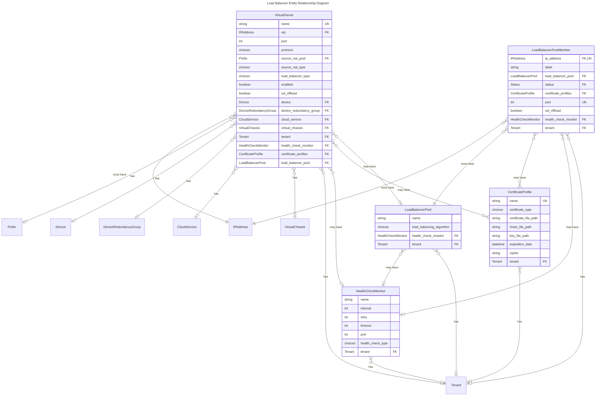

# Load Balancer Models

+++ 3.0.0

This section provides an overview of the data models included in Nautobot to describe load balancers. These models enable users to represent, manage, and track load balancing configurations in a vendor-neutral and infrastructure-aware manner.

Models include Virtual Servers, Load Balancer Pools, Load Balancer Pool Members, Health Check Monitors, and SSL Certificate Profiles. Several of these models integrate with other parts of Nautobot core, including IPAM (for VIPs and pool member IPs), DCIM (for device and chassis assignment), Cloud (for service mapping), and Tenancy (for tenant ownership).

The models were built with traditional enterprise vendor implementations in mind, such as F5, Citrix NetScaler, A10 Networks, VMware Avi Load Balancer, and Fortinet.

You are encouraged to leverage the [load balancer feature guide](../../feature-guides/load-balancers.md) for a practical approach at building the data model and configurations.

## Order of Operations

When configuring objects with the Load Balancer data models, follow this recommended order (as outlined in the [Quick Walkthrough](../../feature-guides/load-balancers.md#quick-walkthrough)):

1. [IP Addresses](../ipam/ipaddress.md)
2. Health Check Monitors
3. Certificate Profiles (if needed)
4. Load Balancer Pools
5. Load Balancer Pool Members (assign them to Pools)
6. Virtual Servers (link to VIPs and Pools)

This order ensures all necessary relationships and prerequisites are in place as you build your configuration.

## Models Overview

| Model Name                                    | Description |
|-----------------------------------------------|-------------|
| [Virtual Server](virtualserver.md)            | Represents a front-end VIP and port combination that distributes traffic to a backend pool. |
| [Load Balancer Pool](loadbalancerpool.md)     | A group of backend servers (Pool Members) serving traffic for a Virtual Server. |
| [Load Balancer Pool Member](loadbalancerpoolmember.md)    | An individual backend node within a Load Balancer Pool. |
| [Certificate Profile](certificateprofile.md)  | Stores metadata for SSL/TLS certificates used by Virtual Servers or Pool Members. |
| [Health Check Monitor](healthcheckmonitor.md) | Monitors the health of Pool Members and Pools to determine availability. |

## Entity Relationship Diagram

## Vendor Data Mappings

This table will help you map to specific vendor terminology.

| Nautobot Model              | F5                        | Citrix NetScaler         | A10 Networks           | VMware Avi Load Balancer      | Fortinet (FortiADC)      |
|-----------------------------|---------------------------|--------------------------|------------------------|-------------------------------|--------------------------|
| **VirtualServer**           | Virtual Server            | Virtual Server           | Virtual Server         | Virtual Service               | Virtual Server           |
| **LoadBalancerPool**        | Pool                      | Service Group            | Service Group / Pool   | Pool                          | Server Pool              |
| **LoadBalancerPoolMember**  | Pool Member / Node        | Service / Server         | Server                 | Pool Member                   | Pool Member / Real Server|
| **HealthCheckMonitor**      | Monitor                   | Monitor                  | Health Monitor         | Health Monitor                | Health Check             |
| **CertificateProfile**      | SSL Profile / Certificate | SSL Profile / Certificate| SSL Template / Cert    | SSL Profile / Certificate     | SSL Profile / Certificate|

Additional details:

- _F5:_ "Pool Member" is a node+port; "Node" is just an IP. SSL Profiles are used for certificates.
- _Citrix NetScaler:_ "Service Group" is a group of "Services" (servers). SSL Profiles are also used.
- _A10 Networks:_ "Service Group" is a pool; "Server" is a backend. SSL Templates manage certificates.
- _VMware Avi Load Balancer:_ "Virtual Service" is the frontend; "Pool" is the backend group; "Pool Member" is a server. SSL Profiles are used.
- _Fortinet:_ "Virtual Server" is the frontend; "Server Pool" is the backend group; "Real Server" is a pool member. SSL Profiles are used.

## Vendor-Specific Configuration with Custom Fields

If you need to store vendor-specific configuration elements — such as F5 iRules, persistence profiles, or application-layer settings — the recommended approach is to use [Custom Fields](../../platform-functionality/customfield.md):

- Use a **multi-select** custom field to track named elements like iRules or HTTP profiles.
- Use a **JSON** custom field to store unstructured vendor configuration snippets.
- Custom Fields can be scoped to specific object types (e.g., only `VirtualServer` or `LoadBalancerPoolMember`) to reflect how your load balancer applies these settings.

This design gives you flexibility to tailor the data model to your environment without forcing unsupported abstractions across different load balancer vendors.
