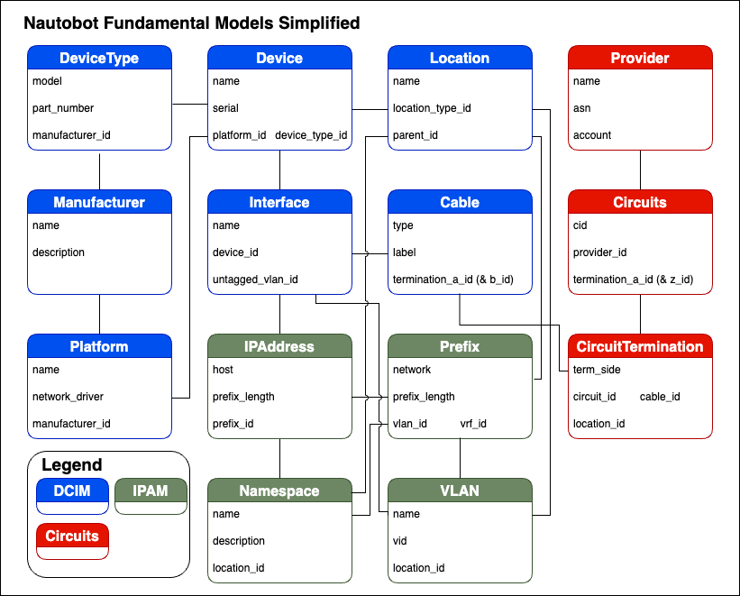

# Introduction

Understanding the data model is key to effectively navigating Nautobot. There are nearly 200 models in Nautobot core, which do not include any of the models that come from Nautobot Apps. This introduction does not attempt to document all of the models but instead intends to highlight the most common models to be used as a quick reference.

## Fundamental Model Simplified

The models included are generally the most used models and attributes of those models, with the following points of consideration:

- Tenants are an often used model, however they connect to most models and in the interest of simplicity not included.
- The direction of relationship is not included, however you can generally tell if there is an `<model>_id` attribute, such as `device_id` on the Interface model.
- More details can be found in the UML style diagram, which is roughly in the same layout.
- This is a model view and not a table view. So that means "through" tables are not shown as they would in a UML diagram.

## Fundamental Model UML

The models included in the UML are largely the same as the simplified diagram shown previously. This diagram has been generated with Postgres on [DBeaver](https://dbeaver.io/) and uses the [IDEF1X](https://en.wikipedia.org/wiki/IDEF1X) notation.

