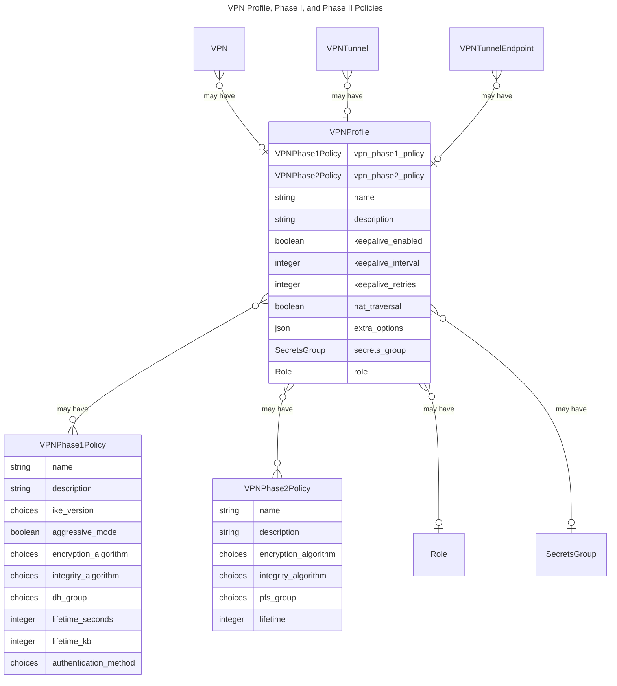
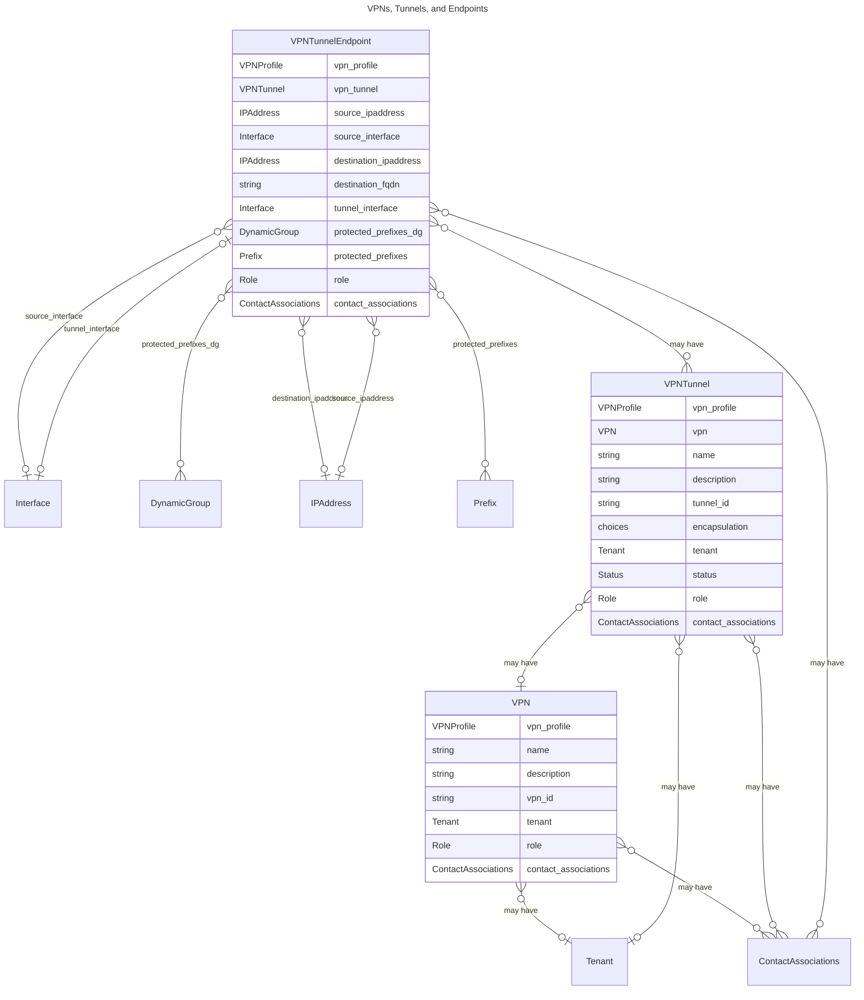

# VPN Data Models

Nautobot provides a set of models for representing Virtual Private Networks (VPNs), including reusable profiles, policies, and tunnel endpoints. These models enable you to define IKE (Phase 1) and IPSec (Phase 2) policy parameters, manage tunnel endpoints, and associate VPNs with roles and secrets. Additionally, VPNs may optionally be associated with tenants so that administrators can indicate ownership of related model instances.

!!! note
    At present, Nautobot's VPN models are designed to represent tunnel-based VPNs. Support for overlay VPNs (MPLS, VXLAN, etc) is planned for future releases.

## High-Level Architecture of VPN Models

The following diagram represents the logic behind VPN Models at a high level.
{ .on-glb }
{ .on-glb }

## Entity Relationship Diagrams

The following schemas illustrate the connections between related models.

!!! note
    Two separate diagrams are shown to make it easier for the reader. Additionally, several minor elements such as Status and Role are not shown for the same reason.

### VPN Profile Models Entity-Relationship Diagram



### VPN Models Entity-Relationship Diagram



## Indicative Usage

### Use Cases

#### Site-to-site IPSec VPN tunnel (transport mode)

Probably the simplest scenario for creating an IPSec VPN tunnel between two endpoints. No tunnel interface is assumed in this scenario.
{ .on-glb }
{ .on-glb }

#### Site-to-site IPSec VPN tunnel (tunnel mode)

Another scenario with an IPSec VPN tunnel between two endpoints but this time a tunnel interface is used.
{ .on-glb }
{ .on-glb }

#### Single hub-and-spoke VPN

Implementation of a hub-and-spoke topology (e.g. DMVPN) with RTR99 as the hub. The difference between this and site-to-site VPN tunnels is that, in this case, the hub only receives inbound VPN requests from the spokes. As such, its tunnel endpoint is re-used among tunnels and also does not need to define destination IP/FQDN.
{ .on-glb }
{ .on-glb }

#### Multiple hub-and-spoke VPNs

Virtually the same as above, mentioned here to illustrate the separation between VPN groupings.
{ .on-glb }
{ .on-glb }

### GraphQL query examples

The following GraphQL query examples show how an operator can query the information that is stored in the proposed VPN models.

#### Querying VPN attributes

```json
{
  vpns {
    vpn_profile {
      name
      secrets_group {
        name
      }
      vpn_phase1_policies {
        name
        encryption_algorithm
        integrity_algorithm
      }
      vpn_phase2_policies {
        name
        encryption_algorithm
        integrity_algorithm
      }
    }
    vpn_tunnels {
      name
      vpn_profile {
        name
      }
    }
  }
}
```

#### Device-level VPN info

```json
{
  device (id: "ABC123") {
    name
    vpn_tunnel_endpoints {
      endpoint_a_vpn_tunnels {
        name
        tunnel_id
        vpn_profile {
          name
        }
      }
      endpoint_z_vpn_tunnels {
        name
        tunnel_id
        vpn_profile {
          name
        }
      }
    }
  }
}
```

### Questions to ask of the data model

Given the data model, what questions would a user ask?

- Given a device, I would like to know all the Tunnels associated with it
- Given a tunnel, I would like to know all peers associated with it e.g. the remote devices
- Given a tunnel or device, I would like to know what tunnel technology I am using e.g. GRE vs DMVPN
- Given a DMVPN tunnel, I would like to know whether I am a hub or a spoke
- Given a DMVPN tunnel, I would like to know if I can directly route between spokes i.e. DMVPN phase 3
- Given a Tunnel, I would like to know, which subnets are considered “southbound” of that
- Given a Tenant, what VPN Tunnel would have to be configured
