# VPN Data Models

Nautobot provides a set of models for representing Virtual Private Networks (VPNs), including reusable profiles, policies, tunnel endpoints, and service terminations. These models enable you to define IKE (Phase 1) and IPSec (Phase 2) policy parameters, manage tunnel endpoints, model overlay and service-style VPN attachments, and associate VPNs with roles and secrets. Additionally, VPNs may optionally be associated with tenants so that administrators can indicate ownership of related model instances.

Nautobot's VPN models support two complementary approaches:

- **Tunnel-based VPNs** — Use [VPN Tunnels](vpntunnel.md) and [VPN Tunnel Endpoints](vpntunnelendpoint.md) to model point-to-point or hub-and-spoke tunnels (e.g. IPSec, GRE, WireGuard).
- **Overlay and service-style VPNs** — Use [VPN Terminations](vpntermination.md) to bind a VPN service (e.g. VXLAN-EVPN, VPLS, E-Line) to local attachment points such as VLANs, device interfaces, or VM interfaces.

## High-Level Architecture of VPN Models

The following diagrams represent the logic behind VPN Models at a high level.

!!! note
    Two separate diagrams are shown to make it easier for the reader. The first covers tunnel-based VPNs (VPN Tunnels and Endpoints), while the second covers termination-based VPNs (VPN Terminations), introduced in Nautobot 3.1.

### Tunnel-based VPN Architecture

{ .on-glb }
{ .on-glb }

### Termination-based VPN Architecture

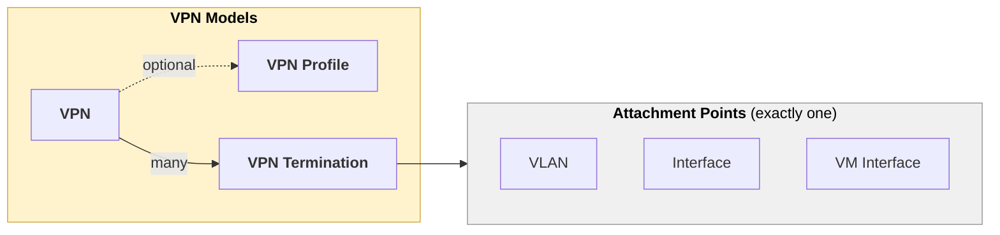
```mermaid
flowchart LR
    subgraph vpn_models["<b>VPN Models</b>"]
        VPN["<b>VPN</b>"]
        VPNProfile["<b>VPN Profile</b>"]
        VPNTermination["<b>VPN Termination</b>"]

        VPN -- "many" --> VPNTermination
        VPN -. "optional" .-> VPNProfile
    end

    subgraph attachment["<b>Attachment Points</b> (exactly one)"]
        VLAN["VLAN"]
        IF["Interface"]
        VMIF["VM Interface"]
    end

    VPNTermination --> attachment

    style vpn_models fill:#fef3cd,stroke:#d4a843,color:#000
    style attachment fill:#f0f0f0,stroke:#999,color:#000
```

## Entity Relationship Diagrams

The following schemas illustrate the connections between related models.

!!! note
    Three separate diagrams are shown to make it easier for the reader. The first covers VPN Profiles and policies, the second covers VPN Tunnels and Tunnel Endpoints, and the third covers VPN Terminations. Several minor elements such as Status and Role are not shown for readability reasons.

### VPN Profile Models Entity-Relationship Diagram

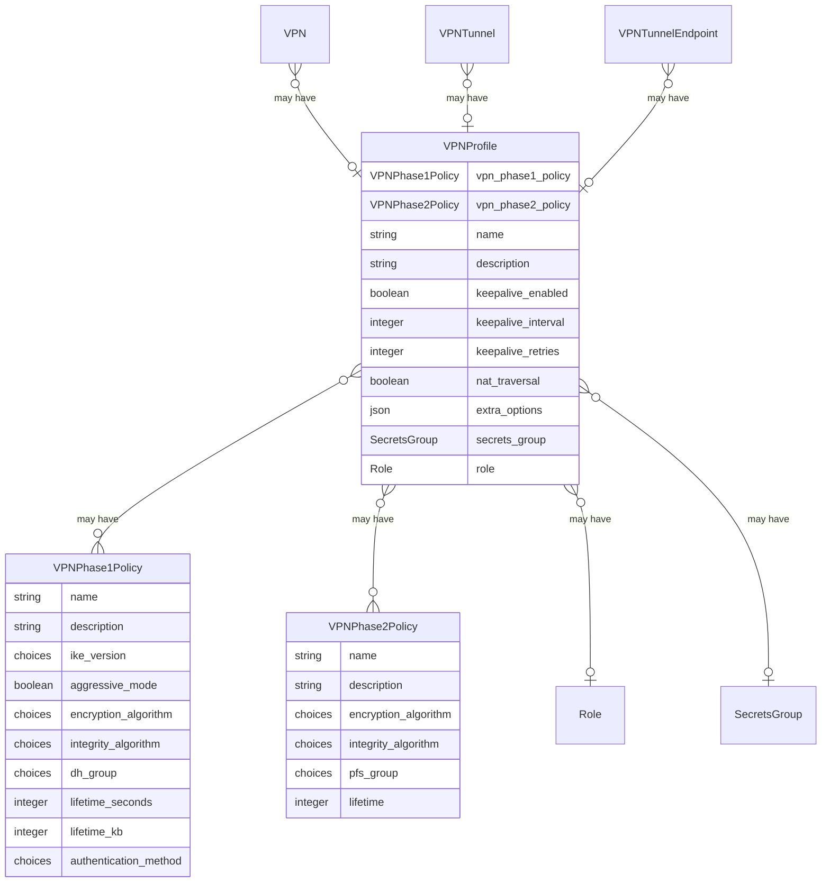
```mermaid
erDiagram
    "extras.Role"[Role] {}
    "extras.SecretsGroup"[SecretsGroup] {}
    "nautobot_vpn_models.VPN"[VPN] {}
    "nautobot_vpn_models.VPNTunnel"[VPNTunnel] {}
    "nautobot_vpn_models.VPNTunnelEndpoint"[VPNTunnelEndpoint] {}

    "nautobot_vpn_models.VPNProfile"[VPNProfile] {
        VPNPhase1Policy vpn_phase1_policy
        VPNPhase2Policy vpn_phase2_policy
        string name
        string description
        boolean keepalive_enabled
        integer keepalive_interval
        integer keepalive_retries
        boolean nat_traversal
        json extra_options
        SecretsGroup secrets_group
        Role role
    }

    "nautobot_vpn_models.VPNPhase1Policy"[VPNPhase1Policy] {
        string name
        string description
        choices ike_version
        boolean aggressive_mode
        choices encryption_algorithm
        choices integrity_algorithm
        choices dh_group
        integer lifetime_seconds
        integer lifetime_kb
        choices authentication_method
    }

    "nautobot_vpn_models.VPNPhase2Policy"[VPNPhase2Policy] {
        string name
        string description
        choices encryption_algorithm
        choices integrity_algorithm
        choices pfs_group
        integer lifetime
    }

    "nautobot_vpn_models.VPNProfile" }o--o{ "nautobot_vpn_models.VPNPhase1Policy" : "may have"
    "nautobot_vpn_models.VPNProfile" }o--o{ "nautobot_vpn_models.VPNPhase2Policy" : "may have"
    "nautobot_vpn_models.VPNProfile" }o--o| "extras.Role" : "may have"
    "nautobot_vpn_models.VPNProfile" }o--o| "extras.SecretsGroup" : "may have"

    "nautobot_vpn_models.VPN" }o--o| "nautobot_vpn_models.VPNProfile" : "may have"
    "nautobot_vpn_models.VPNTunnel" }o--o| "nautobot_vpn_models.VPNProfile" : "may have"
    "nautobot_vpn_models.VPNTunnelEndpoint" }o--o| "nautobot_vpn_models.VPNProfile" : "may have"
```

### VPN Tunnels and Endpoints Entity-Relationship Diagram

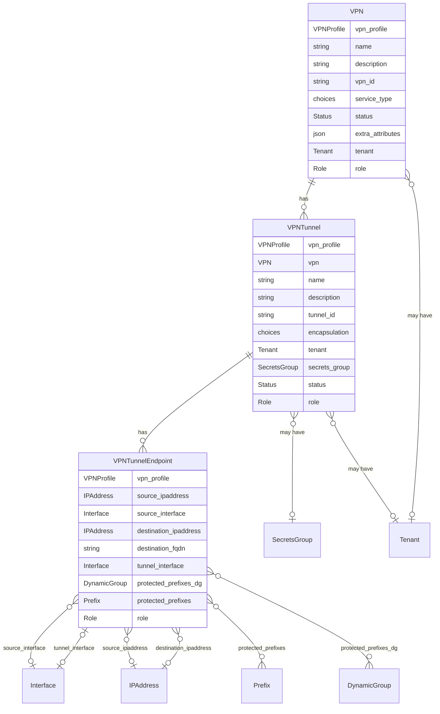
```mermaid
erDiagram
    "nautobot_vpn_models.VPN"[VPN] {
        VPNProfile vpn_profile
        string name
        string description
        string vpn_id
        choices service_type
        Status status
        json extra_attributes
        Tenant tenant
        Role role
    }

    "nautobot_vpn_models.VPNTunnel"[VPNTunnel] {
        VPNProfile vpn_profile
        VPN vpn
        string name
        string description
        string tunnel_id
        choices encapsulation
        Tenant tenant
        SecretsGroup secrets_group
        Status status
        Role role
    }

    "nautobot_vpn_models.VPNTunnelEndpoint"[VPNTunnelEndpoint] {
        VPNProfile vpn_profile
        IPAddress source_ipaddress
        Interface source_interface
        IPAddress destination_ipaddress
        string destination_fqdn
        Interface tunnel_interface
        DynamicGroup protected_prefixes_dg
        Prefix protected_prefixes
        Role role
    }

    "tenancy.Tenant"[Tenant] {}
    "extras.SecretsGroup"[SecretsGroup] {}
    "dcim.Interface"[Interface] {}
    "ipam.IPAddress"[IPAddress] {}
    "ipam.Prefix"[Prefix] {}
    "extras.DynamicGroup"[DynamicGroup] {}

    "nautobot_vpn_models.VPN" ||--o{ "nautobot_vpn_models.VPNTunnel" : "has"
    "nautobot_vpn_models.VPN" }o--o| "tenancy.Tenant" : "may have"

    "nautobot_vpn_models.VPNTunnel" ||--o{ "nautobot_vpn_models.VPNTunnelEndpoint" : "has"
    "nautobot_vpn_models.VPNTunnel" }o--o| "extras.SecretsGroup" : "may have"
    "nautobot_vpn_models.VPNTunnel" }o--o| "tenancy.Tenant" : "may have"

    "nautobot_vpn_models.VPNTunnelEndpoint" }o--o| "dcim.Interface" : "source_interface"
    "nautobot_vpn_models.VPNTunnelEndpoint" |o--o| "dcim.Interface" : "tunnel_interface"
    "nautobot_vpn_models.VPNTunnelEndpoint" }o--o| "ipam.IPAddress" : "source_ipaddress"
    "nautobot_vpn_models.VPNTunnelEndpoint" }o--o| "ipam.IPAddress" : "destination_ipaddress"
    "nautobot_vpn_models.VPNTunnelEndpoint" }o--o{ "ipam.Prefix" : "protected_prefixes"
    "nautobot_vpn_models.VPNTunnelEndpoint" }o--o{ "extras.DynamicGroup" : "protected_prefixes_dg"
```

### VPN Terminations Entity-Relationship Diagram

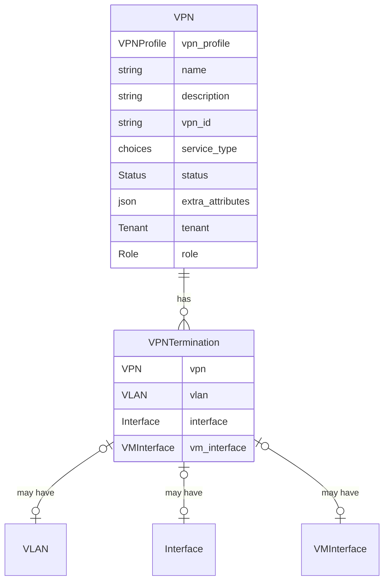
```mermaid
erDiagram
    "nautobot_vpn_models.VPN"[VPN] {
        VPNProfile vpn_profile
        string name
        string description
        string vpn_id
        choices service_type
        Status status
        json extra_attributes
        Tenant tenant
        Role role
    }

    "nautobot_vpn_models.VPNTermination"[VPNTermination] {
        VPN vpn
        VLAN vlan
        Interface interface
        VMInterface vm_interface
    }

    "ipam.VLAN"[VLAN] {}
    "dcim.Interface"[Interface] {}
    "virtualization.VMInterface"[VMInterface] {}

    "nautobot_vpn_models.VPN" ||--o{ "nautobot_vpn_models.VPNTermination" : "has"
    "nautobot_vpn_models.VPNTermination" |o--o| "ipam.VLAN" : "may have"
    "nautobot_vpn_models.VPNTermination" |o--o| "dcim.Interface" : "may have"
    "nautobot_vpn_models.VPNTermination" |o--o| "virtualization.VMInterface" : "may have"
```

## Use Cases

### Site-to-site IPSec VPN tunnel (transport mode)

Probably the simplest scenario for creating an IPSec VPN tunnel between two endpoints. No tunnel interface is assumed in this scenario.

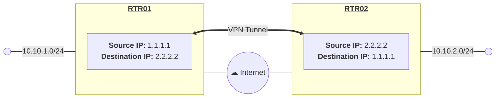
```mermaid
flowchart LR
    RTR01_lan((" "))

    subgraph RTR01["<b><u>RTR01</u></b>"]
        RTR01_ep["<b>Source IP:</b> 1.1.1.1<br/><b>Destination IP:</b> 2.2.2.2"]
    end

    subgraph RTR02["<b><u>RTR02</u></b>"]
        RTR02_ep["<b>Source IP:</b> 2.2.2.2<br/><b>Destination IP:</b> 1.1.1.1"]
    end

    RTR02_lan((" "))

    cloud(("☁ Internet"))

    RTR01_lan -- "10.10.1.0/24" --- RTR01
    RTR01 --- cloud --- RTR02
    RTR01_ep <== "VPN Tunnel" ==> RTR02_ep
    RTR02 -- "10.10.2.0/24" --- RTR02_lan
```

---

### Site-to-site IPSec VPN tunnel (tunnel mode)

Another scenario with an IPSec VPN tunnel between two endpoints but this time a tunnel interface is used.

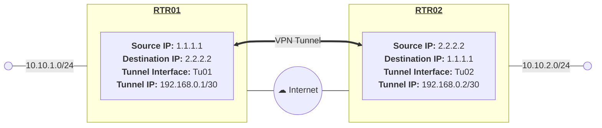
```mermaid
flowchart LR
    RTR01_lan((" "))

    subgraph RTR01["<b><u>RTR01</u></b>"]
        RTR01_ep["<b>Source IP:</b> 1.1.1.1<br/><b>Destination IP:</b> 2.2.2.2<br/><b>Tunnel Interface:</b> Tu01<br/><b>Tunnel IP:</b> 192.168.0.1/30"]
    end

    subgraph RTR02["<b><u>RTR02</u></b>"]
        RTR02_ep["<b>Source IP:</b> 2.2.2.2<br/><b>Destination IP:</b> 1.1.1.1<br/><b>Tunnel Interface:</b> Tu02<br/><b>Tunnel IP:</b> 192.168.0.2/30"]
    end

    RTR02_lan((" "))
    cloud(("☁ Internet"))

    RTR01_lan -- "10.10.1.0/24" --- RTR01
    RTR01 --- cloud --- RTR02
    RTR01_ep <== "VPN Tunnel" ==> RTR02_ep
    RTR02 -- "10.10.2.0/24" --- RTR02_lan
```

---

### Single hub-and-spoke VPN

Implementation of a hub-and-spoke topology (e.g. DMVPN) with RTR99 as the hub. The difference between this and site-to-site VPN tunnels is that, in this case, the hub only receives inbound VPN requests from the spokes. As such, its tunnel endpoint is re-used among tunnels and also does not need to define destination IP/FQDN.

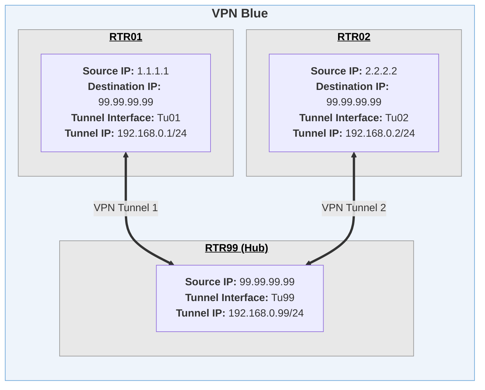
```mermaid
flowchart LR
    subgraph VPN_Blue["<span style='font-size:1.2em'><b>VPN Blue</b></span>"]
        subgraph RTR01["<b><u>RTR01</u></b>"]
            RTR01_ep["<b>Source IP:</b> 1.1.1.1<br/><b>Destination IP:</b> 99.99.99.99<br/><b>Tunnel Interface:</b> Tu01<br/><b>Tunnel IP:</b> 192.168.0.1/24"]
        end

        subgraph RTR99["<b><u>RTR99 (Hub)</u></b>"]
            RTR99_ep["<b>Source IP:</b> 99.99.99.99<br/><b>Tunnel Interface:</b> Tu99<br/><b>Tunnel IP:</b> 192.168.0.99/24"]
        end

        subgraph RTR02["<b><u>RTR02</u></b>"]
            RTR02_ep["<b>Source IP:</b> 2.2.2.2<br/><b>Destination IP:</b> 99.99.99.99<br/><b>Tunnel Interface:</b> Tu02<br/><b>Tunnel IP:</b> 192.168.0.2/24"]
        end

        RTR01_ep <== "VPN Tunnel 1" ==> RTR99_ep
        RTR02_ep <== "VPN Tunnel 2" ==> RTR99_ep
    end

    style VPN_Blue fill:#eef4fb,stroke:#6ea8d9,color:#1e3a5f
    style RTR01 fill:#e8e8e8,stroke:#999,color:#000
    style RTR99 fill:#e8e8e8,stroke:#999,color:#000
    style RTR02 fill:#e8e8e8,stroke:#999,color:#000
```

---

### Multiple hub-and-spoke VPNs

Virtually the same as above, mentioned here to illustrate the separation between VPN groupings.

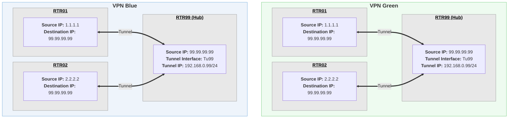
```mermaid
flowchart TB
    subgraph VPN_Green["<span style='font-size:1.2em'><b>VPN Green</b></span>"]
        direction LR

        subgraph G_RTR01["<b><u>RTR01</u></b>"]
            G_RTR01_ep["<b>Source IP:</b> 1.1.1.1<br/><b>Destination IP:</b> 99.99.99.99"]
        end

        subgraph G_RTR99["<b><u>RTR99 (Hub)</u></b>"]
            G_RTR99_ep["<b>Source IP:</b> 99.99.99.99<br/><b>Tunnel Interface:</b> Tu99<br/><b>Tunnel IP:</b> 192.168.0.99/24"]
        end

        subgraph G_RTR02["<b><u>RTR02</u></b>"]
            G_RTR02_ep["<b>Source IP:</b> 2.2.2.2<br/><b>Destination IP:</b> 99.99.99.99"]
        end

        G_RTR01_ep <== "Tunnel" ==> G_RTR99_ep
        G_RTR02_ep <== "Tunnel" ==> G_RTR99_ep
    end

    subgraph VPN_Blue["<span style='font-size:1.2em'><b>VPN Blue</b></span>"]
        direction LR

        subgraph B_RTR01["<b><u>RTR01</u></b>"]
            B_RTR01_ep["<b>Source IP:</b> 1.1.1.1<br/><b>Destination IP:</b> 99.99.99.99"]
        end

        subgraph B_RTR99["<b><u>RTR99 (Hub)</u></b>"]
            B_RTR99_ep["<b>Source IP:</b> 99.99.99.99<br/><b>Tunnel Interface:</b> Tu99<br/><b>Tunnel IP:</b> 192.168.0.99/24"]
        end

        subgraph B_RTR02["<b><u>RTR02</u></b>"]
            B_RTR02_ep["<b>Source IP:</b> 2.2.2.2<br/><b>Destination IP:</b> 99.99.99.99"]
        end

        B_RTR01_ep <== "Tunnel" ==> B_RTR99_ep
        B_RTR02_ep <== "Tunnel" ==> B_RTR99_ep
    end

    style VPN_Blue fill:#eef4fb,stroke:#6ea8d9,color:#1e3a5f
    style VPN_Green fill:#eefbf0,stroke:#6ec977,color:#14532d
    style B_RTR01 fill:#e8e8e8,stroke:#999,color:#000
    style B_RTR99 fill:#e8e8e8,stroke:#999,color:#000
    style B_RTR02 fill:#e8e8e8,stroke:#999,color:#000
    style G_RTR01 fill:#e8e8e8,stroke:#999,color:#000
    style G_RTR99 fill:#e8e8e8,stroke:#999,color:#000
    style G_RTR02 fill:#e8e8e8,stroke:#999,color:#000
```

---

### Hub-and-spoke VPN using terminations

+++ 3.1.0
    VPN Terminations and VPN service types were added.

The [single hub-and-spoke](#single-hub-and-spoke-vpn) use case above models each spoke-to-hub connection as a distinct VPN Tunnel with its own pair of VPN Tunnel Endpoints. This captures per-tunnel detail but requires more objects to manage.

As an alternative, the same topology can be represented with [VPN Terminations](vpntermination.md) — a flatter model introduced in Nautobot 3.1. Each participating router is attached to the VPN through a single termination on a device interface. There are no individual tunnel or endpoint objects; the VPN itself is the only grouping element. This trades per-tunnel granularity for a simpler model that is easier to create and maintain when tunnel-level detail is not needed.

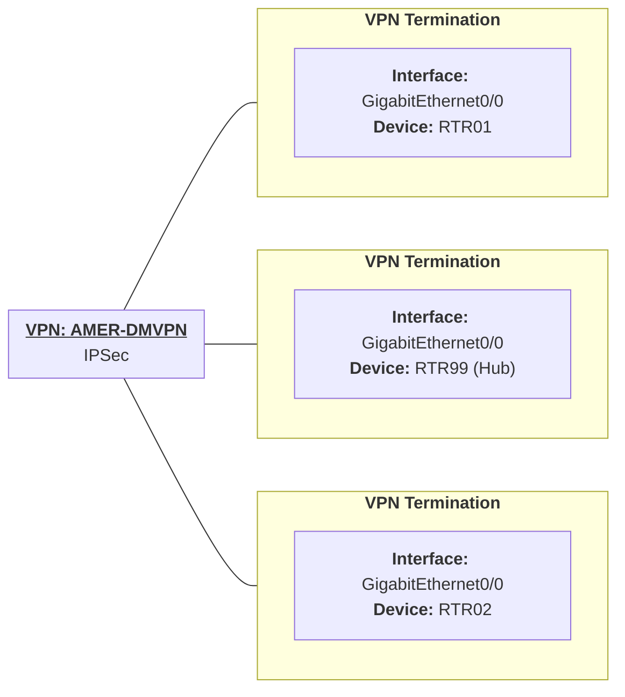
```mermaid
flowchart LR
    subgraph VPN["<b><u>VPN: AMER-DMVPN</u></b><br/>IPSec"]
        direction TB
    end

    subgraph Term1["<b>VPN Termination</b>"]
        IF1["<b>Interface:</b> GigabitEthernet0/0<br/><b>Device:</b> RTR01"]
    end

    subgraph Term2["<b>VPN Termination</b>"]
        IF2["<b>Interface:</b> GigabitEthernet0/0<br/><b>Device:</b> RTR99 (Hub)"]
    end

    subgraph Term3["<b>VPN Termination</b>"]
        IF3["<b>Interface:</b> GigabitEthernet0/0<br/><b>Device:</b> RTR02"]
    end

    VPN --- Term1
    VPN --- Term2
    VPN --- Term3
```

---

### VXLAN-EVPN overlay mapped to VLANs

A VPN with `service_type` set to VXLAN-EVPN and a VNI identifier, with multiple [VPN Terminations](vpntermination.md) each binding the service to a VLAN. This represents a typical data center overlay where a single VXLAN service spans multiple switches and each switch maps the service to a local VLAN.

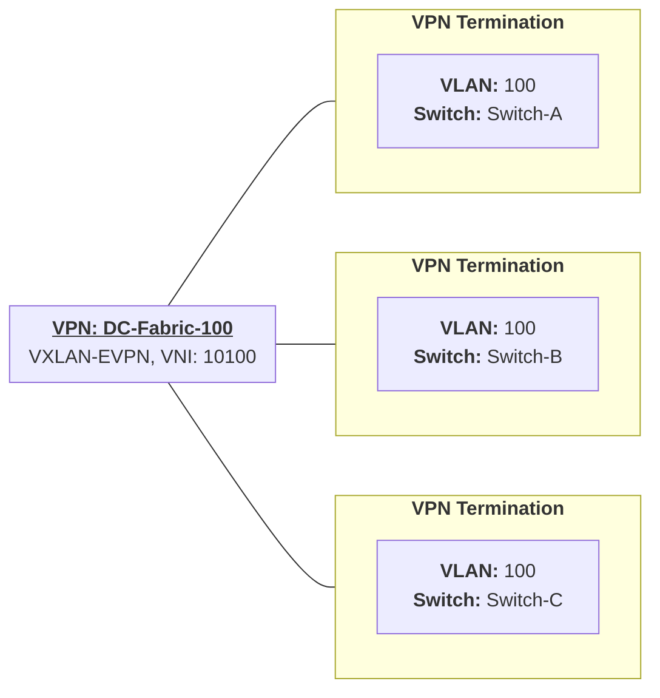
```mermaid
flowchart LR
    subgraph VPN["<b><u>VPN: DC-Fabric-100</u></b><br/>VXLAN-EVPN, VNI: 10100"]
        direction TB
    end

    subgraph Term1["<b>VPN Termination</b>"]
        VLAN1["<b>VLAN:</b> 100<br/><b>Switch:</b> Switch-A"]
    end

    subgraph Term2["<b>VPN Termination</b>"]
        VLAN2["<b>VLAN:</b> 100<br/><b>Switch:</b> Switch-B"]
    end

    subgraph Term3["<b>VPN Termination</b>"]
        VLAN3["<b>VLAN:</b> 100<br/><b>Switch:</b> Switch-C"]
    end

    VPN --- Term1
    VPN --- Term2
    VPN --- Term3
```

---

### Point-to-point E-Line service

A VPN with `service_type` set to EPL (Ethernet Private Line), with exactly two [VPN Terminations](vpntermination.md) — one per device interface. Point-to-point service types enforce a maximum of two terminations per VPN.

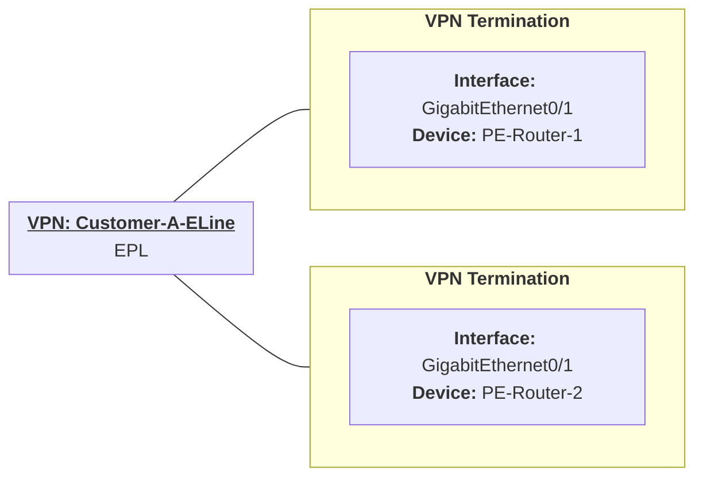
```mermaid
flowchart LR
    subgraph VPN["<b><u>VPN: Customer-A-ELine</u></b><br/>EPL"]
        direction TB
    end

    subgraph Term1["<b>VPN Termination</b>"]
        IF1["<b>Interface:</b> GigabitEthernet0/1<br/><b>Device:</b> PE-Router-1"]
    end

    subgraph Term2["<b>VPN Termination</b>"]
        IF2["<b>Interface:</b> GigabitEthernet0/1<br/><b>Device:</b> PE-Router-2"]
    end

    VPN --- Term1
    VPN --- Term2
```

## GraphQL Query Examples

The following GraphQL query examples show how an operator can query the information that is stored in the VPN models.

### Querying VPN Attributes

```graphql
{
    vpns {
        vpn_profile {
            name
            secrets_group {
                name
            }
            vpn_phase1_policies {
                name
                encryption_algorithm
                integrity_algorithm
            }
            vpn_phase2_policies {
                name
                encryption_algorithm
                integrity_algorithm
            }
        }
        vpn_tunnels {
            name
            vpn_profile {
                name
            }
        }
    }
}
```

### Device-Level VPN Info

```graphql
{
    device (id: "ABC123") {
        name
        vpn_tunnel_endpoints {
            endpoint_a_vpn_tunnels {
                name
                tunnel_id
                vpn_profile {
                    name
                }
            }
            endpoint_z_vpn_tunnels {
                name
                tunnel_id
                vpn_profile {
                    name
                }
            }
        }
    }
}
```

### Querying VPN Terminations

```graphql
{
    vpns {
        name
        service_type
        status {
            name
        }
        vpn_terminations {
            vlan {
                vid
                name
            }
            interface {
                name
                device {
                    name
                }
            }
            vm_interface {
                name
                virtual_machine {
                    name
                }
            }
        }
    }
}
```

## Common Queries

The following are typical questions that can be answered using the VPN data model:

- Given a device, what tunnels are associated with it?
- Given a tunnel, what are the remote peers?
- Given a tunnel or device, what tunnel technology is in use (e.g. GRE vs DMVPN)?
- Given a DMVPN tunnel, is this device a hub or a spoke?
- Given a DMVPN tunnel, can spokes route directly to each other (i.e. DMVPN phase 3)?
- Given a tunnel, what subnets are protected by it?
- Given a tenant, what VPN tunnels are associated with it?
- Given a VLAN, which VPN service does it belong to?
- Given a VPN with a VXLAN service type, what VLANs and interfaces participate in it?
- Given a device interface, is it part of any overlay VPN service?
- Given a VPN, is it modeled as tunnel-based or termination-based?
