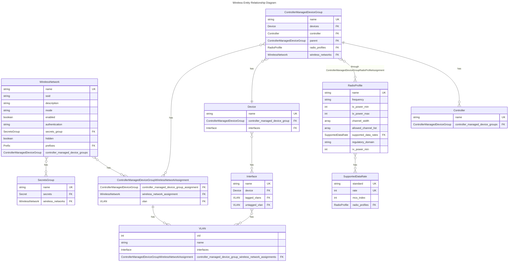

# Wireless

The goal of the Wireless Models is to enable Day-2 Wireless Workflows and Automation focusing on Campus networks. The following use-cases are covered:

1. Inventory of SSID's through the use of [Wireless Networks](wirelessnetwork.md)
2. Grouping Access Points through the use of [Controller Managed Device Group](../dcim/controllermanageddevicegroup.md)
3. Represent common radio frequency and other wireless physical settings through [Radio Profiles](radioprofile.md)

Currently not implemented is support for Wireless or Microwave backhaul, WISP, 5G or LTE.

## Entity Relationship Diagram

This schema illustrates the connections between related models.

