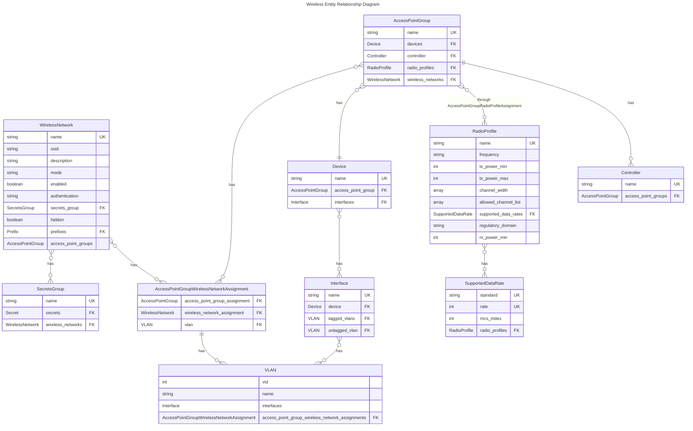

# Wireless

## Entity Relationship Diagram

This schema illustrates the connections between related models.

```mermaid
---
title: Wireless Entity Relationship Diagram
---
erDiagram
    AccessPointGroup {
        string name UK
        Device devices FK
        Controller controller FK
        RadioProfile radio_profiles FK
        WirelessNetwork wireless_networks FK
    }

    WirelessNetwork {
        string name UK
        string ssid
        string description
        string mode
        boolean enabled
        string authentication
        SecretsGroup secrets_group FK
        boolean hidden
        Prefix prefixes FK
        AccessPointGroup access_point_groups
    }

    SupportedDataRate {
        string standard UK
        int rate UK
        int mcs_index
        RadioProfile radio_profiles FK
    }

    RadioProfile {
        string name UK
        string frequency
        int tx_power_min
        int tx_power_max
        array channel_width
        array allowed_channel_list
        SupportedDataRate supported_data_rates FK
        string regulatory_domain
        int rx_power_min
    }

    Device {
        string name UK
        AccessPointGroup access_point_group FK
        Interface interfaces FK
    }

    Interface {
        string name UK
        Device device FK
        VLAN tagged_vlans FK
        VLAN untagged_vlan FK
    }

    AccessPointGroupWirelessNetworkAssignment {
        AccessPointGroup access_point_group_assignment FK
        WirelessNetwork wireless_network_assignment FK
        VLAN vlan FK
    }

    VLAN {
        int vid
        string name
        Interface interfaces
        AccessPointGroupWirelessNetworkAssignment access_point_group_wireless_network_assignments FK
    }
    Controller {
        string name UK
        AccessPointGroup access_point_groups FK
    }
    SecretsGroup {
        string name UK
        Secret secrets FK
        WirelessNetwork wireless_networks FK
    }
    

    AccessPointGroup ||--o{ Controller : has
    AccessPointGroup }o--o{ RadioProfile : "through AccessPointGroupRadioProfileAssignment"
    AccessPointGroup }o--|| Device : "has"
    AccessPointGroup }o--o{ AccessPointGroupWirelessNetworkAssignment : has
    WirelessNetwork }o--o{ AccessPointGroupWirelessNetworkAssignment : has
    WirelessNetwork }o--o{ SecretsGroup : has
    AccessPointGroupWirelessNetworkAssignment ||--o{ VLAN : has

    RadioProfile }o--o{ SupportedDataRate : has

    Device }o--o{ Interface : has
    Interface }o--o{ VLAN : has 
```
