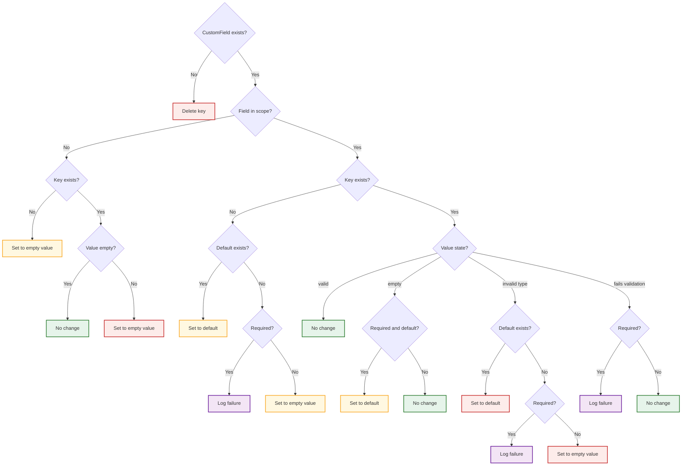
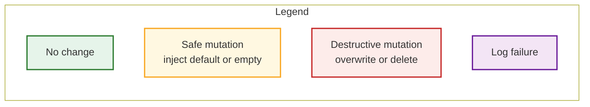

# Custom Field Cleanup Policy

Custom Field data can become inconsistent over time as definitions and policies evolve. Some examples include:

- Validation rules may change, select choices may be added or removed, or defaults may be introduced after data has already been stored.
- Scoping rules can also change — a field that once applied broadly may later apply only to specific device types, roles, or tenants.
- Inconsistencies can also arise from bulk imports, API writes, legacy data migrations, or manual database edits that bypass validation logic. 

The cleanup process evaluates stored Custom Field data against current definitions and scoping rules, correcting inconsistencies. The goal is to align Custom Fields data with the latest configuration, making changes only when necessary.

The job will run and end up in one of the following conditions for each record. 

1.	No change
1.	Log failure
1.	Set to default
1.	Set to empty value
1.	Delete key

!!! warning
    The job will destruct, mutate, or otherwise change the data, do not run the job unless you understand the risk, review the output from a dry-run, and reviewed the data that will be change.

## Cleanup Decision Tree

The flow diagram illustrates how each field evaluation leads to one of these outcomes.

The decision tree above covers many scenarios. The following sections break down each possible outcome in detail.

## No Change

The stored value is preserved exactly as-is.

This occurs when:

- The field exists, is in scope, and the value is valid.
- The value is empty and not required.
- The field is out of scope and already empty.

## Log Failure

No data is modified, but a validation issue is recorded.

This occurs when:

- A required field is missing and no default exists.
- A required field has an invalid type and no default exists.
- A required field fails validation rules, such as min/max, regex, or select value.

The job does not attempt to repair required fields without a default. Manual correction is required.

## Set to Default

The existing value (or missing key) is replaced with the field’s configured default.

This occurs when:

- A field is in scope and missing, and a default exists.
- A field is in scope and empty, required, and has a default.
- A field has an invalid type and a default exists.
- A multiselect becomes empty after filtering and a default exists.

The previous value is overwritten.

!!! note
    Setting a default value is considered safe only when the key is missing from the record.

## Set to Empty Value

The field is set to its normalized empty value:

- None for scalar fields
- [] for lists
- {} for dicts

This occurs when:

- A field is not in scope but contains a non-empty value.
- A field is in scope, optional, missing, and has no default.
- A field has an invalid type, is optional, and has no default.

If the key did not previously exist, it may be created with an empty value depending on configuration.

!!! note
    Setting an empty value is considered safe only when the key is missing from the record.

## Delete Key

The key is removed entirely from _custom_field_data.

This occurs when:

- The Custom Field definition no longer exists.

This removes both the key and its stored value.
