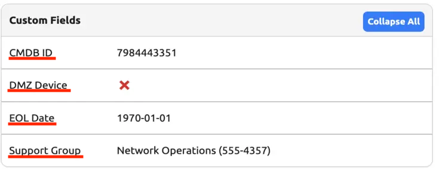
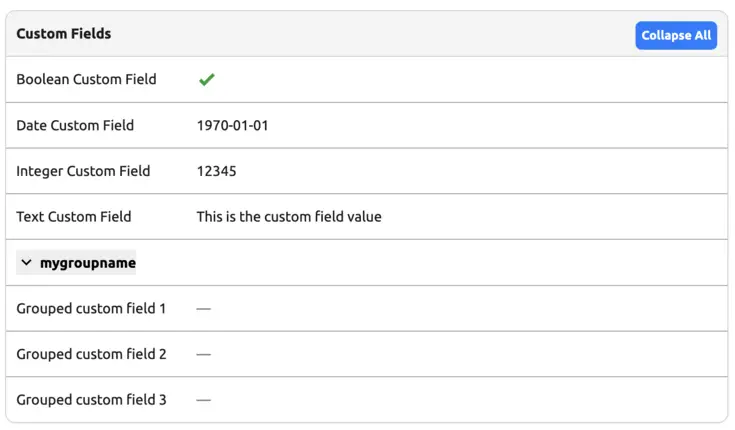
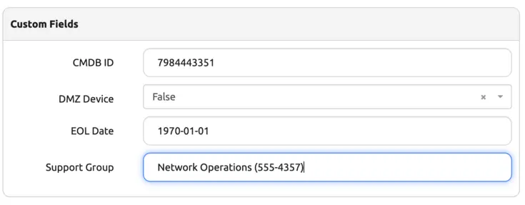
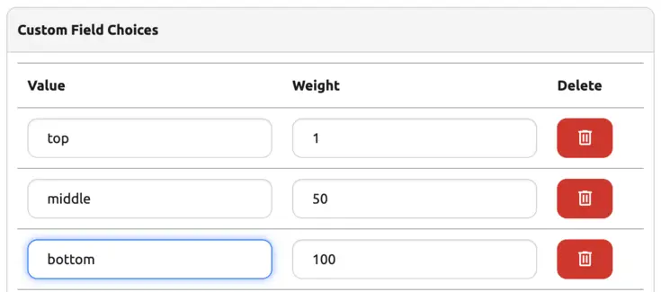
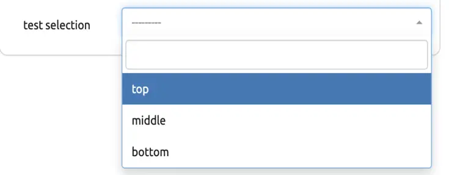

# Custom Fields

Custom fields are a convenient method of adding new fields to existing Nautobot models without needing to modify the underlying source code or database schema. For more general information on how custom fields work, refer to the [custom fields model documentation](../platform-functionality/customfield.md).

## When to use Custom Fields

Custom fields are commonly used for fields that need different values across individual objects. For example, a custom field on devices to reference an internal ticket number that inventories each device in Nautobot. If you need a solution for marking multiple objects with a common flag, [tags](../platform-functionality/tag.md) may be a better fit.

## Create a Custom Field

Navigate to the custom fields page by clicking on **Extensibility -> Custom Fields** in the Nautobot menu. Click on **Add** to create a new custom field.

### Custom Field Attributes

+/- 2.0.0
    CustomField model no longer has a `name` attribute in v2.0. Instead, its pre-existing `label` attribute (unique for all CustomField instances) replaced `name` to be used exclusively for display purposes in the UI.

    CustomField model's `slug` attribute was renamed to `key` (unique for all CustomField instances), which contains a GraphQL-safe string used as the key in the underlying custom field data dictionary.

    These aforementioned changes do not require users to do any manual work as they are properly handled by data migrations during the upgrade from Nautobot v1.x to v2.0. Note that if you have non-GraphQL-safe `slug` values in your database pre-migration, some of the resulting CustomField `key` values might be altered to ensure that `key` values for all CustomField instances are valid and unique.
  
#### Label

The label is the human readable label of the custom field that will be displayed on the associated object detail view.



#### Grouping

The optional grouping field allows you to group custom fields into collapsible menus.



#### Key

The key is used as the key in the underlying custom field data dictionary. This is automatically created from the label if not supplied. The default value should be sufficient for most deployments.

#### Type

The type of data that the custom field will store. Valid choices are documented in the [custom field model documentation](../platform-functionality/customfield.md#creating-custom-fields).

#### Weight

Weight determines how custom fields are sorted in forms and object detail views. Higher-weight fields will be ordered lower on the page; if multiple fields have the same weight, they will be listed alphabetically.

#### Description

The description of a custom field is shown as a mouseover tooltip in object detail views and as help text under form fields.



#### Required

Check the required box if this field cannot be null on the associated objects.

!!! warning
    If an associated object does not have a valid value assigned to a required custom field, that field must be updated with a valid value before the object can be saved. Try to supply a valid default value when creating required custom fields. Since automatic provisioning is only performed when the assigned content types for a custom field change, if an existing custom field is changed from optional to required the associated objects will need to be updated manually.

#### Default

The default value for the custom field. This form field only accepts JSON data so if you want to set the field default to a string of `foo` you must supply the JSON string `"foo"`. Boolean field valid values are `true` and `false` (all lowercase). Date fields are strings in the format `"YYYY-MM-DD"`. Select and multi-select field default must match one of the field's choices.

!!! note
    The default value for a select or multi-select field must match one of the existing choices. If the desired default value is not in the list of choices, the choices must be updated and saved before the default can be changed. As a result of this behavior, default values cannot be set on select and multi-select fields when a custom field is created.

#### Filter Logic

+/- 1.4.0
    Custom field [extended filtering](../platform-functionality/rest-api/filtering.md#lookup-expressions) introduced extended lookup expression filters for `exact` and `icontains`, duplicating the functionality of both the `Strict` and `Loose` settings.

The filter logic setting applies to filtering on custom fields in the UI and API. For example, when filtering in the API to find a device with the custom field `cf1` set to `"abc"` you would query `/api/dcim/devices/?cf_cf1=abc`. If the filter logic setting is set to `Loose` this would match on `"ABC"` and `"abcdef"`. If the filter logic setting is set to `Strict` only devices with the custom field set to exactly "abc" (case sensitive) would be returned. If the filter logic setting is set to `disabled`, no filters will be available for this custom field, including extended lookup filters. The `Loose` and `Strict` settings only change the behavior of the default filter (`cf_customfieldname`) on `text`, `url` and `json` custom fields.

#### Move to Advanced Tab

When selected, the custom field will appear in the "Advanced" tab of the object detail view instead of the default tab.

### Assignment

#### Content Types

The list of content types to add this custom field to. Only models that inherit from the `nautobot.extras.models.customfields.CustomFieldModel` model class can be selected.

!!! note
    When a custom field is created or associated to a new content type (model), all affected existing objects will be updated to add the custom field. The initial value will be set to the `default` value of the custom field. This update runs as a background task via [Celery](../administration/installation/services.md#worker-service), so it may take a few seconds or more before all objects reflect the new custom field, depending on the size of your database.

### Validation Rules

Validation rules are used for constraining custom fields to specific values.

#### Minimum value

Minimum allowed value for `Integer` fields.

#### Maximum value

Maximum allowed value for `Integer` fields.

#### Validation Regex

Regular expression to enforce on `Text`, `URL`, `Selection` and `Multiple selection` field values. Regex validation is handled by the [python re engine](https://docs.python.org/3/library/re.html) which uses a PCRE or perl-like regular expression syntax. Examples of common regex validations:

Must start with companyname

```no-highlight
^companyname
```

Must end with 5 digit zip code

```no-highlight
[0-9]{5}$
```

Must only contain digits

```no-highlight
^\d+$
```

Must be exactly 8 alphanumeric characters

```no-highlight
^[0-9a-zA-Z]{8}$
```

Must be between 8 and 10 alphanumeric characters and underscore

```no-highlight
^\w+{8,10}$
```

Must contain anything that is not whitespace

```no-highlight
\S
```

### Custom Field Choices

The choices to be presented for `Selection` and `Multiple selection` custom field types. These are displayed in the order of the weight values supplied with the lowest weight on top. If regex validation is being used, these choices must match the regular expression.





## Editing Custom Fields

Since automatic provisioning is only performed when a custom field's content types change, some changes made to existing custom fields are not reflected on the associated objects automatically. Some examples of cases where this might cause unexpected behavior are changes to the `required`, `default` and validation fields.

If a custom field is created with `required=False` and then later changed to `required=True`, all of the associated objects that do not yet have a value for this field will fail validation the next time they're saved unless updated with a valid value. Similarly, changes to the validation fields for a custom field will not automatically result in changes to affected objects, but may require changes the next time those objects are edited in order to bring them into compliance with the updated validation rules.

If a custom field's `default` value is changed, newly created objects will use the new default, but existing objects that were set to the previous default value will *not* automatically be updated.

## Deleting Custom Fields

Custom fields are removed from associated objects when a content type is removed from the custom field, including when the custom field is deleted. This update runs as a background task via [Celery](../administration/installation/services.md#worker-service), so it may take a few seconds or more before the custom field data is removed from all objects, depending on the size of your database.

## Retrieving Custom Field Data

Custom fields augment an existing model so retrieving custom field values is different from native fields. All custom field data is stored as a dictionary in the model field named `_custom_field_data` but there is a property named `cf` to make accessing this field easier. Example:

### Retrieve Custom Field Data in Nautobot Shell

```py
# retrieve all custom field data
>>> device.cf
{'eol_date': '1970-01-01',
 'support_group': 'Network Operations (555-4357)',
 'dmz_device': True,
 'cmdb_id': 12345}

# retrieve a single field
>>> device.cf.get("eol_date")
'1970-01-01'
```

The `key` of the custom field is used as the key for the associated object's data dictionary.

### Retrieve Custom Field Data in the Rest API

Custom fields are returned in the API for all supported models in the `custom_fields` key:

??? info "`GET http://localhost:8080/api/dcim/devices/ffd8df99-6d1a-41c3-b19f-b8357eefc481/`"

    ```json
    {
      "id": "ffd8df99-6d1a-41c3-b19f-b8357eefc481",
      ...
      "custom_fields": {
        "dmz_device": true,
        "eol_date": "1970-01-01",
        "cmdb_id": 12345,
        "support_group": "Network Operations (555-4357)"
      }
    }
    ```

### GraphQL

#### Retrieve Data for a Custom Field in GraphQL

Individual custom fields can be retrieved in GraphQL queries by using the `cf_<fieldname>` field name format:

```no-highlight
{
  devices {
    cf_support_group
    name
    id
  }
}
```

??? info "Example GraphQL output"

    ```json
    {
      "data": {
        "devices": [
          {
            "name": "phx-leaf1-1-1",
            "cf_support_group": "Network Operations (555-4357)",
            "id": "8bd9ed2b-3774-4806-9d17-c9f21f2c73e4"
          },
          {
            "name": "stl-leaf1-2-1",
            "cf_support_group": "Network Operations (555-4357)",
            "id": "b22bb7f4-6a6d-4426-9d27-5dcb0471ed2a"
          },
          {
            "name": "Test Device",
            "cf_support_group": "Network Testing (555-8080)",
            "id": "ffd8df99-6d1a-41c3-b19f-b8357eefc481"
          }
        ]
      }
    }
    ```

#### Retrieve Data For All Custom Fields in GraphQL

All custom field data can be retrieved in GraphQL queries by using the `_custom_field_data` field:

```no-highlight
{
  devices(id:"8bd9ed2b-3774-4806-9d17-c9f21f2c73e4") {
    name
    id
    _custom_field_data
  }
}
```

??? info "Example GraphQL output"

    ```json
    {
      "data": {
        "devices": [
          {
            "name": "phx-leaf1-1-1",
            "id": "8bd9ed2b-3774-4806-9d17-c9f21f2c73e4",
            "_custom_field_data": {
              "eol_date": "1970-01-01",
              "support_group": "Network Operations (555-4357)",
              "dmz_device": true,
              "cmdb_id": 12345,
            }
          }
        ]
      }
    }
    ```

#### Filter Queries on Custom Field Data in GraphQL

Queries can also be filtered by custom field values using any of the filters available in the UI and Rest API:

```no-highlight
# Retrieve devices where custom field support_group
# does not contain "Network Operations" (case insensitive)
{
  devices(cf_support_group__nic: "Network Operations") {
    name
    id
    cf_support_group
  }
}
```

??? info "Example GraphQL output"

    ```json
    {
      "data": {
        "devices": [
          {
            "name": "Test Device",
            "id": "ffd8df99-6d1a-41c3-b19f-b8357eefc481",
            "cf_support_group": "Network Testing (555-8080)"
          }
        ]
      }
    }
    ```

## Modifying Custom Field Data

### Modify Custom Field Data in Nautobot Shell

Custom field data behaves like a python dictionary in the Nautobot Shell. When modifying custom fields through the Nautobot Shell, make sure to use the `.validated_save()` method to save the object to ensure that custom field validation is performed.  Example:

```py
>>> device.cf["support_group"]
'Network Operations (555-4357)'
>>> device.cf["support_group"] = "Network Testing (555-8080)"
>>> device.validated_save()
>>> device.cf["support_group"]
'Network Testing (555-8080)'
```

### Modify Custom Field Data in the Rest API

Individual custom field data can be modified by sending a PATCH to the Rest API and setting the new value in the `custom_fields` key:

```no-highlight
PATCH http://localhost:8080/api/dcim/devices/ffd8df99-6d1a-41c3-b19f-b8357eefc481/
{
    "custom_fields": {
        "support_group": "Rest API test"
    }
}
```

??? info "Example API output"

    ```json
    {
      "id": "ffd8df99-6d1a-41c3-b19f-b8357eefc481",
      ...
      "custom_fields": {
        "dmz_device": true,
        "eol_date": "1970-01-01",
        "cmdb_id": 12345,
        "support_group": "Rest API test"
      }
    }
    ```
