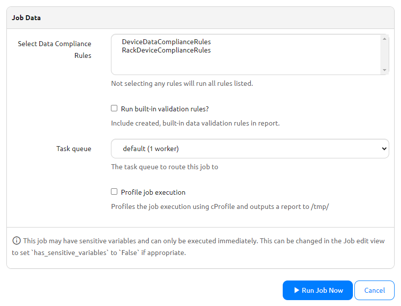

# Data Compliance Guide

## Overview

The Data Compliance feature audits any object within Nautobot according to a set of rules that you can define programmatically or from the built-in data validation rules (e.g. Min/Max, Regex, Required, or Unique rules). Rather than only checking for adherence to specified rules during the *creation or modification* of objects, Data Compliance will run a job that produces compliance statuses across *existing* objects (such as all pre-existing devices).

This is ideal for implementing some kind of business logic or standardization requirement into Nautobot after data is already populated within the platform. Data Compliance will allow you to identify valid or invalid existing objects based on your specified data compliance and validation rules. Additionally, Data Compliance enables the ability to implement more complex rules using the full power of programming logic, in addition to the built-in data validation ones.

### `DataComplianceRule` Class

The `DataComplianceRule` class takes advantage of the [CustomValidator](../../development/apps/api/platform-features/custom-validators.md) workflow. The basic idea is that during an object's `full_clean` method call, any `DataComplianceRule` classes are called to run their `clean` method. That method calls the object class's `audit` method, which you should implement. The expected return value of the `audit` method is `None`; however, any issues found during the `audit` method should raise a `ComplianceError`. Multiple key-value pairs can be passed in to a `ComplianceError`. The data within a `ComplianceError` is used by the `clean` method to create `DataCompliance` objects which relate the given object to the `DataComplianceRule` class, the attribute checked, and the message passed into the `ComplianceError` as to why the attribute is not valid. If there are no `ComplianceErrors` raised within the `audit` method, any existing `DataCompliance` objects for the given object and `DataComplianceRule` pair are marked as valid.

`DataCompliance` objects are only created for the attribute `__all__` (to represent the overall status) and attributes that have at some point been invalid. As an example, suppose there is a `DataComplianceRule` that checks the `location_type` and `status` attributes of a Location object named Location A. When this rule is run for Location A, both attributes are valid, so the only `DataCompliance` object created would be for `__all__` with a value of valid. Then, suppose Location A's `location_type` attribute is edited in a way that makes it invalid. A new `DataCompliance` object would be created for `location_type` stating why it is invalid, and the `__all__` object would be updated to now be invalid. Then, if `location_type` is edited again to bring it back into compliance, the `DataCompliance` objects for `location_type` and `__all__` would be updated to be valid.

Any `DataComplianceRule` class can have a `name` defined to provide a friendly name to be shown within in the UI. The `enforce` attribute can also be set to decide whether or not the `ComplianceError` caught in the `audit` method is raised again to the `clean` method, acting like a `ValidationError` wherever the original `full_clean` was called. Setting `enforce` to `True` changes the `DataComplianceRule` from a passive validation of data to an active enforcement of the logic within it.

!!! note
    Rules created using the `DataComplianceRule` class automatically re-run and re-validate whenever the target object is modified and saved. They can also be run manually using the `RunRegisteredDataComplianceRules` job.
    However, `DataCompliance` objects generated by the `Run built-in validation rules?` option in the job do not update or re-validate automatically. They will only refresh if the job is explicitly run again.
    For example, if a user fixes a non-compliant attribute on an object and checks the Data Compliance tab, the object will still appear as invalid for that built-in rule. This invalid status won't update until the job is rerun with the `Run built-in validation rules?` option enabled.

## How to Use

### Step 1. Create Data Compliance Rules

The first step is to create your desired data compliance rules following whatever programming logic you want. These compliance rules should be included as methods within one or more classes that implement `DataComplianceRule`.

There are two options for where to include these data compliance rule classes:

1. In a remote Git repository *(recommended)*
2. In the app's code

#### Writing Data Compliance Rules in a Remote Git Repository

A Git repository can be configured to add the `data compliance rules` context to store `DataComplianceRule` classes in source control. The app looks for a folder in your repo called `custom_validators`, and any Python files within that folder containing classes that implement `DataComplianceRule` will be imported. No code within the app itself needs to be added, changed, or modified.

Below is a template data compliance rule class that would be stored in `custom_validators/my_data_compliance_rules.py` in a remote Git repository:

```python
import re
from nautobot.apps.models import DataComplianceRule, ComplianceError

class DesiredClassName(DataComplianceRule):
    model = "desired.model" # Ex: 'dcim.device'
    enforce = False # True/False enforce flag

    def audit_desired_name_one(self):
        # Your logic to determine if this function has succeeded or failed
        if self.context["object"].desired_attribute == "undesired_value":
            raise ComplianceError({"desired_attribute": "Desired message why it's invalid."})

    def audit_desired_name_two(self):
        # Your logic to determine if this function has succeeded or failed
        if "undesired_value" in self.context["object"].desired_attribute:
            raise ComplianceError({"desired_attribute": "Desired message why it's invalid."})

    def audit(self):
        messages = {}
        for fn in [self.audit_desired_name_one, self.audit_desired_name_two]: # Add audit functions here
            try:
                fn()
            except ComplianceError as ex:
                messages.update(ex.message_dict)
        if messages:
            raise ComplianceError(messages)
```

After your Git repository is configured and rule class(es) written, add the repository to Nautobot from `Extensibility -> Data Sources -> Git Repositories`. Select `data compliance rules` for the 'provides' field. This will add/sync your repository and automatically find your data compliance rule classes.

#### Writing Data Compliance Rules within the App

To write data compliance rules within the app itself, add the classes that implement `DataComplianceRule` within `nautobot/nautobot_data_validation_engine/custom_validators.py`.

Below is a template data compliance rule class in `custom_validators/custom_validators.py` with the app's code:

```python
...

class DesiredClassName(DataComplianceRule):
    model = "desired.model" # Ex: 'dcim.device'
    enforce = False # True/False enforce flag

    def audit_desired_name_one(self):
        # Your logic to determine if this function has succeeded or failed
        if self.context["object"].desired_attribute == "undesired_value":
            raise ComplianceError({"desired_attribute": "Desired message why it's invalid."})

    def audit_desired_name_two(self):
        # Your logic to determine if this function has succeeded or failed
        if "undesired_value" in self.context["object"].desired_attribute:
            raise ComplianceError({"desired_attribute": "Desired message why it's invalid."})

    def audit(self):
        messages = {}
        for fn in [self.audit_desired_name_one, self.audit_desired_name_two]: # Add audit functions here
            try:
                fn()
            except ComplianceError as ex:
                messages.update(ex.message_dict)
        if messages:
            raise ComplianceError(messages)

custom_validators = list(CustomValidatorIterator()) + [DesiredClassName]
```

!!! tip
    Be sure to modify the existing `custom_validators` variable by casting `CustomValidatorIterator()` to a list and then appending the classes to it.

### Step 2. Run the `RunRegisteredDataComplianceRules` Job

To run data compliance rules, go to Nautobot Jobs and start the `RunRegisteredDataComplianceRules` job. In the pre-job settings, you can choose specific `DataComplianceRule` classes to run. If you don’t select any, the job will run all registered rules by default.

This job executes the `audit()` method for the selected `DataComplianceRule` classes on demand. You can use it to run compliance rules for the first time on a set of objects or re-run rules after updating the compliance logic.

If you also want to generate compliance results for built-in **and** user-created validation rules, check the `Run built-in validation rules?` option. This will apply all validation rules, regardless of whether they are currently **enabled** or **disabled** for the objects assigned to them.

This is especially useful when importing data into Nautobot using applications like [Single Source of Truth](https://github.com/nautobot/nautobot-app-ssot/). With this option, you can bring in data without being blocked by enabled built-in rules enforcing validation. After importing, you can then run this job to check whether the data follows the required standards and rules.



### Step 3. Viewing Data Compliance Results

All data compliance result objects can be found on the navigation bar under `Extensibility -> Data Validation Engine -> Data Compliance`. This view lists all available data compliance results produced from the `RunRegisteredDataComplianceRules` job. You can add filters such as showing only invalid objects or only ones from a specific compliance rule class.

Additionally, the `nautobot_data_validation_engine` app automatically creates template extensions to add a `Data Compliance` tab to the detail view of all objects. This tab makes it easy to check an individual object's compliance with any applicable data compliance rules.

!!! info
    A second job, `DeleteOrphanedDataComplianceData`, associated with Data Compliance can be run to remove/clean up any data compliance results that might be left dangling over time due to the parent object having since been deleted.

## Example

Two data compliance rules will be created using two separate `DataComplianceRule` classes within a remote Git repository called `dve-datacompliance-demo` that check devices for the following:
- `audit_device_name_chars` in `DeviceDataComplianceRules` - will mark a device invalid if the device name contains any special characters other than a dash (-), underscore (_), or period (.)
- `audit_device_rack` in `RackDeviceComplianceRules` - will mark a device invalid if it is not assigned a rack

`custom_validators/data_compliance_rules.py`:

```python
import re
from nautobot.apps.models import DataComplianceRule, ComplianceError

class DeviceDataComplianceRules(DataComplianceRule):
    model = "dcim.device"
    enforce = False

    # Checks if a device name contains any special characters other than a dash (-), underscore (_), or period (.) using regex
    def audit_device_name_chars(self):
        if not re.match("^[a-zA-Z0-9\-_.]+$", self.context["object"].name):
            raise ComplianceError({"name": "Device name contains unallowed special characters."})

    def audit(self):
        messages = {}
        for fn in [self.audit_device_name_chars]:
            try:
                fn()
            except ComplianceError as ex:
                messages.update(ex.message_dict)
        if messages:
            raise ComplianceError(messages)

class RackDeviceComplianceRules(DataComplianceRule):
    model = "dcim.device"
    enforce = False

    # Checks if a device is not assigned to a rack
    def audit_device_rack(self):
        if not self.context["object"].rack:
            raise ComplianceError({"rack": "Device should be assigned to a rack."})

    def audit(self):
        messages = {}
        for fn in [self.audit_device_rack]:
            try:
                fn()
            except ComplianceError as ex:
                messages.update(ex.message_dict)
        if messages:
            raise ComplianceError(messages)
```

After syncing this repository as a Nautobot Git Repository and running the `RunRegisteredDataComplianceRules` job, the audit results from Data Compliance are shown:


Filtering on devices that are out of compliance:


Drilling down on a specific device's Data Compliance tab:


After editing the device to correct the non-compliance, it is automatically re-checked and is now valid & in-compliance:


