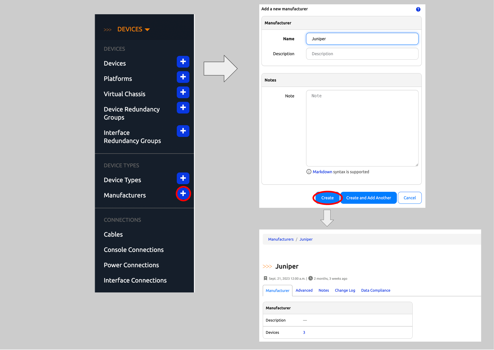
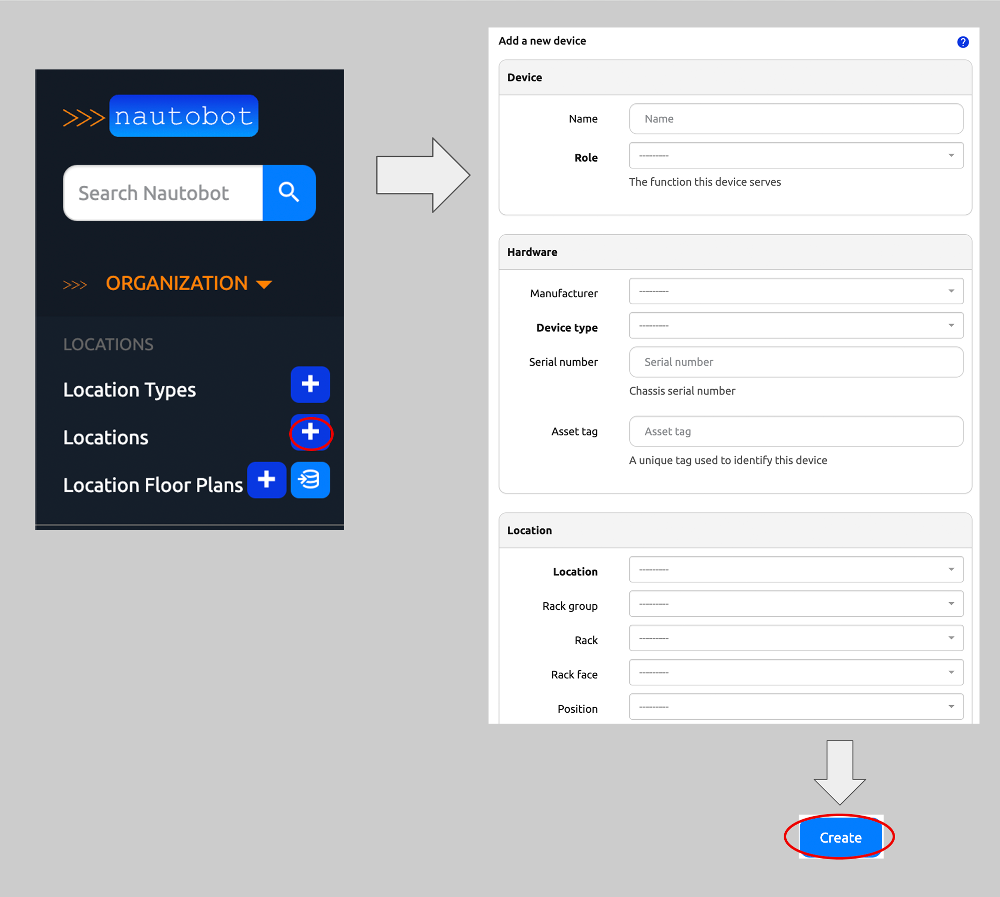
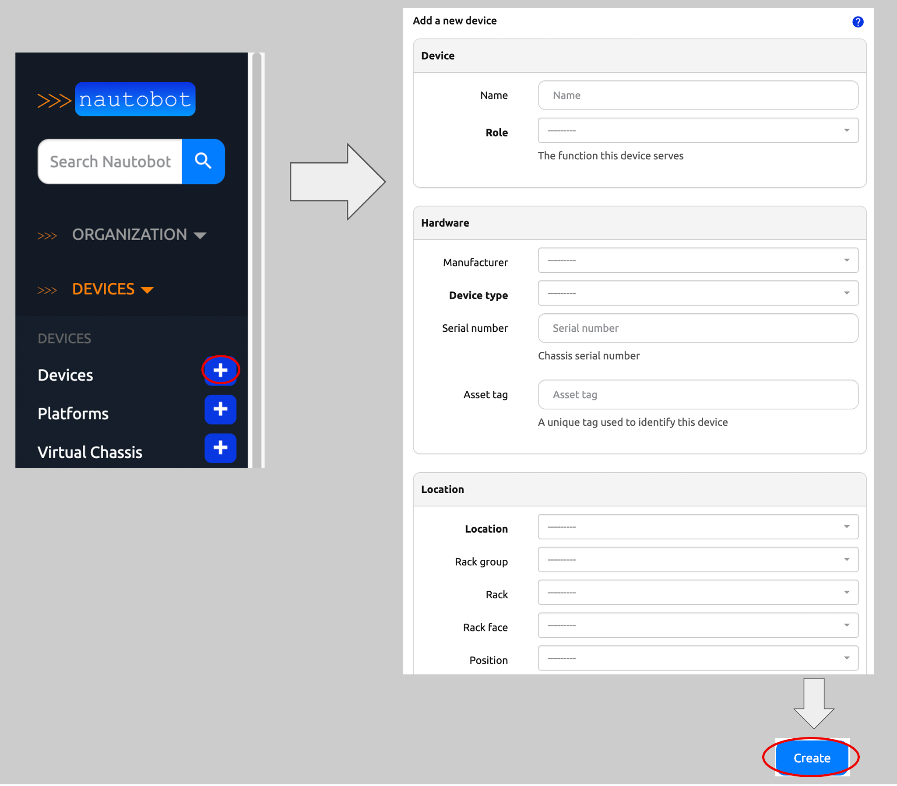

# Creating Devices in Nautobot

Every piece of hardware which is installed within a location or rack exists in Nautobot as a device.

More information on Devices can be found in the [Devices](../../core-data-model/dcim/device.md#devices) section of the Nautobot documentation.

A network Device in Nautobot has a few required attributes:

* A Device Role
* A Device Type
    * A Device Type requires a Manufacturer
* A Location
    * A Location requires a Location Type

Looking at the list above, there are five objects in Nautobot that must be present prior to creating a related Device.
The following sections will guide you through how to create each object type.

## Creating a Device Role

Devices can be organized by functional roles, which are fully customizable by the user.

More information on Device Roles can be found in the [Device Roles](../../core-data-model/dcim/device.md#device-roles) section of the Nautobot documentation.

To create a new Device, you will need an existing Device Role or need to create a new Device Role instance.

!!! note
     You might create roles for core switches, distribution switches, and access switches within your network.

To create a new Device Role:

1. Click on **Devices** in the top navigation menu
2. Find **Device Roles** on the drop-down menu
3. Select `+`
4. In the `Add a new device role` form, populate the `Name`
5. Click on Create

## Creating a Manufacturer

A Manufacturer represents the "make" of a device; e.g. Cisco or Dell. Each device type must be assigned to a manufacturer.

More information on Manufacturers is in the [Manufacturers](../../core-data-model/dcim/devicetype.md#manufacturers) section of the Nautobot documentation.

To create a new Device Type, you will need an existing Manufacturer or need to create a new Manufacturer instance.

To create a new Manufacturer:

1. Click on **Devices** in the top navigation menu
2. Find **Manufacturers** on the drop-down
3. Select **+**
4. In the `Add a new manufacturer` form, populate the `Name`
5. Click on `Create`

## Creating a Device Type

A device type represents a particular make and model of hardware that exists in the real world.
Device types define the physical attributes of a device (rack height and depth) and its individual components (console, power, network interfaces, and so on).

More information on Device Types is in the [Device Types](../../core-data-model/dcim/devicetype.md#device-types_1) section of the Nautobot documentation.

To create a new Device, you will need an existing Device Type or need to create a new Device Type instance.

To create a new Device Type:

1. Click on **Devices** in the top navigation menu
2. Find **Device Types**
3. Select **+** to go to the `Add a new device type` form
4. Select the `Manufacturer` from the drop-down selector
5. Populate the `Model` (name)
6. Click on `Create`

## Creating a Location Type

To create a location, you need to specify a Location Type for the location. The Location Type(s) that you define for your network may vary depending on the nature of your organization and its needs, but might include for example "region", "city", "site", "building" and/or "room". Take some time to think about this before you begin entering data as it will be a fundamental aspect of how you record your network in Nautobot.

More information on Location Type is found in the [Locations](../../core-data-model/dcim/locationtype.md#location-types) section of the Nautobot documentation.

To create a new Location Type:

1. Click on **Organization** in the top navigation menu
2. Find **LocationTypes**
3. Select **+** to go to the `Add a new location type` form
4. Select a `Parent` LocationType if needed
5. Populate the LocationType's `Name`
6. Select the desired `ContentTypes` for this LocationType (in this case `dcim.device`).
7. Click on `Create` at the bottom of the form

## Creating a Location

Once you've established your hierarchy of Location Types, you can begin to create the actual Locations of these types. You generally will start with the most general Locations (for example, if your base Location Type is "Region", you might create an "Americas" location of this type) and work your way down to the most specific Locations (for example, "Room 100 in the Headquarters building").

More information on Locations is found in the [Locations](../../core-data-model/dcim/location.md#locations) section of the Nautobot documentation.

To create a new Device, you will need an existing Location or need to create a new Location instance.

To create a new Location:

1. Click on **Organization** in the top navigation menu
2. Find **Locations**
3. Select **+** to go to the `Add a new location` form
4. Select a `LocationType`
5. Select a `Parent` Location if needed
6. Populate the Location's `Name`
7. Set the `Status` to `Active` in the drop-down selector
8. Click on `Create` at the bottom of the form (not shown)

## Creating a Device

To create a new Device:

1. Click on **Devices** in the top navigation menu
2. Find **Devices**
3. Select **+** to go to the `Add a new device` form
4. Populate the `Name`
5. Select the `Role` from the drop-down selector
6. Select the `Device Type` from the down-down selector
7. Select the `Location` from the drop-down selector
8. Set the `Status` to the appropriate value in the drop-down selector
9. Click on `Create` at the bottom of the form (not shown)

