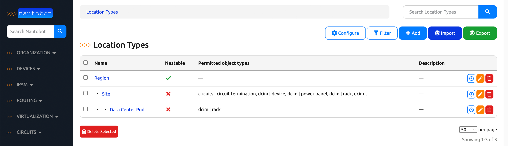
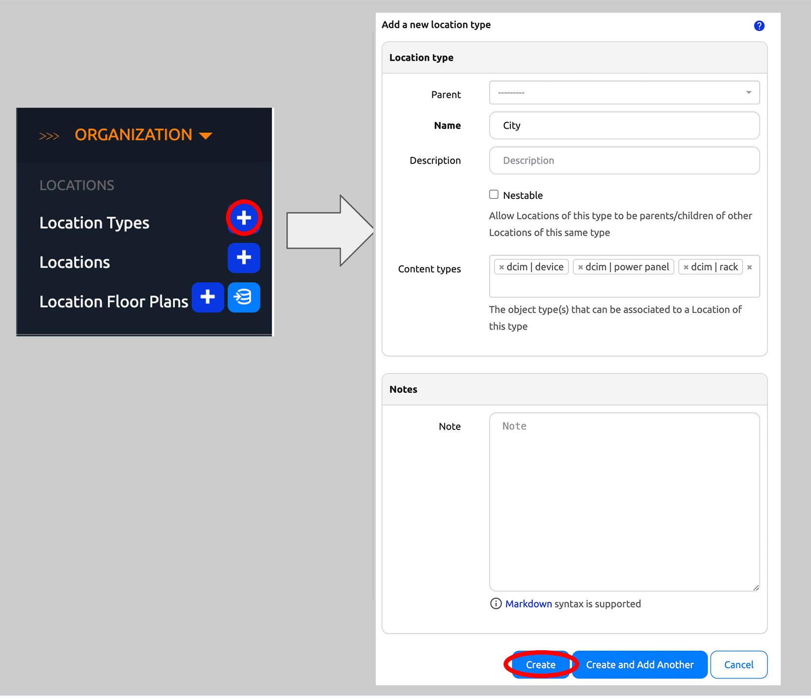
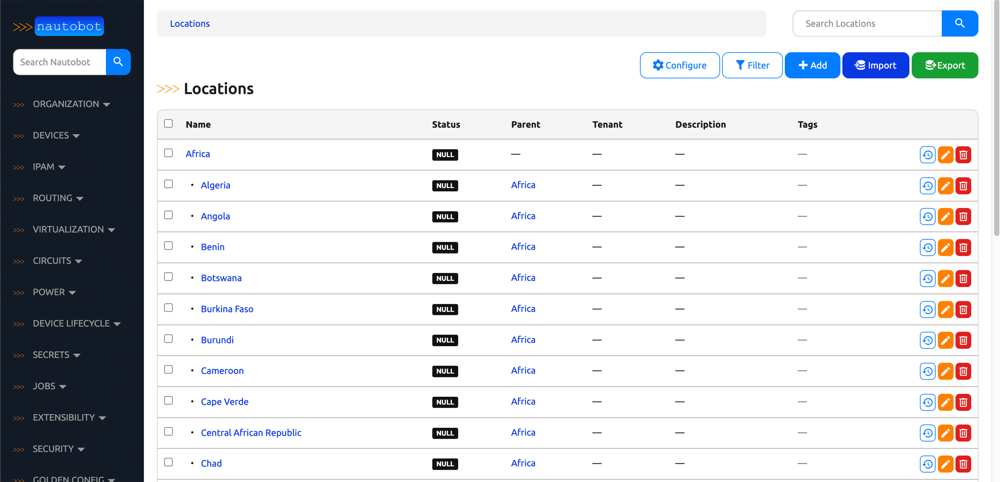

# Location Types and Locations

Location Types describe the hierarchical nature of your organization's infrastructure and is used to organize Locations. They can be nested recursively.
A Location Type might represent a continent, country, city, campus, or other area.

Locations retain hierarchical nature of Location Types but are more specific. For example, a Location of Location Type continent could be Asia, Europe, Americas and etc. or a Location of Location type city could be London, Tokyo, Manhattan and etc.

Additional information on Location Types is in the [Location Type section of the Nautobot documentation](../../core-data-model/dcim/locationtype.md).
Additional information on Locations is in the [Location section of the Nautobot documentation](../../core-data-model/dcim/location.md).

In the following exercise, we will create three Location Types and their corresponding locations:

Location Types:

* Continent
    * Intended to hold Locations that represent Countries in North America
* Country
    * Intended to hold Locations that represent Markets in Canada
* Market
    * Intended to hold Locations that represent Sites in the Vancouver Market
* Site
    * Intended to represent Site Location Type Locations

Locations:

* North America
    * A location of Location Type Continent
* Canada
    * A location of Location Type Country exists within North America
* Vancouver
    * A location of Location Type Market exists within Canada
* Vancouver 1
    * A location of Location Type Site exists within Vancouver

## Creating Location Types and Locations

To create a Location Type:

1. Click on **Organization** in the top menu
2. Click on **Location Types** in the **Organization** drop-down menu
    * From this page you can view any existing Location Types
3. Click on the blue `+ Add` button

The screenshots below show the creation of each Location Type.

Continent:

1. Leave the `Parent` blank; **Continent** will be a top-tier Location Type
2. Populate the `Name` to be `Continent`
3. Click on the `Create and Add Another` button

Country:

1. Select **Continent** as the `Parent` from the drop-down menu selector
2. Populate the `Name` to be `Country`
3. Click on the `Create and Add Another` button

Market:

1. Select **Country** as the `Parent` from the drop-down menu selector
2. Populate the `Name` to be `Market`
3. Click on the `Create and Add Another` button

Site:

1. Select **Market** as the `Parent` from the drop-down menu selector
2. Populate the `Name` to be `Site`
3. Click on the `Create` button

To create a Location of a certain Location Type:

1. Click on **Organization** in the top menu
2. Click on **Locations** in the **Organization** drop-down menu
    * From this page you can view any existing Locations
3. Click on the blue `+ Add` button

The screenshots below show the creation of each Location.

North America:

1. Leave the `Parent` blank; **North America** will be a top-tier Location
2. Select **Continent** from the Location Type drop-down menu selector
3. Populate the `Name` to be `North America`
4. Click on the `Create and Add Another` button

Canada:

1. Select **Country** from the Location Type drop-down menu selector
2. Select **North America** as the `Parent` from the drop-down menu selector
3. Populate the `Name` to be `Canada`
4. Click on the `Create and Add Another` button

Vancouver:

1. Select **Market** from the Location Type drop-down menu selector
2. Select **Canada** as the `Parent` from the drop-down menu selector
3. Populate the `Name` to be `Vancouver`
4. Click on the `Create and Add Another` button

Vancouver 1:

1. Select **Site** from the Location Type drop-down menu selector
2. Select **Vancouver** as the `Parent` from the drop-down menu selector
3. Populate the `Name` to be `Vancouver 1`
4. Click on the `Create` button

