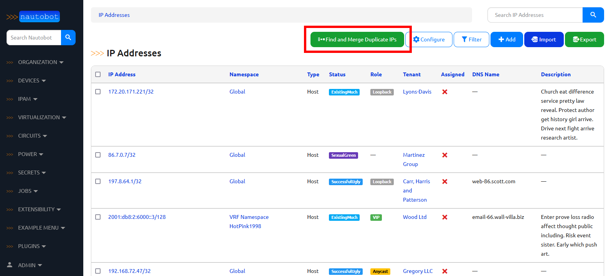
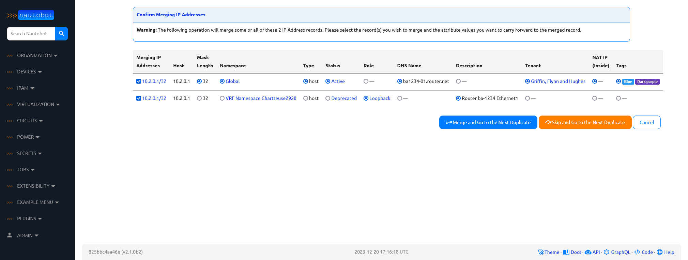
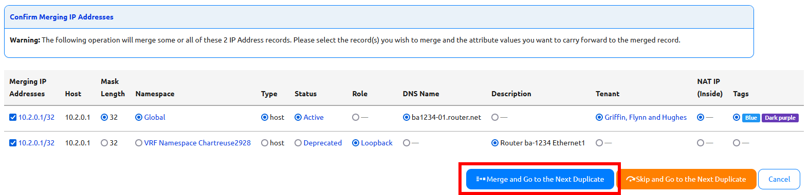
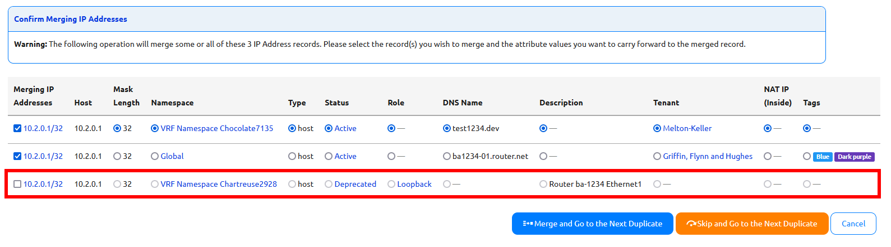
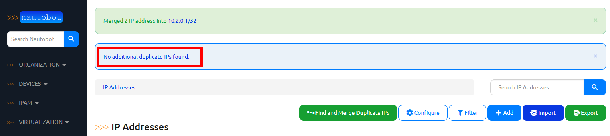

# Duplicate IP Address Merge Tool

In order to satisfy new uniqueness constraints, upgrading from Nautobot v1.x to v2.0 can create duplicate `IPAddress` objects in the existing database. This tool is designated to help users to reduce unnecessary duplicate `IPAddress` objects by merging them into a single IP Address with all the desired attributes.

## When to use this tool

After upgrading to Nautobot v2.0 and running the data migrations necessary, duplicate `IPAddress` objects might exist in your database. We define duplicate `IPAddress` objects as those which have the same `host` attribute but exist in different `namespaces`. If you have no use case to keep those duplicate `IPAddress` objects around, we recommend you to use this tool to de-duplicate those `IPAddress` objects and keep your database clean and manageable. But if you do have reasons to maintain duplicate `IPAddress` objects, this tool is not for you.

!!! important
    One of the possible reasons to maintain duplicate `IPAddress` objects can be that you have use cases for duplicate `IPAddress` objects with different `nat_inside` attributes. Only one `nat_inside` IP address can be assigned per object.

## How to access this tool

To use this tool:

1. Go to the `IPAM` tab on the navigation menu and click on `IP Addresses`. This will take you to the list view of all `IPAddress` objects that exist in the database.
2. On the top right of the page, you will find a group of buttons representing different available actions and the first one should be `Find and Merge Duplicate IPs`.
3. Click on that button to access the tool.

## How it works

1. If you de-select all other duplicates and attempt to merge, nothing will happen (the operation is a no-op) and the object will be skipped over as if you had clicked the `Skip and Go to the Next Duplicate` button.
2. All of the selected `IPAddress` objects will be deleted and a new `IPAddress` object with all of the desired attributes will be created.
3. All `Interface` assignments of the deleted `IPAddress` objects will be automatically updated to reference the newly created `IPAddress` object.
4. All `VMInterface` assignments of the deleted `IPAddress` objects will be automatically updated to reference the newly created `IPAddress` object.
5. The newly created `IPAddress` object will be added to `IPAddress` assignments of related `Service` objects.
6. `primary_ip4/primary_ip6` of `Devices` that are referencing the deleted `IPAddress` objects will be automatically updated to reference the newly created `IPAddress` object.

## How to use this tool

Clicking on the `Find and Merge Duplicate IPs` button will automatically query your database for duplicate `IPAddress` objects and group them by their respective `host` values. The tool will present the duplicate `IPAddress` objects in order from lowest to highest `mask_length` values.

### Merging all presented IP addresses

When a set of potentially duplicate `IPAddress` objects are found, the tool will present them and all of their editable attributes as a table. Select the desired value for each attribute and click on the `Merge and Go to the Next Duplicate` button. Nautobot will combine all of the selected `IPAddress` objects into a new `IPAddress` with the attributes you selected.
If more duplicate addresses are present, with a different `host` value, you will be presented with a new table showing the next set of duplicates, and can repeat this process as needed.

### Merging a subset of presented IP addresses

If you want to keep some of the `IPAddress` objects as distinct records but merge others, you can uncheck the check-boxes in the first column corresponding to the objects you do not wish to merge. From the remaining checked records, select the desired attributes and click on the `Merge and Go to the Next Duplicate` button. This operation will only combine the `IPAddress` objects that you have checked.

!!! note
    Unchecking a given `IP Address` prevents its attribute values from being selected for the merge. Moreover, if there are not at least two boxes checked, there is no merging to perform, and so clicking on the `Merge and Go to the Next Duplicate` button will proceed to the next set of duplicate IP addresses without making any changes to the current set.

### Skip Merging All Duplicate IP Addresses Presented

If you decide that these `IPAddress` objects presented do not need to be merged, you can click on the `Skip and Go to the Next Duplicate` button to skip merging these `IPAddress` objects and go to the next set of duplicate `IPAddress` objects with a different `host` value.

### No more Duplicate IP Addresses

If you have gone through all duplicate `IPAddress` objects, you will be taken back to the list view of `IPAddress` objects with a message indicating that `No additional duplicate IPs found.`.

