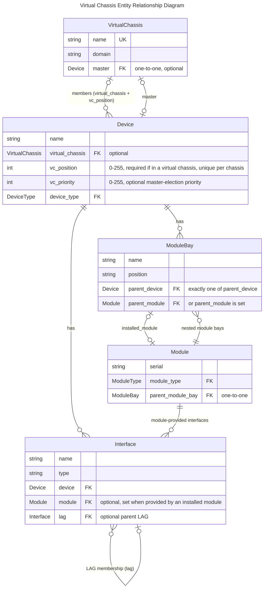
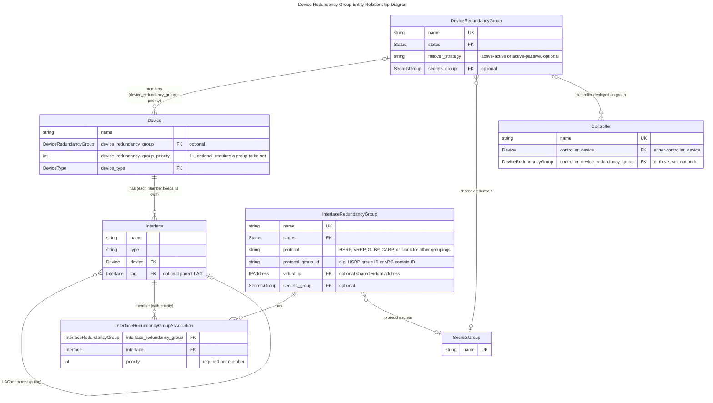

# Redundant Devices

Infrastructure is typically designed with redundancy in mind, prompting vendors to develop various technologies to support different high availability (HA) strategies. These include a range of protocols, connection types, synchronization systems, and terminology.

This creates a complex ecosystem that can be challenging to navigate, especially when determining how to model redundant infrastructure in Nautobot or which model to select. This guide aims to provide a clear and comprehensive approach to documenting redundant device infrastructure by covering:

- Use Cases
- Vendor Implementations
- Data Model Overview
- GraphQL Queries
- Key questions for the data model
- Configuration stanzas
- API Calls using pynautobot snippets
- Design Builder snippets

## Use Cases

The primary use cases to consider when creating, updating, or documenting redundant device models are:

- **Inventory Management:** Tracking assets and device details.
- **Configuration Management:** Generating and managing device configurations.
- **HA Resiliency:** Understanding and documenting network fault tolerance.

To help guide these use cases, we will ask and answer each of these questions to go with the best practices:

- Can you port channel across multiple devices?
- Can you see all interfaces on the Primary?
- Can you see all interfaces on the Backup?
- On Primary, can you tell which interfaces are assigned to which device?
- When do you see all the interfaces on the master device?
- Can you connect interfaces from master to non-master?
- Any configurations don't map back to model?
- How are interfaces named?
- What should the naming standard be for the chassis device?
- Should I use interface named templates?

## Vendor Implementations

While vendors offer a variety of technologies, the data model remains largely agnostic to these specifics. The following table serves as a foundation for modeling redundant devices in Nautobot.

|     | Dual-chassis Single Control Plane | Multi-chassis Stack | Firewall Cluster | Multi-chassis L2 Pair | Firewall HA Pair | HA Pairs |
| --- | --- | --- | --- | --- | --- | --- |
| Example Technologies | VSS / StackWise Virtual / SRX | StackWise / VC / Arista Stack / IRF / SummitStack | Cisco FTD | vPC / MLAG | PAN / Fortinet / ASA | LB / F5 / A10 / Viptela / Versa / Silver Peak |
| Management Control Plane Count | 1* | 1 | 1 | 2 | 2 | 2 |
| Physical Device Count | 2 | 2+ | 2+ | 2+ | 2 | 2 |
| Interface Config Unique | Yes | Yes | Yes (FTD-No) | No | No | No |
| Prompt Identity<br>(CLI Hostname) | Shared<br>(single logical hostname) | Shared<br>(single logical hostname) | Shared<br>(single logical hostname) | Per-device | Per-device<br>(may show active or similar) | Per-device<br>(may show active or similar) |
| Sibling Awareness | Yes (members) | Yes (members) | Yes (members) | Yes (peer relationship) | Yes (node0/node1) | Yes (peer/HA partner) |
| Configuration Scope<br>(must match, if synced will match) | Full<br>(single running config for logical switch) | Full | Full | Partial | Majority | Majority |
| Configuration Sync<br>(full / majority / independent) | Full | Full | Full | Independent | Majority<br>(minor local config) | Majority<br>(minor local config) |
| Redundancy Group Identifier | Domain/Pair ID | Stack/Chassis ID | Cluster ID | Domain/Pair ID<br>(vPC domain ID / MLAG domain) | Cluster ID | HA/Cluster ID |
| Redundancy Mode | Active/Active | Active/Active | Active/Active or Active/Standby | Active/Active | Active/Standby or Active/Active | Active/Standby or Active/Active |
| Dedicated HA Interface | Yes | Yes | Yes | Yes | Yes | Typically<br>(sync/heartbeat links) |
| Shared Virtual MAC | Yes | Yes | Yes | Typically<br>(via protocol such as FHRP/anycast) | Yes (on L3) | Yes |


1. Dual-chassis Single Control Plane
    VSS / StackWise Virtual (Cisco)
2. Multi-chassis Stack
    Stackwise / Virtual Chassis / Arista Stack / HPE IRF / Extreme SummitStack
3. Firewall Cluster
    Cisco FXOS / SRX
4. Multi-chassis L2 Pair
    VPC / MLAG (Cisco vPC, Arista MLAG, Juniper MC-LAG variants)
5. Firewall HA pairs
    PAN / Fortinet / ASA
6. HA Pairs
    Load balancer HA / F5 BIG-IP HA / A10 Thunder HA / Viptela / Versa / Silver Peak

The primary piece of information to consider from this list is the Management Control Plane Count. When it is **one** you should use a VirtualChassis and when it is **two**, you should use a Device Redundancy Group.

## Virtual Chassis

The key piece of Virtual Chassis is when multiple physical devices operate as a **single logical device** with one management IP, such as a switch stack. The model itself is intentionally simple: a single `VirtualChassis` object that member devices point to, with each member recording its position in the stack. One member can be explicitly designated as the master, and Nautobot will surface all ports (interfaces, front ports, rear ports, etc.) from every member on that master device, reflecting how the stack actually presents itself on the network.

!!! note
    Interfaces are not "automatically" numbered. This is similar to the real world, in which when you get a device, the in interfaces presume a `1-slot`, such as `GigabitEthernet1/0/1`, but once you set it as the 3rd slot, the interface would be `GigabitEthernet1/0/1`. You are encouraged to use the Bulk Rename feature to bulk change the device interfaces.

LAG interfaces are supported across devices that have the same parent virtual chassis — this is the one case in Nautobot where a LAG's member interfaces may live on different devices. The LAG will show its member interfaces across the multiple devices on the LAG itself. The recommendation is to create the LAG interface itself (e.g. `PortChannel10`) on the expected master device. Because the chassis is a single logical device, the LAG fully captures the relationship on its own; no additional grouping model (such as an Interface Redundancy Group) is needed.

### Nautobot Model Overview

This schema illustrates the connections between the models involved in a virtual chassis.

TODO: Validate AI Generated ERD



TODO: Should this (and other attributes) be moved to their respective page.

**VirtualChassis Attributes**

| Attribute | Type | Required | Description |
|---|---|---|---|
| `name` | String | Yes | Unique name identifying the virtual chassis |
| `master` | FK → Device | No | The device that acts as the control plane master for the chassis; all member devices are managed through this device |
| `domain` | String | No | Optional domain name shared across chassis members (used in some vendor implementations for identification) |

**Device Attributes (virtual chassis-related)**

| Attribute | Type | Required | Description |
|---|---|---|---|
| `virtual_chassis` | FK → VirtualChassis | No | The virtual chassis this device belongs to |
| `vc_position` | Integer (0–255) | Yes (if in VC) | Slot/position of this device within the virtual chassis; must be unique per chassis |
| `vc_priority` | Integer (0–255) | No | Election priority for master role; higher values win (vendor behavior varies) |

### Sample API - TODO:

### Sample Design Builder

The following [Design Builder](https://docs.nautobot.com/projects/design-builder/en/latest/) example models a two-member Cisco StackWise virtual chassis (`jcy-stackwise-01`). The `VirtualChassis` is declared as its own top-level entry — parallel to how a `DeviceRedundancyGroup` is defined further down — and the member devices then attach via the chassis ref. Because the chassis carries a `master` FK back to a `Device`, the chassis entry uses `deferred: true` so the master assignment resolves only after the master device has been created. The primary IPv4 address is similarly deferred until interface and IP assignments are in place, and the stack ports between members are wired together using `"!connect_cable"` against the refs on switch 1.

```
virtual_chassis:
  - "!create_or_update:name": "jcy-stackwise-01"
    domain: "jcy-stackwise-01"
    master: "!ref:jcy-stackwise-01"
    deferred: true
    "!ref": "jcy-stackwise-01-vc"

devices:
    # Switch 1 of the stack
  - "!create_or_update:name": "jcy-stackwise-01"
    location__name: "JCY"
    status__name: "Active"
    device_type__model: "C9300-48P"
    role__name: "Access Switch"
    virtual_chassis: "!ref:jcy-stackwise-01-vc"
    vc_position: 1
    vc_priority: 15
    "!ref": "jcy-stackwise-01"
    # Interfaces (subset for brevity)
    interfaces:
      - "!create_or_update:name": "GigabitEthernet0/0"
        type: "1000base-t"
        status__name: "Active"
        mgmt_only: true
        description: "Management Interface"
        ip_address_assignments:
          - "!create_or_update:ip_address__address": "192.168.1.10/24"
            ip_address:
              "!create_or_update:address": "192.168.1.10/24"
              "!create_or_update:parent": "192.168.1.0/24"
              status__name: "Active"
              "!ref": "sw1_mgmt_ip"
      - "!create_or_update:name": "StackPort1/1"
        type: "cisco-stackwise-480"
        status__name: "Active"
        "!ref": "sw1_stackport_1"
      - "!create_or_update:name": "StackPort1/2"
        type: "cisco-stackwise-480"
        status__name: "Active"
        "!ref": "sw1_stackport_2"
      - "!create_or_update:name": "Port-channel1"
        type: "lag"
        status__name: "Active"
        mode: "tagged"
        description: "Cross-stack uplink LAG to upstream distribution"
        "!ref": "po1"
      - "!create_or_update:name": "TenGigabitEthernet1/1/1"
        type: "10gbase-x-sfpp"
        status__name: "Active"
        description: "Uplink"
        lag: "!ref:po1"
    # Deferred IP assignment to avoid dependency issues with interface creation/assignment
    primary_ip4:
      "address": "!ref:sw1_mgmt_ip"
      deferred: true

    # Switch 2 of the stack
  - "!create_or_update:name": "jcy-stackwise-01:2"
    location__name: "JCY"
    status__name: "Active"
    device_type__model: "C9300-48P"
    role__name: "Access Switch"
    # VC assignment to existing VC with switch 1 as master
    virtual_chassis: "!ref:virtual_chassis"
    # VC attributes
    vc_position: 2
    vc_priority: 14
    # interfaces (subset for brevity)
    interfaces:
      - "!create_or_update:name": "GigabitEthernet0/0"
        type: "1000base-t"
        status__name: "Active"
        mgmt_only: true
        description: "Management"
        vrf: "!ref:mgmt_vrf"
      - "!create_or_update:name": "StackPort2/1"
        type: "cisco-stackwise-480"
        status__name: "Active"
        "!connect_cable":
          status__name: "Connected"
          to: "!ref:sw1_stackport_2"
      - "!create_or_update:name": "StackPort2/2"
        type: "cisco-stackwise-480"
        status__name: "Active"
        "!connect_cable":
          status__name: "Connected"
          to: "!ref:sw1_stackport_1"
      - "!create_or_update:name": "TenGigabitEthernet2/1/1"
        type: "10gbase-x-sfpp"
        status__name: "Active"
        description: "Uplink"
        lag: "!ref:po1"
    # No primary IP assignment on switch 2 to avoid conflicts with switch 1 management IP
```

### GraphQL

The following query retrieves a virtual chassis by name and uses the master device's `vc_interfaces` field to return every interface across all chassis members in a single flat list. `vc_interfaces` on the VC master expands to the master's own interfaces plus the non-management interfaces of every other member, so there is no need to walk `members -> interfaces` separately.

```graphql
query ($vc_name: [String]) {
  virtual_chassis(name: $vc_name) {
    name
    domain
    master {
      name
      vc_interfaces {
        name
        type
        enabled
        mac_address
        mode
        description
        device {
          name
          vc_position
        }
        lag {
          name
        }
        ip_addresses {
          address
        }
      }
    }
  }
}
```

Query variables:

```json
{
  "vc_name": "jcy-stackwise-01"
}
```

!!! note
    Because `vc_interfaces` is a property on the `Device` model, the same query can be run directly against the master device (e.g. `query { devices(name: ["jcy-stackwise-01"]) { vc_interfaces { ... } } }`) without going through `virtual_chassis` at all. Querying the `virtual_chassis` object is useful when you also need chassis-level attributes such as `domain` or want to confirm the master before traversing its interfaces.

### Dual-chassis Single Control Plane

#### Key Questions

- Can you port channel across multiple devices? Yes, (review bulk edit)
- Can you see all interfaces on the Primary? Yes
- Can you see all interfaces on the Backup? No, only see what is physically on that device (e.g. not the other interfaces)
- On Primary, can you tell which interfaces are assigned to which device? Yes, a column "Device" starts showing up
- When do you see all the interfaces on the master device? When it is set to master
- Can you connect interfaces from master to non-master? Yes
- Do all configuration map to the model correctly? Yes
- How are interfaces named? The interfaces are named per device but shown on the master. However, they are not auto renamaed based on placement, and you are encouraged to use bulk rename for ti.
- What should the naming standard be for the chassis device?  We recommend using a colon `:` delimiter, such as `ams01-sw01` and `ams01-sw01:2`.
- Should I use interface named templates? Yes. You will likely have to rename them after the fact, but the bulk rename makes it simple.

#### Configuration Generation

_Standard Global Config_

```
!
switch virtual domain 200
  switch 1
!
```

> Note: Switch number is local, domain must match

_Management Plane_

```
int port-channel 201
 switchport
 switch virtual link 1
!
interface TenGigabitEthernet1/1/1
 description VSL Link
 no switchport
 no ip address
 no cdp enable
 channel-group 201 mode on
!
interface TenGigabitEthernet1/1/2
 description VSL Link
 no switchport
 no ip address
 no cdp enable
 channel-group 201 mode on
```

> Note: Port Channel is different on the different switches, e.g. 201 for switch 1 and 202 for switch 2

Switch 2:

_Standard Global Config_

```
switch virtual domain 200
  switch 2
```

_Management Plane_

> Note: Port Channel is different on the different switches, e.g. 201 for switch 1 and 202 for switch 2

```
interface port-channel 202
 switchport
 switch virtual link 1
!
interface TenGigabitEthernet2/1/1
 description VSL Link
 no switchport
 no ip address
 no cdp enable
 channel-group 202 mode on
!
interface TenGigabitEthernet2/1/2
 description VSL Link
 no switchport
 no ip address
 no cdp enable
 channel-group 202 mode on
```


_Data Plane_

Switch 1 & 2

```
interface port-channel2
  description VSL Link
  switchport mode trunk
  switchport trunk allowed vlan 10,20,30,40
!
interface TenGigabitEthernet1/0/1
  switchport mode trunk
  switchport trunk allowed vlan 10,20,30,40
  channel-group 2 mode active
!
interface TenGigabitEthernet2/0/1
  switchport mode trunk
  switchport trunk allowed vlan 10,20,30,40
  channel-group 2 mode active
```

> Note: this config is on a single management IP


### Multi-Chassis Stack

#### Key Questions

These questions and answers are based on **Cisco StackWise**:

- Q. Can you port channel across multiple devices? Yes (this is called a Multi-Chassis EtherChannel or MEC).
- Q. Can you see all interfaces on the Primary? Yes.
- Q. Can you see all interfaces on the Backup? Yes (the standby maintains a synced control plane).
- Q. On Primary, can you tell which interfaces are assigned to which device? Yes (via the interface naming convention).
- Q. When do you see all the interfaces on the master device? Always (once the stack is formed and members are "Ready").
- Q. Can you connect interfaces from master to non-master? Yes.
- Q. Any configurations don't map back to model? No (configurations are applied to the logical stack, not specific physical hardware models).
- Q. How are interfaces named? Interface Type Stack-Unit/Slot/Port (e.g., GigabitEthernet 1/0/1).
- Q. What should the naming standard be for the chassis device? Member numbers (usually 1 through 8 or 9).
- Q. Should I use interface named templates? Yes (highly recommended for consistency across the stack).

#### Configuration Generation

_Standard Global Config_

1. Master Switch (Primary)
Set a high priority (default is 1, max is 15) to ensure this switch wins the election.

```
switch 1 priority 15
switch 1 renumber 1
```

2. Member Switches (Non-Master)
Keep a lower priority. You should renumber them so their interfaces are easily identifiable (e.g., Member 2 uses 2/0/x).

```
switch 2 priority 1
switch 1 renumber 2
```

_Management Plane_

You only configure this once on the Master; it automatically propagates to all members.

- Option A: Using an SVI (VLAN interface)

```
interface Vlan1
 ip address 192.168.1.10 255.255.255.0
 no shut
```

- Option B: Using the Dedicated Management Port

```
interface Management0/0
 ip address 10.1.1.10 255.255.255.0
 no shut
```

_Data Plane_

Because the stack behaves as one logical switch, the configuration is identical to a standard Port-Channel, except the interface identifiers reflect the different stack members (e.g., 1/0/1 and 2/0/1).

```
interface Port-channel 1
 description Uplink-to-Core
 switchport mode trunk

interface GigabitEthernet 1/0/1 # <== 1 is member 1 of stack.
 channel-group 1 mode active

interface GigabitEthernet 2/0/1 # <== 2 is member 2 of stack.
 channel-group 1 mode active
```

### Firewall Cluster

#### Key Questions

- Can you port channel across multiple devices? Yes — spanned EtherChannel is supported in FTD clustering
- Can you see all interfaces on the Primary (control node)? No — Each node can only see its interfaces, but all cluster interfaces are visible via FMC
- Can you see all interfaces on the Backup (data node)? No — only interfaces physically on that chassis module are visible locally
- On Primary, can you tell which interfaces are assigned to which device? No — Only the FMC can see all interfaces
- When do you see all the interfaces on the master device? You cannot - Only the FMC can see all interface
- Can you connect interfaces from master to non-master? Yes
- Do all configurations map to the model correctly? Mostly Yes - Anything not represented in the model can be stored in the config context
- How are interfaces named? FXOS notation (e.g., `Ethernet1/1`, `Ethernet1/2`) at chassis level; logical names assigned in FMC
- What should the naming standard be for the chassis device? Use the shared cluster name / FMC display name (logical single name)
- Should I use interface named templates? Yes

#### Configuration Generation

_FXOS Chassis — Physical Interface Config_

```
scope eth-uplink
  scope fabric a
    scope interface Ethernet1/1
      set port-type data
      enable
      exit
    scope interface Ethernet1/2
      set port-type data
      enable
      exit
    scope interface Ethernet1/3
      set port-type cluster
      enable
      exit
    scope interface Ethernet1/4
      set port-type cluster
      enable
      exit
    exit
  exit
```

> Note: Interfaces designated `cluster` type are reserved for CCL; `data` interfaces are assigned to logical devices

_FXOS Chassis — CCL Port Channel_

```
scope eth-uplink
  scope fabric a
    create port-channel 48
      set port-channel-mode active
      create member-port Ethernet1/3
      create member-port Ethernet1/4
      exit
    exit
  exit
```

> Note: The CCL port channel ID (48 in this example) must match on both chassis; use dedicated high-bandwidth interfaces

_FXOS Chassis — Logical Device (Cluster Bootstrap)_

```
scope ssa
  scope slot 1
    scope app-instance ftd FTD-CLUSTER
      set cluster-role control
      set cluster-group-id 1
      set ccl-network 192.0.2.0
      set ccl-mask 255.255.255.0
      exit
    exit
  exit
```

> Note: `cluster-role` is set to `control` on the primary chassis slot and `data` on all others; `cluster-group-id` must match across all members


## Device Redundancy Groups

TODO: Review all of these assertions in detail.

The key piece of Device Redundancy Groups is when multiple physical devices work together to provide high availability while each maintaining its **own control plane and management IP**, such as a firewall HA pair, a vPC/MLAG pair, or a load balancer cluster. The model itself is intentionally simple: a single `DeviceRedundancyGroup` object that member devices point to, with each member optionally recording a priority within the group to convey failover order (e.g. primary vs. secondary). The group itself carries the failover strategy (active/active or active/passive), a status, and optionally a Secrets Group for credentials shared across the members.

!!! note
    Unlike a Virtual Chassis, there is no master concept and interfaces are never surfaced on a peer device. Each member remains a fully independent device in Nautobot — with its own interfaces, inventory, configuration, and primary IP — reflecting that each unit is managed on its own. Which unit is "primary" is conveyed by `device_redundancy_group_priority`; the meaning of the value (whether higher or lower wins) follows vendor behavior, so be consistent across your groups.

LAG interfaces cannot span members of a Device Redundancy Group; a LAG and its member interfaces must belong to the same device (or the same virtual chassis). For multi-chassis technologies such as vPC or MLAG, the recommendation is to model a port channel on each member individually, then tie the pair together with an [Interface Redundancy Group](../core-data-model/dcim/interfaceredundancygroup.md): create one group per multi-chassis port channel, assign each member's LAG interface to it with a priority, and record the vPC/MLAG domain or pair ID in `protocol_group_id`. As users, we recommend giving the LAG the same name on both members (e.g. `Port-Channel10` on each switch) to match how the technology is typically configured, however this is not enforced nor is any configuratoins synced. The Interface Redundancy Group is the only thing in the data model relating them to each other.

An Interface Redundancy Group does not change or take over the interfaces themselves — each member's LAG remains an ordinary, independently configured interface on its own device. What the group models is the real-world relationship between them: the fact that two separately configured interfaces present a single logical entity to the rest of the network. Its protocol fields (HSRP, VRRP, GLBP, CARP), optional shared `virtual_ip`, and Secrets Group exist for the first hop redundancy use case it was originally designed around, but the grouping itself applies to any set of redundant interfaces — pairing the per-member port channels of a vPC/MLAG domain is exactly that.


### Nautobot Model Overview

This schema illustrates the connections between the models involved in a device redundancy group.

TODO: Validate AI Generated ERD



**DeviceRedundancyGroup Attributes**

| Attribute | Type | Required | Description |
|---|---|---|---|
| `name` | String | Yes | Unique name identifying the redundancy group |
| `status` | Status | Yes | Lifecycle status of the group (e.g., Planned, Active, Decommissioning) |
| `description` | String | No | Brief human-readable description of the group's purpose |
| `failover_strategy` | Choice | No | How traffic is handled across members: `Active/Active` (both units process traffic simultaneously) or `Active/Passive` (one unit is standby until failover occurs) |
| `comments` | Text | No | Free-form notes about the group |
| `secrets_group` | FK → SecretsGroup | No | Credentials used to access devices in this group (e.g., shared enable password) |

**Device Attributes (redundancy-related)**

| Attribute | Type | Required | Description |
|---|---|---|---|
| `device_redundancy_group` | FK → DeviceRedundancyGroup | No | The redundancy group this device belongs to |
| `device_redundancy_group_priority` | Integer (≥ 1) | No | Priority of this device within the group |

**InterfaceRedundancyGroup Attributes**

| Attribute | Type | Required | Description |
|---|---|---|---|
| `name` | String | Yes | Unique name identifying the interface redundancy group |
| `status` | Status | Yes | Lifecycle status of the group |
| `protocol` | Choice | No | Redundancy protocol: HSRP, VRRP, GLBP, or CARP; leave blank for other groupings such as vPC/MLAG port channel pairing |
| `protocol_group_id` | String | No | Group identifier, e.g. HSRP/VRRP group ID or vPC/MLAG domain ID |
| `virtual_ip` | FK → IPAddress | No | Virtual IP address shared across the member interfaces |
| `secrets_group` | FK → SecretsGroup | No | Secrets used by the redundancy protocol, e.g. an HSRP authentication key |
| `interfaces` | M2M → Interface | No | Member interfaces; each association requires a `priority` integer used by the redundancy protocol |

### Sample API

### Sample Design Builder

The following [Design Builder](https://docs.nautobot.com/projects/design-builder/en/latest/) example models a Cisco ASA 5500 active/standby failover pair (`jcy-fw-01` and `jcy-fw-02`) tied together by a `DeviceRedundancyGroup` named `jcy-fw-failover`, sharing the same `JCY` location and `192.168.1.0/24` management prefix introduced in the Virtual Chassis example above. Unlike a `VirtualChassis` — where the group depends on its master device and forces deferred assignment — a `DeviceRedundancyGroup` is created first as a standalone object, and each `Device` simply references it through `device_redundancy_group`. The active/standby relationship is expressed via `device_redundancy_group_priority` (higher wins primary, so `jcy-fw-01` is primary in this example), and the dedicated heartbeat/sync link is modeled as a `failover-link` virtual interface on each device in its own `/31`.

```
device_redundancy_groups:
  - "!create_or_update:name": "jcy-fw-failover"
    status__name: "Active"
    failover_strategy: "active-passive"
    description: "ASA 5500 active/standby failover pair for JCY perimeter"
    "!ref": "jcy_fw_drg"

devices:
    # Primary failover unit
  - "!create_or_update:name": "jcy-fw-01"
    location__name: "JCY"
    status__name: "Active"
    device_type__model: "ASA5555-X"
    role__name: "Firewall"
    device_redundancy_group: "!ref:jcy_fw_drg"
    device_redundancy_group_priority: 100
    interfaces:
      - "!create_or_update:name": "Management0/0"
        type: "1000base-t"
        status__name: "Active"
        mgmt_only: true
        description: "Management Interface"
        ip_address_assignments:
          - "!create_or_update:ip_address__address": "192.168.1.20/24"
            ip_address:
              "!create_or_update:address": "192.168.1.20/24"
              "!create_or_update:parent": "192.168.1.0/24"
              status__name: "Active"
              "!ref": "fw01_mgmt_ip"
      - "!create_or_update:name": "GigabitEthernet0/3"
        type: "1000base-t"
        status__name: "Active"
        description: "Failover physical parent"
        "!ref": "fw01_failover_parent"
      - "!create_or_update:name": "failover-link"
        type: "virtual"
        status__name: "Active"
        parent_interface: "!ref:fw01_failover_parent"
        description: "ASA failover link"
        ip_address_assignments:
          - "!create_or_update:ip_address__address": "172.27.48.0/31"
            ip_address:
              "!create_or_update:address": "172.27.48.0/31"
              "!create_or_update:parent": "172.27.48.0/31"
              status__name: "Active"
    primary_ip4:
      "address": "!ref:fw01_mgmt_ip"
      deferred: true

    # Secondary failover unit
  - "!create_or_update:name": "jcy-fw-02"
    location__name: "JCY"
    status__name: "Active"
    device_type__model: "ASA5555-X"
    role__name: "Firewall"
    device_redundancy_group: "!ref:jcy_fw_drg"
    device_redundancy_group_priority: 50
    interfaces:
      - "!create_or_update:name": "Management0/0"
        type: "1000base-t"
        status__name: "Active"
        mgmt_only: true
        description: "Management Interface"
        ip_address_assignments:
          - "!create_or_update:ip_address__address": "192.168.1.21/24"
            ip_address:
              "!create_or_update:address": "192.168.1.21/24"
              "!create_or_update:parent": "192.168.1.0/24"
              status__name: "Active"
              "!ref": "fw02_mgmt_ip"
      - "!create_or_update:name": "GigabitEthernet0/3"
        type: "1000base-t"
        status__name: "Active"
        description: "Failover physical parent"
        "!ref": "fw02_failover_parent"
      - "!create_or_update:name": "failover-link"
        type: "virtual"
        status__name: "Active"
        parent_interface: "!ref:fw02_failover_parent"
        description: "ASA failover link"
        ip_address_assignments:
          - "!create_or_update:ip_address__address": "172.27.48.1/31"
            ip_address:
              "!create_or_update:address": "172.27.48.1/31"
              "!create_or_update:parent": "172.27.48.0/31"
              status__name: "Active"
    primary_ip4:
      "address": "!ref:fw02_mgmt_ip"
      deferred: true
```

### GraphQL

The following query retrieves a `DeviceRedundancyGroup` by name along with each member device and its interfaces. A `DeviceRedundancyGroup` has no equivalent of `vc_interfaces` because every member retains an independent control plane and its own interface set; the canonical pattern is to walk `devices -> interfaces` (filtered as needed, e.g. to just the failover link).

```graphql
query ($drg_name: [String]) {
  device_redundancy_groups(name: $drg_name) {
    name
    failover_strategy
    status {
      name
    }
    devices {
      name
      device_redundancy_group_priority
      interfaces {
        name
        type
        enabled
        description
        parent_interface {
          name
        }
        ip_addresses {
          address
        }
      }
    }
  }
}
```

Query variables:

```json
{
  "drg_name": "jcy-fw-failover"
}
```

!!! note
    If you already have a device name in hand, the same data is reachable from the device side via `devices(name: ["jcy-fw-01"]) { device_redundancy_group { devices { ... } } }`. Querying `device_redundancy_groups` directly is preferred when you want group-level attributes (`failover_strategy`, `status`, `secrets_group`) without first knowing which device belongs to which group.

================

### Multi-chassis L2 Pair

#### Key Questions

- Can you port channel across multiple devices? No — LAG is per-device only
- Can you see all interfaces on the Primary? No — the active unit only shows its own interfaces
- Can you see all interfaces on the Backup? No — the standby unit has its own separate interface list
- On Primary, can you tell which interfaces are assigned to which device? N/A — each device is modeled separately in Nautobot
- When do you see all the interfaces on the master device? Each device always shows only its own interfaces
- Can you connect interfaces from master to non-master? The failover and stateful link interfaces connect the two units either directly or via a switch
- Do all configurations map to the model correctly? Mostly yes; standby IPs and failover link require HA-specific handling
- How are interfaces named? Standard ASA format (e.g., `GigabitEthernet0/0`, `Management0/0`)
- What should the naming standard be for the HA pair? A combination of the two devices names (e.g., `ASA01/ASA02` for `ASA01` and `ASA02`)
- Should I use interface named templates? Yes

#### Configuration Generation

TODO: Validate these AI Generated configurations

The following example shows a Cisco NX-OS vPC pair (`nyc-nexus-01` and `nyc-nexus-02`) in vPC domain 10, with a vPC (Po10) down to an access switch.

Switch 1:

_Global / vPC Domain_

```
feature vpc
feature lacp
!
vpc domain 10
  role priority 10
  peer-keepalive destination 192.168.100.2 source 192.168.100.1 vrf management
  peer-switch
  peer-gateway
  auto-recovery
```

> Note: The vPC domain ID (10) must match on both peers — this is the value to record in `protocol_group_id` on the Interface Redundancy Group. The peer-keepalive runs between each switch's own management IP, reflecting the two independent control planes that make this a Device Redundancy Group rather than a Virtual Chassis.

_Peer-Link_

```
interface port-channel1
  description vPC Peer-Link to nyc-nexus-02
  switchport mode trunk
  switchport trunk allowed vlan 10,20,30,40
  spanning-tree port type network
  vpc peer-link
!
interface Ethernet1/53
  description vPC Peer-Link member
  switchport mode trunk
  channel-group 1 mode active
!
interface Ethernet1/54
  description vPC Peer-Link member
  switchport mode trunk
  channel-group 1 mode active
```

_vPC to Downstream Device_

```
interface port-channel10
  description vPC 10 to jcy-access-01
  switchport mode trunk
  switchport trunk allowed vlan 10,20
  vpc 10
!
interface Ethernet1/1
  description Member of Po10 (vPC 10)
  switchport mode trunk
  channel-group 10 mode active
```

Switch 2:

_Global / vPC Domain_

```
feature vpc
feature lacp
!
vpc domain 10
  role priority 20
  peer-keepalive destination 192.168.100.1 source 192.168.100.2 vrf management
  peer-switch
  peer-gateway
  auto-recovery
```

> Note: Only the role priority and the peer-keepalive source/destination differ from switch 1; the peer-link and downstream vPC configuration are identical on both peers.

_Peer-Link and vPC to Downstream Device_

```
interface port-channel1
  description vPC Peer-Link to nyc-nexus-01
  switchport mode trunk
  switchport trunk allowed vlan 10,20,30,40
  spanning-tree port type network
  vpc peer-link
!
interface Ethernet1/53
  description vPC Peer-Link member
  switchport mode trunk
  channel-group 1 mode active
!
interface Ethernet1/54
  description vPC Peer-Link member
  switchport mode trunk
  channel-group 1 mode active
!
interface port-channel10
  description vPC 10 to jcy-access-01
  switchport mode trunk
  switchport trunk allowed vlan 10,20
  vpc 10
!
interface Ethernet1/1
  description Member of Po10 (vPC 10)
  switchport mode trunk
  channel-group 10 mode active
```

> Note: The `vpc 10` number must match on both peers. The local port-channel ID is allowed to differ between peers, but keeping them identical (`Po10` ↔ `vpc 10` on both) is strongly recommended — this mirrors the data-model guidance above to give both members' LAG interfaces the same name and relate them with an Interface Redundancy Group.

_Downstream Device (jcy-access-01)_

```
interface Port-channel10
  description Uplink to nyc-nexus-01/nyc-nexus-02 (vPC 10)
  switchport mode trunk
  switchport trunk allowed vlan 10,20
!
interface GigabitEthernet1/0/1
  description Uplink to nyc-nexus-01 Eth1/1
  channel-group 10 mode active
!
interface GigabitEthernet1/0/2
  description Uplink to nyc-nexus-02 Eth1/1
  channel-group 10 mode active
```

> Note: From the downstream device's perspective, vPC is invisible — it is a standard LACP port channel whose member links happen to land on two different switches. In Nautobot the downstream side is modeled as an ordinary LAG on a single device; no special handling is required.

### Firewall HA pair

#### Key Questions

- Can you port channel across multiple devices? No — EtherChannel is per-device only
- Can you see all interfaces on the Primary? No — the active unit only shows its own interfaces
- Can you see all interfaces on the Backup? No — the standby unit has its own separate interface list
- On Primary, can you tell which interfaces are assigned to which device? N/A — each device is modeled separately in Nautobot
- When do you see all the interfaces on the master device? Each device always shows only its own interfaces
- Can you connect interfaces from master to non-master? The failover and stateful link interfaces connect the two units either directly or via a switch
- Do all configurations map to the model correctly? Mostly yes; standby IPs and failover link require HA-specific handling
- How are interfaces named? Standard ASA format (e.g., `GigabitEthernet0/0`, `Management0/0`)
- What should the naming standard be for the HA pair? A combination of the two devices names (e.g., `ASA01/ASA02` for `ASA01` and `ASA02`)
- Should I use interface named templates? Yes

#### Configuration Generation

_Primary (Active) Unit — Failover Config_

```
failover
failover lan unit primary
failover lan interface FAILOVER GigabitEthernet0/3
failover replication http
failover link STATEFUL GigabitEthernet0/4
failover interface ip FAILOVER 10.1.1.1 255.255.255.252 standby 10.1.1.2
failover interface ip STATEFUL 10.1.2.1 255.255.255.252 standby 10.1.2.2
```

_Interface Standby IPs (on Primary)_

```
interface GigabitEthernet0/0
 nameif outside
 security-level 0
 ip address 203.0.113.1 255.255.255.0 standby 203.0.113.2
!
interface GigabitEthernet0/1
 nameif inside
 security-level 100
 ip address 10.0.0.1 255.255.255.0 standby 10.0.0.2
```

!!! note
    Standby IP is assigned to the secondary unit's corresponding interface automatically

_Secondary (Standby) Unit — Failover Config_

```
failover
failover lan unit secondary
failover lan interface FAILOVER GigabitEthernet0/3
failover link STATEFUL GigabitEthernet0/4
failover interface ip FAILOVER 10.1.1.1 255.255.255.252 standby 10.1.1.2
failover interface ip STATEFUL 10.1.2.1 255.255.255.252 standby 10.1.2.2
```

!!! note
    The secondary unit receives the full running config from the primary after the failover link is established; interface IPs need not be set manually

### HA pairs

#### Key Questions

These questions and answers are based on **F5 BIG-IP (DSC)**:

- Q. Can you port channel across multiple devices? No. (Each device must have its own independent trunks/links to the switches)
- Q. Can you see all interfaces on the Primary? No. (You only see the local physical interfaces of the Primary unit)
- Q. Can you see all interfaces on the Backup? No. (You only see the local physical interfaces of the Backup unit).
- Q. On Primary, can you tell which interfaces are assigned to which device? No. (The Primary is unaware of the Backup's specific physical port numbering).
- Q. When do you see all the interfaces on the master device? Never. (They remain two separate hardware entities).
- Q. Can you connect interfaces from master to non-master? No. (There is no "backplane" traffic switching; you only connect them via HA/Sync cables)
- Q. Any configurations don't map back to model? Yes. (Specific items like Management IP, Hostname, and Interface speeds are "Device-Specific" and do not sync).
- Q. How are interfaces named? Slot.Port (e.g., 1.1, 1.2).
- Q. What should the naming standard be for the chassis device? FQDN (e.g., f5-01.network.local).
- Q. Should I use interface named templates? No. (F5 uses VLAN names to abstract the configuration; you sync the VLAN, not the interface).

#### Configuration Generation

_Standard Global Config_

1. Device A (Primary)

    ```
    # Set the sync address (usually the internal or HA self-IP)
    modify cm device f5-01.local { configsync-ip 10.1.1.1 }
    # Add Device B to the trust (performed on Device A)
    run cm add-to-trust wire-address 10.1.1.2 user admin

    # Create the Group (On Primary):
    create cm device-group my_ha_group { devices { f5-01.local f5-02.local } type sync-failover }
    ```

2. Device B (Standby)

    ```
    # Set the sync address
    modify cm device f5-02.local { configsync-ip 10.1.1.2 }
    Create the Group (On Primary):
    ```

_Management Plane_

Each retains its own unique Management IP for individual access, but they share a Floating Self-IP for management traffic that needs to reach the "Active" unit (like SNMP or API calls).

**Device A (Primary)**

    ```
    modify sys global-settings mgmt-dhcp disabled
    create sys management-ip 192.168.1.10/24

    create net self floating_mgmt_ip { address 192.168.1.12/24 vlan internal floating enabled traffic-group traffic-group-1 }
    ```

**Device B (Standby)**

    ```
    create sys management-ip 192.168.1.11/24
    Floating Self-IP (Shared/Active):
    ```

_Data Plane_

Does not support Cross-Chassis EtherChannel. Instead, you build a "Trunk" on each device separately. Redundancy is handled by the Floating IP moving from Device A's Trunk to Device B's Trunk during a failover.

1. Create the Trunk (Do this on both units locally)

    ```
    create net trunk my_trunk { interfaces { 1.1 1.2 } lacp enabled }
    ```

2. Assign VLAN to the Trunk

    ```
    create net vlan internal_vlan { interfaces add { my_trunk { tagged } } }
    ```

3. Create the Floating IP (The "Gateway" for your servers)

    ```
    create net self internal_floating { address 10.10.1.1/24 vlan internal_vlan floating enabled traffic-group traffic-group-1 }
    ```
