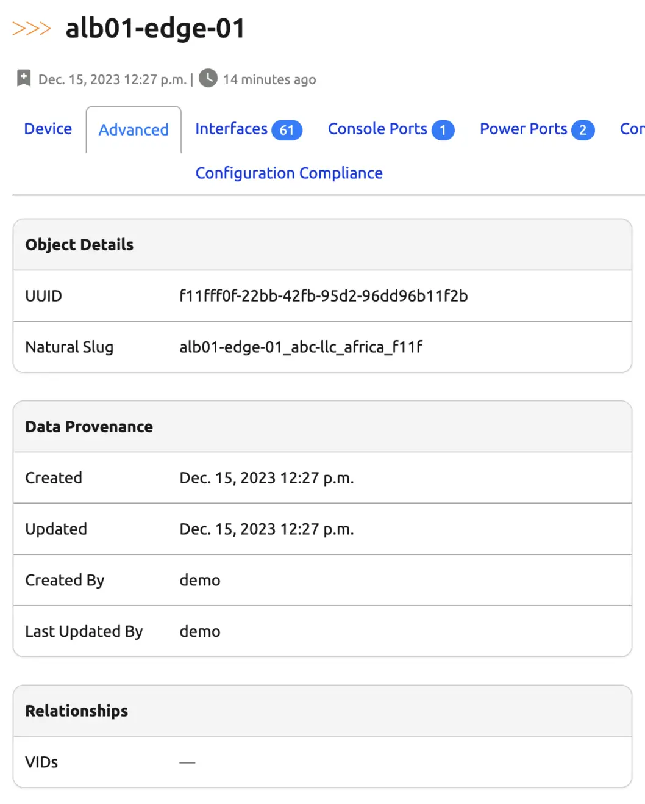

# Relationships

Relationships are defined between one (or more) objects in your source of truth to reflect business logic or other relationships that may be useful to you but that haven't been defined. Relationships define specific links between objects that might be specific to your network or data.

For more technical details on how to use this feature, please see the documentation on [Relationships](../platform-functionality/relationship.md).

## Relationship details

This table defines repository parameters that are required to establish a relationship.

|Field|Explanation|
|:--|:--|
|Label|Label of the relationship as displayed to users.|
|Key|Internal relationship key. Please use underscores rather than dashes.|
|Description|(Optional) Meaningful description to provide additional relationship details.|
|[Type](../platform-functionality/relationship.md#relationship-types)|Cardinality of this relationship.|
|Source type|The source object type to which this relationship applies.|
|Source Label|(Optional) Label for related destination objects, as displayed on the source object.|
|Source filter|(Optional) Filterset filter matching the applicable source objects of the selected type.|
|Destination type|The destination object type to which this relationship applies.|
|Destination Label|(Optional) Label for related destination objects, as displayed on the destination object.|
|Destination filter|(Optional) Filterset filter matching the applicable destination objects of the selected type.|

+/- 2.0.0
    Relationship model now uses its `label` attribute (unique for all Relationship instances) exclusively for display purposes in the UI.

    Relationship's `slug` attribute was renamed to `key` (unique for all Relationship instances), which contains a GraphQL-safe string used as the key in the underlying relationship data dictionary.

    These changes do not require users to do any manual work as they are properly handled by data migrations during the upgrade from Nautobot v1.x to v2.0. If you have duplicate Relationship `slug` values in your database pre-migration, some of the Relationship `key` values might altered to ensure that `key` values for all Relationship instances are unique.

As seen in the table above relationships offers many additional optional options for more advanced functionality, those options will be discussed further during this user guide.

## Using a Relationship

This section will focus on examples relationships.

### Adding a Relationship

To create a relationship, navigate to **Extensibility > Data Management > Relationships**

A simple relationship between `Device to VLAN` which is a `many-to-many` relationship. This relationship is `many-to-many` because more than one Devices can be assigned more than one VLANs. This relationship object is shown below.

### Extensibility of a Relationship

Now that this relationship is created we can navigate over to a Device detail view and we see `VLANs` is now listed under the `Relationships` section.

What if your business requirements or terminology differs from what you want? For example lets say you want `VLANs` to be called `VIDs`, you can simply update the relationship `source label` field based on your needs.

You can see now the relationship name is `VIDs` instead of `VLANs`.

!!! info
    In a similar fashion the destination label can be changed to meet business requirements.

Business requirements are one concept to take into account when making `labels`, but making the relationship data more meaningful is an option worth exploring.

In the snippet below the source label was updated to `Configured VLANs`. The result on the device detail view is evident and provides additional context that is otherwise missing. `VLANs: 3 VLANs` doesn't give the same context as `Configured VLANs: 3 VLANs`.

In a similar fashion the destination label can make it move evident that these VLANs are in use on the devices. A destination label `In use on devices: 3 devices` is far superior to the default of `Devices: 3 devices`. Providing these labels makes it easier for users of the system to understand the relationships, especially if they weren't the initial implementor of the relationship.

Next, some of the visibility options will be discussed. The first option to be demonstrated is the ability to `Move to Advanced tab`. In some cases a particular relationship may not be relevant to the typical user (maybe it's used exclusively in automation) and so you may want the relationship data to be displayed on the `Advanced` tab instead of within the default detail view of the object.

First the option needs to be enabled.

Once the option is enabled you will see the relationship is now moved to the `Advanced` tab.

Another visibility option is the `Hide on Source Object` and `Hide on Destination Object`, these do exactly what you'd expect. If enabled (via checkbox) the relationship will not be displayed on the object under the `Relationships` section.

!!! info
    If the `Move to Advanced tab` and the `Hide on Object` are both enabled, the `Hide on Object` takes precedence and the relationship is not shown on the advanced tab.

The two options above add flexibility to how the data is visualized within the Nautobot UI, the final option to enhance the relationship feature is the ability to match source or destination objects by providing a [filterset](../platform-functionality/relationship.md#relationship-filters).

To continue on this example say we want to limit the relationship on the device to be able to only relate VLANs that have specific attributes. Perhaps only VLANs with the role of server and ID of 1000.

The filterset below can be used to accomplish this.

Once this has been applied you can navigate to the Device and attempt to add the relationship. As seen in the screenshot below only `VLANs` matching the filterset are shown and available to be related.

As detailed in the [extras](https://docs.nautobot.com/projects/core/en/stable/models/extras/relationship/) documentation the API can be used to determine what can be filtered on. Below is a quick example of how to do that.

### Constructing a Relationship Filter

The first step is to navigate to the API documentation. This can be done by going to a browser and navigating to `https://<server-name>/api/docs`.

This will load the Swagger documentation, the next step would be to navigate to the endpoint you're trying to filter.

!!! info
    The easiest way to navigate the Swagger documentation for the necessary endpoint is to search using the content-type defined in your relationship object.

In this example the `Destination type` chosen was `ipam | VLAN`. We can use that to search in the Swagger docs for `ipam/vlans`.

As seen above this endpoint supports all the methods, but if we dig into the `GET` method we will see the parameters that are available.

!!! warn
    The screenshot above is only a subset of the available filters.

!!! info
    A great way to test a filterset before applying it to a relationship would be to use the `try it out` feature from within the API docs page.

### Additional Examples

Many relationship examples are available on the public [sandbox](https://demo.nautobot.com/extras/relationships/)

These cover many of the different `Types` of relationships available in Nautobot.
