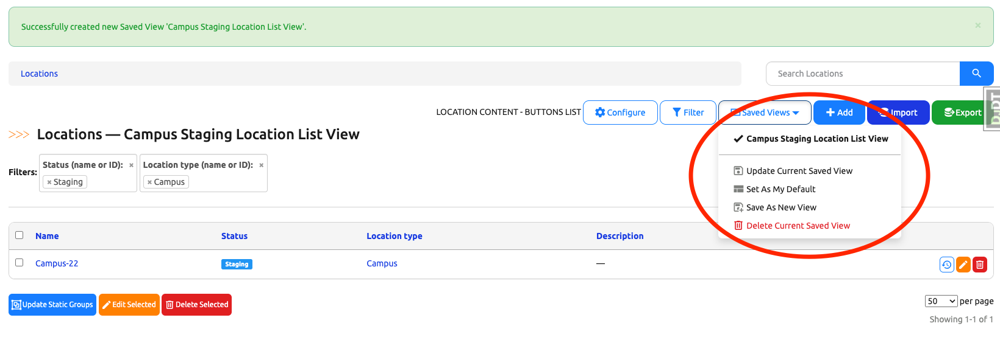
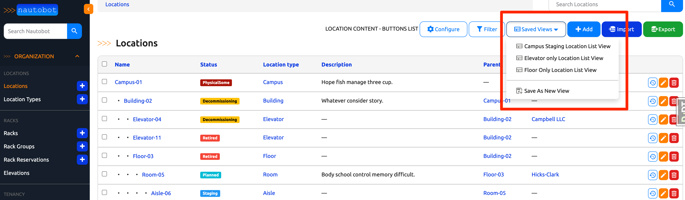
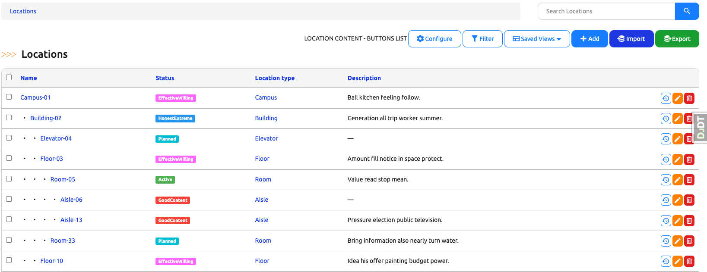

# Saved Views

Below is a user guide on how to create, update, save and use saved views in Nautobot.

## When to use Saved Views

This feature gives users the ability to save multiple list view configurations (table columns, filtering, pagination and sorting) into saved view instances for ease of access during later use and reuse.

## How to use Saved Views

### How to create a new Saved View

Navigate to any saved-view-supported model's list view. (We will use Location List View for the purpose of this guide)

Note that there is a "Saved Views" dropdown button in the group of buttons on the right hand side.

Configure the list view by clicking on the "Filter" and "Configure" buttons on the right hand side.

Once you are satisfied with the current list view configurations, click on the "Saved Views" dropdown button. There should be an option in the dropdown menu named "Save As New View".

Click the "Save As New View" option, a modal should appear to prompt you to give a name to your new saved view.

We will name this new saved view "Campus Staging Location List View".

Click the "Save" button on the modal and the browser should take you to the new saved view. Note the success banner on top of the page stating "Successfully created new Saved View Campus Staging Location List View". Note that the current saved view name also appeared in the page heading. This is an indicator that you are currently viewing a saved view.

Click the "Saved Views" dropdown button again and you should see your new saved view's name and a new option "Update Current View" populated in the dropdown menu.

### How to update an existing Saved View

Stay on the same page where we just created the new Saved View and make some modifications to the view.

Note that an asterisk appeared next to the title of the view. The asterisk is an indicator that this saved view currently has unsaved changes.

Once you have made desired changes, click the "Saved Views" dropdown button and you should see the option "Update Current View".

Click "Update Current View" option and the page should refresh and you should see the success banner on top of the page stating "Successfully updated current view Campus Staging Location List View".

Congratulations, you have successfully updated your saved view!

### How to navigate Saved Views

There are several ways you can navigate saved views. All saved views created by any user for any list view can be accessed from the navigation menu on the left hand side under "Extensibility -> Saved Views":

Another way is from the "Saved View" dropdown button on any given model list view. All saved views defined for this specific model list view are populated in the dropdown menu and the saved view the user is currently viewing will be highlighted in bold.

### How to clear configurations on a Saved View

If the user is currently viewing a saved view, a "Clear View" button will be at the bottom of the dropdown menu. A modal should appear when the button is clicked, prompting the user to confirm the action.

Clicking the confirm button will clear the saved and unsaved configurations of the saved view and the saved view will have the same configuration as the default model list view.

