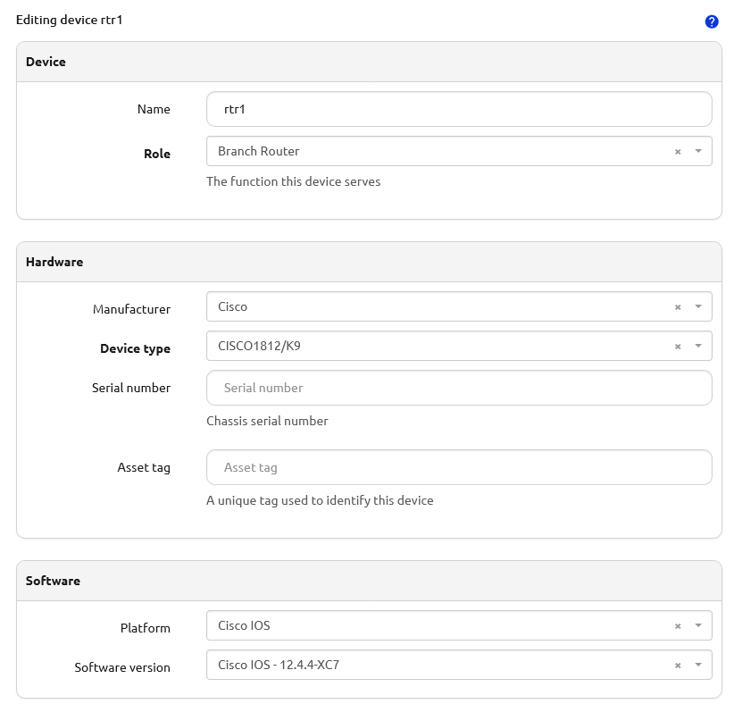

# Software Images and Versions

The [Software Image](../core-data-model/dcim/softwareimage.md) and [Software Version](../core-data-model/dcim/softwareversion.md) models are used to track the Software Versions of [Devices](../core-data-model/dcim/device.md), [Inventory Items](../core-data-model/dcim/inventoryitem.md) and [Virtual Machines](../core-data-model/virtualization/virtualmachine.md) and their associated image files.

## Create a Software Version

!!! note
    Before creating a Software Version, you must have an existing [Platform](../core-data-model/dcim/platform.md) to associate the Software Version to.

To create a new Software Version, navigate to **Devices > Software Versions** and click **Add**. (`/dcim/software-versions/add/`) The `Platform`, `Version` and `Status` fields are all required. You can use the `Alias` field if you would like to add a friendly name for the Software Version. There are optional fields for `Release Date`, `End of Support Date`, `Documentation URL` and booleans for `Long Term Support` and `Pre-Release`.

## Create a Software Image

!!! note
    Before creating a Software Image, you must have an existing Software Version to associate the Software Image to.

To create a new Software Image, navigate to **Devices > Software Images** and click **Add**. (`/dcim/software-images/add/`) The `Software Version`, `Image File Name` and `Status` fields are all required. There are optional fields for `Image File Checksum`, `Hashing Algorithm`, `Image File Size`, `Download URL`, and `Device Types`.

## Assigning Software Images to Device Types

[Device Types](../core-data-model/dcim/devicetype.md) must be associated to Software Images before Devices of that type can be associated to any Software Versions. In the UI, the Device Type / Software Image association can be made either on the Device Type form or the Software Image form. Through the REST API, you must make these associations using the through model `dcim.DeviceTypeToSoftwareImage` at `/api/dcim/device-type-to-software-image/`.

## Assigning Software Versions to Devices, Inventory Items and Virtual Machines

!!! note
    Devices can only be associated to a Software Version if their Device Type is associated to a Software Image for that version.

Devices, Inventory Items and Virtual Machines may be associated to one Software Version to track their current version. This association can be made in the UI on the Device, Inventory Item or Virtual Machine forms. Through the REST API, the Software Version can be associated on the Device, Inventory Item and Virtual Machine REST API POST/PUT/PATCH views.

