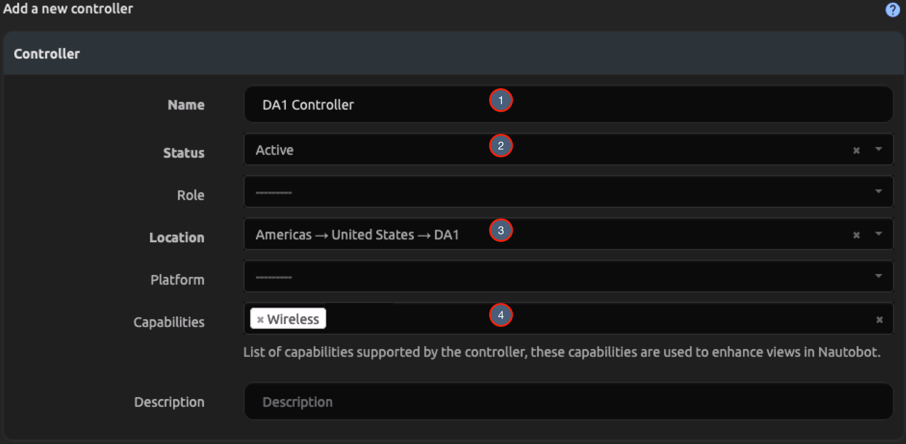
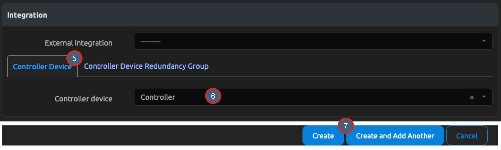
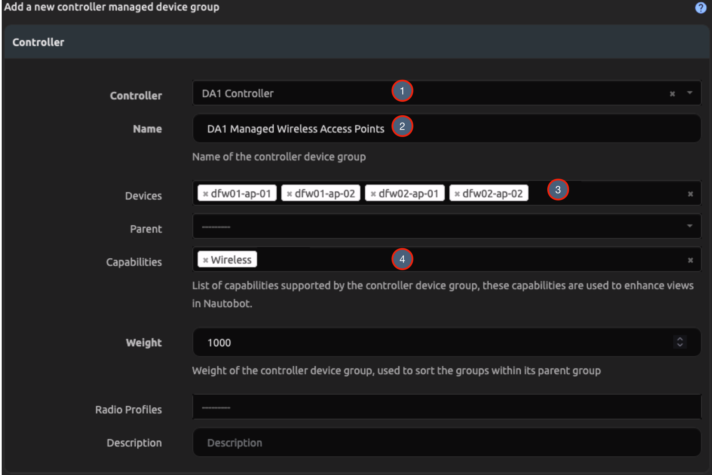
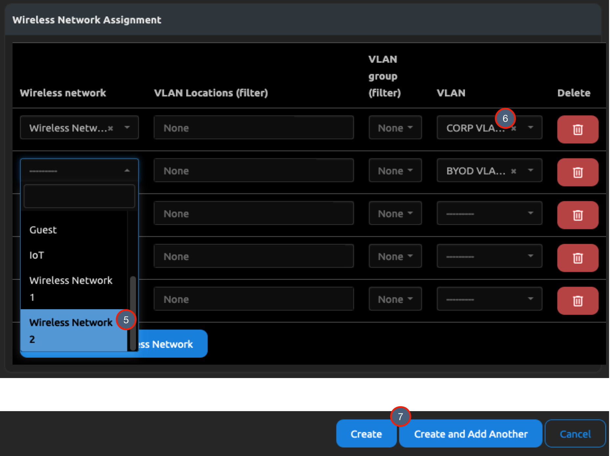
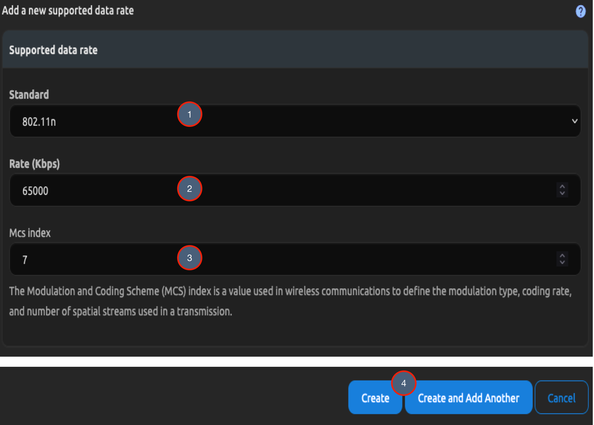

# Wireless Networks and Controllers

This is an example of using Wireless Networks and Controllers to represent Wireless Access Points managed by a Controller in a Data Center. We will be using Central Mode on the Wireless Networks so that traffic from the Access Points is tunnelled through the Controller.

## Optional Prerequisites

Before we start adding Wireless Networks, there are features we can optionally setup to enrich the data in Wireless Networks and Controllers. Here are links to each of the guides for the features:

- [Devices](getting-started/creating-devices.md)
- [Locations](getting-started/creating-location-types-and-locations.md)
- [IP Addresses and Prefixes](getting-started/ipam.md)
- [VLANs](getting-started/vlans-and-vlan-groups.md)

## Wireless Networks

To create a Wireless Network:

1. Click on **Wireless** in the Nav Menu Bar.
2. Click on **Wireless Networks** in the **Wireless** group.
3. Click on the blue `+ Add Wireless Network` button.

Next, we will complete the required fields for the Wireless Network:

1. Enter the Wireless Network name.
2. Enter the Wireless Network SSID.
3. Select a Mode from the Dropdown (Central in this example).
4. Choose the Authentication type.
5. Click on the `Create` or `Create and Add Another` button.

## Controllers

To create a Wireless Controller:

1. Click on **Wireless** in the Nav Menu Bar.
2. Click on **Wireless Controllers** in the **Wireless** group.
3. Click on the blue `+ Add Controller` button.

Next, we will complete the required fields for the Wireless Controller:

1. Enter the Controller name.
2. Select a Status for the Controller.
3. Select a Location for the Controller.
4. Select `Wireless` on the Capabilities dropdown.
5. Optional: Click on the Controller Device tab.
6. Optional: Choose the Device that hosts the Controller.
7. Click on the `Create` or `Create and Add Another` button.

## Device Groups

To create a Device Group:

1. Click on **Wireless** in the Nav Menu Bar.
2. Click on **Device Groups** in the **Wireless** group.
3. Click on the blue `+ Add Controller Managed Device Group`.

Next, we will complete the required fields for the Device Groups:

1. Select the Controller created above.
2. Enter the name of the Device Group.
3. Choose the devices to belong to the Device Group.
4. Select `Wireless` on the Capabilities dropdown.

Now we will connect the Wireless Networks created above:

1. Select the Wireless Network.
2. Optional: Filter the VLANs by Location or VLAN Group, then select a VLAN.
3. Click on the `Create` or `Create and Add Another` button.

## Supported Data Rates (Optional)

This part is optional, Supported Data Rates supports tracking wireless speed and the MCS Index.

1. Click on **Wireless** in the Nav Menu Bar.
2. Click on **Supported Data Rates** in the **Wireless** group.
3. Click on the blue `+ Add Supported Data Rate`.

Next, we will complete the required fields for the Supported Data Rates:

1. Select a Wireless Standard.
2. Enter a rate in Kbps.
3. Enter the MCS Index.

## Radio Profiles (Optional)

This part is optional, Radio Profiles provide context to the Wireless Radios of a Device (through the Device Group).

1. Click on **Wireless** in the Nav Menu Bar.
2. Click on **Radio Profiles** in the **Wireless** group.
3. Click on the blue `+ Add Radio Profile`.

Next, we will complete the required fields for the Radio Profiles:

1. Enter a name for the Radio Profile.
2. Set the regulatory domain. We can also fill out any other data that you have.
3. Click on the `Create` or `Create and Add Another` button.

