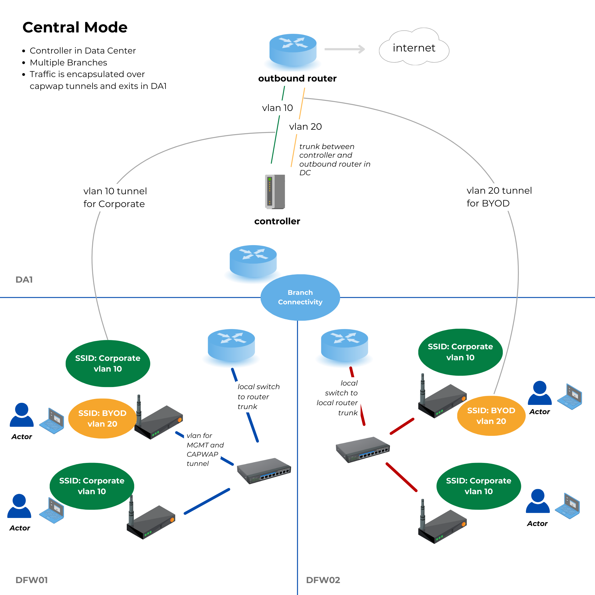
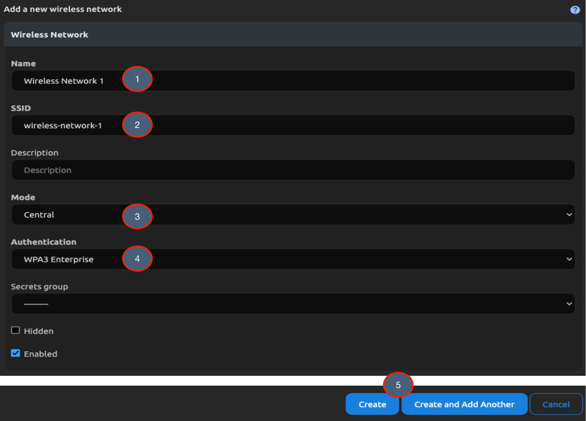

# Wireless Networks and Controllers

This guide demonstrates how to set up Wireless Networks and Controllers to manage Wireless Access Points via a Controller in a Data Center. While Nautobot supports Wireless Networks managed in various modes, in this example we use **Central Mode**, where traffic from the Access Points is tunneled through the Controller.

## Optional Preparation

Before configuring Wireless Networks, you can optionally set up the following features to enrich the data:

- [Devices](getting-started/creating-devices.md)
- [Locations](getting-started/creating-location-types-and-locations.md)
- [IP Addresses and Prefixes](getting-started/ipam.md)
- [VLANs](getting-started/vlans-and-vlan-groups.md)

## Wireless Networks

To create a Wireless Network:

1. Click on **Wireless** in the navigation menu.
2. Select **Wireless Networks** under the **Wireless** group.
3. Click the blue **+ Add Wireless Network** button.

Fill in the required fields for the Wireless Network:

1. Enter the Wireless Network name.
2. Enter the Wireless Network SSID.
3. Select a Mode from the dropdown (Central in this example).
4. Choose the Authentication type.
5. Click **Create** or **Create and Add Another** to save.

## Controllers

To create a Wireless Controller:

1. Click on **Wireless** in the navigation menu.
2. Select **Wireless Controllers** under the **Wireless** group.
3. Click the blue **+ Add Controller** button.

Fill in the required fields for the Wireless Controller:

1. Enter the Controller name.
2. Select the Controller status.
3. Choose a Location for the Controller.
4. Select **Wireless** from the Capabilities dropdown.
5. (Optional) Click the **Controller Device** tab to assign a Device that hosts the Controller.
6. Click **Create** or **Create and Add Another** to save.

## Device Groups

To create a Device Group:

1. Navigate to **Wireless** in the navigation menu.
2. Select **Device Groups** under the **Wireless** group.
3. Click the blue **+ Add Controller Managed Device Group** button.

Fill in the required fields for the Device Group:

1. Select the Controller created above.
2. Enter the name of the Device Group.
3. Choose the devices to include in the group.
4. Select **Wireless** from the Capabilities dropdown.
5. Select the Wireless Network.
6. (Optional) Filter VLANs by Location or VLAN Group, then select a VLAN.
7. Click **Create** or **Create and Add Another** to save.

## Supported Data Rates (Optional)

This part is optional, Supported Data Rates supports tracking wireless speed and the MCS Index.

1. Click on **Wireless** in the navigation menu.
2. Select **Supported Data Rates** under the **Wireless** group.
3. Click the blue **+ Add Supported Data Rate**.

Fill in the required fields for Supported Data Rates:

1. Select a Wireless Standard.
2. Enter a rate in Kbps.
3. Enter the MCS Index.

## Radio Profiles (Optional)

This part is optional, Radio Profiles provide context to the Wireless Radios of a Device (through the Device Group).

1. Click on **Wireless** in the navigation menu.
2. Select **Radio Profiles** under the **Wireless** group.
3. Click the blue **+ Add Radio Profile**.

Fill in the required fields for Radio Profiles:

1. Enter a name for the Radio Profile.
2. Set the regulatory domain. We can also fill out any other data that you have.
3. Click **Create** or **Create and Add Another** to save.

