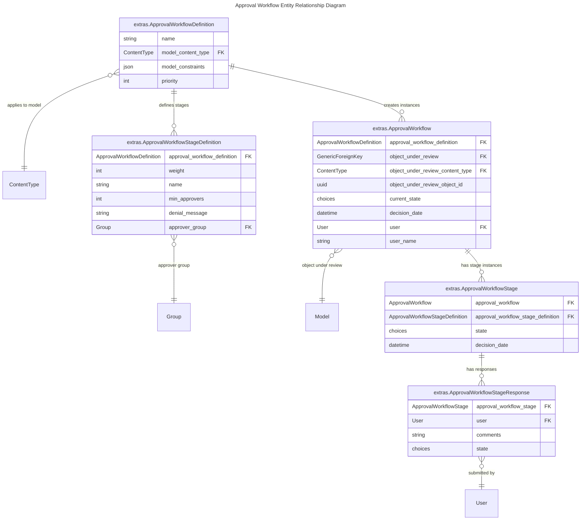

# Approval Workflows

Approval Workflows allows for a multi-stage review and approval of processes before making changes, running or creating specific objects in the system. They are defined in advance and attached to specific models based on certain constraints.

## Use cases

- Preventing accidental deletion of critical data by requiring manager approval before deletion jobs run.
- Requiring security team sign-off before enabling network changes in production.
- Ensuring multiple stakeholders approve large-scale bulk edits.
- Mandating peer review for scheduled jobs that affect multiple systems.

## Model Reference



### ApprovalWorkflowDefinition

The template for a workflow, specifying which model(s) it applies to, any constraints, and the ordered list of stages. Represents a reusable definition of an approval workflow.

### ApprovalWorkflowStageDefinition

A single approval stage within a workflow definition, specifying the approver group and required number of approvers.

### ApprovalWorkflow

A concrete instance of a workflow triggered for a specific object under review.

- Automatically changes to `Denied` if any stage is denied.
- Automatically changes to `Approved` if all stages are approved.
- Calls object’s `on_workflow_approved()` or `on_workflow_denied()` when final state is reached.

### ApprovalWorkflowStage

A stage instance within a workflow execution. Progresses from `Pending` → `Approved`/`Denied`.

- Approves automatically when minimum approvals are met.
- Denies immediately if any denial is submitted.
- Triggers parent workflow state updates.

### ApprovalWorkflowStageResponse

A single user's input on a specific stage - this may be an explicit decision (`approve`/`deny`) or simply a comment without a decision.

- Saving a response can trigger stage and workflow state updates.

## How-To Guides

### Attach Workflow to a Model Instance

Workflows are automatically attached after creating, running, or updating an object that complies with the workflow model and constraints. Manual attachment is not available.

### Using Approval Workflow via UI

#### Create an Approval Workflow Definition with stages

1. Go to `Approvals > Workflow Definitions > Add Approval Workflow Definition`.
2. Enter:
    - **Name** (e.g., "Scheduled Job Run Workflow").
    - **Model** (e.g., `extras|scheduled job`).
    - **Constraints** (optional JSON filter, e.g., `{"name": "Bulk Delete Objects Scheduled Job"}`).
    - **Priority** (lower means higher priority).
3. In the **Approval Workflow Stage Definitions** section, define one or more stages:
    - **Stage Name** (e.g, "Stage1").
    - **Weight** (order in which the stage is executed).
    - **Minimum Approvers** (number of approvals required).
    - **Approver Group** (group of users eligible to approve)
    - **Denial Message** (optional message shown if denied).

#### Approve or Deny a Stage

1. Go to `Approvals > Approval Dashboard` or on the right `User dropdown menu > Approval Dashboard` and select the **My Approvals** tab.
2. Locate the relevant object under review in the table. The table displays:
    - **Object under review** - Linked to the object’s detail view.
    - **Workflow** - Name of the workflow definition (linked to the workflow detail view).
    - **Current Stage** - Stage awaiting action.
    - **Actions Needed** - Remaining approvals required.
    - **State** - Current workflow state.
3. To approve the stage, select the green button.  
4. To deny the stage, select the red button.
5. After the decision action, a confirmation window appears where a comment can be added before confirming the action.

#### View My Requests

1. Open the **Approval Dashboard** and select the **My Requests** tab.
2. The table lists all workflows initiated by the current user. The columns include:
    - **Approval Workflow Definition** - Linked to the workflow definition.
    - **Object Type Under Review** - Model and object type for the request.
    - **Object Under Review** - Linked to the specific object awaiting or having received approval.
    - **Current State** - State of the workflow (e.g., `Pending`, `Approved`, `Denied`).
    - **User** - Requesting user.

#### Check Workflow State

1. Go to `Approvals > Approval Workflow Definition`
2. Select the required workflow definition.
3. In the **Workflows** list, all workflows for this definition are displayed.
4. Select the details button for a specific workflow.
5. View **Approval Workflow** details view contains:
    - **Approval Workflow** panel:
        - **Approval Workflow Definition** - Linked definition for the workflow.
        - **Object Under Review** - Object subject to approval.
        - **Current State** - Workflow status.
        - **Approval Date** - Date of final decision.
        - **Requesting User** - User who initiated the workflow.
    - **Stages** panel:
        - **Stage** - Stage name.
        - **Actions Needed** - Remaining approvals required.
        - **State** - Current stage status.
        - **Decision Date** - Date of stage decision.
    - **Responses** panel:
        - **Stage** - Stage name.
        - **User** - Responding user.
        - **Comments** - Submitted comment.
        - **State** - Decision state (`Pending`, `Approved`, `Denied`).

### Using Approval Workflow via API

#### Approve/Deny a Stage

```no-highlight
curl -X POST \
-H "Authorization: Token $TOKEN" \
-H "Content-Type: application/json" \
-H "Accept: application/json; version=1.3; indent=4" \
-d '{"comment": "Approved for deployment"}' \
http://nautobot/api/extras/approval-workflow-stages/$APPROVAL_WORKFLOW_STAGE_ID/approve
```

```no-highlight
curl -X POST \
-H "Authorization: Token $TOKEN" \
-H "Content-Type: application/json" \
-H "Accept: application/json; version=1.3; indent=4" \
-d '{"comment": "Deny reason"}' \
http://nautobot/api/extras/approval-workflow-stages/$APPROVAL_WORKFLOW_STAGE_ID/deny
```

#### List Pending/Done Approvals

Retrieves a list of approval workflow stages filtered by their status relative to the current user using the `pending_my_approvals` query parameter on the standard list endpoint:

- `?pending_my_approvals=true` — Returns stages pending approval by the current user.

```no-highlight
curl -X GET \
-H "Authorization: Token $TOKEN" \
-H "Accept: application/json; version=1.3; indent=4" \
http://nautobot/api/extras/approval-workflow-stages/?pending_my_approvals=true
```

- `?pending_my_approvals=false` — Returns stages the current user has already approved/denied.

```no-highlight
curl -X GET \
-H "Authorization: Token $TOKEN" \
-H "Accept: application/json; version=1.3; indent=4" \
http://nautobot/api/extras/approval-workflow-stages/?pending_my_approvals=false
```

If the parameter is omitted, all stages are returned regardless of approval status.

## Permissions by Persona

### Object Operator

Responsible for creating, updating, or running objects, which may trigger an approval workflow. Cannot approve workflows.

**Required permissions:**
- `extras.view_approvalworkflow` - to view created approval workflows after creating, updating, or running an object.
- `extras.view_approvalworkflowstage` - to view the **My Requests** tab on the Dashboard.
- `extras.view_approvalworkflowstageresponse` - to view responses for each stage.

### Approver

Responsible for reviewing and making decisions on approval workflow stages assigned to them. Must be a member of one or more approver groups (see [Approval Groups](#approver-groups)).

**Required permissions:**
- `extras.view_approvalworkflowstage` and `extras.change_approvalworkflowstage` - to view the **My Approvals** tab on the Dashboard and take actions such as approve or deny.

### Workflow Architect

Responsible for designing, managing, and configuring approval workflow definitions and their stages.

**Required permissions:**
- All permissions required by the **Object Operator** role.
- Additional permissions:
    - `extras.view/add/change/delete_approvalworkflowdefinition`
    - `extras.view/add/change/delete_approvalworkflowstagedefinition`

### Approver Groups

Approval actions are controlled not only by permissions but also by **approver group membership** defined in each workflow definition:

- Each **Approval Workflow Stage Definition** specifies an **Approver Group** (user group authorized to act on that stage).
- A user must belong to the stage’s approver group to:
    - See the stage in the **My Approvals** tab.
    - Perform approval or denial actions.
- If the user has the required permissions but is **not** a member of the approver group, the stage will not appear in their dashboard and no actions will be available.

## Upgrade Considerations

**From Nautobot 2.x**
If upgrading from Nautobot 2.x, the management command `check_job_approval_status` is available to identify Jobs and Scheduled Jobs that have `approval_required=True`. Running this command prior to upgrading helps detect and address these cases by:
- Approving (and running) or denying scheduled jobs that require approval.
- Defining approval workflows for Jobs where appropriate.
