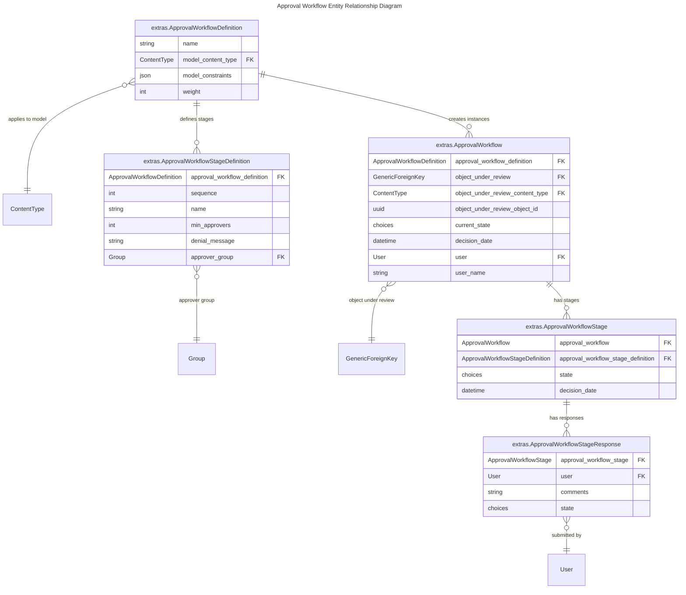

# Approval Workflows

Approval Workflows allows for a multi-stage review and approval of processes before making changes, running or creating specific objects in the system. They are defined in advance and attached to specific models based on certain constraints.

## Use cases

- Preventing accidental deletion of critical data by requiring manager approval before deletion jobs run.
- Requiring security team sign-off before enabling network changes in production.
- Ensuring multiple stakeholders approve large-scale bulk edits.
- Mandating peer review for scheduled jobs that affect multiple systems.

### Involving Scheduled Job Approval

1. The [Workflow Architect](#workflow-architect) defines the [workflow definition](#create-an-approval-workflow-definition-with-stages).
2. An [Object Operator](#object-operator) submits a job for approval. See [Running Jobs Via the Web UI](jobs/index.md#via-the-web-ui) or [Scheduling via the UI](jobs/job-scheduling-and-approvals.md#scheduling-via-the-ui). If an approval workflow definition exists, the approval workflow is created automatically.
3. The [Approver(s)](#approver) review and [approve the job](#approve-or-deny-a-stage).
4. Once all required approvals are obtained, the job is automatically placed in the execution queue.

## Model Reference



### ApprovalWorkflowDefinition

The template for a workflow, specifying which model(s) it applies to, any constraints, and the ordered list of stages. Represents a reusable definition of an approval workflow.

#### Constraints

Constraints define when a workflow definition should apply to a particular model instance.

- Constraints are stored as a dictionary of **field lookups → values** (e.g. `{"approval_required": True}`).
- Any valid Django ORM lookup can be used (e.g. `{"job_model__name__in": ["ExampleDryRunJob", "Example Job of Everything", "Export Object List"]}`, `{"job_model__name__icontains": "Export"}`, `{"total_run_count__gte": 10}`), since constraints are passed directly into `.filter(**constraints)`.
- If the instance matches the constraints, the workflow applies.
- If no constraints are defined, the workflow applies to all instances of the model.

#### Weight

When multiple workflow definitions exist for the same model, only **one** will apply to any given object under review.
The workflow with the **highest weight value** that matches the object’s constraints is selected.

##### Example 1: Specific scheduled job

- Workflow Definition A:
    - Model: `Scheduled Job`
    - Constraints: `{"job_model__name": "Bulk Delete Objects"}`
    - Weight: **20**
- Workflow Definition B:
    - Model: `Scheduled Job`
    - Constraints: none (applies to all scheduled jobs)
    - Weight: **10**

Result:
If the object under review is the *Bulk Delete Objects Scheduled Job*, Workflow A applies (weight 20 wins).
For all other scheduled jobs, Workflow B applies (weight 10).

### ApprovalWorkflowStageDefinition

A single approval stage within a workflow definition, specifying the approver group and required number of approvers.

### ApprovalWorkflow

A concrete instance of a workflow triggered for a specific object under review.

- Automatically changes to `Denied` if any stage is denied.
- Automatically changes to `Approved` if all stages are approved.
- Calls object’s `on_workflow_approved()` or `on_workflow_denied()` when final state is reached.

### ApprovalWorkflowStage

A concrete instance of stage within a workflow execution. Progresses from `Pending` → `Approved`/`Denied`.

- Approves automatically when minimum approvals are met.
- Denies immediately if any denial is submitted.
- Triggers parent workflow state updates.

### ApprovalWorkflowStageResponse

A single user's input on a specific stage - this may be an explicit decision (`approve`/`deny`) or simply a comment without a decision.

- Saving a response can trigger stage and workflow state updates.

## How-To Guides

### Attach Workflow to a Model Instance

Workflows are automatically attached after creating, running, or updating an object that complies with the workflow model and constraints. Manual attachment is not available.

### Using Approval Workflow via UI

#### Create an Approval Workflow Definition with stages

<!-- pyml disable-num-lines 7 no-inline-html -->
1. Go to `Approvals > Workflow Definitions > Add Approval Workflow Definition`.
    <div class="grid cards example-images" markdown>

    - { .on-glb }
    { .on-glb }
    - { .on-glb }
    { .on-glb }
    - { .on-glb }
    { .on-glb }

    </div>

2. Enter:
    - **Name** (e.g., "Scheduled Job Run Workflow").
    - **Model** (e.g., `extras|scheduled job`).
    - **Constraints** (optional JSON filter, e.g., `{"job_model__name": "Bulk Delete Objects"}`, see [Contraints](#constraints)).
    - **Weight** (only one workflow definition (with the highest weight) will apply to any given object under review, see [Weight](#weight)).
3. In the **Approval Workflow Stage Definitions** section, define one or more stages:
    - **Stage Name** (a descriptive name for the approval step (e.g., "Finance Approval", "Security Review", "Management Approval")).
    - **Sequence** (order in which the stage is executed).
    - **Minimum Approvers** (number of approvals required).
    - **Approver Group** (group of users eligible to approve)
    - **Denial Message** (optional message shown if denied).

#### Approve or Deny a Stage

<!-- pyml disable-num-lines 24 no-inline-html -->
1. Go to `Approvals > Approval Dashboard` or on the right `User dropdown menu > Approval Dashboard` and select the **My Approvals** tab.
    <div class="grid cards example-images" markdown>

    - { .on-glb }
    { .on-glb }
    - { .on-glb }
    { .on-glb }
    - { .on-glb }
    { .on-glb }

    </div>

2. Locate the relevant object under review in the table. The table displays:
    - **Object under review** - Linked to the object’s detail view.
    - **Workflow** - Name of the workflow definition (linked to the workflow detail view).
    - **Current Stage** - Stage awaiting action.
    - **Actions Needed** - Remaining approvals required.
    - **State** - Current workflow state.
3. To approve the stage, select the  button.
3. To approve the stage, select the  button.
4. To deny the stage, select the  button.
4. To deny the stage, select the  button.
5. After the decision action, a confirmation window appears where a comment can be added before confirming the action.
    <div class="grid cards example-images" markdown>

    - { .on-glb }
    { .on-glb }
    - { .on-glb }
    { .on-glb }

    </div>

#### View My Requests

<!-- pyml disable-num-lines 5 no-inline-html -->
1. Open the **Approval Dashboard** and select the **My Requests** tab.
    <div class="grid cards example-images" markdown>

    - { .on-glb }
    { .on-glb }

    </div>

2. The table lists all workflows initiated by the current user. The columns include:
    - **Approval Workflow Definition** - Linked to the workflow definition.
    - **Object Type Under Review** - Model and object type for the request.
    - **Object Under Review** - Linked to the specific object awaiting or having received approval.
    - **Current State** - State of the workflow (e.g., `Pending`, `Approved`, `Denied`).
    - **User** - Requesting user.

#### Check Workflow State

There are 2 ways to check the state of a workflow, depending on whether user is a object operator/approver or a workflow architect.

##### Check State as Object Operator/Approver**

<!-- pyml disable-num-lines 9 no-inline-html -->
1. Go to `Approvals > Approval Dashboard` or on the right `User dropdown menu > Approval Dashboard`
2. Select **My Approvals** or **My Requests** tab.
3. Click the workflow (in My Approvals view) or details button (in My Requests view) for specific workflow.
    <div class="grid cards example-images" markdown>

    - { .on-glb }
    { .on-glb }
    - { .on-glb }
    { .on-glb }

    </div>

##### Check State as Workflow Architect**

<!-- pyml disable-num-lines 38 no-inline-html -->
1. Go to `Approvals > Approval Workflow Definition`
2. Select the required workflow definition.
    <div class="grid cards example-images" markdown>

    - { .on-glb }
    { .on-glb }

    </div>

3. In the **Workflows** list, all workflows for this definition are displayed.
4. Select the details button for a specific workflow.
    <div class="grid cards example-images" markdown>

    - { .on-glb }
    { .on-glb }

    </div>

5. View **Approval Workflow** details view contains:
    - **Approval Workflow** panel:
        - **Approval Workflow Definition** - Linked definition for the workflow.
        - **Object Under Review** - Object subject to approval.
        - **Current State** - Workflow status.
        - **Approval Date** - Date of final decision.
        - **Requesting User** - User who initiated the workflow.
    - **Stages** panel:
        - **Stage** - Stage name.
        - **Actions Needed** - Remaining approvals required.
        - **State** - Current stage status.
        - **Decision Date** - Date of stage decision.
    - **Responses** panel:
        - **Stage** - Stage name.
        - **User** - Responding user.
        - **Comments** - Submitted comment.
        - **State** - Decision state (`Pending`, `Approved`, `Denied`).

<div class="grid cards example-images" markdown>

- { .on-glb }
{ .on-glb }

</div>

### Using Approval Workflow via API

#### Approve/Deny a Stage

```no-highlight
curl -X POST \
-H "Authorization: Token $TOKEN" \
-H "Content-Type: application/json" \
-H "Accept: application/json; version=1.3; indent=4" \
-d '{"comment": "Approved for deployment"}' \
http://nautobot/api/extras/approval-workflow-stages/$APPROVAL_WORKFLOW_STAGE_ID/approve
```

```no-highlight
curl -X POST \
-H "Authorization: Token $TOKEN" \
-H "Content-Type: application/json" \
-H "Accept: application/json; version=1.3; indent=4" \
-d '{"comment": "Deny reason"}' \
http://nautobot/api/extras/approval-workflow-stages/$APPROVAL_WORKFLOW_STAGE_ID/deny
```

#### List Pending/Done Approvals

Retrieves a list of approval workflow stages filtered by their status relative to the current user using the `pending_my_approvals` query parameter on the standard list endpoint:

- `?pending_my_approvals=true` — Returns stages pending approval by the current user.

```no-highlight
curl -X GET \
-H "Authorization: Token $TOKEN" \
-H "Accept: application/json; version=1.3; indent=4" \
http://nautobot/api/extras/approval-workflow-stages/?pending_my_approvals=true
```

- `?pending_my_approvals=false` — Returns stages the current user has already approved/denied.

```no-highlight
curl -X GET \
-H "Authorization: Token $TOKEN" \
-H "Accept: application/json; version=1.3; indent=4" \
http://nautobot/api/extras/approval-workflow-stages/?pending_my_approvals=false
```

If the parameter is omitted, all stages are returned regardless of approval status.

## Permissions by Persona

The permissions below include the required permissions to run everything in approval workflows, your Jobs and Scheduled Jobs permissions [remain unchanged](../../user-guide/platform-functionality/jobs/managing-jobs.md#permissions-checklist).

### Object Operator

Responsible for creating, updating, or running objects, which may trigger an approval workflow. Cannot approve workflows.

**Required permissions:**

- `extras.view_approvalworkflow` - to view created approval workflows after creating, updating, or running an object.
- `extras.view_approvalworkflowstage` - to view the **My Requests** tab on the Dashboard.
- `extras.view_approvalworkflowstageresponse` - to view responses for each stage.

!!! tip
    Provided by object-permission `nautobot-default-scheduledjobs-approver-permissions` and assigned to group `nautobot-default-scheduledjobs-approver` by default.

### Approver

Responsible for reviewing and making decisions on approval workflow stages assigned to them. Must be a member of one or more approver groups (see [Approval Groups](#approver-groups)).

**Required permissions:**

- All permissions required by the **Object Operator** role.
- `extras.view_approvalworkflowstage`
- `extras.change_approvalworkflowstage` - to view the **My Approvals** tab on the Dashboard and take actions such as approve or deny.

!!! tip
    Provided by object-permission `nautobot-default-scheduledjobs-operator-permissions` and assigned to group `nautobot-default-scheduledjobs-operator` by default.

### Workflow Architect

Responsible for designing, managing, and configuring approval workflow definitions and their stages.

**Required permissions:**

- All permissions required by the **Object Operator** role.
- `extras.view/add/change/delete_approvalworkflowdefinition`
- `extras.view/add/change/delete_approvalworkflowstagedefinition`

!!! tip
    Provided by object-permission `nautobot-default-scheduledjobs-architect-permissions` and assigned to group `nautobot-default-scheduledjobs-architect` by default.

### Approver Groups

Approval actions are controlled not only by permissions but also by **approver group membership** defined in each workflow definition:

- Each **Approval Workflow Stage Definition** specifies an **Approver Group** (user group authorized to act on that stage, how to create user group via the admin UI check [here](users/groups.md)).
- A user must belong to the stage’s approver group or be a super user to:
    - See the stage in the **My Approvals** tab.
    - Perform approval or denial actions.
- If the user has the required permissions but is **not** either a member of the approver group or a super user, the stage will not appear in their dashboard and no actions will be available.

!!! note
    A Nautobot super user is considered to be members of all Approval Groups.

## Upgrade Considerations

### From Nautobot 2.x

If upgrading from Nautobot 2.x, the management command `check_job_approval_status` is available in Nautobot 2.4.15+ to identify Jobs and Scheduled Jobs that have `approval_required=True`.

- Running the command doesn't approve/run/deny jobs, it just identifies the ones that need such action to be performed as a separate step.
- After running this command to identify the impacted Jobs, and completing the upgrade to Nautobot 3.x, you'll want to define appropriate approval workflows to apply to those jobs.

**Example**: Running the command `check_job_approval_status` will provide similar output to:

```no-highlight
Following jobs still have `approval_required=True`.
These jobs will no longer trigger approval automatically.
After upgrading to Nautobot 3.x, you should add an approval workflow definition(s) covering these jobs.
Refer to the documentation: https://docs.nautobot.com/projects/core/en/next/user-guide/platform-functionality/approval-workflow/
Affected jobs (Names):
    - ExampleDryRunJob
    - Example Job of Everything
    - Export Object List
```

- User can create an `ApprovalWorkflowDefinition` using constraints such as `{"job_model__name__in": ["ExampleDryRunJob", "Example Job of Everything", "Export Object List"]}`. See [Create an Approval Workflow Definition with stages](#create-an-approval-workflow-definition-with-stages)
- However, constraints today are limited to what can be expressed as a single dictionary of field lookups. More complex logic (e.g., `name=A OR (name=B AND status=active)`) is not possible yet.

### Predefined Approval Workflow

When installing or upgrading to Nautobot v3.0, the following seed data is automatically provisioned:

- Permissions for the three approval workflow personas.
- Groups for each persona, with permissions assigned (no initial group members).
- An Approval Workflow definition that references these personas but does not apply to any specific jobs by default.

In order to get like for like workflow, you should do the following:

1. Update the Approval Workflow **Model Constraints** to match the jobs you want to control. By default, a placeholder value (`JobThatDoesNotExist`) is set, replace this with the name of your job (e.g., `BackupJob` or `LogsCleanup`) or any other valid constraint.
2. Add users who will run jobs requiring approval to the `nautobot-default-scheduledjobs-operator` group.
3. Add users who can approve these jobs to the `nautobot-default-scheduledjobs-approver` group.

New users should review the [Jobs permission checklist](../../user-guide/platform-functionality/jobs/managing-jobs.md#permissions-checklist) to ensure all necessary permissions are in place.
