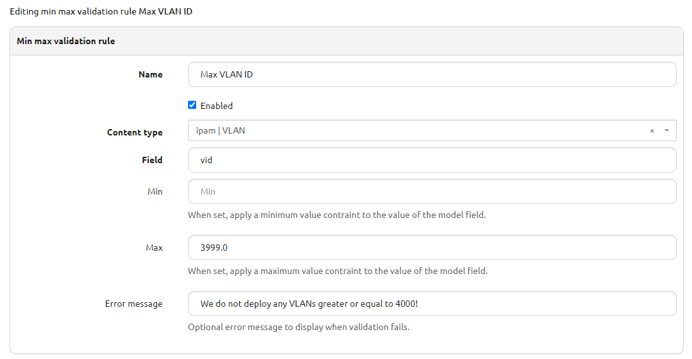
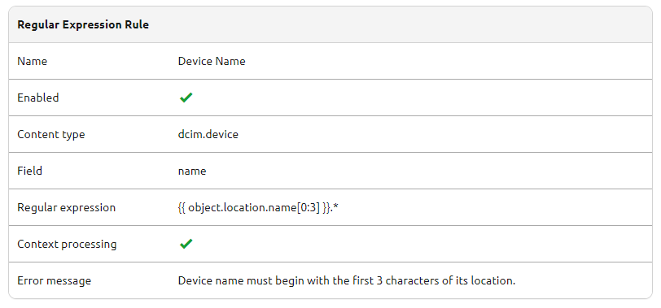
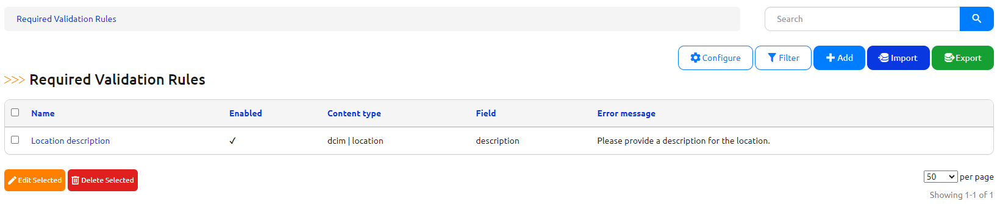
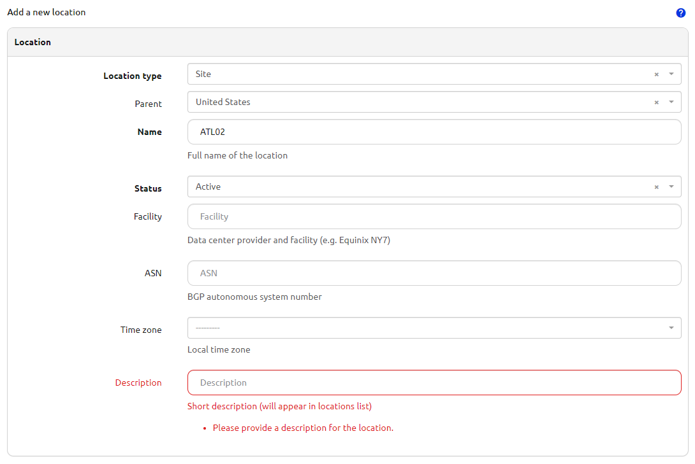
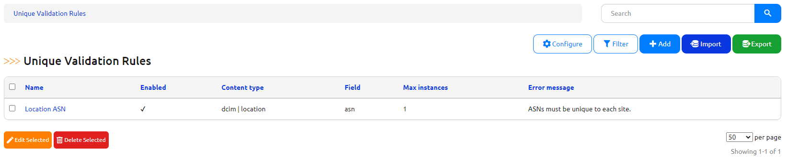
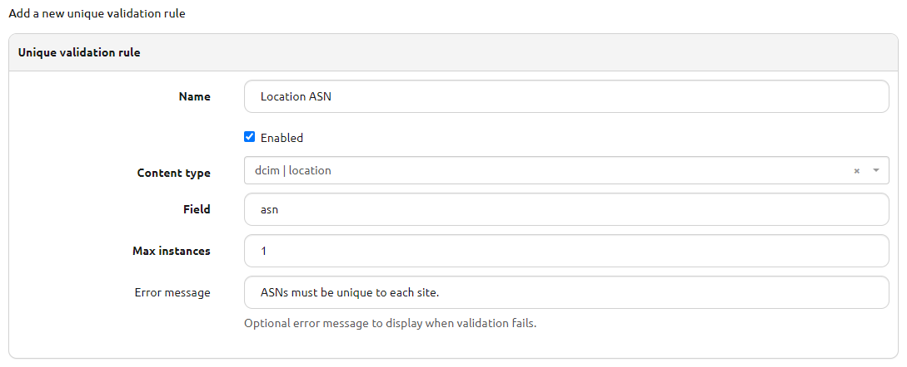
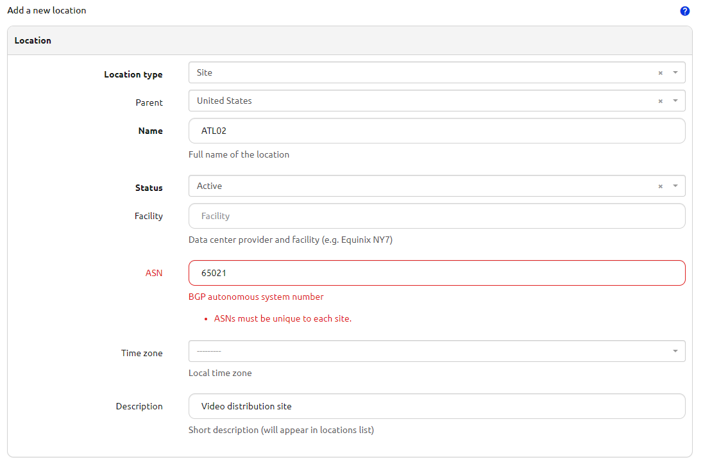

# Data Validation Engine

+++ 3.0.0

The data validation engine offers a set of user definable rules which are used to enforce business constraints on the data in Nautobot. These rules are tied to particular models and each rule is meant to enforce one aspect of a business use case.

Supported rule types include:

- Regular expression
- Min/max value
- Required fields
- Unique values

## Use-cases and common workflows

### Min/Max Rules

Each rule is defined with these fields:

- name - A unique name for the rule.
- enabled - A boolean to toggle enforcement of the rule on and off.
- content type - The Nautobot model to which the rule should apply (e.g. device, location, etc.).
- field - The name of the numeric based field on the model to which the min/max value is validated.
- min - The min value to validate value against (greater than or equal).
- max - The max value to validate value against (less than or equal).
- error message - An optional error message to display to the user when validation fails. By default, a message indicating validation against the defined min/max value has failed is shown.

In this example, a max value for VLAN IDs has been configured, preventing VLANs greater than 3999 from being created.

### Regular Expression Rules

Each rule is defined with these fields:

- name - A unique name for the rule.
- enabled - A boolean to toggle enforcement of the rule on and off.
- content type - The Nautobot model to which the rule should apply (e.g. device, location, etc.).
- field - The name of the character based field on the model to which the regular expression is validated.
- regular expression - The body of the regular expression used for validation.
- context processing - A boolean to toggle Jinja2 context processing of the regular expression prior to evaluation
- error message - An optional error message to display to the use when validation fails. By default, a message indicating validation against the defined regular expression has failed is shown.

In this example, a device hostname validation rule has been created and prevents device records from being created or updated that do not conform to the naming standard.

Regex rules may also support complex Jinja2 rendering called context processing which allows for the regular expression itself to by dynamically generated based on the context of the data it is validating.

In this example the name of a device must start with the first three characters of the name of the location to which the device belongs. The dynamic nature of the Jinja2 rendering means that the location name can be anything, the enforcement action is simply that the given device name matches its assigned location.

!!! warning
    If there is an exception while rendering the Jinja2 template or the resulting regular expression string is invalid, data validation against the rule will fail and users will be instructed to either fix the rule or disable it before the data may be saved.

### Required Rules

Each rule is defined with these fields:

- name - A unique name for the rule.
- enabled - A boolean to toggle enforcement of the rule on and off.
- content type - The Nautobot model to which the rule should apply (e.g. device, location, etc.).
- field - The name of the field on the Nautobot model which should always be required.
- error message - An optional error message to display to the user when validation fails. By default, a message indicating the field may not be left blank is shown.

In this example, a rule is enforcing that location objects must always have a description populated.

### Unique Rules

Each rule is defined with these fields:

- name - A unique name for the rule.
- enabled - A boolean to toggle enforcement of the rule on and off.
- content type - The Nautobot model to which the rule should apply (e.g. device, location, etc.).
- field - The name of the field on the Nautobot model which should always be required.
- max instances - The total number of records that may have the same unique value for the given field. Default of 1.
- error message - An optional error message to display to the user when validation fails. By default, a message indicating the value already exists on another record or set of records, as determined by max instances.

In this example, the rule enforces that the assigned ASN for a location is unique across all other locations.

