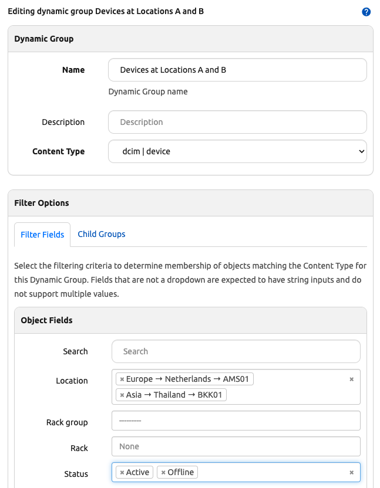
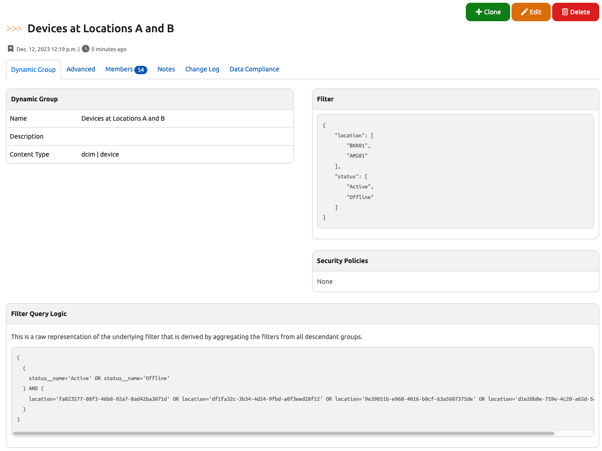
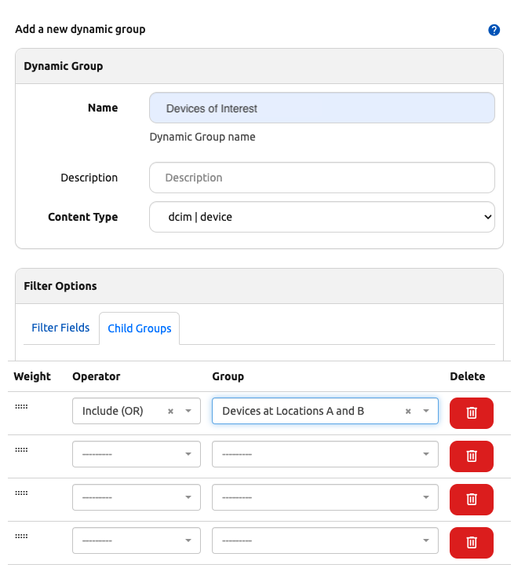
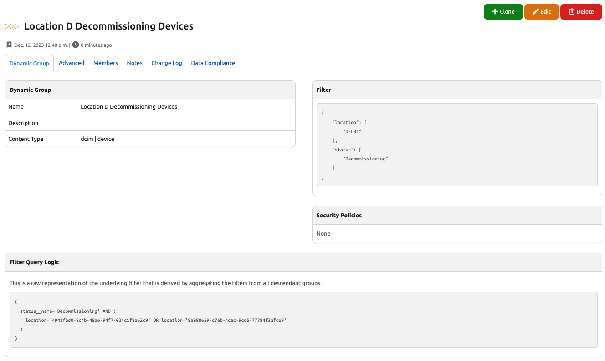
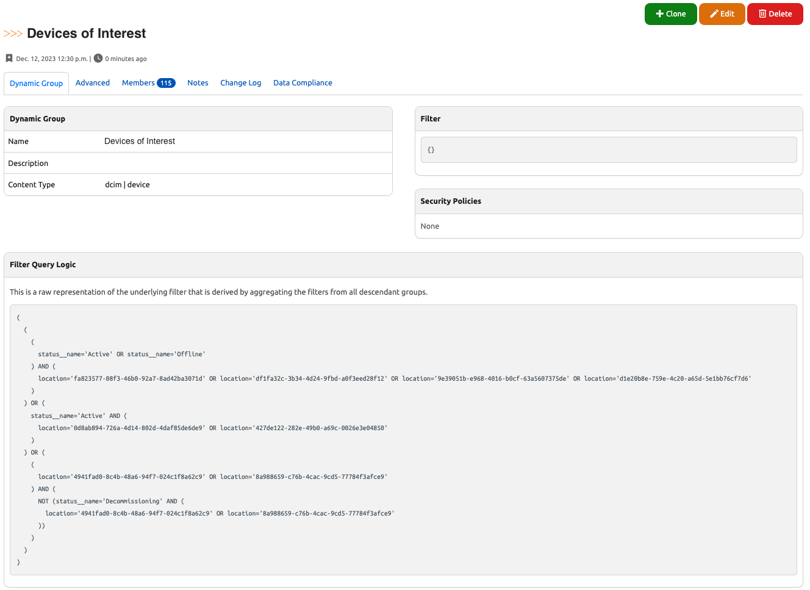
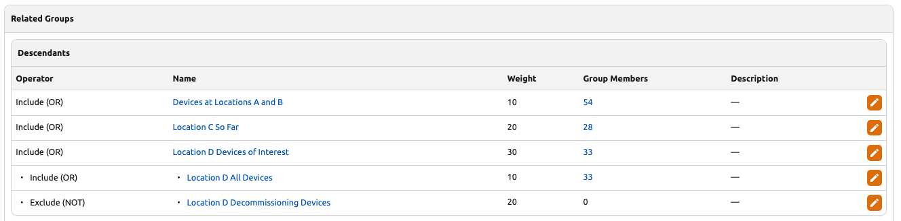
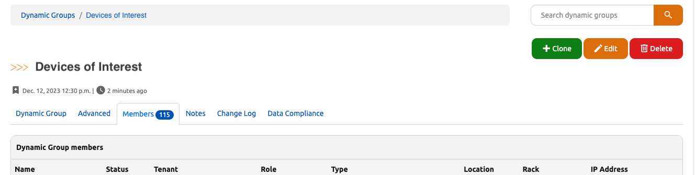

# Dynamic Groups


Dynamic Groups provide a general-purpose way to collect related objects of a given Content Type, such as Devices associated with a given Location(s) and Status(es), Circuits attached to a given set of Devices, and so forth. A given Dynamic Group may contain any number of objects of the appropriate type as members, and an object may belong to any number of Dynamic Groups of the appropriate content-type as a member of each. It is possible both to query the members of a given Dynamic Group, and also to query which Dynamic Groups a given object is a member of.

There are currently three ways to define the object members of a Dynamic group:

1. Filter-based assignment (for example, "All Devices with Location X and Status Y")
2. Set-based assignment from other defined groups (for example, "All devices in Group A or Group B but not Group C")
3. Static assignment directly to the group (for example, "Device XYZ01, Device XYZ02, and Device XYZ04")


+++ 2.3.0 "Static group assignment"
    Support for static assignment to groups was added, and the distinction between filter-based and set-based assignment was formally established.

The members of each Dynamic Group are cached and tracked by [Static Group Association](staticgroupassociation.md) database records.

## Introduction

### Creating Dynamic Groups in the UI

Dynamic Groups can be created through the UI under _Organization > Groups > Dynamic Groups_ and clicking the "Add" button.

When creating a Dynamic Group, you must provide a unique **Name** for the group, select an **Object Type** (also known as content-type) of the objects that it will contain as members, for example `dcim.device`, and also select a **Group Type**, specifying which of the supported member assignment patterns will apply to this group. (Any given Dynamic Group can only use one such pattern; mixing assignment types within a single group is not permitted at this time.) You can also optionally provide a **Description** for the group, select a [**Tenant**](../core-data-model/tenancy/tenant.md) that the group applies to, and/or apply [**Tags**](tag.md) to it.

+++ 2.3.0 "Tenant and tags"
    Support for assigning a tenant and/or tags to a Dynamic Group was added.

!!! warning
    After initial creation, the Content Type for a Dynamic Group may not be modified, as doing so would invalidate the filter, set definition, or static assignments of members for this group. Similarly, the Group Type also generally may not be modified, except in a few specific cases that are permitted for backwards compatibility with the behavior of Dynamic Groups before an explicit Group Type field was added to the model. All other fields may be updated at any time.

Once a new Dynamic Group is created, the group membership can be configured by clicking the "Edit" button to specify **Filter Fields** or **Child Groups** as appropriate to the Group Type, or, for static membership, by navigating to the object list view and selecting the objects to add to the group. More on these options below.

### Working with Dynamic Groups in the UI

Once created and configured, Dynamic Groups can be accessed from the primary Dynamic Groups landing page in the web interface under the _Organization > Groups > Dynamic Groups_ menu. From there you may view the list of available groups, search or filter the list, view or edit an individual group, or bulk delete groups. Additionally if a group has any members, you can click on the members count in the Dynamic Groups list view to display the full list of members for that Dynamic Group.

Dynamic Groups cannot be imported nor can they be updated in bulk, as these operations would be complex and do not make sense in most cases.

From an individual object's detail page, if it is a member of any groups, a "Dynamic Groups" tab will display in the navigation tabs. Clicking that tab will display all Dynamic Groups of which this object is a member.

## About Membership Caching

Since looking up the members of a filter-based or set-based Dynamic Group can potentially involve an expensive set of database queries depending on the complexity of the group definition, Nautobot internally caches the members of these group types using the same [Static Group Association](staticgroupassociation.md) database table that also records the members of statically-defined Dynamic Groups. In particular, this implementation greatly speeds up the "reverse lookup" pattern where, given an individual object, the user needs to identify all Dynamic Groups that it is a member of.

Creating, updating, or deleting a Dynamic Group will automatically refresh the cache with the new membership information for this group, as will viewing the "detail view" of any given Dynamic Group.

If you need to refresh the membership cache for all Dynamic Groups, you can do so by running the management command `nautobot-server refresh_dynamic_group_member_caches`. This will clear and repopulate the cache for all Dynamic Groups.

You can also refresh the cache for one or all Dynamic Groups by running the `Refresh Dynamic Group Caches` system [Job](jobs/index.md). You may find it useful to define a schedule for this job such that it automatically refreshes these caches periodically, such as every 15 minutes or every day, depending on your needs.

!!! warning
    Creating or updating other objects (candidate group members and/or objects that are referenced by a Dynamic Group's filters) will **not** automatically refresh these caches.

## Dynamic Group Types

### Filter-Based Dynamic Groups

Assignment of objects to a filter-based Dynamic Group is powered by Nautobot **FilterSet** classes underneath the hood. The [`django-filter`](https://django-filter.readthedocs.io/en/stable/) documentation may be a useful reference for users wanting to develop an in-depth understanding of FilterSets, but is by no means required to understand Dynamic Groups.

A filter-based Dynamic Group defines a `filter` field, which is stored in the database as a JSON dict. An object is considered to be a member of such a Dynamic Group if it has the correct Content Type and it is not excluded by the filter criteria defined by the group. By default, a freshly created Dynamic Group has an empty filter (`{}`), which means that all objects of the matching Content Type are members of this group, just as a default list view of these objects would display all such objects prior to any filter fields being selected in the web UI.

For example, for a Dynamic Group with Content Type of `dcim.device` and an empty filter, the list of members would be equivalent to the default Device list view, which in turn is equivalent to the queryset for `Device.objects.all()` from the database ORM.


When editing a filter-based Dynamic Group, under the **Filter Options** section, you will find a **Filter Fields** tab that allows you to select filter criteria. The filter fields available for a given Content Type are backed and validated by underlying FilterSet classes (for example `nautobot.dcim.filters.DeviceFilterSet`) and are represented in the web interface as a dynamically-generated filter form that corresponds to each eligible filter field.

### Set-Based Dynamic Groups


Set-based Dynamic Groups do not directly define a filter for identifying member objects; instead, they define their members based on set operations (AND, OR, and NOT, or Union, Intersection, and Difference if you prefer) involving _other_ Dynamic Groups.

!!! tip
    At this time, a set-based Dynamic Group may include filter-based Dynamic Groups and other set-based Dynamic Groups in its members definition, but set-based Dynamic Groups _may not_ currently include static-assignment-based Dynamic Groups. This restriction may be removed in a future Nautobot release.

An object is considered a member of an set-based Dynamic Group if it matches the aggregated filter criteria derived from the "child" or "descendant" groups included in this group definition. The immediate descendants of a Dynamic Group are accessible through its `.children` attribute, but if the children are also set-based Dynamic Groups, then they may have their own descendants as well, and so forth. The many-to-many mapping of "parent" to "child" Dynamic Groups is implemented via a "through table" of `DynamicGroupMembership` records.

!!! info
    The name "Dynamic Group Membership" is potentially confusing -- it does _not_ describe the member objects (devices, IP addresses, etc.) of a Dynamic Group (that's the "Static Group Association" table, described below, used for static-assignment-based groups and caching); rather, this table defines the association between each set-based Dynamic Group and the other Dynamic Groups that are its "children".

When editing a set-based Dynamic Group, under the **Filter Options** section, you will find a **Child Groups** tab that allows you to select other Dynamic Groups of the same Content Type to be "children" of this "parent" group and how they will be used to select or exclude candidate objects from the "parent" group's members.


### Static-Assignment-Based Dynamic Groups

+++ 2.3.0

Unlike the other types of Dynamic Groups, the members of a static-assignment-based Dynamic Group are not automatically derived by Nautobot, but instead are each explicitly assigned to such a group. Each association of a given object into a given static-assignment-based Dynamic Group is recorded by a [Static Group Association](staticgroupassociation.md) database record. Individual objects can be associated to these Dynamic Groups in the object's create/edit form, but in most cases it's easier and quicker to bulk-update a set of objects from their appropriate list/table view via the "Update Group Assignment" button.

## Example Workflow

Dynamic Groups are a complex topic and are perhaps best understood through a series of worked examples.

### Basic Filtering with a single Filter-Based Dynamic Group

Let's say you want to create a Dynamic Group that contains all production Devices at your first two Locations. You can create a Dynamic Group named "Devices at Locations A and B", for Content Type `dcim | device`, with Group Type "Filter-based membership", then edit it and set the **Filter Fields** to match:

1. a Location of either "AMS01" or "BKK01"
2. a Status of "Active" or "Offline"



After clicking "Update", you will be returned to the detail view for this Dynamic Group, where you can verify the filter logic that results, and click the "Members" tab to see the set of Devices that it contains.




A key to understand here is that generally, within a single Dynamic Group, additional values specified for the _same_ filter field (here, "Location") will _broaden_ the group to _include_ additional objects that match those additional values, while specifying values for _additional filter fields_ (here, "Status") will _narrow_ the group to match only the objects that match this additional filter. This is expressed in the "Filter Query Logic" panel by the use of `OR` and `AND` operators - the logic for this Dynamic Group is:

```no-highlight
(
  (
    location='fa823577-08f3-46b0-92a7-8ad42ba3071d' OR location='df1fa32c-3b34-4d24-9fbd-a0f3eed28f12' OR location='9e39051b-e968-4016-b0cf-63a5607375de' OR location='d1e20b8e-759e-4c20-a65d-a0f3eed28f12'
  ) AND (
    status__name='Offline'
  )
)
```

!!! note
    Keep in mind that the `Filter Query Logic` will also contain any descendants of the selected model instance.  As we can see above the `Filter Query Logic` uses both location "BKK01" and "AMSO1" and their descendants.

### Advanced Filtering: Defining a Set-Based Dynamic Group to Combine Two Others


Now, let's say that you add a third location to your network. This location is currently being built out, and you don't care about Devices from this location that are Offline status at present. What you want for your "Devices of Interest" Dynamic Group is logic similar to:

```no-highlight
(
  (
    (
      location__name='ams01' OR location__name='bkk01'
    ) AND (
      status__name='Active' OR status__name='Offline'
    )
  ) OR (
    location__name='can01' AND status__name='Active'
  )
)
```

This logic is too complex to express directly via a single Dynamic Group, but fear not! This is what combining Dynamic Groups via a set-based group allows you to do.

First, create a new "Devices of Interest" group, again of Content Type "dcim | device", but this time select "Set-based membership" as the Group Type. Edit this group, and instead of specifying **Filter Fields**, you will instead use the **Child Groups** tab of the editor, select the operator "Include (OR)" and the group "Devices at Locations A and B", and update the group.



In the new group's detail view, you can see that it now contains one child group, "Devices at Locations A and B", and its members are exactly the same as those of that group. But we're not done yet!


Next, you'll create another group to represent the other part of your desired logic. Call this group "Location C So Far", and set its **Filter Fields** to match Location "CAN01" and Status "Active". Verify that it contains the expected set of Devices from Location C.


Now, we'll add this group into the "Devices of Interest" parent group. Navigate back to the **Dynamic Groups** list view, and edit this group. Under the **Child Groups** tab, add another "Include (OR)" operator and select group "Location C So Far":


Now things are getting interesting!


The "Devices of Interest" Dynamic Group now contains the filtered Devices from both of its child groups, and the "Filter Query Logic" matches our intent as we stated it earlier:

```no-highlight
(
  (
    (
      location__name='ams01' OR location__name='bkk01'
    ) AND (
      status__name'Active' OR status__name='Offline'
    )
  ) OR (
    location__name='can01' AND status__name='Active'
  )
)
```

### Advanced Filtering: Nested Groups and Negation


Next, let's say you add a fourth location to your network. This location is in bad shape, and has Devices in a wide range of statuses. You want your "Devices of Interest" group to include all Devices from this location, _except for those in Decommissioning status_. To express this logic and add these devices to our parent group, we will need to use a combination of groups and the "Exclude (NOT)" operator.

First, you will create an "Location D All Devices" group. This will simply match Devices at Location "DEL01", regardless of their status.


Then create a "Location D Decommissioning Devices" group, which matches Location "DEL01" and Status "Decommissioning".



Next create a "Location D Devices of Interest" group, and set its **Child Groups** to:

1. Operator "Include (OR)", group "Location D All Devices"
2. Operator "Exclude (NOT)", group "Location D Decommissioning Devices"


!!! warning
    In general, but especially when using the AND and NOT operators, you must pay close attention to the order of the child groups. In this example, if you were to reverse the order of these two child groups, you would **not** get the desired final result!

You can check this group and confirm that it contains the expected restricted subset of Devices.


Finally, you can edit the parent "Devices of Interest" group and add a third **Child Groups** entry, "Include (OR)" on "Location D Devices of Interest". The final result is a Dynamic Group that contains the desired set of Devices across all four of your Locations.



You can see the filter logic that this combination of groups results in:

```no-highlight
(
  (
    (
      location__name='ams01' OR location__name='bkk01'
    ) AND (
      status__name='Active' OR status__name='Offline'
    )
  ) OR (
    location__name='can01' AND status__name'Active'
  ) OR (
    location__name='del01' AND (
      NOT (location__name='del01' AND status__name='Decommissioning')
    )
  )
)
```

You can also see the hierarchy of nested groups that are being used to derive the "Devices of Interest" group:



Most importantly, you now have a Dynamic Group that contains exactly the set of Devices you need!



## Technical Details

### Filter Generation

Filters are always processed hierarchically from the top down starting from the parent group and descending recursively to the last nested child group in order by the `weight` value assigned to that group when it was associated to its parent.

!!! note
    For the purpose illustration, we will use "left to right" terminology since when verbally describing precedence in English, we read from left to right, so that following it will be more intuitive.

The nesting of Dynamic Groups is performed using two advanced patterns: Sets and graphs. Rules for each child group are processed using a set `operator`, and groups are sorted hierarchically as a directed acyclic graph (DAG), where the `weight` is used for sorting child groups topologically.

In both cases, the ordering of the tree of descendants from a parent group to its nested children is significant and critically important to how each subsequent filter or group of filters are processed to result in a final set of member objects.

Consider an example where there is a graph from the parent group to three direct child groups, the third of which has its own nested child group:

```no-highlight
parent
- first-child
- second-child
- third-child
  - nested-child
```

The filter generation would walk the graph: starting from the base (match-all) filter of `parent`, the filter of `first-child` would be applied, then `second-child`, as ordered by their `weight`. In the case of `third-child`, all of its children (only `nested-child` in this case) would be processed in order in the same way and the resultant filter from all of the child groups for `third-child` would be applied to the filter resulting from `first-child` and `second-child`, resulting in the final filter for `parent`.

### Weights

Weights are used to define the order in which a parent group's child group filters are processed. Because this ordering is significant, care must be taken when constructing nested Dynamic Groups to result in filter parameters that have the desired outcome.

!!! note
    Unique weights are only considered for directly-related child groups. In other words, the weights for each child group of a parent group are unique to that parent and only affect the sorting of the children for that parent.

In practice, weights are automatically assigned in increments of `10` when associating child groups in the web UI, and child groups may be dragged and dropped to re-order them and re-assign their weights accordingly. When using the REST API, the weights must be explicitly provided as a part of your request payload.

Using the example group hierarchy above, the weights would be as follows:

```no-highlight
parent
- first-child {weight: 10}
- second-child {weight: 20}
- third-child {weight: 30}
  - nested-child {weight: 10}
```

### Operators

Set theory is applied when a new group is added as a child group. Three key concepts are at play: Intersections, Unions, and Differences.

We have attempted to simplify working with these operators by giving them both human-readable and Boolean name mappings. They are as follows:

- **Restrict (Boolean `AND`)** - The **Restrict** operator performs a set _intersection_ on the queryset, and is equivalent to a Boolean `AND`. The preceding filter is _restricted_ (aka _intersected_) by the objects matching the child filter. All filter criteria must match between the filters for a member object to be included in the resultant filter.
- **Include (Boolean `OR`)** - The **Include** operator performs a set _union_ on the queryset, and is equivalent to a Boolean `OR`. The preceding filter is _extended to include_ (aka _unioned with_) any objects matching the child filter. Any filter criteria may match between the filters for member objects to be included in the resultant filter.
- **Exclude (Boolean `NOT`)** - The **Exclude** operator performs a set _difference_ on the queryset, and is equivalent to a Boolean `NOT`. The preceding filter _excludes_ (aka _differences_) any objects matching the child filter. Any matching objects from the child filter will be negated from the members of the resultant filter.

The following table maps the Nautobot **operator** to the corresponding set operations:

| Operator | Set Operation | Boolean | Description                                                  |
| -------- | ------------- | ------- | ------------------------------------------------------------ |
| Restrict | Intersection  | AND     | Objects _must_ match this child filter to be included in the parent group |
| Include  | Union         | OR      | Objects _may_ match the child filter to be included in the parent group |
| Exclude  | Difference    | NOT     | Objects _must not_ match this child filter to be included in the parent group |

Any filters provided by the child groups are used to filter the members from the parent group using one of the three operators: **Restrict (AND)**, **Include (OR)**, or **Exclude (NOT)**.

Using the example group hierarchy from above, let's apply operators and explain how it would work:

```no-highlight
parent {filter: None}
- first-child {weight: 10, operator: intersection (AND), filter: location=ams01}
- second-child {weight: 20, operator: union (OR), filter: location=ang01}
- third-child {weight: 30, operator: difference (NOT), filter: None}
  - nested-child {weight: 10, operator: intersectio (AND), filter: status=active}
```

Logically, the filter will be expressed like so using the hierarchy above:

```no-highlight
((first-child OR second-child) AND (NOT nested-child))
```

Which in turn would map to the object filter:

```no-highlight
((location=ams01 OR location=ang01) AND (NOT status=active))
```

#### How does this work?

First, the filters for direct children for a group will always be included in a parenthetical grouping, separated by the operator. Parent groups always start from their base filter containing "all objects" (equivalent to an empty filter or `{}`). Therefore the filter of `parent` and the filter of `third-child` are not directly used for generating the filter and are instead passed through from `parent` left to right as the "base" filter.

Similarly, by the time we get to `third-child`, the filter at that node in the graph will have already had the filter from `first-child` and `second-child` applied, and will merely be passed through to the filter generated from the children of `third-child`.

Because `first-child` and `second-child` are "included" by way of the `union` set operator (Boolean `OR`), but because the filter for `third-child` is empty as explained above, its filter condition is not directly included, resulting in `(first-child OR second-child)` as the first group, representing all _direct_ filters for the group `parent`.

!!! note
    But what about the `AND` coming from the association of `first-child`, you might be asking?

    Well, that `AND` is also passed through because the default behavior when performing queryset filtering is to join all filter statements together with `AND`. For example, consider when you perform this from the Django ORM `Device.objects.filter(location__name="ams01")` the outcome is in fact equivalent to `AND location__name="ams01"`. Therefore, for the first child group (literally `first-child` in this case), initial `AND` will be omitted.

Continuing on to the children of `third-child`, the same iteration rules apply. The filter from `nested-child` gets applied to the filter being passed through from its parent, `third-child`, except that the "exclude" (boolean `NOT`) operator is still applied from the association of `third-child` to parent resulting in `(NOT nested-child`).

!!! note
    You'll see `NOT` emitted as an `AND NOT` because `NOT` is actually just shorthand for this. They are in fact interchangeable as Boolean operators. While it's technically possible to perform an `OR NOT` query from a database perspective, it is not supported by Dynamic Groups because the `NOT` operator maps directly to the "difference" set operation which is distinctly an `AND NOT` Boolean operation when performing underlying SQL queries at the database.

Piecing the rules together, we ended up with two filters and by wrapping them in their own set of parentheses we get our final generated filter:

```no-highlight
(
  (
    [ALL OBJECTS]
    AND first-child
  )
  OR second-child
)
AND NOT (
  [ALL OBJECTS]
  AND nested-child
)
```

## Dynamic Groups and the REST API

Dynamic Groups are fully supported by the API. There are several distinct endpoints for accessing different aspects of this feature

The REST API endpints under `/api/extras/dynamic-groups/` are used to perform standard CRUD (Create/Retrieve/Update/Delete) operations on Dynamic Group definitions. There is also a special read-only endpoint `/api/extras/dynamic-groups/<group UUID>/members/` that returns a serialized list of a group's member objects; for example, for a Dynamic Group of Prefixes, this endpoint would return the list of Prefix objects contained in this group.

A second set of endpoints, `/api/extras/dynamic-group-memberships/`, provides CRUD functionality for the Dynamic Group Membership through table that manages the definition of a set-based Dynamic Group.

A third set of endpoints, `/api/extras/static-group-associations/`, provides CRUD functionality for the [Static Group Association](staticgroupassociation.md) through table that manages the assignment of members to a static-membership Dynamic Group.

### Specifying Filter Conditions

Dynamic Groups are fairly straightforward however it is important to understand how the `filter` field works before digging in.

The `filter` is a JSON field and it must be able to be used as valid query parameters for filtering objects of the corresponding Content Type.

It is an error to provide any value other than a JSON object (`{}` or a Python dictionary) for the `filter` field.

#### Multiple Values

Most fields within the `filter` accept multiple values and must be represented as a JSON array (Python list), for example:

```json
{
    "location": ["ams01", "ang01"]
}
```

#### Single Values

Certain fields take Boolean values (JSON `true`/`false`) or single numeric integers or character strings.

For example, consider this boolean filter that requires a single `true`/`false` and would result in a Dynamic Group of devices that have interfaces:

```json
{
  "has_interfaces": true
}
```

Or this character filter that requires a single string and would result in a Dynamic Group with only one member matching this `name`:

```json
{
  "name": "ams01-edge-01"
}
```

#### Field Validation

Any invalid field values for valid field names will also result in a `ValidationError`, for example providing an integer to the `name` filter is invalid:

```json
{
    "name": -42
}
```

!!! note
    Please refer to either the source code definition of the `{model_name}FilterSet` (e.g. for `Device` it would be `nautobot.dcim.filters.DeviceFilterSet`) or the API documentation for the list endpoint (e.g. `/api/dcim/devices/`) for a given model object, to view the available filter fields and their expectations.


### Managing Dynamic Groups in the REST API

#### Creating a Dynamic Group via REST

A Dynamic Group may be created by performing a `POST` to the Dynamic Groups list endpoint at `/api/extras/dynamic-groups/`.

!!! note
    The `group_type` field defaults to `dynamic-filter` (i.e., filter-based membership) if unspecified, and similarly the `filter` field will default to an empty filter (`{}`) if not provided.

!!! important
    It is not possible to perform a nested assignment of `children` when creating a new Dynamic Group. You must first create the new group and then use the endpoint for creating Dynamic Group Memberships as explained below under [Assigning Child Groups via REST](#assigning-child-groups-via-rest).

Request:

```json
POST /api/extras/dynamic-groups/

{
    "name": "parent",
    "description": "I am a parent group with nested children.",
    "content-type": "dcim.device",
    "group-type": "dynamic-filter",
}
```

Response:

```json
{
    "id": "1f825078-b6dc-4b12-9463-be5a9189b03f",
    "display": "parent",
    "url": "http://localhost:6789/api/extras/dynamic-groups/1f825078-b6dc-4b12-9463-be5a9189b03f/",
    "name": "parent",
    "description": "I am the parent group with nested children.",
    "content_type": "dcim.device",
    "group_type": "dynamic-filter",
    "filter": {},
    "children": [],
    "created": "2022-07-06T20:17:04.305663Z",
    "last_updated": "2022-07-06T20:17:04.305663Z",
    "custom_fields": {},
    "computed_fields": {},
    "relationships": {}
}
```

#### Updating or Deleting a Dynamic Group via REST

!!! important
    It is not possible to perform a nested update of `children` when updating a Dynamic Group. You must use the endpoint for creating Dynamic Group Memberships as explained below under [Updating or Deleting Child Groups via REST](#updating-or-deleting-child-groups-via-rest).

Updating or deleting a Dynamic Group is done by sending a request to the detail endpoint for that object.

A Dynamic Group may be updated using `PUT` or `PATCH` requests. As usual for REST, a `PUT` request requires the entire object to be described, while a `PATCH` allows for individual fields to be updated without affecting the other fields. For example if you wanted to update the `name` and the `description` together, leaving every other field with their current values as provided:

```json
PATCH /api/extras/dynamic-groups/{uuid}/

{
    "name": "I am the best parent group",
    "description": "I am the best parent group with nested children.",
}
```

To delete a Dynamic Group you would send a `DELETE` request to the detail endpoint:

```json
DELETE /api/extras/dynamic-groups/{uuid}/
```

### Managing Child Groups via REST

Dynamic Groups may be added to a set-based group by creating a new Dynamic Group Membership. The act of assigning a Dynamic Group as a child to a parent group creates a Dynamic Group Membership.

This can be done at the list endpoint found at `/api/extras/dynamic-group-memberships/`.

#### Assigning Child Groups via REST

Dynamic Group Membership objects may be created, updated, or deleted just like any other object and are represented as `children` on the parent group.

!!! note
    When interacting with the REST API, the `operator` must be provided using the string representation that is stored in the database. The human-readable operator names (such as "Exclude (AND)" for "intersection") are not accepted.

Request:

```json
POST /api/extras/dynamic-group-memberships/

{
    "group": {"name": "first-child"},
    "parent_group": {"name": "parent"},
    "operator": "intersection",
    "weight": 10
}
```

Response:

```json
{
    "id": "4c8296de-42bc-49a6-8fed-fc1b1f6b93ca",
    "display": "parent > intersection (10) > first-child",
    "url": "http://localhost:6789/api/extras/dynamic-group-memberships/4c8296de-42bc-49a6-8fed-fc1b1f6b93ca/",
    "group": {
        "display": "first-child",
        "id": "97188a74-eddd-46d8-be41-909c1ece1d43",
        "url": "http://localhost:6789/api/extras/dynamic-groups/97188a74-eddd-46d8-be41-909c1ece1d43/",
        "name": "first-child",
        "content_type": "dcim.device"
    },
    "parent_group": {
        "display": "parent",
        "id": "1f825078-b6dc-4b12-9463-be5a9189b03f",
        "url": "http://localhost:6789/api/extras/dynamic-groups/1f825078-b6dc-4b12-9463-be5a9189b03f/",
        "name": "parent",
        "content_type": "dcim.device"
    },
    "operator": "intersection",
    "weight": 10
}
```

Observe that after adding this new membership object, the parent group now reflects this in its `children`:

```json
GET /api/extras/dynamic-groups/1f825078-b6dc-4b12-9463-be5a9189b03f/

{
    "id": "1f825078-b6dc-4b12-9463-be5a9189b03f",
    "display": "parent",
    "url": "http://localhost:6789/api/extras/dynamic-groups/1f825078-b6dc-4b12-9463-be5a9189b03f/",
    "name": "parent",
    "description": "",
    "content_type": "dcim.device",
    "group_type": "dynamic-set",
    "filter": {},
    "children": [
        {
            "id": "4c8296de-42bc-49a6-8fed-fc1b1f6b93ca",
            "display": "parent > intersection (10) > first-child",
            "url": "http://localhost:6789/api/extras/dynamic-group-memberships/4c8296de-42bc-49a6-8fed-fc1b1f6b93ca/",
            "group": {
                "display": "first-child",
                "id": "97188a74-eddd-46d8-be41-909c1ece1d43",
                "url": "http://localhost:6789/api/extras/dynamic-groups/97188a74-eddd-46d8-be41-909c1ece1d43/",
                "name": "first-child",
                "content_type": "dcim.device"
            },
            "parent_group": {
                "display": "parent",
                "id": "1f825078-b6dc-4b12-9463-be5a9189b03f",
                "url": "http://localhost:6789/api/extras/dynamic-groups/1f825078-b6dc-4b12-9463-be5a9189b03f/",
                "name": "parent",
                "content_type": "dcim.device"
            },
            "operator": "intersection",
            "weight": 10
        }
    ],
    "created": "2022-07-15T00:00:00Z",
    "last_updated": "2022-07-15T16:50:45.453965Z",
    "notes_url": "http://localhost:6789/api/extras/dynamic-groups/1f825078-b6dc-4b12-9463-be5a9189b03f/notes/",
    "custom_fields": {}
}
```

#### Updating or Deleting Child Groups via REST

Updating or deleting Dynamic Group Membership is done by sending a request to the detail endpoint for that membership object.

A Dynamic Group Membership may be updated using `PUT` or `PATCH` requests. Again, a `PUT` request requires the entire object to be described, while performing a partial update using a `PATCH` request can allow any single field to be updated without affecting the other fields. For example, if we only wanted to update the `weight` for a membership:

```json
PATCH /api/extras/dynamic-group-memberships/{uuid}/

{
    "weight": 15
}
```

To delete a Dynamic Group Membership you would send a `DELETE` request to the detail endpoint:

```json
DELETE /api/extras/dynamic-group-memberships/{uuid}/
```

## Dynamic Groups and the Python API (Django ORM)

!!! tip
    By default, all models inheriting from Nautobot's `OrganizationalModel` or `PrimaryModel` classes are assumed to be a viable object type for Dynamic Groups to be defined for. Individual models that do not wish to be assignable to Dynamic Groups can declare the flag `is_dynamic_group_associable_model = False` on their model definition. Conversely, models that inherit directly from Nautobot's `BaseModel` default to _not_ supporting Dynamic Groups, but can include the `nautobot.apps.models.DynamicGroupsModelMixin` class as a part of their class definition in order to enable Dynamic Group support.

### Working with a Dynamic Group's Members

Any Dynamic Group object in the ORM has a simple property, `.members`, for retrieving the QuerySet of (cached) members of that group. Because this data is cached in the database, even for a complex filter-based or set-based group definition, no expensive queries are required here; evaluating the QuerySet will perform a single efficient database query. You can of course perform further `.filter()` and other QuerySet operations, but (as always with QuerySets) this will incur additional database queries to re-evaluate the modified QuerySet.

Additionally, a Dynamic Group has the method `.has_member(obj)` for checking whether a single given database object is a (cached) member of this group. This too is a very efficient query.

Neither of the above attributes provide a way to directly bypass the cache used by this Dynamic Group; if it's important to your use case to guarantee up-to-the-minute accurate membership information, you can call a Dynamic Group's `.update_cached_members()` method, which will refresh its cache and return the resulting member QuerySet. Because refreshing the cache involves evaluating the Dynamic Group's defined filter(s), this is necessarily a more expensive database query(s) than either of the above access patterns, so it should only be done if required.

+/- 2.3.0 "Simpler, always-on caching"
    In prior versions of Nautobot, `.members` did not use a cache (and so would always re-evaluate the Dynamic Group), and a separate `.members_cached` property used a configurable Redis cache to temporarily store the evaluated QuerySet. For performance reasons, the behavior of `.members` has been changed to behave as described above. `.members_cached` should be considered deprecated and will likely be removed in a future major release.

    Similarly, `.has_member(obj)` was previously non-cached by default, but the Redis cache could be used by invoking it as `.has_member(obj, use_cache=True)`; this too has been changed in this release, and the `use_cache` flag should be considered deprecated as well.

For static-assignment-based Dynamic groups (only!) you can update its member list by assigning directly to its `.members` or calling its `.add_members()` or `.remove_members()` methods as desired. Invoking any of these APIs for a filter-based or set-based Dynamic Group is an error and will raise an exception.

### Working with an Object's Containing Dynamic Groups

Conversely, any model instance that supports Dynamic Groups will expose the property `.dynamic_groups`, which returns the QuerySet of (cached) Dynamic Groups that contain the model instance. As above, there's no direct way to bypass caching; if it's critically important to your use case to have up-to-the-minute accuracy, your only recourse is to call `DynamicGroup.update_cached_members()` for _each and every potentially relevant DynamicGroup record_, which obviously has the potential to be a very expensive operation if many Dynamic Groups are defined.

+/- 2.3.0 "Simpler, always-on caching"
    In prior versions of Nautobot, `.dynamic_groups` did not use a cache (and so had the potential to be a very expensive lookup every time it was accessed), and a separate `.dynamic_groups_cached` property used a configurable Redis cache to temporarily store the evaluated QuerySet. For performance reasons, the behavior of `.dynamic_groups` has been changed to behave as described above. `.dynamic_groups_cached` should be considered deprecated and will likely be removed in a future major release.

    Additionally, prior versions of Nautobot exposed two additional model properties, `.dynamic_groups_list` and `.dynamic_groups_cached`, which provided a (very slight) performance improvement over the previous two properties. With the introduction of the database cache implementation, these properties no longer provide any relevant performance improvement, and should be considered deprecated as well.

### Refreshing the Cache

In addition to the UI, management command, and Job based mechanisms for refreshing a group's members cache, described earlier in this document, from an App or Job, you can also directly call `group.update_cached_members()` as described above.
