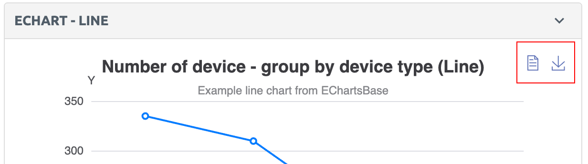
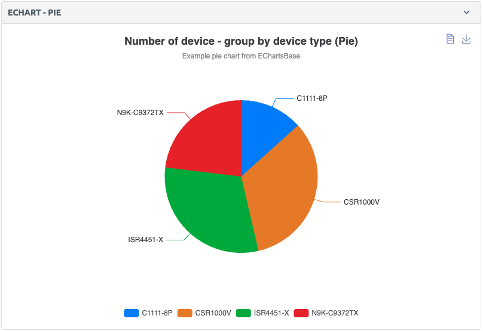
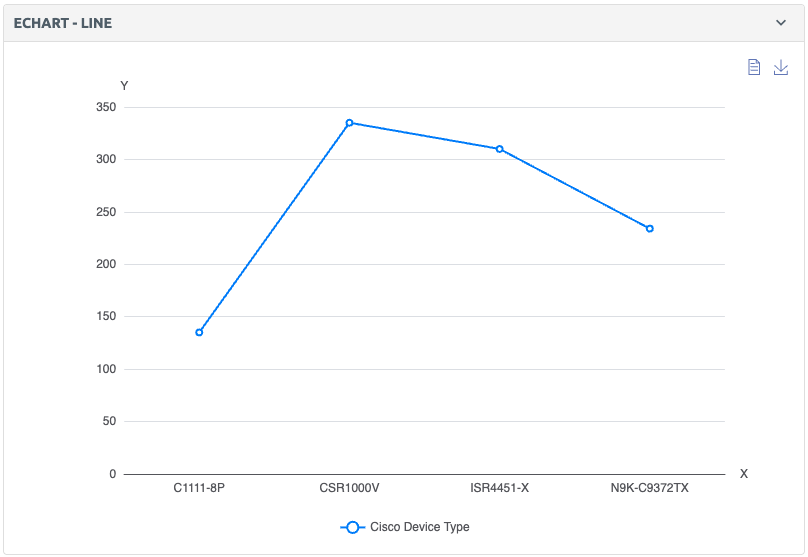

# ECharts

This module is based on [Apache ECharts](https://echarts.apache.org/en/index.html). To create and configure charts in Nautobot, the `EChartsBase` class is used. It handles transforming input data, applying themes, and generating a valid ECharts option config JSON.

## EChartsBase

Base definition for an ECharts chart (no rendering logic). This class transforms input data, applies theme colors, and generates a valid ECharts option config. Currently, ECharts supports three types:

- [bar](#bar-type)
- [pie](#pie-type)
- [line](#line-type)

### Additional Options

Each chart comes with two default toolbox icons:

- Detail View (allows viewing the underlying chart data)
- Save as Image (allows exporting the chart as an image (png, jpeg or svg). See more information in model definition)

<!-- pyml disable-num-lines 3 no-inline-html -->
<p align="center">
    
</p>

## Example Usage in a Django View

```no-highlight
from nautobot.core.ui.echarts import EChartsBase, queryset_to_nested_dict_records_as_series, queryset_to_nested_dict_keys_as_series
from nautobot.core.ui.choices import EChartsTypeChoices

template_name = "detail.html"
def get_extra_context(self, request, instance):
    chart = EChartsBase(
        chart_type=EChartsTypeChoices.BAR,
        header="Traffic per Interface",
        description="Example chart",
        data={
            "Compliant": {"aaa": 5, "dns": 12, "ntp": 8},
            "Non Compliant": {"aaa": 10, "dns": 20, "ntp": 15},
        },
    )

    chart_config = chart.get_config()

    return {
        "chart": chart,
        "chart_config": chart.get_config(),
        "chart_width": self.width,
        "chart_height": self.height,
        "chart_container_id": slugify(f"echart-{self.header}"),
    }
```

Corresponding Template (`detail.html`)

```no-highlight


```

## Example Usage as a Nautobot UI Component

### Bar Type

```no-highlight
from nautobot.core.ui import object_detail
from nautobot.core.ui.choices import EChartsTypeChoices, SectionChoices

object_detail_content = object_detail.ObjectDetailContent(
    panels=[
        object_detail.EChartsPanel(
            section=object_detail.SectionChoices.FULL_WIDTH,
            weight=100,
            label="EChart - BAR",
            chart_kwargs={
                "chart_type": EChartsTypeChoices.BAR,
                "header": "Traffic per Interface Bar",
                "description": "Example bar chart from EChartsBase",
                "data": {"Compliant": {"aaa": 5, "dns": 12, "ntp": 8}, "Non Compliant": {"aaa": 10, "dns": 20, "ntp": 15}},
            },
        ),
    ]
)
```


### Pie Type

```no-highlight
from nautobot.core.ui import object_detail
from nautobot.core.ui.choices import EChartsTypeChoices, SectionChoices

object_detail_content = object_detail.ObjectDetailContent(
    panels=[
        object_detail.EChartsPanel(
            section=object_detail.SectionChoices.LEFT_HALF,
            weight=100,
            label="EChart - PIE",
            chart_kwargs={
                "chart_type": EChartsTypeChoices.PIE,
                "header": "Traffic per Interface Pie",
                "description": "Example pie chart from EChartsBase",
                "data": {"Traffic Sources": {"Direct": 335, "Email": 310, "Union Ads": 234, "Video Ads": 135}},
            },
        ),
    ]
)
```

<!-- pyml disable-num-lines 3 no-inline-html -->
<p align="center">
    
</p>

### Line Type

```no-highlight
from nautobot.core.ui import object_detail
from nautobot.core.ui.choices import EChartsTypeChoices, SectionChoices

object_detail_content = object_detail.ObjectDetailContent(
    panels=[
        object_detail.EChartsPanel(
            section=object_detail.SectionChoices.RIGHT_HALF,
            weight=100,
            label="EChart - LINE",
            chart_kwargs={
                "chart_type": EChartsTypeChoices.LINE,
                "header": "Traffic per Interface Line",
                "description": "Example line chart from EChartsBase",
                "data": {"Traffic Sources": {"Direct": 335, "Email": 310, "Union Ads": 234, "Video Ads": 135}},
            },
        ),
    ]
)
```

<!-- pyml disable-num-lines 3 no-inline-html -->
<p align="center">
    
</p>

## Example Usage with Querysets

Instead of defining chart data manually, you can generate it directly from annotated querysets using the utility functions `queryset_to_nested_dict_records_as_series` and `queryset_to_nested_dict_keys_as_series`.

### Records as Series (record_key as outer keys)

```no-highlight
from nautobot.core.ui.echarts import EChartsBase, queryset_to_nested_dict_records_as_series, queryset_to_nested_dict_keys_as_series
from nautobot.core.ui.choices import EChartsTypeChoices

chart = EChartsBase(
    chart_type=EChartsTypeChoices.BAR,
    header="Devices and Prefixes by Location Type",
    description="Example chart with queryset_to_nested_dict_records_as_series",
    data=queryset_to_nested_dict_records_as_series(
        Location.objects.annotate(
            device_count=count_related(Device, "location"),
            prefix_count=count_related(Prefix, "locations"),
        ),
        record_key="location_type__nestable",
        value_keys=["prefix_count", "device_count"],
    ),
)
```

This produces data in the format:

```no-highlight
{
    "Nestable": {"prefix_count": 10, "device_count": 5},
    "No Nestable": {"prefix_count": 3, "device_count": 8},
}
```


### Keys as Series (value_keys as outer keys)

```no-highlight
from nautobot.core.ui.echarts import EChartsBase, queryset_to_nested_dict_records_as_series, queryset_to_nested_dict_keys_as_series
from nautobot.core.ui.choices import EChartsTypeChoices

chart = EChartsBase(
    chart_type=EChartsTypeChoices.BAR,
    header="Devices and Prefixes by Status",
    description="Example chart with queryset_to_nested_dict_keys_as_series",
    data=queryset_to_nested_dict_keys_as_series(
        Location.objects.annotate(
            device_count=count_related(Device, "location"),
            prefix_count=count_related(Prefix, "locations"),
        ),
        record_key="status",
        value_keys=["prefix_count", "device_count"],
    ),
)
```

This produces data in the format:

```no-highlight
{
    "prefix_count": {"Active": 12, "Retired": 5, ...},
    "device_count": {"Active": 20, "Retired": 7, ...},
}
```


