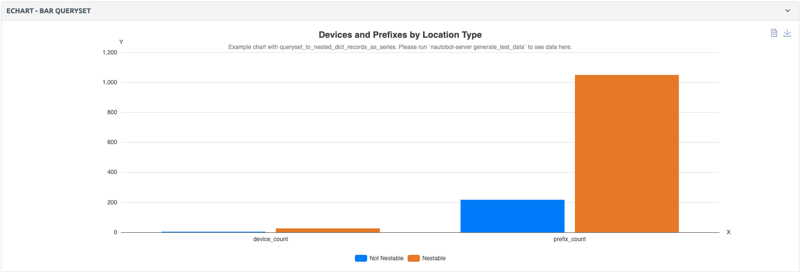
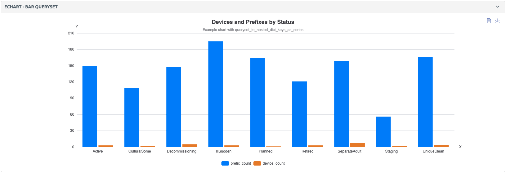

# ECharts

This module is based on [Apache ECharts](https://echarts.apache.org/en/index.html). To create and configure charts in Nautobot, the `EChartsBase` class is used. It handles transforming input data, applying themes, and generating a valid ECharts option config JSON.

## [EChartsBase](../../code-reference/nautobot/apps/ui.md#nautobot.apps.ui.EChartsBase)

Base definition for an ECharts chart (no rendering logic). This class transforms input data, applies theme colors, and generates a valid ECharts option config. Currently, ECharts supports three types:

- [bar](#bar-type)
- [pie](#pie-type)
- [line](#line-type)

### Data Handling

The `data` argument can be provided in **several formats**:

1. Raw nested format (more user-friendly):

    ```no-highlight
    {
        "Series1": {"x1": val1, "x2": val2},
        "Series2": {"x1": val3, "x2": val4},
    }
    ```

    - Keys represent series names.
    - Each series maps x-axis categories (e.g. "x1", "x2") to numeric values.
    - Internally, this is transformed into the normalized format described below.

2. Normalized internal format (directly compatible with [ECharts](https://echarts.apache.org/en/option.html)):

    ``` no-highlight
    {
        "x": ["x1", "x2"],
        "series": [
            {"name": "Series1", "data": [val1, val2]},
            {"name": "Series2", "data": [val3, val4]},
        ]
    }
    ```

    - `x` defines the list of x-axis labels (categories).
    - `series` is a list of objects, each containing:
        - "name": Series name (legend entry).
        - "data": Numeric values aligned with the order of x.

3. From a QuerySet via helper functions:
    - [Keys as series](#keys-as-series-value_keys-as-outer-keys)
    - [Records as series](#records-as-series-record_key-as-outer-keys)

4. Using a callable (lambda/function):
    - Instead of passing data directly, you can pass a `callable` that returns data in any of the above formats.
    - This is useful in UI components (`EChartsPanel`) where the database may not be ready at declaration time.

    ```no-highlight
    chart = EChartsBase(
        chart_type=EChartsTypeChoices.BAR,
        header="EChart",
        description="Example chart",
        data=lambda context: queryset_to_nested_dict_keys_as_series(
            Location.objects.annotate(
                device_count=count_related(Device, "location"),
            ),
            record_key="status",
            value_keys=["device_count"],
        )
    )
    ```

5. Using a callable with context:
    - For detail views, you often need to compute chart data dynamically based on the object currently being rendered.
    - You can do this by passing a callable (such as a function or `lambda`) to the `data` argument inside `chart_kwargs`.
    - The callable receives the `context`, giving you access to the current object at render time.

    ```no-highlight
    def tenant_related_objects_data(context):
        instance = get_obj_from_context(context)
        data_series = queryset_to_nested_dict_records_as_series(
            Tenant.objects.annotate(
                Circuits=count_related(Circuit, "tenant"),
                Clusters=count_related(Cluster, "tenant"),
            ).filter(pk=instance.id),
            record_key="name",
            value_keys=[
                "Circuits",
                "Clusters",
            ],
        )
        return data_series

    object_detail_panels = [
        EChartsPanel(
            section=SectionChoices.FULL_WIDTH,
            weight=100,
            label="EChart - Stats",
            chart_kwargs={
                "chart_type": EChartsTypeChoices.PIE,
                "header": "Stats by Tenant",
                "description": "Example chart using context and queryset.",
                "data": tenant_related_objects_data,
            },
        )
    ]
    ```

    - Here, the dataset is generated dynamically for the current `Tenant` object by using a callable with `context`.
    - This approach is recommended when chart data should be tied to the specific object being rendered in the detail view.

### Additional Options

Each chart comes with two default toolbox icons:

- Detail View (allows viewing the underlying chart data)
- Save as Image (allows exporting the chart as an image (png, jpeg or svg). See more information in model definition)

<!-- pyml disable-num-lines 3 no-inline-html -->
<p align="center">
    
</p>

### Combined Charts (`combined_with`)

`combined_with` allows merging another chart of a different type into the same ECharts instance. The header, description, x-axis, and y-axis are inherited from the parent `EChartsBase` instance. In the `combined_with` chart, can specify type and provide data as series names and corresponding values.

```no-highlight
chart = EChartsBase(
    chart_type=EChartsTypeChoices.BAR,
    "header": "Compliance per Feature",
    description="Example bar chart with line",
    data={
        "Compliant": {"aaa": 5, "dns": 12, "ntp": 8},
        "Non Compliant": {"aaa": 10, "dns": 20, "ntp": 15},
    },
    combined_with=EChartsBase(
        chart_type=EChartsTypeChoices.LINE,
        data={
            "Compliant": {"aaa": 5, "dns": 12, "ntp": 8},
            "Non Compliant": {"aaa": 10, "dns": 20, "ntp": 15},
        },
    ),
)
```


## Example Usage in a Django View

```no-highlight
from nautobot.core.ui.echarts import EChartsBase
from nautobot.core.ui.choices import EChartsTypeChoices

template_name = "detail.html"
def get_extra_context(self, request, instance):
    chart = EChartsBase(
        chart_type=EChartsTypeChoices.BAR,
        header="Compliance per Feature",
        description="Example chart",
        data={
            "Compliant": {"aaa": 5, "dns": 12, "ntp": 8},
            "Non Compliant": {"aaa": 10, "dns": 20, "ntp": 15},
        },
    )

    return {
        # Chart object
        "chart": chart,

        # JSON configuration for ECharts (consumed by JS)
        "chart_config": chart.get_config(),

        # Unique HTML <div id="..."> where the chart will be rendered
        "chart_container_id": slugify(f"echart-{chart.header}"),

        # Optional dimensions (defaults are: width="100%", height="32rem")
        "chart_width": "100%",
        "chart_height": "32rem",
    }
```

Corresponding Template (`detail.html`)

```no-highlight


```

## Example Usage as a Nautobot UI Component ([EChartsPanel](../../code-reference/nautobot/apps/ui.md#nautobot.apps.ui.EChartsPanel))

### Bar Type

```no-highlight
from nautobot.core.ui import object_detail
from nautobot.core.ui.choices import EChartsTypeChoices, SectionChoices

object_detail_content = object_detail.ObjectDetailContent(
    panels=[
        object_detail.EChartsPanel(
            section=SectionChoices.FULL_WIDTH,
            weight=100,
            label="EChart - BAR",
            chart_kwargs={
                "chart_type": EChartsTypeChoices.BAR,
                "header": "Compliance per Feature",
                "description": "Example bar chart from EChartsBase",
                "data": {"Compliant": {"aaa": 5, "dns": 12, "ntp": 8}, "Non Compliant": {"aaa": 10, "dns": 20, "ntp": 15}},
            },
        ),
    ]
)
```


### Pie Type

```no-highlight
from nautobot.core.ui import object_detail
from nautobot.core.ui.choices import EChartsTypeChoices, SectionChoices

object_detail_content = object_detail.ObjectDetailContent(
    panels=[
        object_detail.EChartsPanel(
            section=SectionChoices.LEFT_HALF,
            weight=100,
            label="EChart - PIE",
            chart_kwargs={
                "chart_type": EChartsTypeChoices.PIE,
                "header": "Number of device - group by device type (Pie)",
                "description": "Example pie chart from EChartsBase",
                "data": {"Cisco Device Type": {"CSR1000V": 335, "ISR4451-X": 310, "N9K-C9372TX": 234, "C1111-8P": 135}},
            },
        ),
    ]
)
```

<!-- pyml disable-num-lines 3 no-inline-html -->
<p align="center">
    
</p>

### Line Type

```no-highlight
from nautobot.core.ui import object_detail
from nautobot.core.ui.choices import EChartsTypeChoices, SectionChoices

object_detail_content = object_detail.ObjectDetailContent(
    panels=[
        object_detail.EChartsPanel(
            section=SectionChoices.RIGHT_HALF,
            weight=100,
            label="EChart - LINE",
            chart_kwargs={
                "chart_type": EChartsTypeChoices.LINE,
                "header": "Number of device - group by device type (Line)",
                "description": "Example line chart from EChartsBase",
                "data": {"Cisco Device Type": {"CSR1000V": 335, "ISR4451-X": 310, "N9K-C9372TX": 234, "C1111-8P": 135}},
            },
        ),
    ]
)
```

<!-- pyml disable-num-lines 3 no-inline-html -->
<p align="center">
    
</p>

## Example Usage with Querysets

Instead of defining chart data manually, you can generate it directly from annotated querysets using the utility functions `queryset_to_nested_dict_records_as_series` and `queryset_to_nested_dict_keys_as_series`.

### Records as Series (record_key as outer keys)

```no-highlight
from nautobot.core.ui.echarts import EChartsBase, queryset_to_nested_dict_records_as_series, queryset_to_nested_dict_keys_as_series
from nautobot.core.ui.choices import EChartsTypeChoices

chart = EChartsBase(
    chart_type=EChartsTypeChoices.BAR,
    header="Devices and Prefixes by Location Type",
    description="Example chart with queryset_to_nested_dict_records_as_series",
    data=queryset_to_nested_dict_records_as_series(
        Location.objects.annotate(
            device_count=count_related(Device, "location"),
            prefix_count=count_related(Prefix, "locations"),
        ),
        record_key="location_type__nestable",
        value_keys=["prefix_count", "device_count"],
    ),
)
```

This produces data in the format:

```no-highlight
{
    "Nestable": {"prefix_count": 10, "device_count": 5},
    "No Nestable": {"prefix_count": 3, "device_count": 8},
}
```



### Keys as Series (value_keys as outer keys)

```no-highlight
from nautobot.core.ui.echarts import EChartsBase, queryset_to_nested_dict_records_as_series, queryset_to_nested_dict_keys_as_series
from nautobot.core.ui.choices import EChartsTypeChoices

chart = EChartsBase(
    chart_type=EChartsTypeChoices.BAR,
    header="Devices and Prefixes by Status",
    description="Example chart with queryset_to_nested_dict_keys_as_series",
    data=queryset_to_nested_dict_keys_as_series(
        Location.objects.annotate(
            device_count=count_related(Device, "location"),
            prefix_count=count_related(Prefix, "locations"),
        ),
        record_key="status",
        value_keys=["prefix_count", "device_count"],
    ),
)
```

This produces data in the format:

```no-highlight
{
    "prefix_count": {"Active": 12, "Retired": 5, ...},
    "device_count": {"Active": 20, "Retired": 7, ...},
}
```


