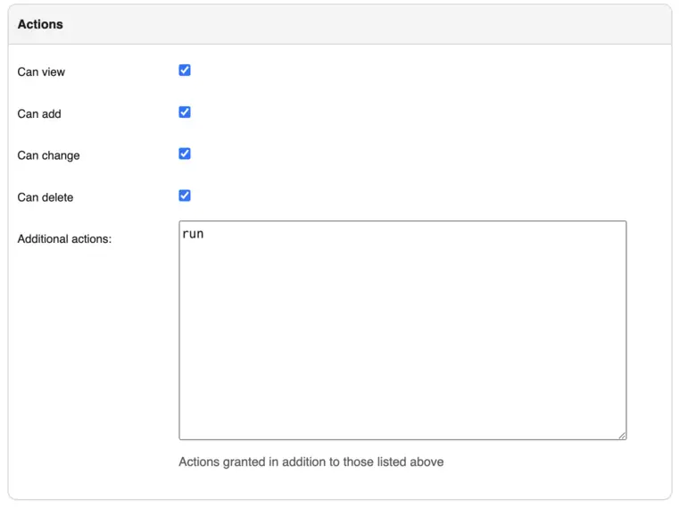

# Jobs

Jobs are a way for users to execute custom logic on demand from within the Nautobot UI. Jobs can interact directly with Nautobot data to accomplish various data creation, modification, and validation tasks, such as:

- Automatically populate new devices and cables in preparation for a new location deployment
- Create a range of new reserved prefixes or IP addresses
- Fetch data from an external source and import it to Nautobot
- Check and report whether all top-of-rack switches have a console connection
- Check and report whether every router has a loopback interface with an assigned IP address
- Check and report whether all IP addresses have a parent prefix

...and so on. Jobs are Python code and exist outside of the official Nautobot code base, so they can be updated and changed without interfering with the core Nautobot installation. And because they're completely customizable, there's practically no limit to what a job can accomplish.

The following pages provide detailed guides for managing and running Jobs:

- **[Managing Jobs](./managing-jobs.md)**: Enable/disable Jobs, override metadata, delete Jobs.
- **[Job Scheduling & Approvals](./job-scheduling-and-approvals.md)**: Schedule Jobs to run in the future or regularly.
- **[Job Queues](./jobqueue.md)**: Configure dedicated Celery or Kubernetes queues.
- **[Job Buttons](./jobbutton.md)**: Run Jobs from detail views of Nautobot objects.
- **[Job Hooks](./jobhook.md)**: Automatically trigger Jobs based on object changes.
- **[Kubernetes Job Support](./kubernetes-job-support.md)**: Run Jobs within a Kubernetes cluster.
- **[Developing Jobs](../../../development/jobs/index.md)**: To write your own jobs or migrate them from previous Nautobot releases, check out the developer section.

+/- 2.0.0
    Backwards compatibility with NetBox scripts and reports has been removed. This includes removal of automatic calls to the `post_run()` and `test_*()` methods.

!!! note
    Jobs unify and supersede the functionality previously provided in NetBox by "custom scripts" and "reports". User input is supported via [job variables](../../../development/jobs/job-structure.md#variables).

## Managing Jobs

Each installed Job class has an associated database record controlling its availability and metadata.

To enable or disable Jobs, override metadata, or remove obsolete Job records, see [**Managing Jobs**](./managing-jobs.md).

## Running Jobs

!!! note
    To run any job, a user must be assigned the `extras.run_job` permission. This is achieved by assigning the user (or group) a permission on the `extras > job` object and specifying the `run` action in the admin UI as shown below.

    Is it true right now ?
    Similarly, to [approve a job request by another user](./job-scheduling-and-approvals.md), a user must be assigned the `extras.change_approvalworkflowstage` and `extras.view_approvalworkflowstage` permission via the same process. Job approvers also need the `extras.change_scheduledjob` and/or `extras.delete_scheduledjob` permissions as job approvals are implemented via the `ScheduledJob` data model.

    
    *Admin → Users → (Select user or group) → Object permissions → Add object permission*

### Via the Web UI

Jobs can be run via the web UI by navigating to the job, completing any required form data (if any), and clicking the "Run Job" button.

Once a job has been run, the latest [`JobResult`](./models.md#job-results) for that job will be summarized in the job list view.

### Via the REST API

--- 2.0.0
    The `commit` parameter was removed. All job input should be provided via the `data` parameter.

To run a job via the REST API, issue a POST request to the job's endpoint `/api/extras/jobs/<uuid>/run/` **or** `/api/extras/jobs/<name>/run/`. You can optionally provide JSON data to specify any required user input `data`, optional `task_queue`, and/or provide optional scheduling information as described in [the section on scheduling and approvals](./job-scheduling-and-approvals.md).

+++ 2.0.0
    The `/api/extras/jobs/<name>/` REST API endpoints were added as an alternative to `/api/extras/jobs/<uuid>/`.

For example, to run a job, by UUID, with no user inputs:

```no-highlight
curl -X POST \
-H "Authorization: Token $TOKEN" \
-H "Content-Type: application/json" \
-H "Accept: application/json; version=1.3; indent=4" \
http://nautobot/api/extras/jobs/$JOB_ID/run/
```

Or to run a job, by name, that expects user inputs:

```no-highlight
curl -X POST \
-H "Authorization: Token $TOKEN" \
-H "Content-Type: application/json" \
-H "Accept: application/json; version=1.3; indent=4" \
http://nautobot/api/extras/jobs/$JOB_NAME/run/ \
--data '{"data": {"string_variable": "somevalue", "integer_variable": 123}}'
```

When providing input data, it is possible to specify complex values contained in `ObjectVar`s, `MultiObjectVar`s, and `IPAddressVar`s.

- `ObjectVar`s can be specified by either using their primary key directly as the value, or as a dictionary containing a more complicated query that gets passed into the Django ORM as keyword arguments.
- `MultiObjectVar`s can be specified as a list of primary keys.
- `IPAddressVar`s can be provided as strings in CIDR notation.

#### Jobs with Files

To run a job that contains `FileVar` inputs via the REST API, you must use `multipart/form-data` content type requests instead of `application/json`. This also requires a slightly different request payload than the example above. The `task_queue` and `schedule` data are flattened and prefixed with underscore to differentiate them from job-specific data. Job specific data is also flattened and not located under the top-level `data` dictionary key.

An example of running a job with both `FileVar` (named `myfile`) and `StringVar` (named `interval`) input:

```no-highlight
curl -X POST \
-H 'Authorization: Token $TOKEN' \
-H 'Content-Type: multipart/form-data' \
-H "Accept: application/json; version=1.3; indent=4" \
'http://nautobot/api/extras/jobs/$JOB_NAME/run/' \
-F '_schedule_interval="immediately"' \
-F '_schedule_start_time="2022-10-18T17:31:23.698Z"' \
-F 'interval="3"' \
-F 'myfile=@"/path/to/my/file.txt"' \
```

### Via the CLI

Jobs can be run from the CLI by invoking the management command:

```no-highlight
nautobot-server runjob [--username <username>] [--local] [--data <data>] <class_path>
```

!!! note
    [See above](./models.md#understanding-job-class-paths) for `class_path` definitions.

The `--data` parameter must be a JSON string, e.g. `--data='{"string_variable": "somevalue", "integer_variable": 123}'`

Using the same example shown in the API:

```no-highlight
nautobot-server runjob --username myusername example.MyJobWithNoVars
```

!!! warning
    The `--username <username>` must be supplied to specify the user that will be identified as the requester of the job.

    Note that `nautobot-server` commands, like all management commands and other direct interactions with the Django database, are not gated by the usual Nautobot user authentication flow. It is possible to specify any existing `--username` with the `nautobot-server runjob` command in order to impersonate any defined user in Nautobot. Use this power wisely and be cautious who you allow to access it.
