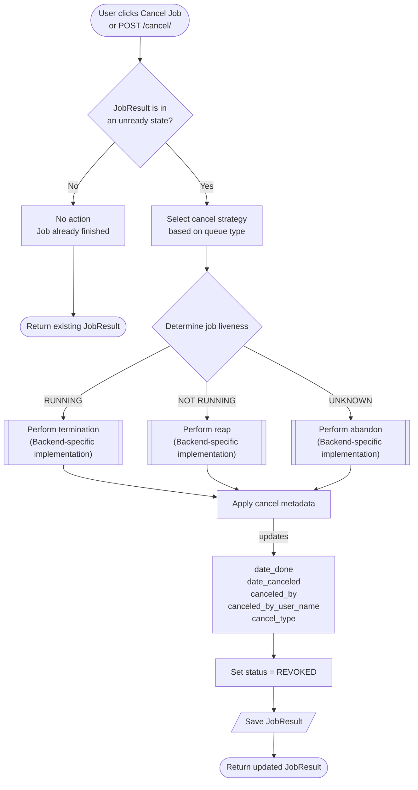
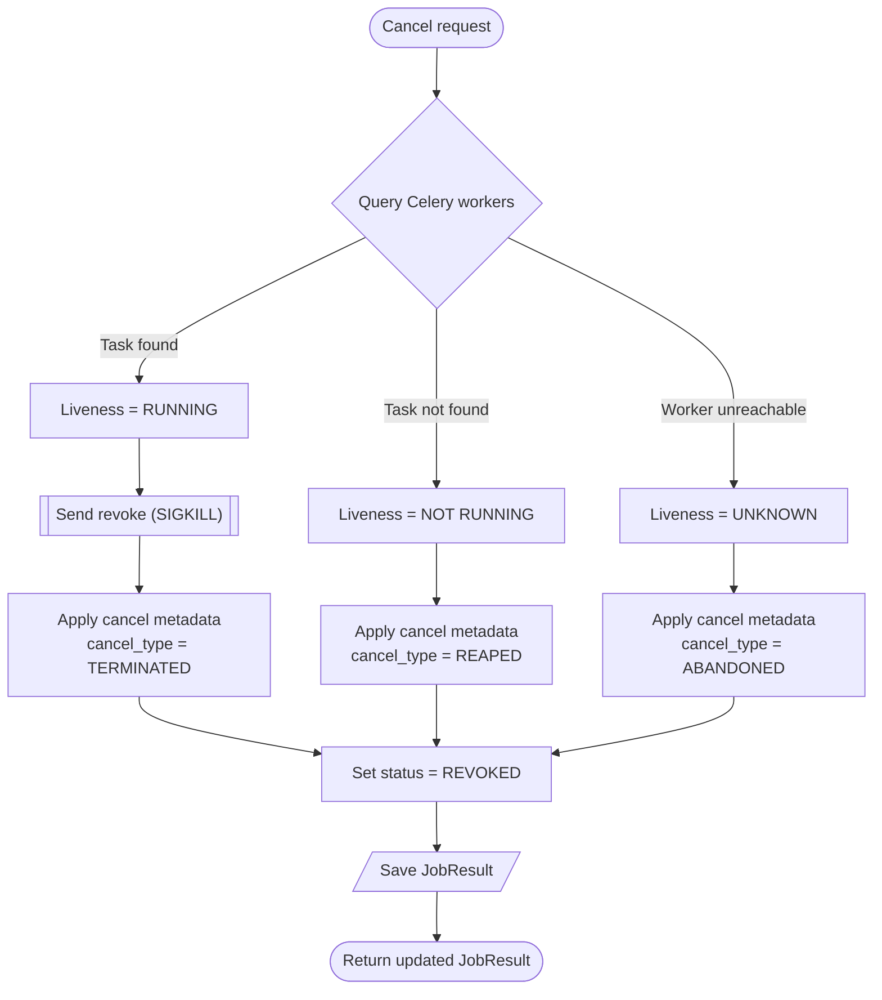
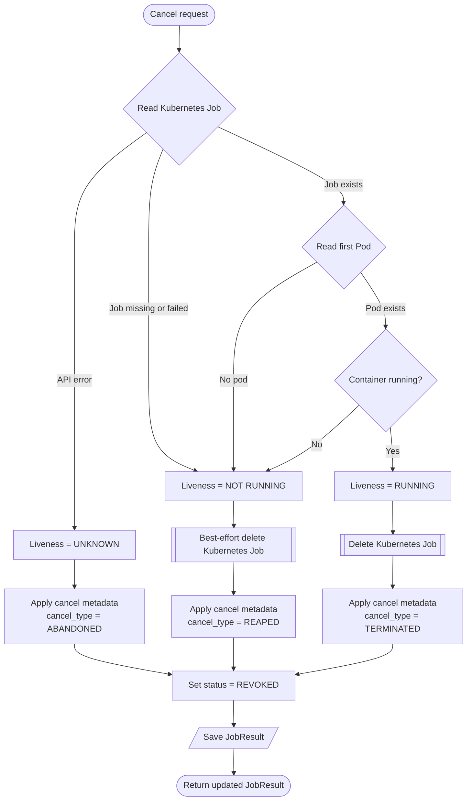

# Job Cancel

+++ 3.2.0

The Job Cancel feature gives operators the ability to terminate running or pending jobs and clean up stuck job records across all supported backends (Celery and Kubernetes).

## Overview

Sometimes a job is taking longer than expected and needs to be cancelled. Sometimes a worker crashed mid-job and the `JobResult` is left sitting in `STARTED` forever, even though nothing is actually running. Sometimes a job might have been incorrectly enqueued to a queue that doesn't actually have any workers servicing it. Job Cancel handles such situations through a single user action (clicking `Cancel Job` on a `JobResult`) and moves the JobResult to `REVOKED` state, doing any appropriate additional actions as described below.

!!! warning "Cancel is not a rollback"
    Canceling stops further execution. It does not undo work that has already been done. Nautobot does not wrap the job in an atomic transaction, and it does not revert operations that already completed. If a job has already run against 20 of 100 devices when you cancel it, those 20 stay affected. Only the remaining work is prevented.

When an operator terminates a job, Nautobot first asks the backend whether any worker still holds the task. There are three possible answers:

When an operator cancels a job, Nautobot first asks the backend about the job's liveness — whether any worker still holds the task. There are three possible answers, and each maps to a different cancel type:

1. `running` — a worker is processing the task. Nautobot terminates it. For Celery, that means sending SIGKILL to the worker holding the task. For Kubernetes, that means deleting the K8s Job (which cascades to its pods via Background propagation). The JobResult is updated with the user who initiated the kill, the time, a final status of REVOKED, `cancel_type = TERMINATED`.
2. `not running` — the backend confirms no worker has the task. (no worker reports it, the K8s Job has already failed, the pod is stuck in a non-running state, etc.). The job is reaped: the JobResult is marked `REVOKED` with `cancel_type = REAPED`, with no kill intent. For Kubernetes, a best-effort delete still runs to clean up any lingering resources, but the action is classified as a reap regardless of what the delete returns.
3. `unknown` — the backend cannot be reached. For Celery, this means the broker/inspect call failed. For Kubernetes, this means the API server returned a non-404 error during the liveness check. In this case the job is abandoned: the JobResult is marked REVOKED with `cancel_type = ABANDONED`. No kill signal is sent, because there is no backend to send it to. If the job is in fact still running somewhere, it will continue until it finishes on its own. Nautobot has no way to confirm or change that. For Celery, a worker-startup hook reconciles state if the worker comes back later (see [Worker restart recovery](#worker-restart-recovery)).

In all cases the `JobResult` ends up with `canceled_by`, `canceled_by_user_name`, `cancel_type`, `date_canceled` and `date_done` recorded, so the operator who killed the job is auditable.

### Terminate, reap, and abandon

The distinction matters because the two paths have very different costs and side effects:

- A `terminate` acts on live work. For Celery, that's SIGKILL to a worker mid-task, possibly holding database transactions, possibly partway through writing changes — there is no chance for the job to clean up. For Kubernetes, that's `delete_namespaced_job` with Background propagation, which marks the Job and its pods for deletion and lets the garbage collector tear them down asynchronously. This is what users expect when they click "Cancel Job" but it's the more disruptive of the two.
- A `reap` is a database-only operation - no worker involvement. For Celery, reap is database-only with no backend involvement. For Kubernetes, reap still issues a best-effort delete to clean up resources that K8s' own `ttlSecondsAfterFinished` may not have collected (e.g. pods stuck in `ImagePullBackOff` never reach a "finished" state the TTL controller acts on), but it doesn't claim a kill happened.
- An `abandon` is a database-only operation in both backends. The whole point of abandon is that Nautobot couldn't talk to the backend, so it would be dishonest to attempt cleanup or claim a kill. The JobResult is marked REVOKED so the operator isn't stuck staring at a STARTED row indefinitely, but the audit trail makes it clear (via `cancel_type = ABANDONED`) that no kill signal was sent and the job's real-world state is unknown. Because abandon sends no kill signal, the task may still be running and can run to completion. If it does, its final status (COMPLETED/SUCCESS or FAILURE) replaces the earlier REVOKED. This is expected.

All three paths converge on `status = REVOKED` with full attribution.

### Cancel workflows

The following diagrams summarize how Nautobot determines what kind of cancel operation to perform and how that behavior differs between Celery and Kubernetes backends.

#### General workflow

The first diagram shows the backend-independent decision tree implemented by the cancel framework.



### Celery workflow

This diagram illustrates how Celery determines whether a task is still running and the actions taken for terminate, reap, and abandon.



### Kubernetes workflow

This diagram shows how Kubernetes determines job liveness from the Job and Pod state before selecting terminate, reap, or abandon.



### Worker restart recovery

There's one edge case worth knowing about: a job can be marked `REVOKED` in the database while its Celery message is still sitting in the broker queue. If the worker that was supposed to run it has been down, the message has not been consumed yet. When the worker comes back online, it would normally pick the message up and run the job, ignoring the database state. To prevent this, a `worker_ready` signal handler runs once at worker startup. It reads every queue the worker is consuming, finds messages whose `JobResult` is already `REVOKED` in the database, and adds those task IDs to Celery's in-memory canceled set. When the worker dequeues those messages it sees them in the canceled set and discards them. This closes the gap between "operator clicked Cancel Job" and "worker comes back online" — the kill survives a restart.

### Kubernetes specifics

For Kubernetes jobs, a job is considered live only when its pod is actively running. Pods that never started (e.g. stuck pulling an image), pods that
already finished or crashed, and jobs whose pod was never created all count as not live and go through the reap path.

Reap on Kubernetes still issues a best-effort cleanup of the underlying K8s resources — if they're already gone (which is the expected case once `ttlSecondsAfterFinished` has fired), that's fine and treated as success, as long as the `JobResult` hasn't moved to a final state (e.g. `COMPLETED`) in the meantime. If it has, the original status is preserved and the cancel is skipped.

### Permissions

Canceling requires `extras.view_jobresult` to reach the job, plus authority to cancel it. There are two ways to have that authority:

- **Submitters** can always cancel a job they submitted, without holding `extras.cancel_job`.
- **Anyone else** needs the `extras.cancel_job` permission, scoped (object-level) to the specific Job being canceled. A user whose `extras.cancel_job` is constrained to certain Jobs can only cancel those Jobs.

If the Job associated with a result has been deleted, there is no Job left to scope the permission against. In that case any user with the `extras.cancel_job` permission can cancel the result, regardless of constraints, so that these orphaned results can be cleaned up.

### Cancel via the UI

A running or pending job can be canceled from its `JobResult` detail view. Click the **Cancel Job** button to open the confirmation page, which indicates whether the job is currently running (and will be terminated) or whether its worker is gone (and the record will be reaped). Confirming the action moves the `JobResult` to `REVOKED` state and records the operator who initiated it.

The button is shown only when the job is in an unfinished state and the current user is permitted to cancel it. See [Permissions](#permissions) for details.

### Cancel via the API

Job cancel can also be triggered via the REST API. The endpoint is exposed on the `JobResult` viewset under `cancel`.

The API supports a two-step workflow:

- `GET` returns a preview of the cancel operation and what action will be taken.
- `POST` performs the actual cancel operation.

#### Preview a cancel

A `GET` request returns details about the job and the action that would be taken. No worker is signaled and no `JobResult` is modified.

```no-highlight
curl -X GET \
-H "Authorization: Token $TOKEN" \
-H "Accept: application/json; version=1.3; indent=4" \
http://nautobot/api/extras/job-results/$JOB_RESULT_ID/cancel/
```

The `action` field indicates the path the server would take:

- `TERMINATE` the worker is alive and would receive a `SIGKILL` (Celery) or have its K8s Job deleted (Kubernetes).
- `REAP` no worker is running the task; the `JobResult` would be marked canceled without signaling anything.
- `ABANDON` the backend (Celery broker or Kubernetes API) could not be reached, so the job's actual state cannot be confirmed. The `JobResult` would be marked canceled without sending any signal. If the job is still running somewhere, it will continue until it finishes on its own.
- `None` the job has already reached a ready state; no action would be taken.

The `job_status` field reports the job's liveness as seen by the backend:

- `RUNNING` — backend confirms a worker is processing the task.
- `NOT RUNNING` — backend confirms no worker is processing the task.
- `UNKNOWN` — backend could not be queried.
- A terminal state (`SUCCESS`, `FAILURE`, `REVOKED`, …) — the job has already finished.

Example response when a worker is alive:

```json
{
    "message": "Are you sure you want to cancel ''?",
    "action": "TERMINATE",
    "action_description": "SIGKILL to worker. Stops immediately, no cleanup.",
    "job_status": "RUNNING",
    "irreversible": "This action cannot be undone.",
    "timestamp": "2026-05-14T11:00:12.060393+00:00"
}
```

If the `JobResult` is already in a finished state, the preview endpoint still returns `200 OK`, since no state-changing operation is attempted. The `irreversible` field is omitted because there is nothing to undo.

Example response for a finished job:

```json
{
    "message": "Job '<jobresult_name>' is already finished.",
    "action": "None",
    "action_description": "Job is already finished. Nothing to do.",
    "job_status": "SUCCESS",
    "timestamp": "2026-05-14T11:00:12.060393+00:00"
}
```

Example response when the backend is unreachable:

```json
{
    "message": "Are you sure you want to cancel ''?",
    "action": "ABANDON",
    "action_description": "Backend unreachable. Marks JobResult as canceled without confirming its state. If the job is still running, it will continue until it finishes on its own.",
    "job_status": "UNKNOWN",
    "irreversible": "This action cannot be undone.",
    "timestamp": "2026-05-14T11:00:12.060393+00:00"
}
```

#### Perform a cancel

A `POST` request performs the cancel.

```no-highlight
curl -X POST \
-H "Authorization: Token $TOKEN" \
-H "Accept: application/json; version=1.3; indent=4" \
http://nautobot/api/extras/job-results/$JOB_RESULT_ID/cancel/
```

On success the response is the updated `JobResult` (now in `REVOKED` state, with `canceled_by` and `date_done` set)

If the `JobResult` is already in a finished state, the request returns 409 Conflict.

```json
{
    "detail": "Job is already finished. Nothing to do."
}
```

#### A note on the `status` field after a `TERMINATE`

When the action is `TERMINATE`, the cancel is delivered to the Celery worker asynchronously: Nautobot sends `SIGKILL` and returns immediately, while the worker writes `status = "REVOKED"` back through the result backend a moment later. The `JobResult` returned in the API response is read immediately after the signal is sent, so its `status` field will often still show the prior value (e.g. `STARTED` or `PENDING`) not because the cancel failed, but because the status update hasn't propagated yet.

The authoritative signal that a cancel succeeded is the presence of `canceled_by` and `date_canceled` on the returned `JobResult`. If those fields are set, the cancel was accepted and recorded; the `status` field will catch up on a subsequent read.

For `REAP` (no live worker), the `status` field is updated synchronously and will already read `REVOKED` in the response.

API clients that need the final `status` immediately should poll the `JobResult` detail endpoint until `status` reaches a terminal value, rather than relying on the response body of the `cancel` call.

#### Status codes

| Code | Meaning                                                                              |
|------|--------------------------------------------------------------------------------------|
| 200  | Preview returned successfully (`GET`) or cancel succeeded (`POST`).              |
| 500  | The cancel strategy reported an error or the queue type is unsupported.              |
| 403  | The caller lacks proper permissions. See [Permissions](#permissions) for full rules. |
| 409  | A `POST` cancel request was made for a JobResult already in a finished state.        |
| 500  | The cancel strategy reported an error or the queue type is unsupported.              |
