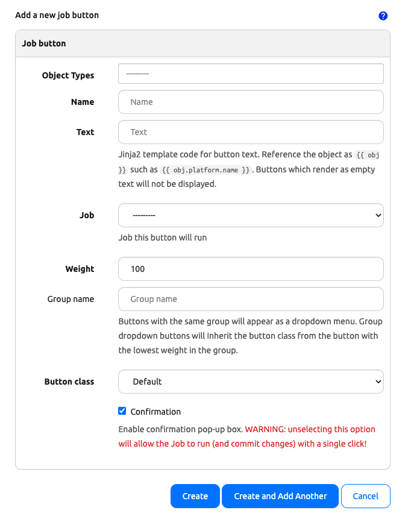
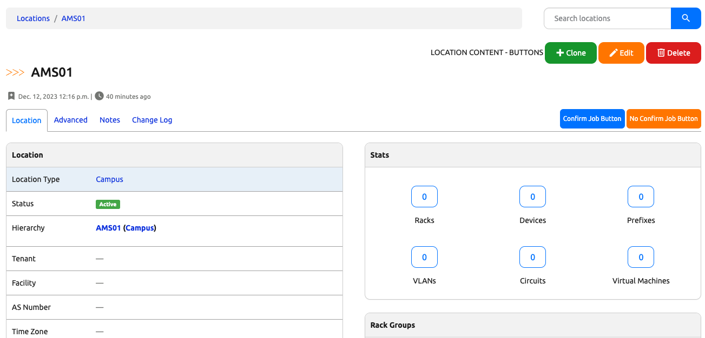

# Job Buttons

+++ 1.5.14

Job Buttons are predefined buttons that allow users to run jobs directly from within Nautobot object views. It uses the object where the button was pressed as the only input to the job. These are helpful when you want to start a job that requires minimal or no input without having to use the standard job form. For example, you may have a job that only requires a user to select a device. Instead, they can now go to that device in the web UI and click the associated Job Button instead.

Job Buttons can be created in web UI located in the navbar under Jobs > Job Buttons. Each button can be associated with multiple Nautobot object types (location, device, prefix, etc.) and will be displayed on all of the associated object detail views. The text displayed on the button supports Jinja2 templating which allows for using [context data](#context-data) to dynamically update or [even be hidden under certain conditions](#conditional-rendering).

The buttons appear at the top right corner of an object's individual detail page for each object type they are associated to. They can be either individual buttons or grouped together in a dropdown for better organization. Buttons will be sorted from left to right based on their `weight` with the lowest `weight` button on the left. Any groups of buttons will be displayed to the right of all ungrouped buttons. Group dropdown buttons will inherit the button class from the button with the lowest `weight` in the group and will be sorted from top to bottom with the lowest `weight` button on top.

## Configuration

* **Name** - A unique name for the Job Button.
* **Object type(s)** - The type or types of Nautobot object that the button will be associated to.
* **Text** - The text that will be displayed on the button.
* **Job** - The [Job Button Receiver](../../../development/jobs/index.md#job-button-receivers) that this button will run.
* **Weight** - The number used for determining the order the buttons will appear.
* **Group** - The name of the dropdown group to add this button into (optional).
* **Button Class** - The button CSS class, which dictates the color.
* **Confirmation** - Should the button pop up a confirmation dialog before running.

!!! warning
    As you can see, there is no `commit` option for a Job Button like there is for a normal Job. All Job Buttons will run with `commit=True` **implicitly**.



For any Job that is loaded into Nautobot, the Job must be enabled to run. See [Enabling Jobs for Running](./index.md#enabling-jobs-for-running) for more details.

## Required Permissions

!!! note
    In order to run any job via a Job Button, a user must be assigned the `extras.run_job` **as well as** the `extras.run_jobbutton` permissions. This is achieved by assigning the user (or group) a permission on the `extras > job` and `extras > jobbutton` objects and specifying the `run` action in the **Additional actions** section. Any user lacking these permissions may still see the button on the respective page(s) - if not using [conditional rendering](#conditional-rendering) - but they will be disabled.

## Context Data

The following context data is available within the template when rendering a Job Button's text.

| Variable  | Description                                                                                                       |
| --------- | ----------------------------------------------------------------------------------------------------------------- |
| `obj`     | The Nautobot object being displayed                                                                               |
| `debug`   | A boolean indicating whether debugging is enabled                                                                 |
| `request` | The current WSGI request                                                                                          |
| `user`    | The current user (if authenticated)                                                                               |
| `perms`   | The [permissions](https://docs.djangoproject.com/en/stable/topics/auth/default/#permissions) assigned to the user |

All [built-in Jinja2 filters](../template-filters.md) are available and it's also possible to [develop and register custom Jinja2 filters](../../../development/apps/api/platform-features/jinja2-filters.md).

## Conditional Rendering

Only buttons which render with non-empty text are included on the page. You can employ conditional Jinja2 logic to control the conditions under which a button gets rendered.

For example, if you only want to display a button for active devices, you could set the button text to

```jinja2
Provision
```

The button will not appear when viewing a device with any status other than `Active`.

As another example, if you wanted to show only devices belonging to a certain manufacturer, you could do something like this:

```jinja2
Provision
```

The button will only appear when viewing a device with a manufacturer name of `Cisco`.

As a last example, you can hide the button for users that lack the proper permissions to run a job like this:

```jinja2
Provision
```

The button will only appear if they have the permission to run jobs.



!!! note
    To access custom fields of an object within a template, use the `cf` attribute. For example, `{{ obj.cf.color }}` will return the value (if any) for the custom field with a key of `color` on `obj`.
