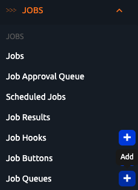
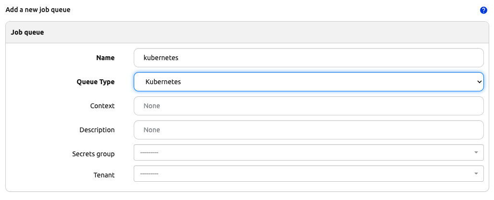
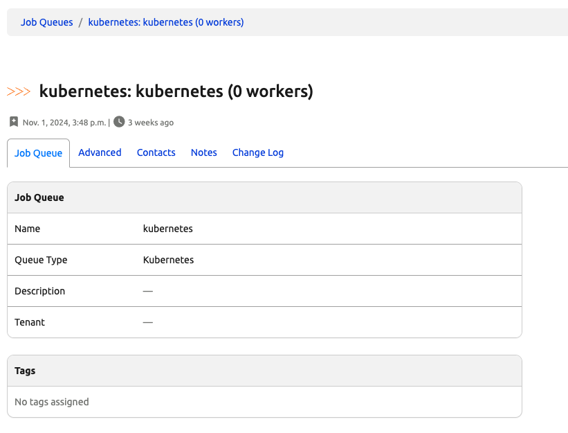
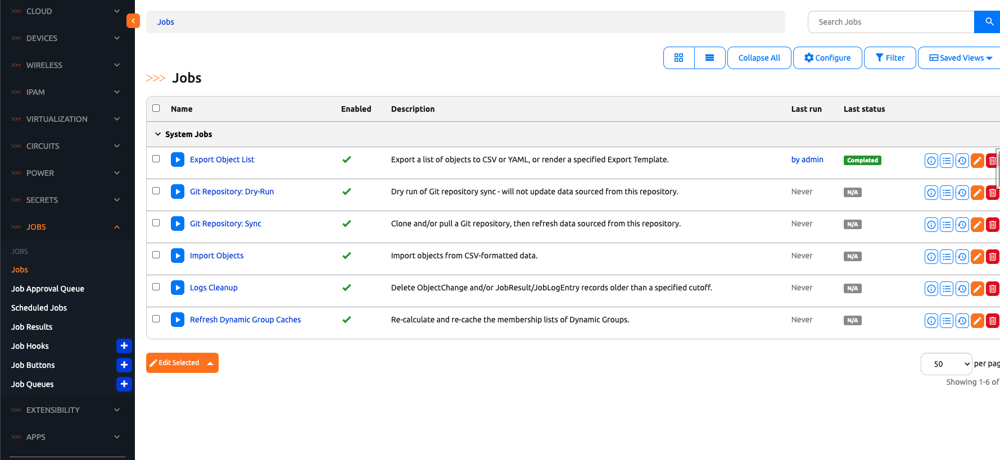
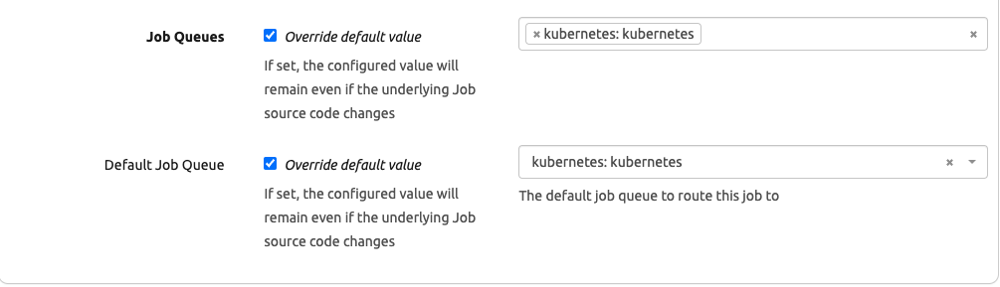
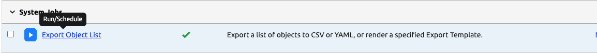
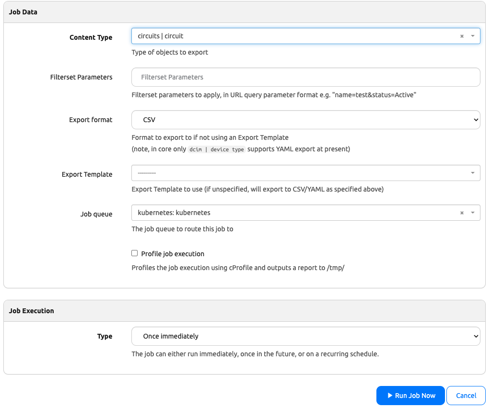
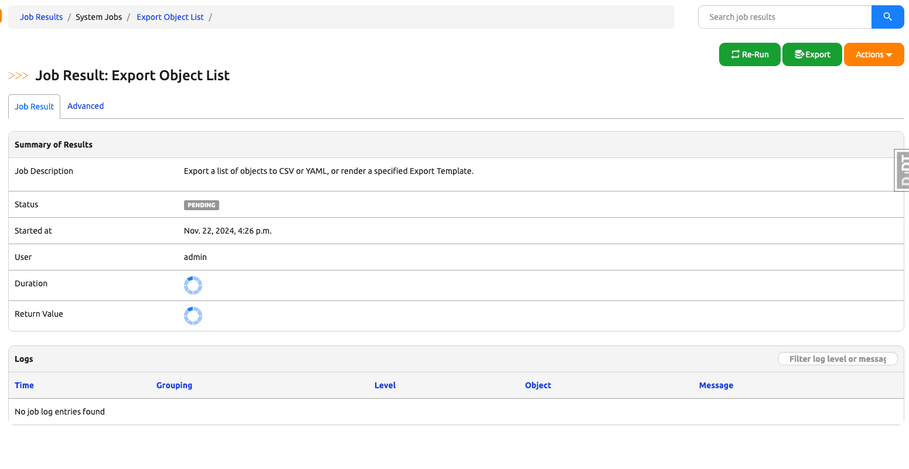
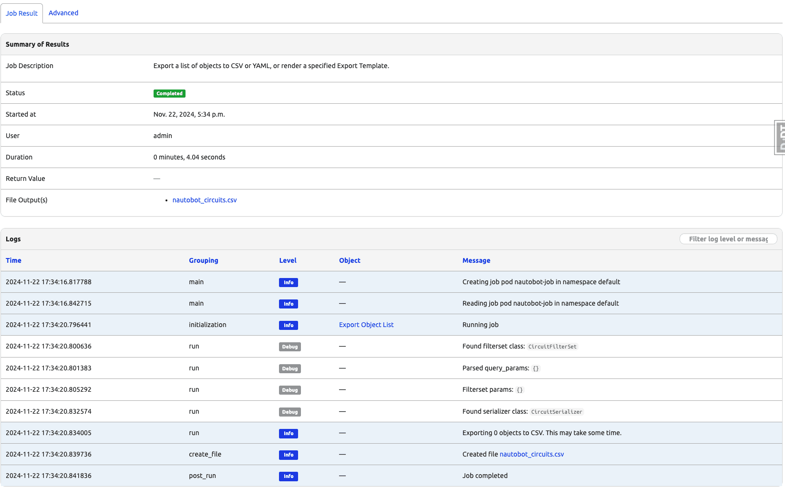

# Kubernetes Job Support

+++ 2.4.0

## When to Use Kubernetes Jobs

Kubernetes job support was added in Nautobot v2.4.0 to provide an alternative for job execution for Nautobot in Kubernetes deployments. Presently, running Nautobot jobs with Celery and Celery workers within a Kubernetes deployment has several potential downsides. To list a few:

1. Resource Allocation Issues: Celery workers require resource allocation (CPU/Memory). Although Kubernetes allows for limits and requests, under-allocation of resources can cause crashes, while over-allocation can be quite wasteful
2. In some environments with resource contention, Kubernetes may evict pods with Celery workers, leading to task loss or interruptions.
3. If a Celery worker pod crashes or is terminated, any in-progress tasks without any retry mechanisms can be lost and their results untraceable.

So if you have any concerns with running Celery workers in your Kubernetes deployment, executing jobs with Kubernetes might be for you.

## Configuration

=== "Single Kubernetes Job Queue"

    !!! note "How to Configure Environment Variables"
        All Kubernetes job queues use the environment variables and behavior described below. With a single queue, you must configure a manifest via `NAUTOBOT_KUBERNETES_JOB_MANIFEST` and optionally adjust pod name, namespace, and service address.

    [**`NAUTOBOT_KUBERNETES_JOB_MANIFEST`**](../../administration/configuration/settings.md#kubernetes_job_manifest)

    This environment variable should store a [Kubernetes Job](https://kubernetes.io/docs/concepts/workloads/controllers/job/) manifest as a JSON string. Below is a sample kubernetes job manifest.

    !!! important
        Ensure this job template uses the same Docker image as your Nautobot Kubernetes deployment. You can specify the image name in spec.template.spec.containers.image. Additionally, configure and map the required environment variables to corresponding [Kubernetes ConfigMap](https://kubernetes.io/docs/concepts/configuration/configmap/) instances. These variables can be defined in the spec.template.spec.containers.env list. For consistency, it is recommended to use the same environment configuration for this Job manifest as that of your Nautobot Kubernetes deployment.

    !!! important "**VERY IMPORTANT**: Nautobot Must Be First Container"
        In order to select the correct job, we must override the container's run command to include the primary key of the job result. As such, it is imperative that the Nautobot container be the first container in the manifest `spec.template.spec.containers` list. You are free to add additional containers to the manifest (e.g., sidecars), but the Nautobot container must be the first one.

    ```json
    {
        "apiVersion": "batch/v1",
        "kind": "Job",
        "metadata": {"name": "nautobot-job"},
        "spec": {
            "ttlSecondsAfterFinished": 5,
            "template": {
                "spec": {
                    "containers": [
                        {
                            "env": [
                                {
                                    "name": "MYSQL_DATABASE",
                                    "valueFrom": {"configMapKeyRef": {"key": "MYSQL_DATABASE", "name": "dev-env"}}
                                },
                                {
                                    "name": "NAUTOBOT_REDIS_PORT",
                                    "valueFrom": {"configMapKeyRef": {"key": "NAUTOBOT_REDIS_PORT", "name": "dev-env"}}
                                },
                                {
                                    "name": "POSTGRES_DB",
                                    "valueFrom": {"configMapKeyRef": {"key": "POSTGRES_DB", "name": "dev-env"}}
                                },
                                {
                                    "name": "POSTGRES_PASSWORD",
                                    "valueFrom": {"configMapKeyRef": {"key": "POSTGRES_PASSWORD", "name": "dev-env"}}
                                },
                                {
                                    "name": "POSTGRES_USER",
                                    "valueFrom": {"configMapKeyRef": {"key": "POSTGRES_USER", "name": "dev-env"}}
                                }
                                ...
                            ],
                            "name": "nautobot-job",
                            "image": "networktocode/nautobot:latest",
                            "tty": true,
                            "volumeMounts": [
                                {"mountPath": "/opt/nautobot/media", "name": "media-root"},
                                {
                                    "mountPath": "/opt/nautobot/nautobot_config.py",
                                    "name": "nautobot-cm1",
                                    "subPath": "nautobot_config.py"
                                }
                            ]
                        }
                    ],
                    "volumes": [
                        {"name": "media-root", "persistentVolumeClaim": {"claimName": "media-root"}},
                        {
                            "configMap": {
                                "items": [{"key": "nautobot_config.py", "path": "nautobot_config.py"}],
                                "name": "nautobot-cm1"
                            },
                            "name": "nautobot-cm1"
                        }
                    ],
                    "restartPolicy": "Never"
                }
            },
            "backoffLimit": 0
        }
    }
    ```

    [**`NAUTOBOT_KUBERNETES_JOB_POD_NAME`**](../../administration/configuration/settings.md#kubernetes_job_pod_name)

    The default value for this environment variable is `"nautobot-job"`. You can modify this value as needed. The job result's pk will be appended to the pod name in order to ensure a unique pod name for each job result. (e.g. `nautobot-job-8e12af62-7b6b-4f3d-894a-729963a7e364`)

    [**`NAUTOBOT_KUBERNETES_JOB_POD_NAMESPACE`**](../../administration/configuration/settings.md#kubernetes_job_pod_namespace)

    The default value for this environment variable is "default". However, this value could be inaccurate depending on the setup of your Nautobot deployment. To ensure you have the right value for this variable. You can run the command `kubectl describe pod <nautobot-pod-name>` and you should see an output similar to what is below:

    ```bash
    Name:             nautobot-679bdc765-hl72m
    Namespace:        default
    Priority:         0
    Service Account:  default
    Node:             minikube/192.168.58.2
    Start Time:       Fri, 22 Nov 2024 10:43:38 -0500
    Labels:           io.kompose.service=nautobot
                      pod-template-hash=679bdc765
    Annotations:      kompose.cmd: kompose --file docker-compose-min.yml convert
                      kompose.version: 1.34.0 (HEAD)
    Status:           Running
    IP:               10.244.1.148
    ...
    ```

    Note that the field with label `Namespace` tells you exactly what namespace your Nautobot deployment is in and what value you should assign to the environment variable `NAUTOBOT_KUBERNETES_JOB_POD_NAMESPACE`.

    [**`NAUTOBOT_KUBERNETES_DEFAULT_SERVICE_ADDRESS`**](../../administration/configuration/settings.md#kubernetes_default_service_address)

    The default value for this environment variable is `https://kubernetes.default.svc`. However, this value may vary depending on your Nautobot deployment setup. The format for the base URL is `https://<kubernetes-service-name>.<kubernetes-service-namespace>.svc.`.

    If you know the namespace where your Kubernetes service is running, you can run the command `kubectl get services -n <kubernetes-service-namespace>` to retrieve the service details. The output will resemble the example shown below.

    ```bash
    NAME         TYPE        CLUSTER-IP      EXTERNAL-IP   PORT(S)    AGE
    db           ClusterIP   10.111.0.30     <none>        5432/TCP   27d
    kubernetes   ClusterIP   10.96.0.1       <none>        443/TCP    27d
    nautobot     ClusterIP   10.106.32.53    <none>        8080/TCP   6d1h
    redis        ClusterIP   10.102.99.143   <none>        6379/TCP   27d
    ```

    If you are not sure which namespace your Kubernetes service is running in, you can run the command `kubectl get namespaces` to list out all namespaces and examine each one until you find the Kubernetes service.

    Now you have the name and the namespace of the Kubernetes service, you have all the information you need to configure this url correctly.

    !!! note "How to Use Kubernetes Jobs"
        Consult the documentation from the official [Kubernetes page](https://kubernetes.io/docs/home/) and learn how to set up a simple Kubernetes cluster with pods running Nautobot containers in your own development environment from this [doc](../../../development/core/minikube-dev-environment-for-k8s-jobs.md). Once you have the correct environment setup, executing a Kubernetes job is as simple as assigning a [job queue](./jobqueue.md) with type "Kubernetes" and running the job on it. The following steps apply to both single and multiple Kubernetes job queues.

    **Configure a New Job Queue of Type Kubernetes**

    Go to the Navigation bar on your left hand side and look at the Jobs Section. You should see Job Queues at the very end of the section. Click on the plus button next to the Job Queues entry and this will take you to a form for creating a new job queue.

    

    You can give the name "kubernetes" to the new job queue and select "Kubernetes" from the Queue Type dropdown.

    

    Scroll down and click on the create button. A new Job Queue with name "kubernetes" and with type Kubernetes should be created.

    

    **Assign that Job Queue to a Job**

    Go to a Job's edit form and assign the newly created kubernetes job queue to the job. You will be using the "Export Object List" system job here.

    

    Check the override default value checkbox on the `Job Queues` field and select the Kubernetes job queue from the dropdown.
    Check the override default value checkbox on the `Default Job Queue` field and select the Kubernetes job queue from the dropdown.

    

    Click on the update button when you are finished.

    **Run the Job**

    After clicking on the update button after the previous step, you should be redirected to the table of jobs. Click on the link that says "Export Object List". This should take you to the Job Run Form.

    

    Select an option for the Content Type field dropdown and notice that the Job queue is already filled out with the Kubernetes job queue that you assigned to this job from previous steps. So you do not need to make any changes there.

    

    Click on the "Run Job Now" button and you should be directed to the job result page.

    

    **Inspect the Job Result**

    You can inspect the job result and the job logs in this page. Notice the two job log entries that read something like "Creating job pod (pod-name) in namespace default" and "Reading job pod (pod-name) in namespace default". Those entries indicate that a Kubernetes Job pod was executing the job for you.

    

    !!! note "High Level Flow of Kubernetes Components"
        Below are diagrams that describe the kubernetes components and their interactions with each other during the three stages of job execution.

    **Before the Job Execution:**

    ```bash
    NAME                               READY   STATUS    RESTARTS   AGE
    pod/celery-beat-6fb67477b7-rsw62   1/1     Running   3          1h
    pod/db-8687b48964-gtvtc            1/1     Running   3          1h
    pod/nautobot-679bdc765-hl72m       1/1     Running   0          1h
    pod/redis-7cc58577c-tl5sq          1/1     Running   4          1h

    NAME                 TYPE        CLUSTER-IP      EXTERNAL-IP   PORT(S)    AGE
    service/db           ClusterIP   10.111.0.30     <none>        5432/TCP   1h
    service/nautobot     ClusterIP   10.106.32.53    <none>        8080/TCP   1h
    service/redis        ClusterIP   10.102.99.143   <none>        6379/TCP   1h

    NAME                          READY   UP-TO-DATE   AVAILABLE   AGE
    deployment.apps/celery-beat   1/1     1            1           1h
    deployment.apps/db            1/1     1            1           1h
    deployment.apps/nautobot      1/1     1            1           1h
    deployment.apps/redis         1/1     1            1           1h
    ```

    ```mermaid
    ---
    title: Kubernetes Component Flow Before Job Execution
    ---
    erDiagram
        Nautobot-Deployment ||--|{ Nautobot-Pod: contains
        Redis ||--|{ Redis-Service: exposes
        DB ||--|{ DB-Service: exposes
        Celery-Beat-Deployment ||--|{ Celery-Beat-Pod: contains
        Redis-Service }|..|{ Nautobot-Pod: interacts
        DB-Service }|..|{ Nautobot-Pod: interacts
        Redis-Service }|..|{ Celery-Beat-Pod: interacts
        DB-Service }|..|{ Celery-Beat-Pod: interacts
    ```

    During job execution, your Nautobot pod will create a new job result and spin up a new Kubernetes job and job pod that shares the same redis and db instances as your Nautobot pod. The Kubernetes job pod will execute the job locally and made modifications to the job result.

    ```bash
    NAME                                                          READY   STATUS    RESTARTS   AGE
    pod/celery-beat-6fb67477b7-rsw62                              1/1     Running   3          1h
    pod/db-8687b48964-gtvtc                                       1/1     Running   3          1h
    pod/nautobot-679bdc765-hl72m                                  1/1     Running   0          1h
    pod/nautobot-job-11892564-b0b6-4d5b-8fd1-02a88c85f501-cw4v9   1/1     Running   0          2s
    pod/redis-7cc58577c-tl5sq                                     1/1     Running   4          1h

    NAME                 TYPE        CLUSTER-IP      EXTERNAL-IP   PORT(S)    AGE
    service/db           ClusterIP   10.111.0.30     <none>        5432/TCP   1h
    service/kubernetes   ClusterIP   10.96.0.1       <none>        443/TCP    1h
    service/nautobot     ClusterIP   10.106.32.53    <none>        8080/TCP   1h
    service/redis        ClusterIP   10.102.99.143   <none>        6379/TCP   1h

    NAME                          READY   UP-TO-DATE   AVAILABLE   AGE
    deployment.apps/celery-beat   1/1     1            1           1h
    deployment.apps/db            1/1     1            1           1h
    deployment.apps/nautobot      1/1     1            1           1h
    deployment.apps/redis         1/1     1            1           1h

    NAME                                                          STATUS    COMPLETIONS   DURATION   AGE
    job.batch/nautobot-job-11892564-b0b6-4d5b-8fd1-02a88c85f501   Running   0/1           2s         2s
    ```

    ```mermaid
    ---
    title: Kubernetes Component Flow During Job Execution
    ---
    erDiagram
        Nautobot-Deployment ||--|{ Nautobot-Pod: contains
        Nautobot-Pod ||--o{ Nautobot-Job: creates
        Nautobot-Job ||--|{ Nautobot-Job-Pod: contains
        Redis ||--|{ Redis-Service: exposes
        DB ||--|{ DB-Service: exposes
        Celery-Beat-Deployment ||--|{ Celery-Beat-Pod: contains
        Redis-Service }|..|{ Nautobot-Pod: interacts
        DB-Service }|..|{ Nautobot-Pod: interacts
        Redis-Service }|..|{ Celery-Beat-Pod: interacts
        DB-Service }|..|{ Celery-Beat-Pod: interacts
        Redis-Service }|..|{ Nautobot-Job-Pod: interacts
        DB-Service }|..|{ Nautobot-Job-Pod: interacts
    ```

    After the job is executed, the Kubernetes job and job pod will clean themselves up.

    ```bash
    NAME                               READY   STATUS    RESTARTS   AGE
    pod/celery-beat-6fb67477b7-rsw62   1/1     Running   3          1h
    pod/db-8687b48964-gtvtc            1/1     Running   3          1h
    pod/nautobot-679bdc765-hl72m       1/1     Running   0          1h
    pod/redis-7cc58577c-tl5sq          1/1     Running   4          1h

    NAME                 TYPE        CLUSTER-IP      EXTERNAL-IP   PORT(S)    AGE
    service/db           ClusterIP   10.111.0.30     <none>        5432/TCP   1h
    service/nautobot     ClusterIP   10.106.32.53    <none>        8080/TCP   1h
    service/redis        ClusterIP   10.102.99.143   <none>        6379/TCP   1h

    NAME                          READY   UP-TO-DATE   AVAILABLE   AGE
    deployment.apps/celery-beat   1/1     1            1           1h
    deployment.apps/db            1/1     1            1           1h
    deployment.apps/nautobot      1/1     1            1           1h
    deployment.apps/redis         1/1     1            1           1h
    ```

    ```mermaid
    ---
    title: Kubernetes Component Flow After Job Execution
    ---
    erDiagram
        Nautobot-Deployment ||--|{ Nautobot-Pod: contains
        Redis ||--|{ Redis-Service: exposes
        DB ||--|{ DB-Service: exposes
        Celery-Beat-Deployment ||--|{ Celery-Beat-Pod: contains
        Redis-Service }|..|{ Nautobot-Pod: interacts
        DB-Service }|..|{ Nautobot-Pod: interacts
        Redis-Service }|..|{ Celery-Beat-Pod: interacts
        DB-Service }|..|{ Celery-Beat-Pod: interacts
    ```

=== "Multiple Kubernetes Job Queues"

    !!! note "Inherited configuration"
        Multiple Kubernetes job queues use the same environment variables and behavior as the **Single Kubernetes Job Queue** tab with regards to the `NAUTOBOT_KUBERNETES_JOB_POD_NAME`, `NAUTOBOT_KUBERNETES_JOB_POD_NAMESPACE`, and `NAUTOBOT_KUBERNETES_DEFAULT_SERVICE_ADDRESS` environment variables. The steps for creating job queues, assigning them to jobs, and running jobs also apply; you simply create and use more than one Kubernetes-type job queue.

    **Per-queue manifest and fallback**

    For each Kubernetes job queue, Nautobot looks for a queue-specific manifest file at a path derived from the job queue name and the configured job-queue path. If that file is missing, Nautobot falls back to the default manifest from the `NAUTOBOT_KUBERNETES_JOB_MANIFEST` environment variable (the same manifest used for the single-queue setup).

    [**`NAUTOBOT_JOB_QUEUE_PATH`**](../../administration/configuration/settings.md#job_queue_path) / [**`JOB_QUEUE_PATH`**](../../administration/configuration/settings.md#job_queue_path)

    The directory where job queue configuration files are stored. The default is `/etc/nautobot/job-queues`. You can override it with the `NAUTOBOT_JOB_QUEUE_PATH` environment variable or the `JOB_QUEUE_PATH` setting in your configuration.

    **Per-queue manifest file**

    For a job queue named `my-queue`, Nautobot looks for a Kubernetes Job manifest at:

    `[JOB_QUEUE_PATH]/my-queue/manifest.json`

    The file must be valid JSON and contain a [Kubernetes Job](https://kubernetes.io/docs/concepts/workloads/controllers/job/) manifest. Use the same structure and recommendations as in the **Single Kubernetes Job Queue** tab (image, env, volumeMounts, etc.).

    !!! tip "Fallback when manifest.json is missing"
        If `manifest.json` is not present at `[JOB_QUEUE_PATH]/[queue_name]/manifest.json`, Nautobot uses the default manifest from `NAUTOBOT_KUBERNETES_JOB_MANIFEST` (a deep copy per run). So you can define only the queues that need a custom manifest on disk and let the rest use the shared default from the environment.

    **Example layout**

    With `JOB_QUEUE_PATH` set to `/etc/nautobot/job-queues` and two Kubernetes job queues named `default-k8s` and `high-mem-k8s`:

    - `/etc/nautobot/job-queues/default-k8s/` — no `manifest.json`: this queue uses the manifest from `NAUTOBOT_KUBERNETES_JOB_MANIFEST`.
    - `/etc/nautobot/job-queues/high-mem-k8s/manifest.json` — present: this queue uses this file for its Job manifest (e.g. with higher memory/CPU requests).

    Consult the [official Kubernetes documentation](https://kubernetes.io/docs/home/) and the [minikube development guide](../../../development/core/minikube-dev-environment-for-k8s-jobs.md) for setting up a cluster. Creating and using multiple Kubernetes job queues in the UI or API is the same as for a single queue; create additional Job Queues with type "Kubernetes", assign them to jobs as needed, and run jobs on the desired queue.
