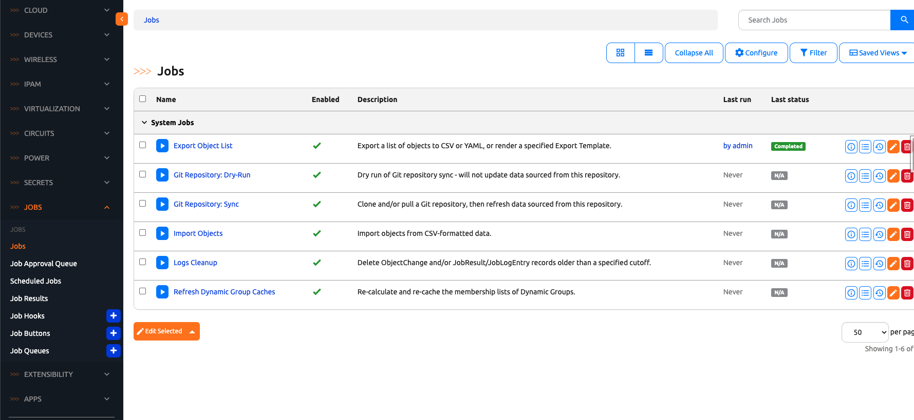
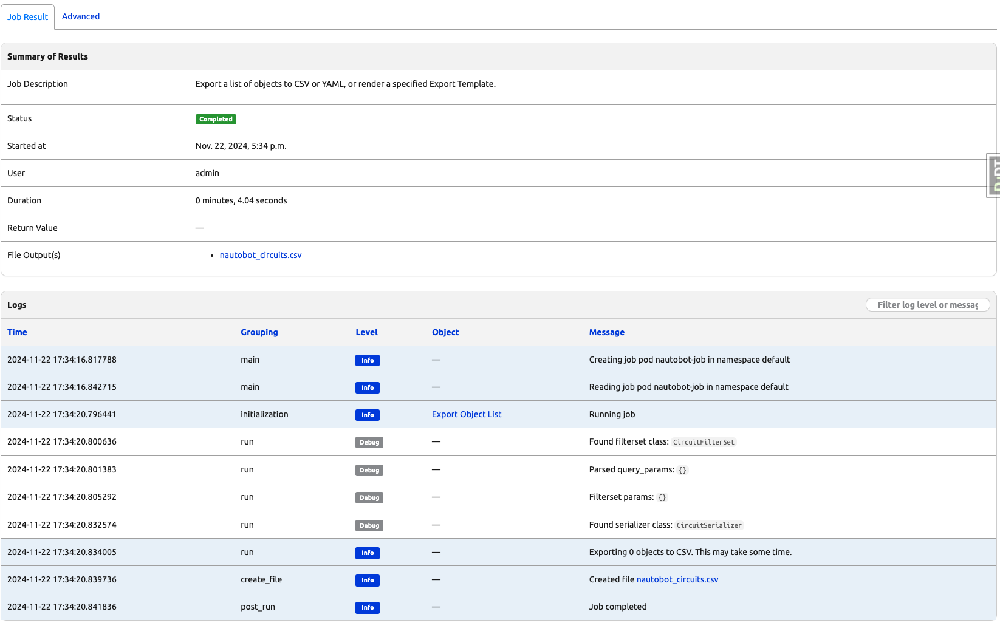

# Kubernetes Job Support

+++ 2.4.0

## When to Use Kubernetes Jobs

Kubernetes job support was added in Nautobot v2.4.0 to provide an alternative for job execution for Nautobot in Kubernetes deployments. Presently, running Nautobot jobs with Celery and Celery workers within a Kubernetes deployment has several potential downsides. To list a few:

1. Resource Allocation Issues: Celery workers require resource allocation (CPU/Memory). Although Kubernetes allows for limits and requests, under-allocation of resources can cause crashes, while over-allocation can be quite wasteful
2. In some environments with resource contention, Kubernetes may evict pods with Celery workers, leading to task loss or interruptions.
3. If a Celery worker pod crashes or is terminated, any in-progress tasks without any retry mechanisms can be lost and their results untraceable.

So if you have any concerns with running Celery workers in your Kubernetes deployment, executing jobs with Kubernetes might be for you.

## How to Use Kubernetes Jobs

Consult the documentation from the offical [Kubernetes page](https://kubernetes.io/docs/home/) and learn how to set up a simple Kubernetes cluster with pods running Nautobot containers in your own development environment from this [doc](../../../development/core/kubernetes-job-support.md).

Once you have the correct environment setup, executing Kubernetes job would just be as simple as assigning a [job queue](../jobs/jobqueue.md) with type "Kubernetes" and running the job on it. Below is a detail guide on how you can do that in Nautobot.

### Configure a New Job Queue of Type Kubernetes

Go to the Navigation bar on your left hand side and look at the Jobs Section. You should see Job Queues at the very end of the section. Click on the plus button next to the Job Queues entry and this will take you to a form for creating a new job queue.


You can give the name "kubernetes" to the new job queue and select "Kubernetes" from the Queue Type dropdown.


Scroll down and click on the create button. A new Job Queue with name "kubernetes" and with type Kubernetes should be created.


### Assign that Job Queue to a Job

Go to a Job's edit form and assign the newly created kubernetes job queue to the job. You will be using the "Export Object List" system job here.



Check the override default value checkbox on the `Job Queues` field and select the Kubernetes job queue from the dropdown.
Check the override default value checkbox on the `Default Job Queue` field and select the Kubernetes job queue from the dropdown.


Click on the update button when you are finished.

### Run the Job

After clicking on the update button after the previous step, you should be redirected to the table of jobs. Click on the link that says "Export Object List". This should take you to the Job Run Form.


Select an option for the Content Type field dropdown and notice that the Job queue is already filled out with the Kubernetes job queue that you assigned to this job from previous steps. So you do not need to make any changes there.


Click on the "Run Job Now" button and you should be directed to the job result page.


### Inspect the Job Result

You can inspect the job result and the job logs in this page. Notice the two job log entries that reads something like "Creating job pod (pod-name) in namespace default" and Reading job pod (pod-name) in namespace default". Those entries indicate that a Kubernetes Job pod was executing the job for you.



## High Level Flow of Kubernetes Components

Below are diagrams that describe the kubernetes components and their interactions with each other during the three stages of job execution.

Before the Job Execution:

```bash
NAME                               READY   STATUS    RESTARTS   AGE
pod/celery-beat-6fb67477b7-rsw62   1/1     Running   3          1h
pod/db-8687b48964-gtvtc            1/1     Running   3          1h
pod/nautobot-679bdc765-hl72m       1/1     Running   0          1h
pod/redis-7cc58577c-tl5sq          1/1     Running   4          1h

NAME                 TYPE        CLUSTER-IP      EXTERNAL-IP   PORT(S)    AGE
service/db           ClusterIP   10.111.0.30     <none>        5432/TCP   1h
service/nautobot     ClusterIP   10.106.32.53    <none>        8080/TCP   1h
service/redis        ClusterIP   10.102.99.143   <none>        6379/TCP   1h

NAME                          READY   UP-TO-DATE   AVAILABLE   AGE
deployment.apps/celery-beat   1/1     1            1           1h
deployment.apps/db            1/1     1            1           1h
deployment.apps/nautobot      1/1     1            1           1h
deployment.apps/redis         1/1     1            1           1h
```


During job execution, your Nautobot pod will create a new job result and spin up a new Kubernetes job and job pod that shares the same redis and db instances as your Nautobot pod. The Kubernetes job pod will execute the job locally and made modifications to the job result.

```bash
NAME                                                          READY   STATUS    RESTARTS   AGE
pod/celery-beat-6fb67477b7-rsw62                              1/1     Running   3          1h
pod/db-8687b48964-gtvtc                                       1/1     Running   3          1h
pod/nautobot-679bdc765-hl72m                                  1/1     Running   0          1h
pod/nautobot-job-11892564-b0b6-4d5b-8fd1-02a88c85f501-cw4v9   1/1     Running   0          2s
pod/redis-7cc58577c-tl5sq                                     1/1     Running   4          1h

NAME                 TYPE        CLUSTER-IP      EXTERNAL-IP   PORT(S)    AGE
service/db           ClusterIP   10.111.0.30     <none>        5432/TCP   1h
service/kubernetes   ClusterIP   10.96.0.1       <none>        443/TCP    1h
service/nautobot     ClusterIP   10.106.32.53    <none>        8080/TCP   1h
service/redis        ClusterIP   10.102.99.143   <none>        6379/TCP   1h

NAME                          READY   UP-TO-DATE   AVAILABLE   AGE
deployment.apps/celery-beat   1/1     1            1           1h
deployment.apps/db            1/1     1            1           1h
deployment.apps/nautobot      1/1     1            1           1h
deployment.apps/redis         1/1     1            1           1h

NAME                                                          STATUS    COMPLETIONS   DURATION   AGE
job.batch/nautobot-job-11892564-b0b6-4d5b-8fd1-02a88c85f501   Running   0/1           2s         2s
```


After the job is executed, the Kubernetes job and job pod will clean themselves up.

```bash
NAME                               READY   STATUS    RESTARTS   AGE
pod/celery-beat-6fb67477b7-rsw62   1/1     Running   3          1h
pod/db-8687b48964-gtvtc            1/1     Running   3          1h
pod/nautobot-679bdc765-hl72m       1/1     Running   0          1h
pod/redis-7cc58577c-tl5sq          1/1     Running   4          1h

NAME                 TYPE        CLUSTER-IP      EXTERNAL-IP   PORT(S)    AGE
service/db           ClusterIP   10.111.0.30     <none>        5432/TCP   1h
service/nautobot     ClusterIP   10.106.32.53    <none>        8080/TCP   1h
service/redis        ClusterIP   10.102.99.143   <none>        6379/TCP   1h

NAME                          READY   UP-TO-DATE   AVAILABLE   AGE
deployment.apps/celery-beat   1/1     1            1           1h
deployment.apps/db            1/1     1            1           1h
deployment.apps/nautobot      1/1     1            1           1h
deployment.apps/redis         1/1     1            1           1h
```


## How to Configure Environment Variables
