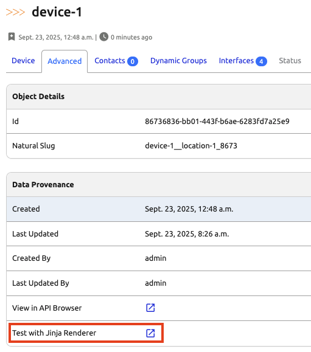
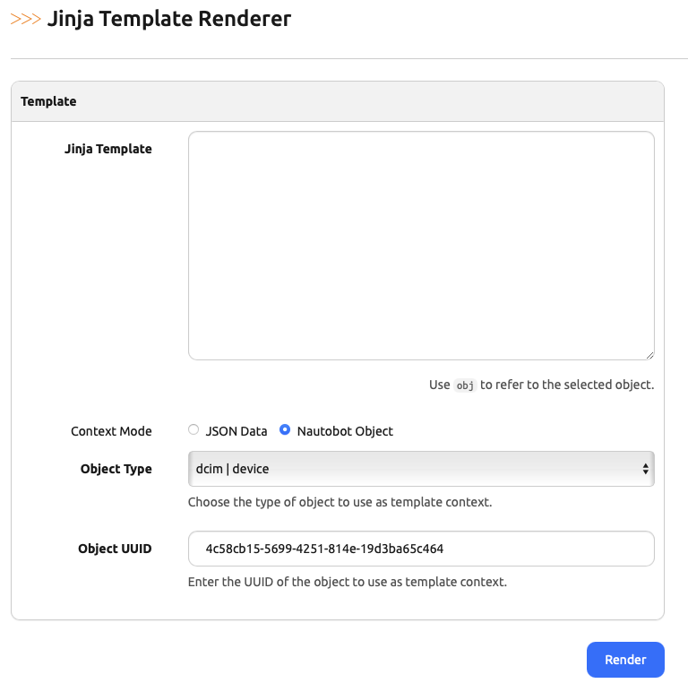

# Rendering Jinja Templates

+++ 2.4.0

Nautobot provides a built-in [Jinja2](https://jinja.palletsprojects.com/) templating engine that can be used to render templates using Nautobot data. This is useful for generating configuration files, reports, or any other text-based output that can be generated from a template. Nautobot uses Jinja2 to render text for multiple features such as [Job Buttons](./jobs/jobbutton.md), [Custom Links](./customlink.md), [Webhooks](./webhook.md), [External Integrations](./externalintegration.md), and more. It's also used by some Nautobot Apps, for example [Golden Config](https://docs.nautobot.com/projects/golden-config/en/latest/) uses Jinja2 to render configuration templates.

## REST API

It's possible to render Jinja2 templates via the Nautobot REST API. You can use the `POST /api/core/render-jinja-template/` endpoint to render a template using Nautobot's Jinja2 environment. The request body should include the template content and the context data to render the template.

```json
{
  "template_code": "Hello, {{ name }}!",
  "context": {
    "name": "World"
  }
}
```

## UI

There is also a UI for rendering Jinja2 templates in the Nautobot web interface. You can access it by navigating to `/render-jinja-template/` or by clicking the "Jinja Renderer" link in the footer of any Nautobot page. The UI provides a form where you can enter the template content and choose between two context modes:

### JSON Data Mode

The default mode allows you to provide custom JSON data as context for your template. This is useful for testing templates with arbitrary data.

### Nautobot Object Mode

The object mode allows you to select a specific Nautobot object (by content type and UUID) to use as the template context. This is useful for testing templates against real objects in your Nautobot database, such as devices, locations, circuits, etc.

#### Context Data

| Variable | Description |
|----------|-------------|
| `obj`      | The selected Nautobot object |
| `debug`    | A boolean indicating whether debugging is enabled |
| `request`  | The current WSGI request |
| `user`     | The current user (if authenticated) |
| `perms`    | The [permissions](https://docs.djangoproject.com/en/stable/topics/auth/default/#permissions) assigned to the user |

All [built-in Jinja2 filters](./template-filters.md) are available and it's also possible to [develop and register a custom Jinja2 filters](../../development/apps/api/platform-features/jinja2-filters.md).

### Quick Access from Object Views

You can quickly test templates against any object by navigating to the object's detail page, clicking on the "Advanced" tab, and selecting "Test with Jinja Renderer":



This will open the Jinja renderer with the object pre-selected:



## Conditional Rendering

Only links which render with non-empty text are included on the page. You can employ conditional Jinja2 logic to control the conditions under which a link gets rendered.

For example, if you only want to display a link for active devices, you could set the link text to

```jinja2
View NMS
```

The link will not appear when viewing a device with any status other than "active."

As another example, if you wanted to show only devices belonging to a certain manufacturer, you could do something like this:

```jinja2
View NMS
```

The link will only appear when viewing a device with a manufacturer name of "Cisco."

!!! note
    To access custom fields of an object within a template, use the `cf` attribute. For example, `{{ obj.cf.color }}` will return the value (if any) for the custom field with a key of `color` on `obj`.


## Examples

### Testing Device Configuration Templates

When working with a device object in object mode, you can test configuration templates:

```jinja2
hostname {{ obj.name }}
!
interface Management1
 description {{ obj.location.name }} - {{ obj.device_type.manufacturer.name }} {{ obj.device_type.model }}

 ip address {{ obj.primary_ip4.address }}

!

interface {{ interface.name }}
 description {{ interface.description | default }}
 
 ip address {{ interface.ip_addresses.first().address }}
 
!

```

### Testing Custom Link Templates

Test custom link URL generation with real object data:

```jinja2
https://monitoring.example.com/devices/{{ obj.name | lower | replace(' ', '-') }}
```

### REST API with Object Context

The REST API also supports object-based context by providing both `content_type` and `object_uuid` instead of `context`:

```json
{
  "template_code": "Device {{ obj.name }} is located in {{ obj.location.name }}",
  "content_type": "dcim.device",
  "object_uuid": "123e4567-e89b-12d3-a456-426614174000"
}
```

When rendering Jinja templates through the REST API endpoint or UI, the template will have access to all [Django-provided Jinja2 filters](https://docs.djangoproject.com/en/4.2/ref/templates/builtins/#built-in-filter-reference), [Nautobot-specific filters](./template-filters.md), and any [custom filters](https://docs.djangoproject.com/en/4.2/howto/custom-template-tags/#writing-custom-template-filters) that have been registered in the Django Jinja2 environment.
