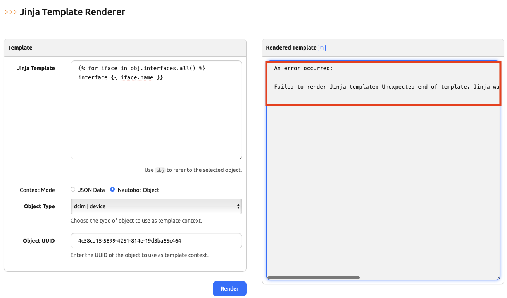

# Rendering Jinja Templates

+++ 2.4.0

Nautobot provides a built-in [Jinja2](https://jinja.palletsprojects.com/) templating engine that can be used to render templates using Nautobot data. This is useful for generating configuration files, reports, or any other text-based output that can be generated from a template. Nautobot uses Jinja2 to render text for multiple features such as [Job Buttons](./jobs/jobbutton.md), [Custom Links](./customlink.md), [Webhooks](./webhook.md), [External Integrations](./externalintegration.md), and more. It's also used by some Nautobot Apps, for example [Golden Config](https://docs.nautobot.com/projects/golden-config/en/latest/) uses Jinja2 to render configuration templates.

To assist with developing and testing Jinja templates, Nautobot provides the capability to render an arbitrary template via the REST API and the UI. Two context modes are supported:

1. In JSON mode, you can provide a JSON data structure defining the context for the template. This is useful for testing templates with arbitrary data.
2. In object mode, you can provide any single Nautobot object (that you have access permissions for) as the context for the template. The Django representation of that object will be provided to the template as `obj` and will function similarly to the [Computed Field Template Context](./computedfield.md#computed-field-template-context).

Whether rendering Jinja templates through the REST API endpoint or the UI, the template will have access to all [Django-provided Jinja2 filters](https://docs.djangoproject.com/en/4.2/ref/templates/builtins/#built-in-filter-reference), [Nautobot-specific filters](./template-filters.md), [App-provided Jinja2 filters](../../development/apps/api/platform-features/jinja2-filters.md), and any other [custom filters](https://docs.djangoproject.com/en/4.2/howto/custom-template-tags/#writing-custom-template-filters) that have been registered in the Django Jinja2 environment.

## REST API

It's possible to render Jinja2 templates via the Nautobot REST API. You can use the `POST /api/core/render-jinja-template/` endpoint to render a template using Nautobot's Jinja2 environment.

When using JSON data mode, the request body should include the template content and the context data to render the template.

```json
{
  "template_code": "Hello, {{ name }}!",
  "context": {
    "name": "World"
  }
}
```

When using object mode, the request body should include the template content, the content type of the object to render, and the UUID of the object to render.

```json
{
  "template_code": "{{ obj.name }}",
  "content_type": "dcim.device",
  "object_uuid": "c2c80545-6b3d-4882-ab4d-f23bc2a135e6"
}
```

The content type can be specified in the REST API either as a string (for example, `"dcim.device"`) or as the integer ID of the content-type, (for example, `3`).

## UI

There is also a UI for rendering Jinja2 templates in the Nautobot web interface. You can access it by navigating to `/render-jinja-template/` or by clicking the "Jinja Renderer" link in the footer of any Nautobot page. The UI provides a form where you can enter the template content and choose between the two context modes.

### Quick Access from Object Views

You can quickly test templates against any object by navigating to the object's detail page, clicking on the "Advanced" tab, and selecting "Test with Jinja Renderer":


This will open the Jinja renderer with the object pre-selected:


### Debugging Template Issues

If a template fails to render, the reason for the failure will be displayed in "Rendered Template" section of the UI:



## Examples

### Testing Device Configuration Templates

When working with a device object in object mode, you can test configuration templates:

```jinja2
hostname {{ obj.name }}
!
interface Management1
 description {{ obj.location.name }} - {{ obj.device_type.manufacturer.name }} {{ obj.device_type.model }}

 ip address {{ obj.primary_ip4.address }}

!

interface {{ interface.name }}
 
 description {{ interface.description | default }}
 
 
 ip address {{ interface.ip_addresses.first().address }}
 
!

```

If you find you need to add/remove whitespace from the rendered output, the [Jinja2 Documentation](https://jinja.palletsprojects.com/en/stable/templates/#whitespace-control) documentation has details on this.

### Testing Custom Link Templates

Test custom link URL generation with real object data:

```jinja2
https://monitoring.example.com/devices/{{ obj.name | lower | replace(' ', '-') }}
```
