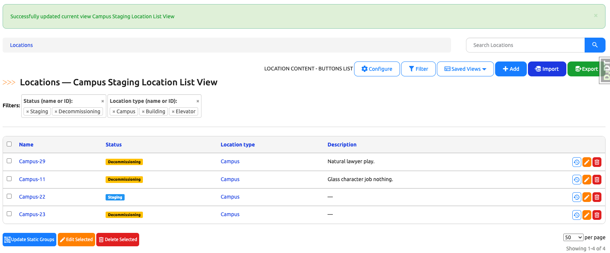
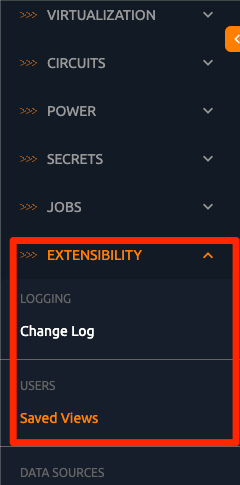

# Saved Views

+++ 2.3.0

Saved Views give users the ability to save multiple configurations of list views, including table columns, filtering, pagination, and sorting, for ease of later use and reuse.

The essential attributes for a Saved View are `owner`, `name`, `view`, `is_shared` and `is_global_default`. The `owner` attribute links to the user account that created the Saved View. The `view` attribute refers to the specific list view from which the Saved View is derived, such as `dcim:device_list` or `circuits:circuit_list`.
The `is_shared` attribute dictates whether a Saved View will be made available for other users to select. The `is_global_default` attribute (which may be set on a single Saved View per list view) makes this Saved View the default for all users of the system unless they specifically set their own default view (more on this below).

When a user creates a new Saved View, the `owner` and `view` attributes are automatically populated. The user only needs to provide the `name` attribute, which, in combination with owner and view, must form a unique set and set the `is_shared` attribute.

The `config` attribute holds the configuration of the list view, stored as a `dictionary`. For example, a configuration for the list view `dcim:location_list` might appear as follows:

```json
{
    "filter_params": {
        "location_type": [
            "Campus",
            "Floor",
            "Building"
        ],
        "status": [
            "Active"
        ]
    },
    "pagination_count": 50,
    "sort_order": [
        "name"
    ],
    "table_config": {
        "LocationTable": {
            "columns": [
                "name",
                "status",
                "location_type",
                "parent",
                "tenant",
                "description",
                "facility",
                "asn",
                "tags"
            ]
        }
    }
}
```

Below is a user guide on how to create, update, save and use Saved Views in Nautobot.

## When to use Saved Views

This feature gives users the ability to save multiple list view configurations (table columns, filtering, pagination and sorting) into Saved View instances for ease of access during later use and reuse.

## How to use Saved Views

### How to create a new Saved View

Navigate to any saved-view-supported model's list view. (We will use Location List View for the purpose of this guide)

Note that there is a "Saved Views" dropdown button in the group of buttons on the right hand side.


Configure the list view to your liking by clicking on the "Filter" and/or "Configure" buttons on the right hand side. You can also change the pagination from the dropdown on the bottom right side of the table and sort by a sortable column by clicking on the column header.


Once you are satisfied with the current list view configurations, click on the "Saved Views" dropdown button. There should be an option in the dropdown menu named "Save As New View".


Click the "Save As New View" option, a modal should appear to prompt you to give a name to your new Saved View and decide whether to make this Saved View available to other users.

In this example, we will name this new Saved View "Campus Staging Location List View" and make this view public (shared with other users).


Click the "Save" button on the modal and the browser should take you to the new Saved View. Note the success banner on top of the page stating "Successfully created new Saved View Campus Staging Location List View". Note that the current Saved View name also appeared in the page heading. This is an indicator that you are currently viewing a Saved View.


Click the "Saved Views" dropdown button again and you should see your new Saved View's name and a new option "Update Current View" populated in the dropdown menu.


### How to update an existing Saved View

Stay on the same page where we just created the new Saved View and make some modifications to the view.

Note that the title font of the Saved View became italicized. This is an indicator that this Saved View currently has unsaved changes.


Click the "Saved Views" dropdown button and you should now see the option "Update Current Saved View".

Click "Update Current Saved View" option and the page should refresh and you should see the success banner on top of the page stating "Successfully updated current view Campus Staging Location List View".

Congratulations, you have successfully updated your Saved View!



### How to navigate Saved Views

There are several ways you can navigate Saved Views. As we've already seen, any given model list view has a "Saved Views" button, which opens a dropdown showing all Saved Views that you have access to for this view (those that you have created, and those that other users have created and shared). The Saved View that you're currently using will be highlighted in bold.


Additionally, if you have the `extras:view_savedview` object permission (or are a superuser), you can view a table of all Saved Views created by any user for any list view, accessible from the navigation menu under "Extensibility -> Saved Views":



### How to set a Saved View as global default for all users

Users with the `extras:view_savedview` and `extras:change_savedview` object permissions can set a Saved View as the default for all users for any given object list view. There can only be one global default for each object list view.


Clicking on the edit button will direct you to a standard edit view where you can edit the `name`, `is_shared` and `is_global_default` attributes of the current Saved View.


Check the box for `is_global_default` and click on the Update button.

You should be redirected to the Saved View list view with a success message. Now all users without a default view of their own will be directed to the selected Saved View when they access the given list view.


### How to hide a Saved View from all other users but yourself

In order to create a Saved View only for yourself to see, you should make sure that you uncheck the box for `is_shared` when you are creating a new Saved View. This will make sure that you are the only who is able to see this Saved View.


As an admin or a user with the appropriate permissions, you can also edit the `is_shared` attribute from Saved View Edit View. Make sure to uncheck both the `is_shared` box and the `is_global_default` box as a global default view will be automatically made as public to all users.


After the Saved View is updated, we can log in as a **different** user and see that this Saved View is not available in the Saved View dropdown of the ObjectListView.


### How to set a user-specific default Saved View

You can also set a Saved View as default for an object list view for yourself, overriding the global default. You can set a view as default by navigate to the view from the Saved View dropdown, for example, "Elevator Only Location List View". Clicking on the Saved Views dropdown again, you should be able to see the option named "Set As My Default".


Clicking on that option will set the current Saved View as your default view for this object list view. The page should refresh with a success message. Now whenever you access the Location list view, this Saved View will automatically be applied to it.


### How to clear configurations on a Saved View

The current Saved View will have a checkmark next to its name in the dropdown menu. Clicking this menu item (deselecting the current Saved View) will direct you back to the default object list view with no Saved View applied.


