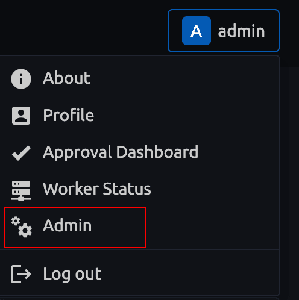
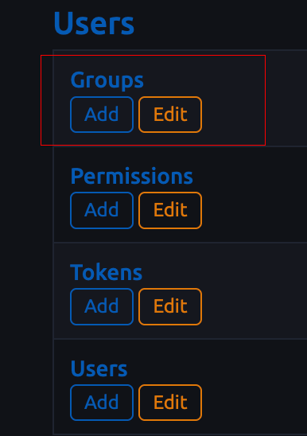
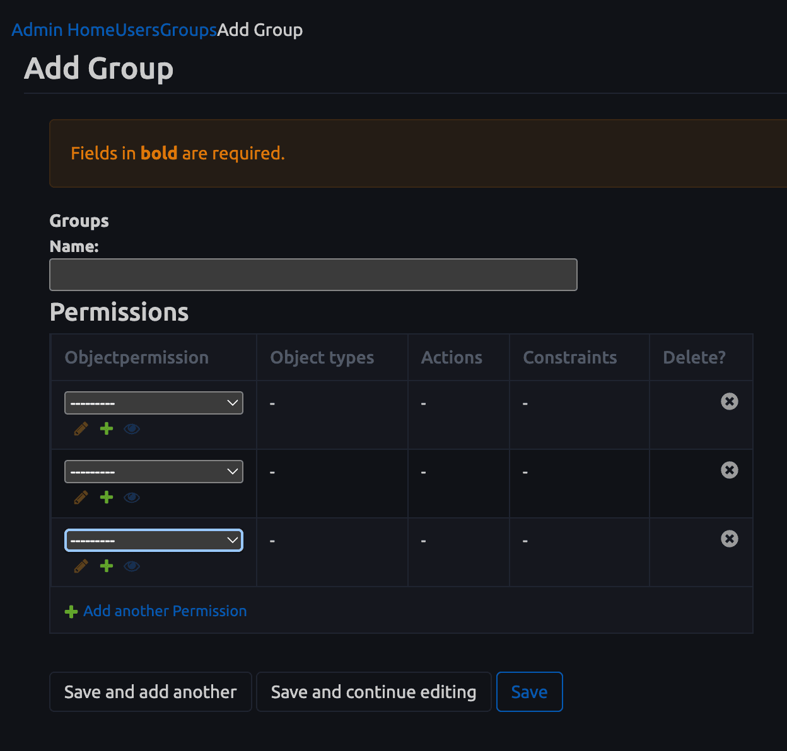

# User Groups

User Groups allow you to organize users into collections that share common permissions and can be assigned to approval workflows.

## Accessing User Groups

1. Open the **User dropdown menu** in the top-right corner and select **Admin**.  
   

2. In the **Users** section, select **Groups > Add** or **Groups > Edit**.  
   

## Adding a Group

1. Click **Add Group**.  
2. Enter a **Group Name**.  
3. Assign one or more **Permissions** to the group.  
    - Each permission defines what actions members of this group can perform on specific object types.  
    - For details on creating and managing permissions, see [Permissions](./objectpermission.md).  

   

## Using Groups

- Groups are typically referenced in [Approval Workflow Stage Definitions](../approval-workflow.md#approvalworkflowstagedefinition) to control which users are eligible approvers for a given stage.  
- A user must belong to the specified approver group *and* have the required permissions in order to approve or deny workflow stages.
