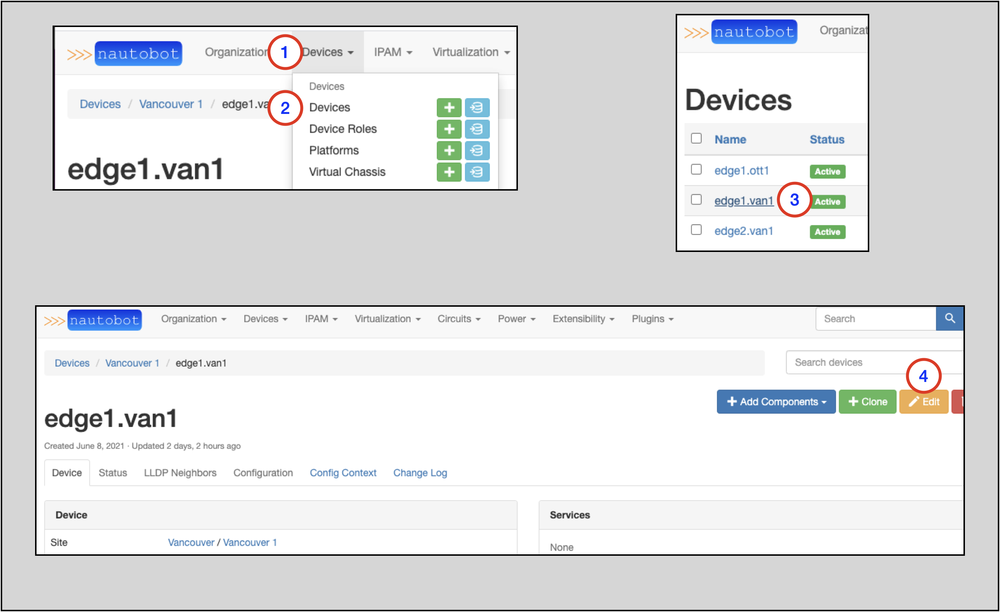

# Getting Nautobot Up and Running in the Web UI

## Introduction and Scope
The audience for this user guide is a user new to Nautobot. 
It is intended to assist the user with:
* Understanding the prerequisites to adding a new Device
* Creating the necessary prerequisite objects to add a new Device
* Adding new Devices
* Adding and understanding Regions
* Adding and Understanding Platforms
* Adding and Understanding Tenants and Tenant Groups
* Adding and Interfaces to a Device
* Adding VLANs and Understanding VLAN Groups
* Understanding IP Address Management (IPAM) in Nautobot

## Requirements
1. A functional Nautobot installation
2. Administrative rights in the Nautobot Web UI

## Creating Devices in Nautobot

A network Device in Nautobot has a few required attributes:
* A Device Role
* A Device Type
  * A Device Type requires a Manufacturer
* A Site

Looking at the list above, there are four objects in Nautobot that must be present prior to creating a related Device.
The following sections will guide you through how to create each object type.

### Creating a Device Role
To create a new Device, you will need an existing Device Role or need to create a new Device Role instance.

To create a new Device Role:
1. Click on **Devices** in the top navigation menu
2. Find **Device Roles** on the drop-down menu
3. Select `+`
4. In the `Add a new device role` form, populate a Name
    * The Slug will auto-populate based on the Name, but can be manually overwritten
5. Click on Create    

### Creating a Manufacturer
To create a new Device Type, you will need an existing Manufacturer or need to create a new Manufacturer instance.

To create a new Manufacturer:
1. Click on **Devices** in the top navigation menu
2. Find **Manufacturers** on the drop-down selector
3. Select `+`
4. In the `Add a new manufacturer` form, populate the Name
     * The Slug will auto-populate based on the Name, but can be manually overwritten
5. Click on **Create**

### Create a Device Type
To create a new Device, you will need an existing Device Type or need to create a new Device Type instance.

To create a new Device Type:
1. Click on **Devices** in the top navigation menu
2. Find **Device Types**
3. Select `+`

On the `Add a new device type` form
4. Select the Manufacturer from the drop-down selector
5. Select the Model from the drop-down selector
6. Click on **Create**

### Create a Site
To create a new Device, you will need an existing Site or need to create a new Site instance.

To create a new Site:
1. Click on **Organization** in the top navigation menu
2. Find **Sites**
3. Select `+`

On the `Add a new site` form:
4. Populate the Site's Name
    * The Slug will auto-populate based on the Name, but can be manually overwritten
5. Set the Status to `Active` in the drop-down selector
6. Click on **Create** at the bottom of the form (not shown)

### Creating a Device
To create a new Device:
1. Click on **Devices** in the top navigation menu
2. Find **Devices**
3. Select `+`

On the `Add a new device` form:
4. Populate the Name
5. Select the Device Role from the drop-down selector
6. Select the Device Type from the down-down selector
7. Select the Site from the drop-down selector
8. Set the Status to the appropriate value in the drop-down selector
9. Click on **Create** at the bottom of the form (not shown)

## Creating Regions

Regions are administrative domains, used to organize Sites and other Regions. They can be nested recursively.
A Region might represent a continent, country, city, campus, or other area. A Region can contain Sites and other Regions.

Additional information on Regions is in the [Regions section of the Nautobot documentation](https://nautobot.readthedocs.io/en/latest/models/dcim/region/).

In the following exercise, we will create three Regions:
* North America
  * Intended to hold Regions that represent each component country 
* Canada
  * Intended to hold Regions that represent markets in Canada
* Vancouver
  * Intended to hold Sites within the Vancouver market
    
To view existing Regions:
1. Click on **Organization** in the top memu
2. Click on **Regions** in the **Organization** drop-down menu
    * From this page you can view any existing Regions
3. Click on the blue `+ Add` button    

The screenshots below show the creation of each Region.

North America:
1. Leave the Parent blank; **North America** will be a top-tier Region
2. Populate the Name
    * The Slug will auto-populate based on the Name, but can be manually overwritten
3. Click on the `Create` or `Create and Add Another` button

Canada:
1. Select **North America** as the Parent from the drop-down menu selector
2. Populate the Name
    * The Slug will auto-populate based on the Name, but can be manually overwritten   
3. Click on the `Create` or `Create and Add Another` button

Vancouver:
1. Select **Canada** as the Parent from the drop-down menu selector
2. Populate the Name
    * The Slug will auto-populate based on the Name, but can be manually overwritten
3. Click on the `Create` or `Create and Add Another` button

## Adding a Site to a Region

It's quite easy to add an existing Site to a Region.

To access the page where you can modify a Site:
1. Click on **Organization** in the top navigation menu
2. Click on **Sites** in the drop-down menu
3. The **Sites** page will appear; click on the specific Site you want to modify (`Vancouver 1` in this example shown).
4. On the page for the Site, click on the `Edit` button 

Once you're on the `Editing site` form:
1. Look for the **Region** drop-down selection menu and select the appropriate Region
2. Observe that the correct region for the Site is selected
3. Click on the `Update` button

The page for the Site you updated will appear again, showing the updated Region hierarchy for the Site.

> NOTE: In the example, notice that we assigned the `Vancouver 1` Site to `Vancouver`, which is tier-3 Region. 
> Notice that the Regional hierarchy is displayed for the `Vancouver 1` Site: `North America/Canada/Vancouver`

## Platforms

A Platform object can hold various information about a device, such as the OS, OS version, and NAPALM driver.

Further information is available in the [Platforms](https://nautobot.readthedocs.io/en/latest/models/dcim/platform/) section of the Nautobot docs.

While use of Platforms is optional, they provide great value in many use cases.

To add a Platform:
1. Click on **Devices** in the top navigation menu
2. Find **Platforms** and click on the `+` icon in the menu

Once on the `Add a new platform` form:
3. Provide a Name (required)
4. The Slug will auto-populate based on the Name you provide; you may override this if necessary
5. Select a Manufacturer from the drop-down selector (optional)
6. Provide the name of the NAPALM driver ** (optional) (Note: this must be the exact name of the NAPALM driver)
7. Provide NAPALM arguments (optional)
8. Provide description (optional)
9. Click on the `Create` button

> TIP: NAPALM Driver Options include:
> - eos (Arista)
> - ios (Cisco)
> - nxos (used with nxapi feature)
> - nxos_ssh (used for ssh login)
> - junos 

Once completed, you will be sent to the Platforms page, where all the Platform variants are shown.

> TIP: Different use cases for Platforms may require different information. For example, to use a specific Platform with 
> the Device Onboarding Plugin, you may be required to override the default Slug value with that of the 
> Netmiko [device_type](https://github.com/ktbyers/netmiko/blob/2dc032b64c3049d3048966441ee30a0139bebc81/netmiko/ssh_autodetect.py#L50)

## Tenants

A 'Tenant' signifies ownership of an object in Nautobot and as such, any object may only have a single Tenant assigned.

More information on Tenants can be found in the [Tenants](https://nautobot.readthedocs.io/en/latest/models/tenancy/tenant/) section of the Nautobot docs.

To create a Tenant:
1. Click on **Devices** on the top navigation menu
2. Find **Platforms** and click on the `+`
3. Populate the Name
4. The Slug will auto-populate based on the Name you provide, but this can be manually overwritten
5. Click the `Create` button

### Assigning a Tenant to an Object

It is simple to assign a Tenant to an existing object. This next example will add a Tenant to an existing Device.

1. Click on **Devices** in the top navigation menu
2. Look for the **Devices** option and click on it; this will take you to the Devices page
3. Click on the specific Device you want to add the Tenant to; this will take you to the main page for that Device
4. On the specific Device page, click on the `Edit` button

Once on the page to edit the Device:
1. Make a selection from the **Tenant** drop-down menu selector
2. Click the `Update` button

This will take you back to the main page for the Device.

Notice that the **Tenant** field is now populated/updated.

