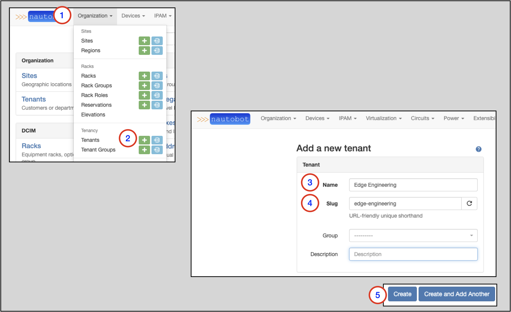
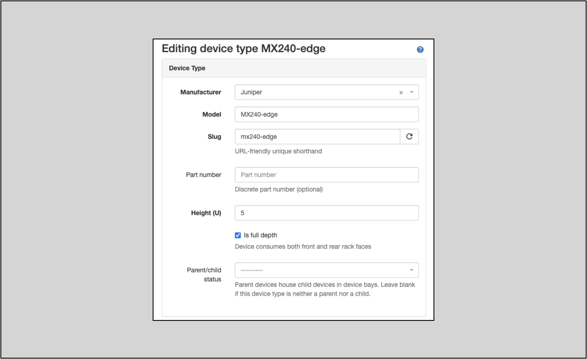
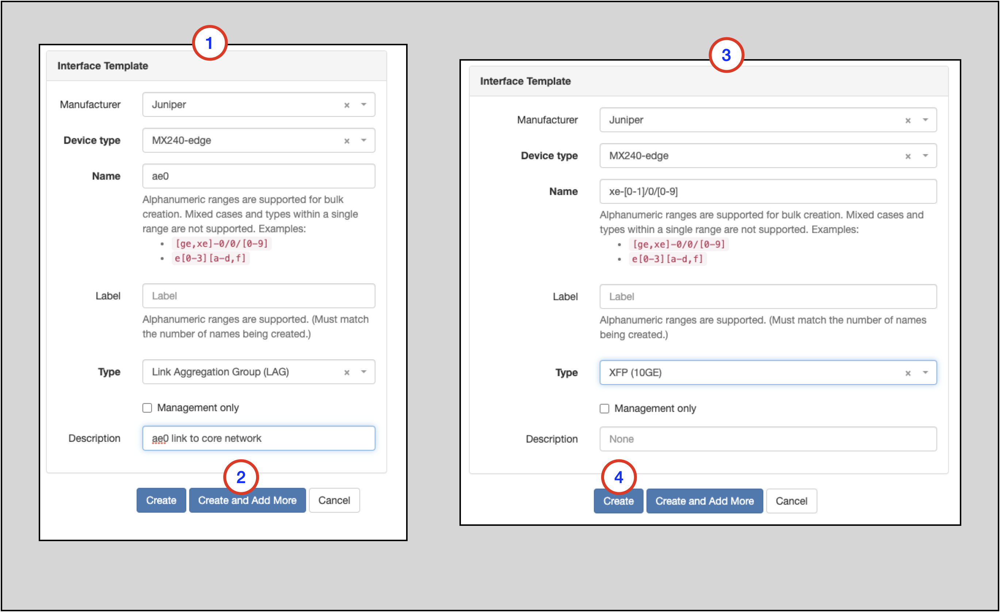
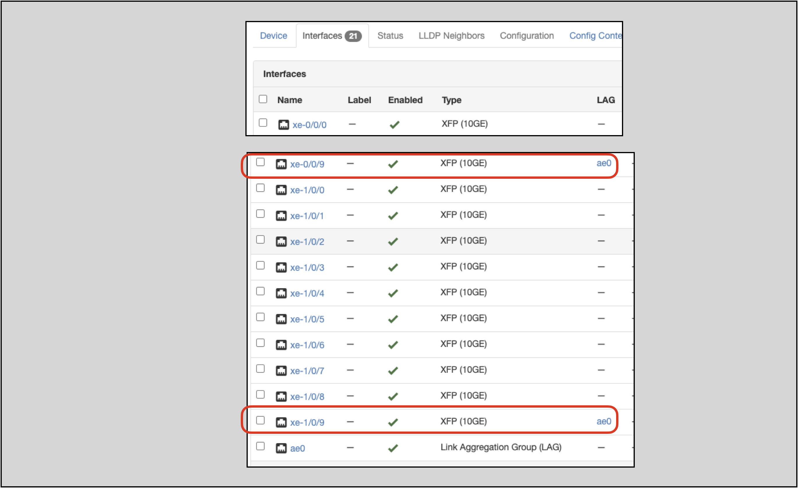
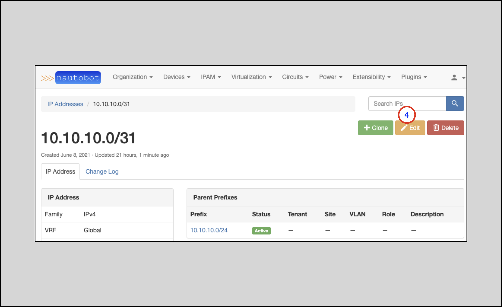
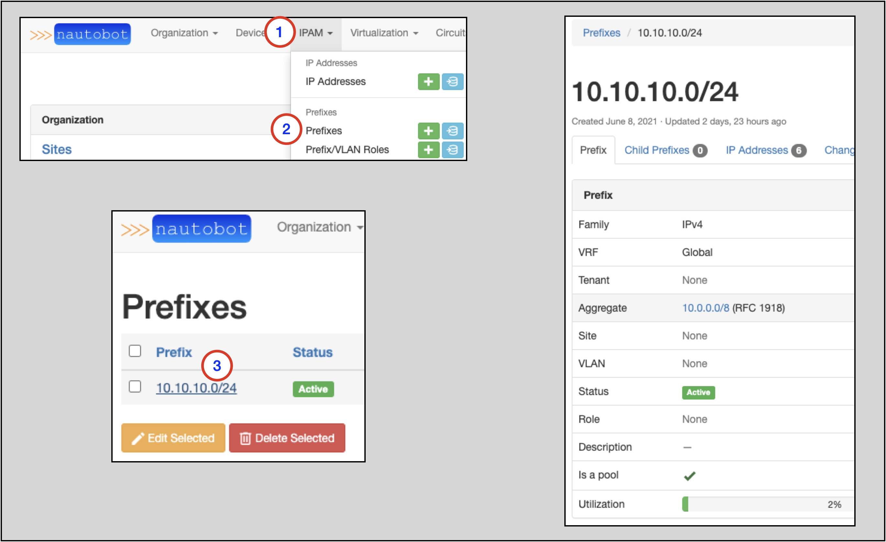
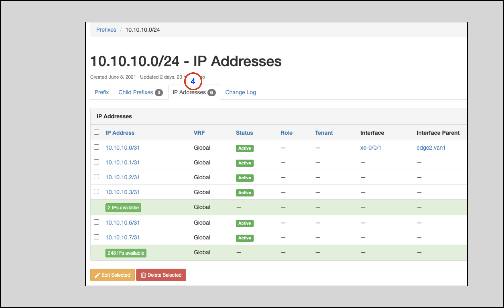

# Getting Nautobot Up and Running in the Web UI

## Introduction and Scope
The audience for this user guide is a user new to Nautobot. 
It is intended to assist the user with:
* Understanding the prerequisites to adding a new Device
* Creating the necessary prerequisite objects to add a new Device
* Adding new Devices
* Adding and understanding Regions
* Adding and Understanding Platforms
* Adding and Understanding Tenants and Tenant Groups
* Adding and Interfaces to a Device
* Adding VLANs and Understanding VLAN Groups
* Understanding IP Address Management (IPAM) in Nautobot

## Requirements
1. A functional Nautobot installation
2. Administrative rights in the Nautobot Web UI

## Creating Devices in Nautobot

A network Device in Nautobot has a few required attributes:
* A Device Role
* A Device Type
  * A Device Type requires a Manufacturer
* A Site

Looking at the list above, there are four objects in Nautobot that must be present prior to creating a related Device.
The following sections will guide you through how to create each object type.

### Creating a Device Role
To create a new Device, you will need an existing Device Role or need to create a new Device Role instance.

To create a new Device Role:
1. Click on **Devices** in the top navigation menu
2. Find **Device Roles** on the drop-down menu
3. Select `+`
4. In the `Add a new device role` form, populate a Name
    * The Slug will auto-populate based on the Name, but can be manually overwritten
5. Click on Create    

### Creating a Manufacturer
To create a new Device Type, you will need an existing Manufacturer or need to create a new Manufacturer instance.

To create a new Manufacturer:
1. Click on **Devices** in the top navigation menu
2. Find **Manufacturers** on the drop-down selector
3. Select `+`
4. In the `Add a new manufacturer` form, populate the Name
     * The Slug will auto-populate based on the Name, but can be manually overwritten
5. Click on **Create**

### Create a Device Type
To create a new Device, you will need an existing Device Type or need to create a new Device Type instance.

To create a new Device Type:
1. Click on **Devices** in the top navigation menu
2. Find **Device Types**
3. Select `+`

On the `Add a new device type` form
4. Select the Manufacturer from the drop-down selector
5. Select the Model from the drop-down selector
6. Click on **Create**

### Create a Site
To create a new Device, you will need an existing Site or need to create a new Site instance.

To create a new Site:
1. Click on **Organization** in the top navigation menu
2. Find **Sites**
3. Select `+`

On the `Add a new site` form:
4. Populate the Site's Name
    * The Slug will auto-populate based on the Name, but can be manually overwritten
5. Set the Status to `Active` in the drop-down selector
6. Click on **Create** at the bottom of the form (not shown)

### Creating a Device
To create a new Device:
1. Click on **Devices** in the top navigation menu
2. Find **Devices**
3. Select `+`

On the `Add a new device` form:
4. Populate the Name
5. Select the Device Role from the drop-down selector
6. Select the Device Type from the down-down selector
7. Select the Site from the drop-down selector
8. Set the Status to the appropriate value in the drop-down selector
9. Click on **Create** at the bottom of the form (not shown)

## Creating Regions

Regions are administrative domains, used to organize Sites and other Regions. They can be nested recursively.
A Region might represent a continent, country, city, campus, or other area. A Region can contain Sites and other Regions.

Additional information on Regions is in the [Regions section of the Nautobot documentation](https://nautobot.readthedocs.io/en/latest/models/dcim/region/).

In the following exercise, we will create three Regions:
* North America
  * Intended to hold Regions that represent each component country 
* Canada
  * Intended to hold Regions that represent markets in Canada
* Vancouver
  * Intended to hold Sites within the Vancouver market
    
To view existing Regions:
1. Click on **Organization** in the top memu
2. Click on **Regions** in the **Organization** drop-down menu
    * From this page you can view any existing Regions
3. Click on the blue `+ Add` button    

The screenshots below show the creation of each Region.

North America:
1. Leave the Parent blank; **North America** will be a top-tier Region
2. Populate the Name
    * The Slug will auto-populate based on the Name, but can be manually overwritten
3. Click on the `Create` or `Create and Add Another` button

Canada:
1. Select **North America** as the Parent from the drop-down menu selector
2. Populate the Name
    * The Slug will auto-populate based on the Name, but can be manually overwritten   
3. Click on the `Create` or `Create and Add Another` button

Vancouver:
1. Select **Canada** as the Parent from the drop-down menu selector
2. Populate the Name
    * The Slug will auto-populate based on the Name, but can be manually overwritten
3. Click on the `Create` or `Create and Add Another` button

## Adding a Site to a Region

It's quite easy to add an existing Site to a Region.

To access the page where you can modify a Site:
1. Click on **Organization** in the top navigation menu
2. Click on **Sites** in the drop-down menu
3. The **Sites** page will appear; click on the specific Site you want to modify (`Vancouver 1` in this example shown).
4. On the page for the Site, click on the `Edit` button 

Once you're on the `Editing site` form:
1. Look for the **Region** drop-down selection menu and select the appropriate Region
2. Observe that the correct region for the Site is selected
3. Click on the `Update` button

The page for the Site you updated will appear again, showing the updated Region hierarchy for the Site.

> NOTE: In the example, notice that we assigned the `Vancouver 1` Site to `Vancouver`, which is tier-3 Region. 
> Notice that the Regional hierarchy is displayed for the `Vancouver 1` Site: `North America/Canada/Vancouver`

## Platforms

A Platform object can hold various information about a device, such as the OS, OS version, and NAPALM driver.

Further information is available in the [Platforms](https://nautobot.readthedocs.io/en/latest/models/dcim/platform/) section of the Nautobot docs.

While use of Platforms is optional, they provide great value in many use cases.

To add a Platform:
1. Click on **Devices** in the top navigation menu
2. Find **Platforms** and click on the `+` icon in the menu

Once on the `Add a new platform` form:
3. Provide a Name (required)
4. The Slug will auto-populate based on the Name you provide; you may override this if necessary
5. Select a Manufacturer from the drop-down selector (optional)
6. Provide the name of the NAPALM driver ** (optional) (Note: this must be the exact name of the NAPALM driver)
7. Provide NAPALM arguments (optional)
8. Provide description (optional)
9. Click on the `Create` button

> TIP: NAPALM Driver Options include:
> - eos (Arista)
> - ios (Cisco)
> - nxos (used with nxapi feature)
> - nxos_ssh (used for ssh login)
> - junos 

Once completed, you will be sent to the Platforms page, where all the Platform variants are shown.

> TIP: Different use cases for Platforms may require different information. For example, to use a specific Platform with 
> the Device Onboarding Plugin, you may be required to override the default Slug value with that of the 
> Netmiko [device_type](https://github.com/ktbyers/netmiko/blob/2dc032b64c3049d3048966441ee30a0139bebc81/netmiko/ssh_autodetect.py#L50)

## Tenants

A 'Tenant' signifies ownership of an object in Nautobot and as such, any object may only have a single Tenant assigned.

More information on Tenants can be found in the [Tenants](https://nautobot.readthedocs.io/en/latest/models/tenancy/tenant/) section of the Nautobot docs.

To create a Tenant:
1. Click on **Devices** on the top navigation menu
2. Find **Platforms** and click on the `+`
3. Populate the Name
4. The Slug will auto-populate based on the Name you provide, but this can be manually overwritten
5. Click the `Create` button

### Assigning a Tenant to an Object

It is simple to assign a Tenant to an existing object. This next example will add a Tenant to an existing Device.

1. Click on **Devices** in the top navigation menu
2. Look for the **Devices** option and click on it; this will take you to the Devices page
3. Click on the specific Device you want to add the Tenant to; this will take you to the main page for that Device
4. On the specific Device page, click on the `Edit` button

Once on the page to edit the Device:
1. Make a selection from the **Tenant** drop-down menu selector
2. Click the `Update` button

This will take you back to the main page for the Device.

Notice that the **Tenant** field is now populated/updated.

## Interfaces

Interfaces can be added at the **Device** or the **Device Type** level.  Which one you choose depends on your intent.

Interfaces added to an individual Device are for that Device only.
Interfaces added to the Device Type will be applied to all NEW implementations of that Device Type (not existing implementations).  

Which one you select depends on your use case, and in some instances you will need to use both.

### Interface Add Example

Let’s take an example: We want to define a Device Type of MX240-edge.  
This Device Type will have 20x10G (`xe[0-1]/0/[0-9]`) ports and one LAG (`ae0`).  
The following ports will be part of `ae0`: `xe-0/0/9`, `xe-1/0/9`

### Create a Device Type

We are going to use the **Device Type** to achieve part of this goal. Using the **Device Type** will also provide repeatability
because the **Device Type** object also serves as a template. This templating feature is demonstrated in this example.

To use a Device Type:
1. Click on **Devices** in the top navigation menu
2. Click on the **Device Types** option in the drop-down menu
3. On the Device Types page `Add +` a new Device Type
    * Creating a Device Type is very similar to [creating a Device](#creating-a-device)
    * A Device Type requires a **Manufacturer** object to be created prior to creating the Device Type
    * Device Type requires Manufacturer, Model, Slug, and Height values at creation.
    * In this example, name the Device Type `MX240-edge`
    

      
4. On the home page for the specific Device Type, click on `+Add Components` and select `Interfaces`    

You will now see the `Interface Template` form:
1. Add the `ae0` Interface Template
   * `Manufacturer` will auto-populate to the Manufacturer of the Device Type you are editing
   * `Device Type` will auto-populate to the Device Type you are editing
   * Populate a `Name`
   * Select a `Type` of **Link Aggregation Group (LAG)** from the drop-down selector
   * Add a `Description` and Label (optional)
2. Click `Create and Add More`
3. Create the `xe-` Interfaces
   * This example shows bulk creation using ranges in Name
   * Select the appropriate Type from the drop-down selector
4. Click on `Create`    

Clicking the `Create` button will take you back to the home screen for the Device Type you are editing. There, you will
see that the **Interfaces** tab now has the expected 21 Interfaces listed.

> NOTE: As of this writing (Nautobot 1.0.3), Interfaces cannot be assigned in to a LAG in the Device Type template; component
> Interfaces must be designated in the specific instantiation of s Device created from the Device Type 

### Create a New Device Using the Device Type

Create a new Device with these attributes:
* **Name** = `edge2.van1`
* **Device role** select `Customer Edge`
* **Device type** select `Juniper MX240-edge` (this will show up as a fusion of the **Manufacturer** (`Juniper`) for the Device Type and the Device Type (`MX240-edge`) Names)
* **Site** = `Vancouver 1`

On the main screen for the new Device, you will see an **Interfaces** tab with the expected Interfaces from the Device Type template:

> NOTE: **Device Type** properties only apply to **new** instantiations of Devices from the Type; 
> Devices created prior to a modification of the Device Type will not inherit the changes retroactively

### Specify the LAG Components on the Device

As of this writing (Nautobot 1.0.3), LAG component Interfaces cannot be assigned in the Device Type template, so we will
edit this new Device, specifying the component `ae0` Interfaces.

1. On the new Device's main page, select the appropriate Interfaces (`xe-0/0/9` and `xe-1/0/9`) to be added to `ae0` and click on the `Edit` button
2. On the `Editing Interfaces` form, select `ae0` in the **Parent LAG** drop-down selector
3. Click on `Apply`; you will be taken back to the main page for the Device

On the Device's main page, notice that `xe-0/0/9` and `xe-1/0/9` are now assigned to the `ae0` LAG

## VLANS and VLAN Groups

Each VLAN may be assigned to a site, tenant, and/or VLAN group.

Each VLAN must be assigned a status. The following statuses are available by default:
- Active
- Reserved
- Deprecated

In general, VLANs can have overlapping names and IDs. The exception to this is VLANs within a VLAN Group: each VLAN within a group must have a unique ID and name.  
A VLAN Group may be assigned to a specific site, but a group cannot belong to multiple sites. VLANs may be assigned to a specific site as well.

The Nautobot documentation has more info about [VLANs and VLAN Groups](https://nautobot.readthedocs.io/en/latest/core-functionality/vlans/#vlan-management).

### VLAN Example

In the following example, we will create two VLANs with overlapping Names and IDs: ID = `100` and Name = `vlan 100`.
Neither of the vlan 100 instances is assigned to a group, but each of these VLANs is assigned to a different site. 
Assigning a VLAN to a specific site restricts use of that VLAN to the assigned site.

We’ll also create a vlan 200 without a site assignment.

> NOTE: this example will require a Site (`Ottawa 1`) within a Region (`Ottawa`) in the `North America` Region in addition to the `Vancouver 1` Site and `Vancouver` Region created prior. 
> Refer back to the [Create a Site](#create-a-site) and [Create a Region](#creating-regions) sections to do so.

The following example will show:
* Creating a `vlan 200` without a site assignment (*global* scope)
* Creating two VLANs, each with overlapping Names and IDs: ID = `100` and Name = `vlan 100`
  * Neither of the `vlan 100` instances will be assigned to a group, but each of the VLANs will be assigned to a different site (*site-specific* scope)
* How the *site-specific* and *global* scopes affect which VLANs can be assigned on which Devices

#### Creating the VLANs

1. Click on **IPAM** in the top navigation menu
2. Look for the **VLANS** option and click on the `+` to go to the `Add a new VLAN` form
3. Populate **ID** with `200`
4. Populate **Name** with `vlan 200`
5. Select **Status** as `Active`
6. Click on `Create and Add Another` to save and to go to the `Add a new VLAN` form

> NOTE: The required parameters to create a new VLAN are bolded in the `Add a new VLAN` form: **ID**, **Name**, and **Status**

Now we'll create two instances of VLANs, each with **ID** = `100` and **Name** = `vlan 100` and an `Active` **Status**.
The differentiator will be that one instance will be assigned to the `Vancouver 1` Site and the other to the `Ottawa 1` Site.

On the `Add a new VLAN` form:
1. Populate **ID** with `100`
2. Populate **Name** with `vlan 100`
3. Select **Status** as `Active`
4. Select `Vancouver` from the **Region** selector drop-down
5. Select `Vancouver 1` from the **Site** selector drop-down
6. Click on the `Create and Add Another` button

> NOTE: The **Region** drop-down selection in step 4 is optional and only meant to narrow down the options presented in the **Site** drop-down selector in Step 5.
> A VLAN cannot be assigned to a Region.

1. Populate **ID** with `100`
2. Populate **Name** with `vlan 100`
3. Select **Status** as `Active`
4. Select `Ottawa` from the **Region** selector drop-down
5. Select `Ottawa 1` from the **Site** selector drop-down
6. Click on the `Create` button when complete with the second instance

Once you've created the three VLANs and then hit the `Create` button, you will be taken to the **VLANs** main page. On that page, 
you'll see the three VLANs and the Site assignment for each one. Each `vlan 100` instance will have a Site assignment, while
`vlan 200` will not:

#### Assigning VLANs to an Interface

To assign a VLAN to an Interface:
1. Click on **IPAM** on the top-level navigation menu
2. Select **Devices** to go to the Devices main page
3. Click on the name of the Device you wish to add a VLAN to (`edge2.van1`) in this example
4. Click on the `Edit` button for the `xe-0/0/0` Interface to go to the `Editing interface xe-0/0/0` page

5. On the `Editing interface xe-0/0/0` page, set **802.1Q** Mode to `Access` (or whatever mode you need) and then click on the VLAN drop-down selector. Notice that there are two choices:
    * One choice is the `vlan 100` instance specifically assigned to the `Vancouver 1` Site
    * The other choice is `vlan 200`, which was not assigned to a Site, and thus has a global scope
    * The `vlan 100` choice that is assigned to the `Ottawa 1` Site does not show up as an option

## IP Address Management

This next section will demonstrate how to 
- Create a Regional Internet Registry
- Create an aggregate  
- Create assignable IP addresses
- Assign an IP address to an Interface on a Device

These type of operations fall under an umbrella called IP Address Management (IPAM). 
The Nautobot documentation [IPAM section](https://nautobot.readthedocs.io/en/latest/core-functionality/ipam/) has more detail on IPAM and each operation.

### Create a Regional Internet Registry (RIR)

A RIR allocates globally-routable IP address space. There are five RIRs, each responsible for a particular section of the globe.
Nautobot also considers RFCs 1918 and 6589 to be RIR-like because they allocate private IP space.

Nautobot requires any IP allocation be attributed to a RIR.

To create a RIR:
1. Click on **IPAM** in the top-level navigation menu
2. Find **RIRs** and click on the `+`; this takes you to the `Add a new RIR` form
3. Specify the RIR Name
4. The Slug will auto-populate based on the Name you provide, but this default can be manually overwritten
5. There is a checkbox to flag Private (internal use) only
6. Click on the `Create` button

### Create an Aggregate

An aggregate is a consolidated allocation of IP address space, whether it is public or private. An aggregate must map back to a RIR that has allocated the space.

To create an Aggregate:
1. Click on **IPAM** in the top-level navigation menu
2. Find **Aggregates** and click on the `+`; this takes you to the `Add a new aggregate` form
3. Specify the prefix and mask in a `prefix/mask` format
4. Select a RIR from the drop-down selector
5. Click the `Create` button

You will then be taken to the `Aggregates` main page, where you will see the Aggregate you just created.

### Creating a Prefix

A Prefix is an IPv4 or IPv6 network and mask expressed in CIDR notation (e.g. 192.0.2.0/24). 
Prefixes are automatically organized by their parent Aggregates. 
Additionally, each Prefix can be assigned to a particular Site and virtual routing and forwarding instance (VRF). 

To create a prefix:
1. Click on **IPAM** in the top-level navigation menu
2. Look for **Prefixes** and click on the `+`; this will take you to the `Add a new prefix` form
3. Populate the Prefix in CIDR notation
4. Select a Status from the drop-down selector
5. If all addresses in the Prefix are usable, check the `Is a pool` flag
6. Click on the `Create` button (not shown)

### Verify a Prefix in an Aggregate

To view the Prefixes in an Aggregate:
1. Click on **IPAM** in the top-level navigation menu
2. Click on **Aggregates** to go to the Aggregates main page
3. Find the Aggregate you are interested in and click on it
4. On the main page for the specific Aggregate, look for a specific Prefix (`10.10.10.0/24` in this example)

> NOTE: Nautobot will break an Aggregate into the highest-level child Prefixes to carve out user-defined Prefixes

### Create IP Addresses

To create an IP address:
1. Click on **IPAM** in the top-level navigation menu
2. Find **IP Addresses** and click on the `+`; this will take you to the `Add a new IP address` form
3. In this example, we are going to create multiple individual addresses, so click on the `Bulk Create` tab
4. Populate an Address pattern
    * This example uses `10.10.10.[0-1,2-3,6-7]/31` to create 3 non-contiguous /31's 
    * The specified mask should be exactly as would be configured on the Device's Interface 
5. Select Active for Status from the drop-down selector   
6. Click on the `Create` button

### Assigning IP Addresses

To assign an IP Address:
1. Click on **IPAM** in the top-level navigation menu
2. Click on **IP Addresses** to go to the main IP Addresses page
3. Find the IP address you wish to assign to an Interface and click on it

4. On the main page for the Address, click on the `Edit` button to go to the `Editing IP address` page

Once on the `Editing IP address` page:
1. Select a Device from the drop-down selector
2. Select an Interface on the Device
3. Click on the `Update` button
    * This will take you back to the main page for the IP Address, where you will see the `device (interface)` assignment

### The Search Bar

The next few sections walk you through finding different objects and verifying information about the objects. 
The instructions will walk you through how to **navigate** to the main page for the proper object. 

You can also use the search bar to get to find the desired object's page.

We will show two quick examples.

Example 1: 
1. Type in `10.10.10.0` in the Search Bar and click on `Search`
2. **Aggregate** search result `10.0.0.0/8`
3. **Prefix** search result `10.10.10.0/24`
4. **IP Address** search result `10.10.10.0/31`
5. Interface related to `10.10.10.0/31` 
6. Interface Parent for `10.10.10.0/31`

Clicking on any of these objects takes you to the main page for that object.
This example shows the result of clicking on the **IP Address** object (4).

Example shows a Device-specific search:
1. Search for `edge`
2. In the drop-down selector to the right, select **Device**
3. Devices with `edge` in the name
4. Tenants for each Device 
5. Device Type for each Device
6. Site for each Device

Clicking on 

### Finding an IP Address for an Interface

1. Click on **Devices** on the top-level navigation menu
2. Click on **Devices** to go to the main page for Devices
3. Search for the Device you are interested in and click on the link to go to the main page for the Device
4. Go to the `Interfaces` tab and look for the row with the Interface you are interested in; find the IP Address(es) in the **IP Addresses** column in the row

### Finding IP Addresses in a Prefix 

To find information on a particular Prefix:
1. Click on **IPAM** in the top-level drop-down menu
2. Click on **Prefixes** to get to the Prefixes main page 
3. Find the Prefix you are interested in and click on the link

4. To view the available and allocated IP Addresses, click on the `IP Addresses` tab

