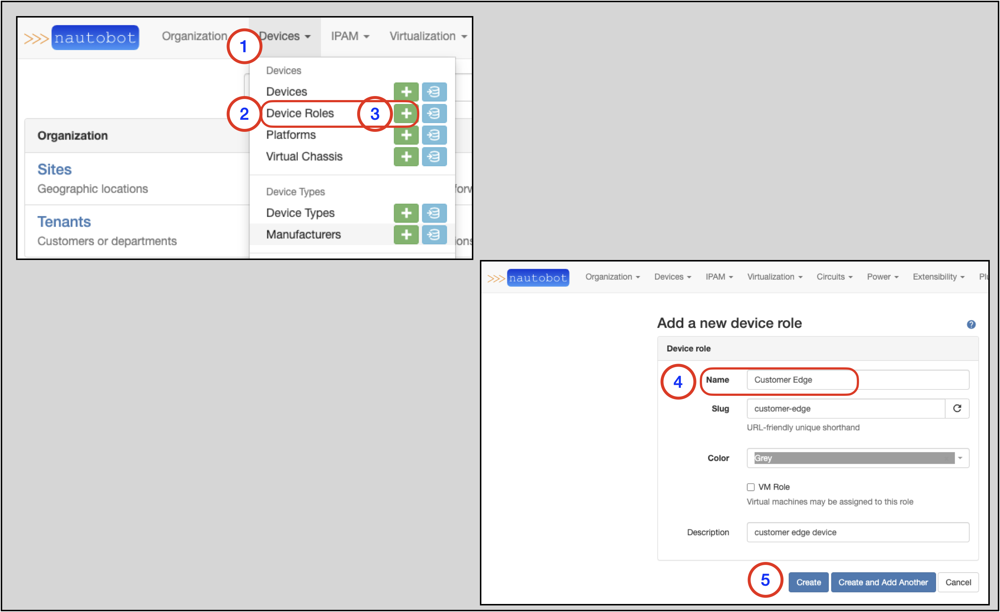
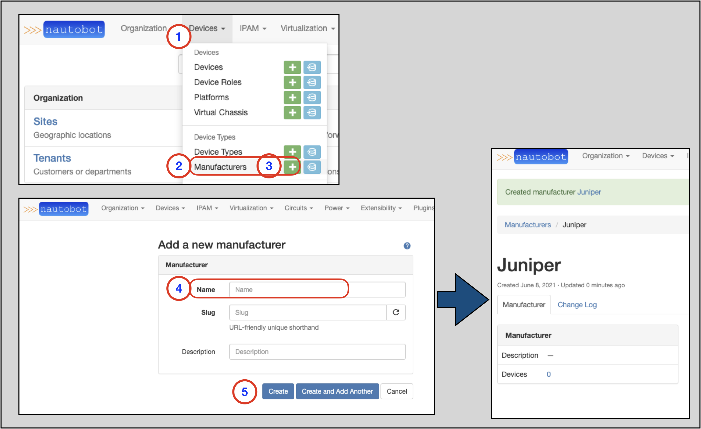
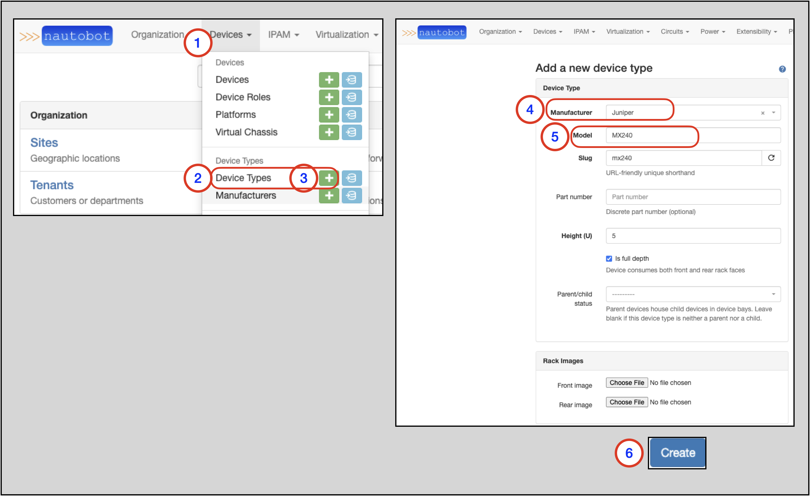
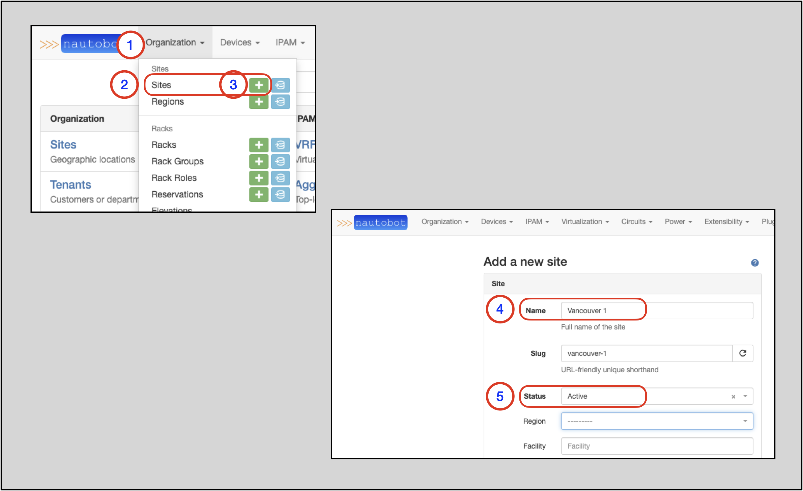
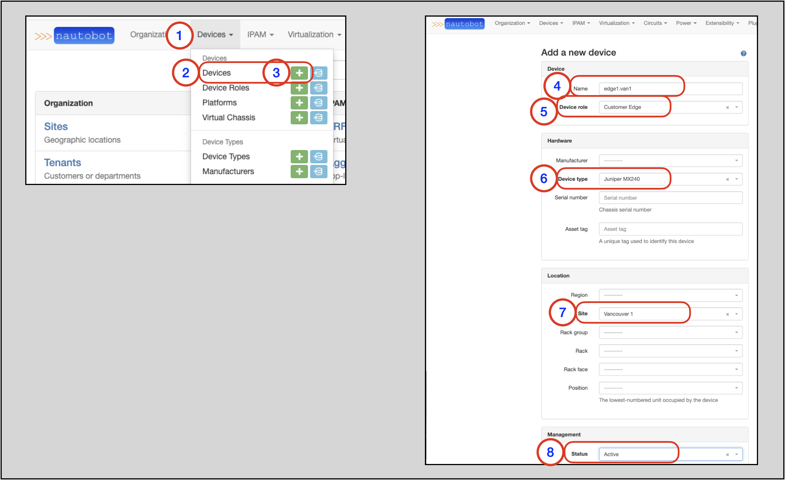

# Creating Devices in Nautobot

Every piece of hardware which is installed within a site or rack exists in Nautobot as a device.

More information on Devices can be found in the [Devices](../../core-functionality/devices.md#devices) section of the Nautobot documentation.

A network Device in Nautobot has a few required attributes:

* A Device Role
* A Device Type
    * A Device Type requires a Manufacturer
* A Site

Looking at the list above, there are four objects in Nautobot that must be present prior to creating a related Device.
The following sections will guide you through how to create each object type.

## Creating a Device Role

Devices can be organized by functional roles, which are fully customizable by the user.

More information on Device Roles can be found in the [Device Roles](../../core-functionality/devices.md#device-roles) section of the Nautobot documentation.

To create a new Device, you will need an existing Device Role or need to create a new Device Role instance.

!!! note
     You might create roles for core switches, distribution switches, and access switches within your network.

To create a new Device Role:

1. Click on **Devices** in the top navigation menu
2. Find **Device Roles** on the drop-down menu
3. Select `+`
4. In the `Add a new device role` form, populate the `Name`
    * The `Slug` will auto-populate based on the `Name` field, but can be manually overwritten
5. Click on Create

!!! note
    A `slug` is a short label for something, containing only letters, numbers, underscores or hyphens. They’re generally used within URLs. For example: `/dcim/device-roles/customer-edge/`

## Creating a Manufacturer

A Manufacturer represents the "make" of a device; e.g. Cisco or Dell. Each device type must be assigned to a manufacturer.

More information on Manufacturers is in the [Manufacturers](../../core-functionality/device-types.md#manufacturers) section of the Nautobot documentation.

To create a new Device Type, you will need an existing Manufacturer or need to create a new Manufacturer instance.

To create a new Manufacturer:

1. Click on **Devices** in the top navigation menu
2. Find **Manufacturers** on the drop-down
3. Select **+**
4. In the `Add a new manufacturer` form, populate the `Name`
     * The `Slug` will auto-populate based on the entered `Name`, but can be manually overwritten
5. Click on `Create`

## Creating a Device Type

A device type represents a particular make and model of hardware that exists in the real world.
Device types define the physical attributes of a device (rack height and depth) and its individual components (console, power, network interfaces, and so on).

More information on Device Types is in the [Device Types](../../core-functionality/device-types.md#device-types_1) section of the Nautobot documentation.

To create a new Device, you will need an existing Device Type or need to create a new Device Type instance.

To create a new Device Type:

1. Click on **Devices** in the top navigation menu
2. Find **Device Types**
3. Select **+** to go to the `Add a new device type` form
4. Select the `Manufacturer` from the drop-down selector
5. Populate the `Model` (name)
6. Click on `Create`

## Creating a Site

How you choose to employ sites when modeling your network may vary depending on the nature of your organization, but generally a site will equate to a building or campus.
For example, a chain of banks might create a site to represent each of its branches, a site for its corporate headquarters, and two additional sites for its presence in two co-location facilities.

More information on Sites is found in the [Sites](../../core-functionality/sites-and-racks.md#sites) section of the Nautobot documentation.

To create a new Device, you will need an existing Site or need to create a new Site instance.

To create a new Site:

1. Click on **Organization** in the top navigation menu
2. Find **Sites**
3. Select **+** to go to the `Add a new site` form
4. Populate the Site's `Name`
    * The `Slug` will auto-populate based on the `Name` field, but can be manually overwritten
5. Set the `Status` to `Active` in the drop-down selector
6. Click on `Create` at the bottom of the form (not shown)

## Creating a Device

To create a new Device:

1. Click on **Devices** in the top navigation menu
2. Find **Devices**
3. Select **+** to go to the `Add a new device` form
4. Populate the `Name`
5. Select the `Device Role` from the drop-down selector
6. Select the `Device Type` from the down-down selector
7. Select the `Site` from the drop-down selector
8. Set the `Status` to the appropriate value in the drop-down selector
9. Click on `Create` at the bottom of the form (not shown)

