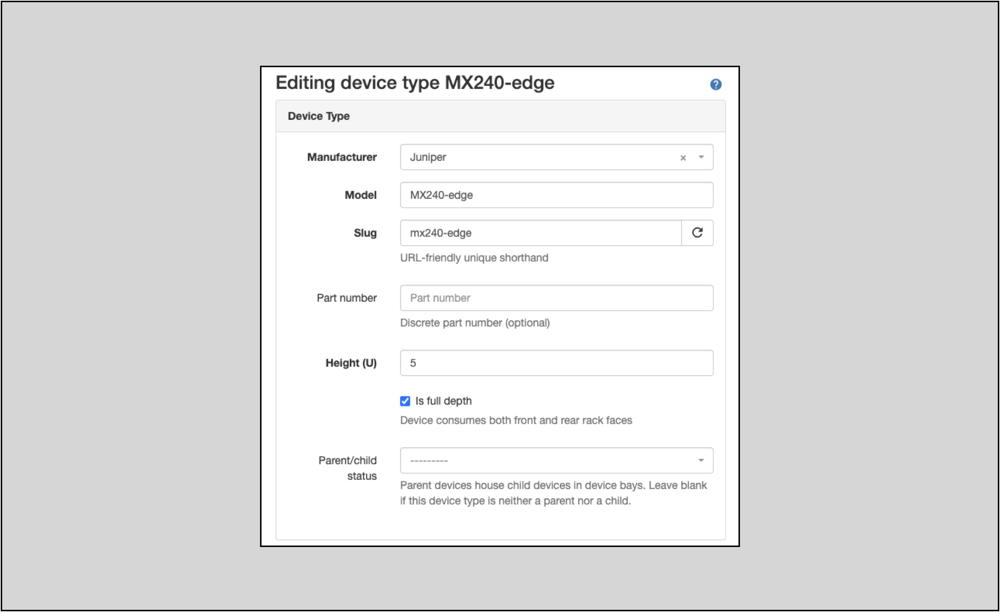
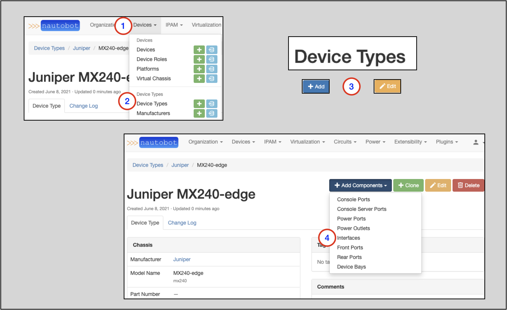
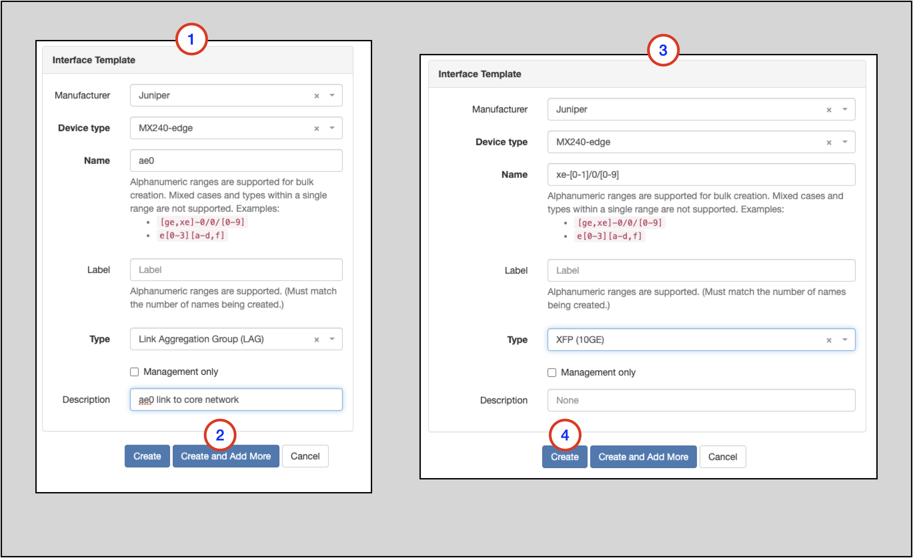
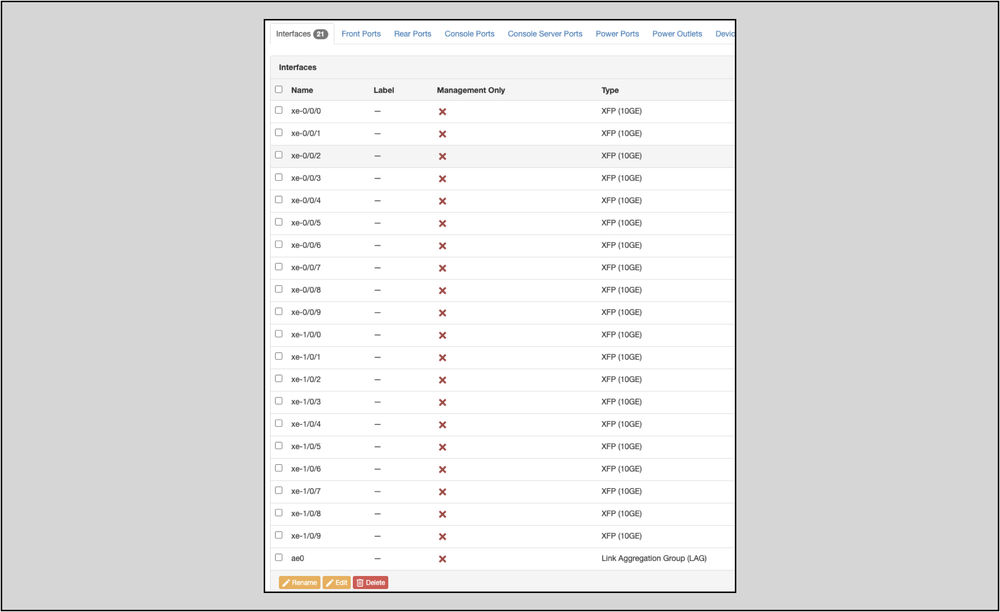
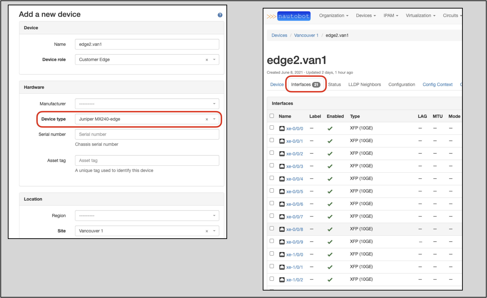
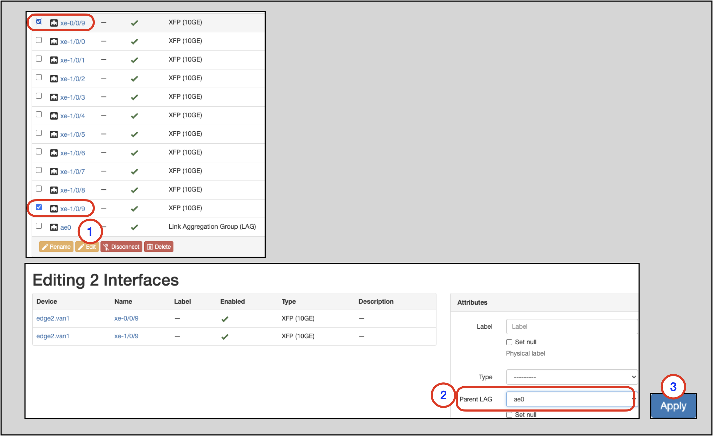
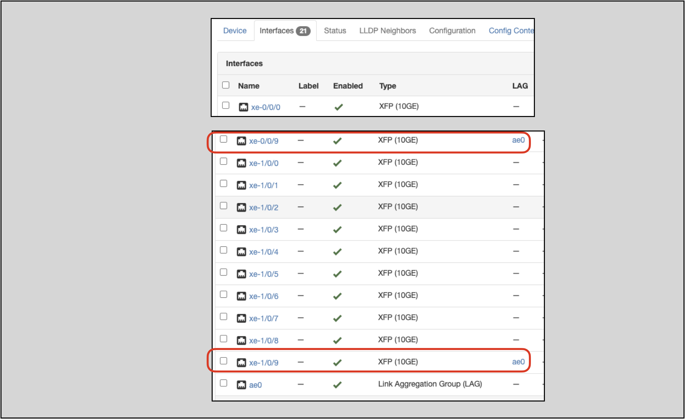

# Interfaces

Interfaces in Nautobot represent network interfaces used to exchange data with connected devices.

More information on Interfaces is in the [Interfaces](../../core-functionality/devices.md#interfaces) section of the Nautobot documentation.

Interfaces can be added at the Device or the Device Type level:

* Interfaces added to an individual Device are for that Device only
* Interfaces added to the Device Type will be applied to all NEW implementations of that Device Type (not existing implementations)

Which one you select depends on your use case; in some instances you will need to use both, as in the example below.

## Interface Add Example

Let’s take an example:

* We want to define a Device Type of `MX240-edge`
* This Device Type will have 20x 10G (`xe-[0-1]/0/[0-9]`) Interfaces and one LAG (`ae0`) Interface
* The `xe-0/0/9` and `xe-1/0/9` Interfaces will be members of the `ae0` Interface

## Creating a Device Type

We are going to use the **Device Type** to achieve part of this goal. Using the **Device Type** will also provide repeatability
because the **Device Type** object also serves as a template. This templating feature is demonstrated in this example.

Device Types can serve as templates for Devices, and as such the two are very similar. Here is a screenshot of a Device Type:

Creating a Device Type is very similar to [creating a Device](creating-devices.md).

To create a Device Type:

1. Click on **Devices** in the top navigation menu
2. Click on the **Device Types** option in the drop-down menu
3. On the Device Types page `Add +` a new Device Type
    * A Device Type requires a **Manufacturer** object to be created prior to creating the Device Type
    * Device Type requires **Manufacturer**, **Model**, **Slug**, and **Height** values at creation
    * In this example, name the Device Type `MX240-edge`
4. On the home page for the specific Device Type, click on `+Add Components` and select `Interfaces`

You will now see the `Interface Template` form:

1. Add the `ae0` Interface Template
    * `Manufacturer` will auto-populate to the Manufacturer of the Device Type you are editing
    * `Device Type` will auto-populate to the Device Type you are editing
    * Populate a `Name`
    * Select a `Type` of `Link Aggregation Group (LAG)` from the drop-down selector
    * Add a `Description` and `Label` (optional)
2. Click `Create and Add More`
3. Create the `xe-` Interfaces
    * This example shows bulk creation using a range (`xe-[0-1]/0/[0-9]`) in `Name`
    * Select the appropriate Type from the drop-down selector
4. Click on `Create`

Clicking the `Create` button will take you back to the home screen for the Device Type you are editing. There, you will
see that the **Interfaces** tab now has the expected 21 Interfaces listed.

!!! note
    As of this writing (Nautobot 1.0.3), Interfaces cannot be assigned in to a LAG in the Device Type template; component
    Interfaces must be designated in the specific instantiation of a Device created from the Device Type.

## Creating a New Device Using the Device Type

Create a new Device with these attributes:

* **Name** = `edge2.van1`
* **Device role** select `Customer Edge`
* **Device type** select `Juniper MX240-edge` (this will show up as a fusion of the **Manufacturer** (`Juniper`) for the Device Type and the Device Type (`MX240-edge`) Names)
* **Site** select `Vancouver 1`

On the main screen for the new *Device*, you will see an **Interfaces** tab with the expected Interfaces from the *Device Type* template:

!!! note
    Device Type properties only apply to **new** instantiations of Devices from the Type;
    Devices created prior to a modification of the Device Type will not inherit the changes retroactively

## Specifying the LAG Components on the Device

As of this writing (Nautobot 1.0.3), LAG component Interfaces cannot be assigned in the Device Type template, so we will
edit this new Device, specifying the component `ae0` Interfaces.

1. On the new Device's main page, select the appropriate Interfaces (`xe-0/0/9` and `xe-1/0/9`) to be added to `ae0` and click on the `Edit` button
2. On the `Editing Interfaces` form, select `ae0` in the `Parent LAG` drop-down selector
3. Click on `Apply`; you will be taken back to the main page for the Device

On the Device's main page, notice that `xe-0/0/9` and `xe-1/0/9` are now assigned to the `ae0` LAG:

