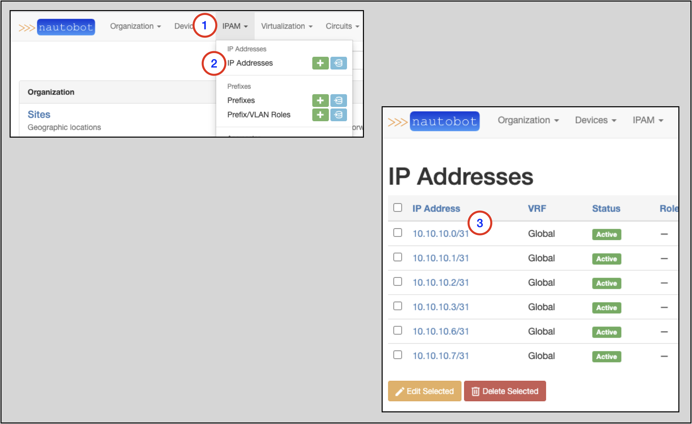
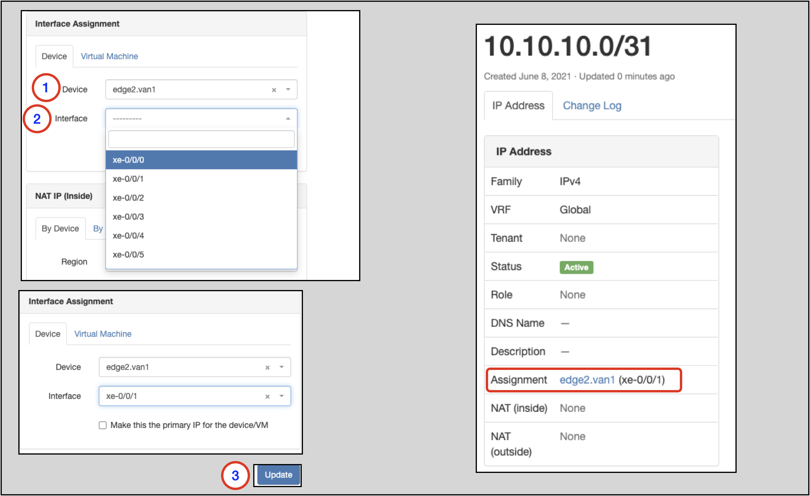

# IP Address Management

This next section will demonstrate how to:

* Create a Regional Internet Registry
* Create an Aggregate
* Create assignable IP addresses
* Assign an IP address to an Interface on a Device

These type of operations fall under an umbrella called IP Address Management (IPAM).
The Nautobot documentation [IPAM section](../../core-functionality/ipam.md) has more detail on IPAM and each operation.

## Creating a Regional Internet Registry (RIR)

A RIR allocates globally-routeable IP address space. There are five top-level RIRs, each responsible for a particular section of the globe.
Nautobot also considers RFCs 1918 and 6589 to be RIR-like because they allocate private IP space.

Nautobot requires any IP allocation be attributed to a RIR.

To create a RIR:

1. Click on **IPAM** in the top-level navigation menu
2. Find **RIRs** and click on the **+**; this takes you to the `Add a new RIR` form
3. Specify the RIR `Name`
4. The `Slug` will auto-populate based on the `Name` field, but this default can be manually overwritten
5. There is a checkbox to flag `Private` (internal use) only
6. Click on the `Create` button

## Creating an Aggregate

An aggregate is a consolidated allocation of IP address space, whether it is public or private. An aggregate must map back to a RIR that has allocated the space.

To create an Aggregate:

1. Click on **IPAM** in the top-level navigation menu
2. Find **Aggregates** and click on the **+**; this takes you to the `Add a new aggregate` form
3. Specify the `Prefix` in a `prefix/mask` format
4. Select a `RIR` from the drop-down selector
5. Click the `Create` button

You will then be taken to the `Aggregates` main page, where you will see the Aggregate you just created.

## Creating a Prefix

A Prefix is an IPv4 or IPv6 network and mask expressed in CIDR notation (e.g. 192.0.2.0/24).
Prefixes are automatically organized by their parent Aggregates.
Additionally, each Prefix can be assigned to a particular Site and virtual routing and forwarding (VRF) instance.

To create a prefix:

1. Click on **IPAM** in the top-level navigation menu
2. Look for **Prefixes** and click on the **+**
    * This will take you to the `Add a new prefix` form
3. Populate the `Prefix` in CIDR notation
4. Select a `Status` from the drop-down selector
5. If all addresses in the Prefix are usable, check the `Is a pool` flag
6. Click on the `Create` button (not shown)

## Verifying a Prefix in an Aggregate

To view the Prefixes in an Aggregate:

1. Click on **IPAM** in the top-level navigation menu
2. Click on **Aggregates** to go to the Aggregates main page
3. Find the Aggregate you are interested in and click on it
4. On the main page for the specific Aggregate, look for a specific Prefix (`10.10.10.0/24` in this example)

!!! note
    Nautobot will break an Aggregate into the highest-level child Prefixes to carve out user-defined Prefixes

## Creating IP Addresses

To create an IP address:

1. Click on **IPAM** in the top-level navigation menu
2. Find **IP Addresses** and click on the **+**
    * This will take you to the `Add a new IP address` form
3. In this example, we are going to create multiple individual addresses, so click on the `Bulk Create` tab
4. Populate an Address pattern
    * This example uses `10.10.10.[0-1,2-3,6-7]/31` to create 3 non-contiguous /31's
    * The specified mask should be exactly as would be configured on the Device's Interface
5. Select `Active` for `Status` from the drop-down selector
6. Click on the `Create` button

## Assigning IP Addresses

To assign an IP Address to a specific Device and Interface:

1. Click on **IPAM** in the top-level navigation menu
2. Click on **IP Addresses** to go to the main IP Addresses page
3. Find the IP address you wish to assign to an Interface and click on it
4. On the main page for the Address, click on the `Edit` button to go to the `Editing IP address` page

Once on the `Editing IP address` page:

1. Select a `Device` from the drop-down selector
2. Select an `Interface` on the Device
3. Click on the `Update` button
    * This will take you back to the main page for the IP Address, where you will see the assignment shown as `device (interface)`

## Finding an IP Address for an Interface

1. Click on **Devices** on the top-level navigation menu
2. Click on **Devices** to go to the main page for Devices
3. Search for the Device you are interested in (`edge2.van1` in this example) and click on the link to go to the main page for the Device
4. Go to the `Interfaces` tab and look for the row with the Interface you are interested in; find the IP Address(es) in the **IP Addresses** column in the row

## Finding IP Addresses in a Prefix

To find information on a particular Prefix:

1. Click on **IPAM** in the top-level drop-down menu
2. Click on **Prefixes** to get to the Prefixes main page
3. Find the Prefix you are interested in and click on the link
4. To view the available and allocated IP Addresses, click on the `IP Addresses` tab

