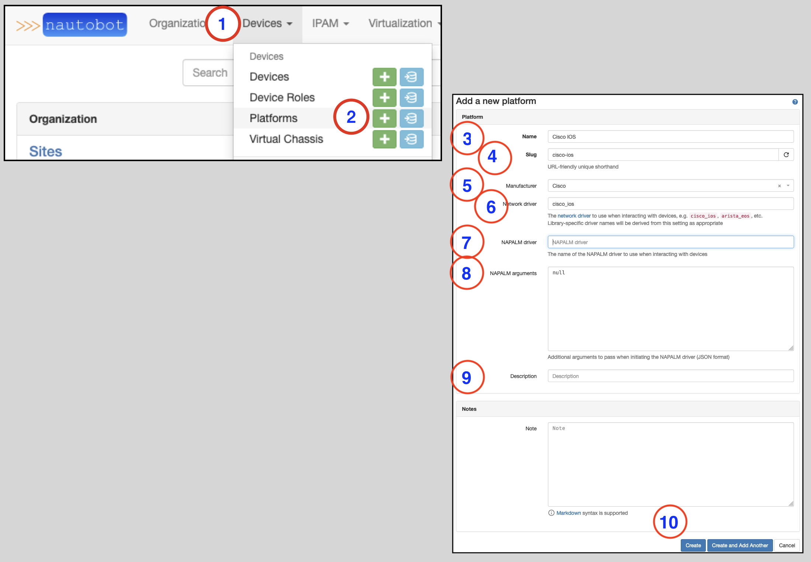
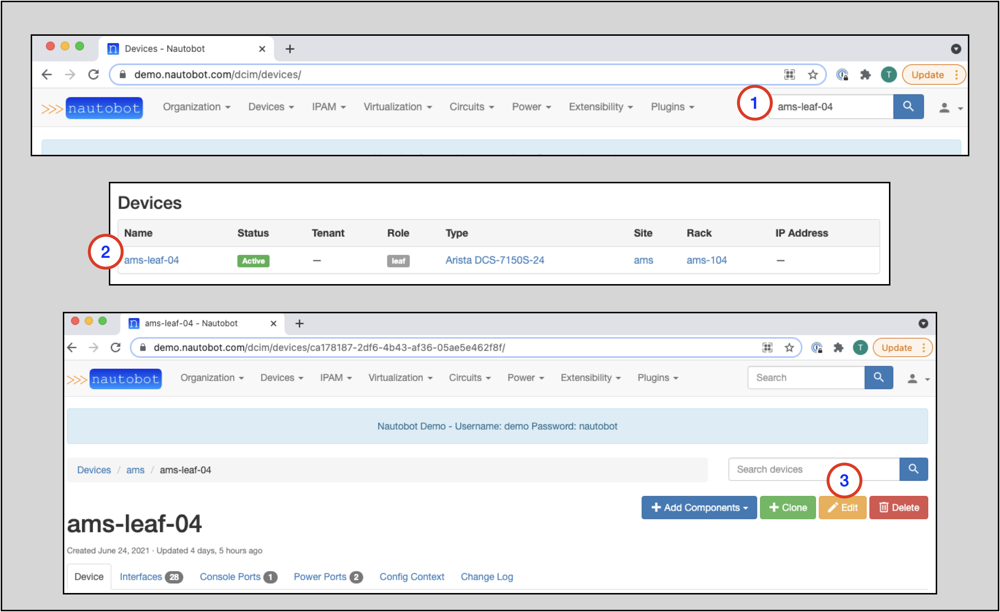
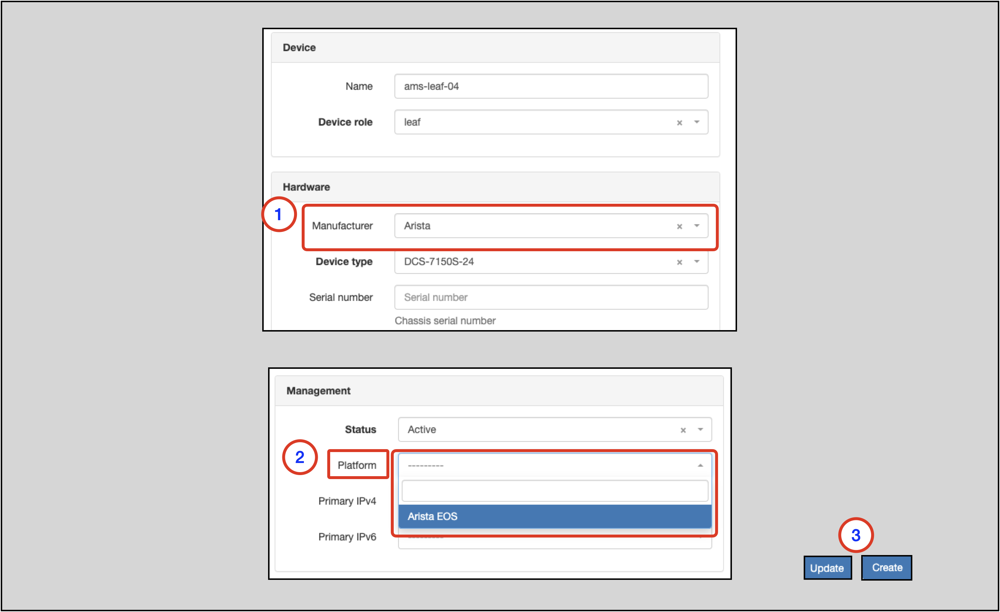

# Platforms

A Platform object can hold various information about a device, such as the OS, OS version, and NAPALM driver.

Further information is available in the [Platforms](../../models/dcim/platform.md) section of the Nautobot docs.

While use of Platforms is optional, they provide great value in many use cases.

## Creating a Platform

To create a Platform:

1. Click on **Devices** in the top navigation menu
2. Find **Platforms** and click on the **+** icon in the menu
    * This takes you to the `Add a new platform` form
3. Provide a `Name` (required)
4. The `Slug` will auto-populate based on the `Name` field; you may override this if necessary
5. Select a `Manufacturer` from the drop-down selector (optional)
6. Provide the name of the `NAPALM driver` (optional) (Note: this must be the exact name of the NAPALM driver)
7. Provide `NAPALM arguments` (optional)
8. Provide `Description` (optional)
9. Click on the `Create` button

!!! tip
    NAPALM Driver Options include:

    - eos (Arista)
    - ios (Cisco)
    - nxos (used with `nxapi` feature)
    - nxos_ssh (used for ssh login)
    - junos

Once completed, you will be sent to the Platforms page, where all the Platform variants are shown.

!!! tip
    Different use cases for Platforms may require different information. For example, to use a specific Platform with
    the **Device Onboarding Plugin**, you may be required to override the default Slug value with that of the
    Netmiko [device_type](https://github.com/ktbyers/netmiko/blob/2dc032b64c3049d3048966441ee30a0139bebc81/netmiko/ssh_autodetect.py#L50)

## Adding a Platform to an Existing or New Device

The Platform attribute is optional for a Device.

It is quite easy to add a Platform to an existing Device or while creating a new Device.

A Device's `Platform` is specified on the `Add a new device` or `Editing device` page, depending on whether you are adding or editing a Device.

### Reaching the `Editing device` page for an Existing Device

The quickest way to reach the `Editing device` page for a Device is to search for the Device name
in the Search Bar.

!!! tip
    See the [Search Bar](search-bar.md) section of this guide for more information on using the Search Bar

1. Type the device name in the Search Bar in the upper-right of the page
2. Click on the device name on the results page
3. Click on the `Edit` button on the main page for the Device

### Reaching the `Add a new device` Page

For a new Device, follow the steps to [create a new Device](creating-devices.md) to reach the `Add a new device` page.

### Specifying the Device's Platform

1. While on the **Add a new device**/**Editing device** page, scroll down to the 'Management' section
2. In the `Platform` field drop-down selector, select the appropriate Platform
3. Click the 'Update' (edit Device) or `Create` (add Device) button

!!! tip
    The only choices that will appear in the `Platform` drop-down selector will be those Platforms that have the same Manufacturer specified in the Device's `Hardware` section.

