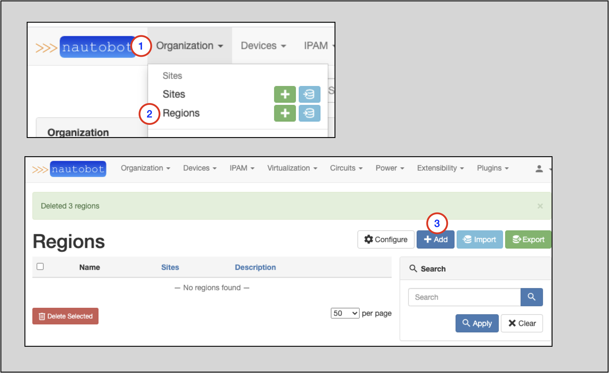
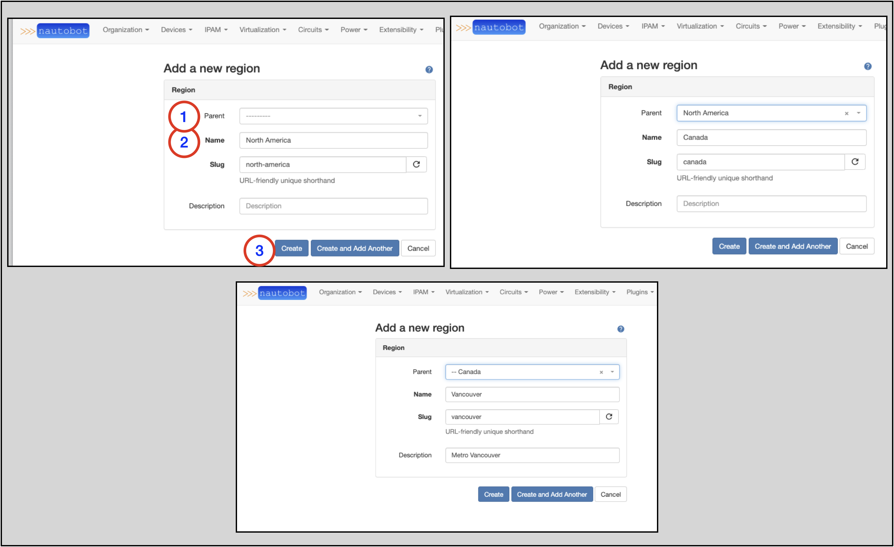
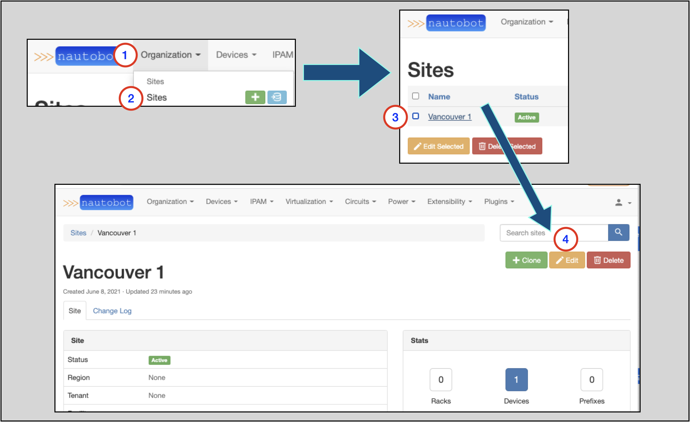
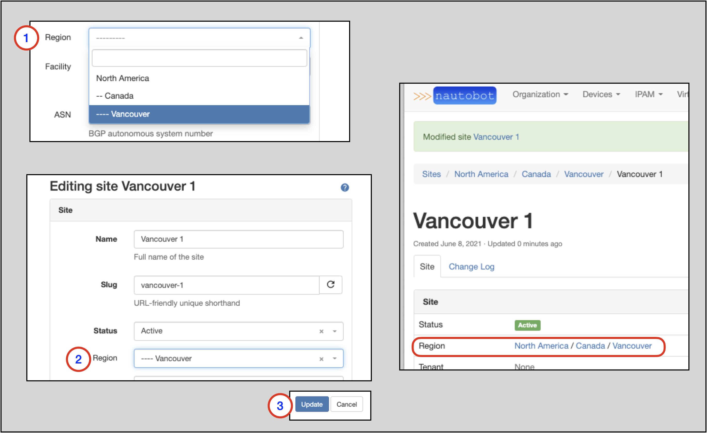

# Regions

Regions are administrative domains, used to organize Sites and other Regions. They can be nested recursively.
A Region might represent a continent, country, city, campus, or other area. A Region can contain Sites and other Regions.

Additional information on Regions is in the [Regions section of the Nautobot documentation](../../models/dcim/region.md).

In the following exercise, we will create three Regions:

* North America
    * Intended to hold Regions that represent each component country
* Canada
    * Intended to hold Regions that represent markets in Canada
* Vancouver
    * Intended to hold Sites within the Vancouver market

## Creating a Region

To create a Region:

1. Click on **Organization** in the top menu
2. Click on **Regions** in the **Organization** drop-down menu
    * From this page you can view any existing Regions
3. Click on the blue `+ Add` button

The screenshots below show the creation of each Region.

North America:

1. Leave the `Parent` blank; **North America** will be a top-tier Region
2. Populate the `Name` to be `North America`
    * The `Slug` will auto-populate based on the `Name` field, but can be manually overwritten
3. Click on the `Create and Add Another` button

Canada:

1. Select **North America** as the `Parent` from the drop-down menu selector
2. Populate the `Name` to be `Canada`
    * The `Slug` will auto-populate based on the `Name` field, but can be manually overwritten
3. Click on the `Create and Add Another` button

Vancouver:

1. Select **Canada** as the `Parent` from the drop-down menu selector
2. Populate the `Name` to be `Vancouver`
    * The `Slug` will auto-populate based on the `Name` field, but can be manually overwritten
3. Click on the `Create` button

## Adding a Site to a Region

It's quite easy to add an existing Site to a Region.

To access the page where you can modify a Site:

1. Click on **Organization** in the top navigation menu
2. Click on **Sites** in the drop-down menu
3. The **Sites** page will appear; click on the specific Site you want to modify (`Vancouver 1` in this example shown).
4. On the page for the Site, click on the `Edit` button

Once you're on the `Editing site` form:

1. Look for the `Region` drop-down selection menu and select the appropriate Region
2. Observe that the correct `Region` for the `Site` is selected
3. Click on the `Update` button

The page for the Site you updated will appear again, showing the updated Region hierarchy for the Site.

!!! note
    In the example, notice that we assigned the `Vancouver 1` Site to `Vancouver`, which is tier-3 Region.
    Notice that the Regional hierarchy is displayed for the `Vancouver 1` Site: `North America / Canada / Vancouver`
