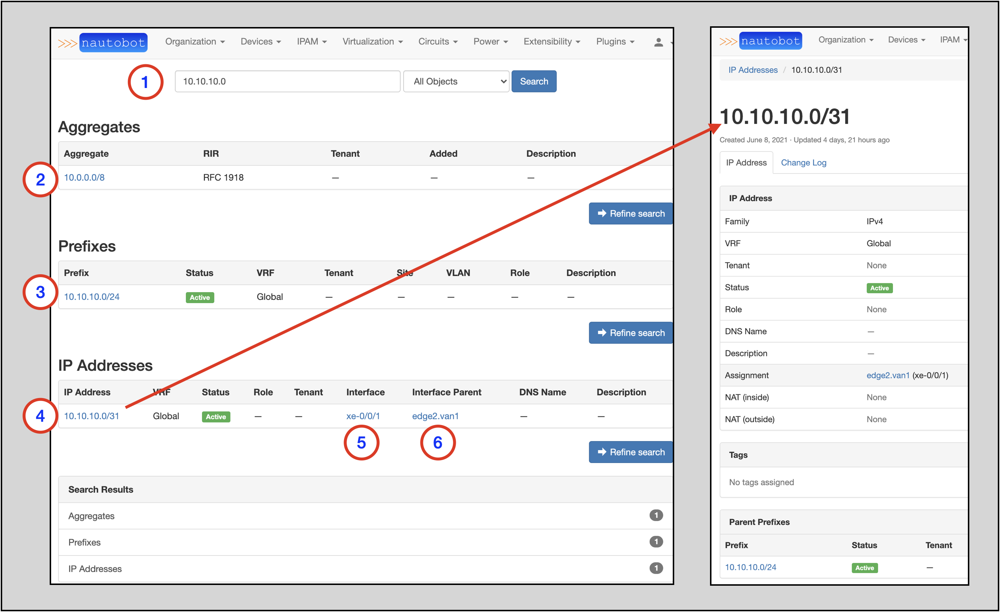
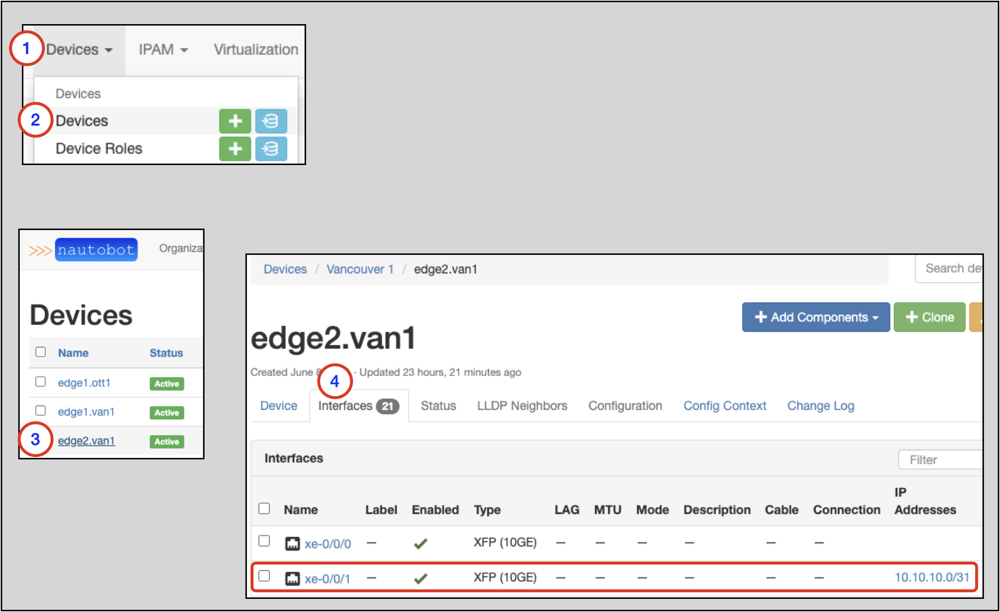
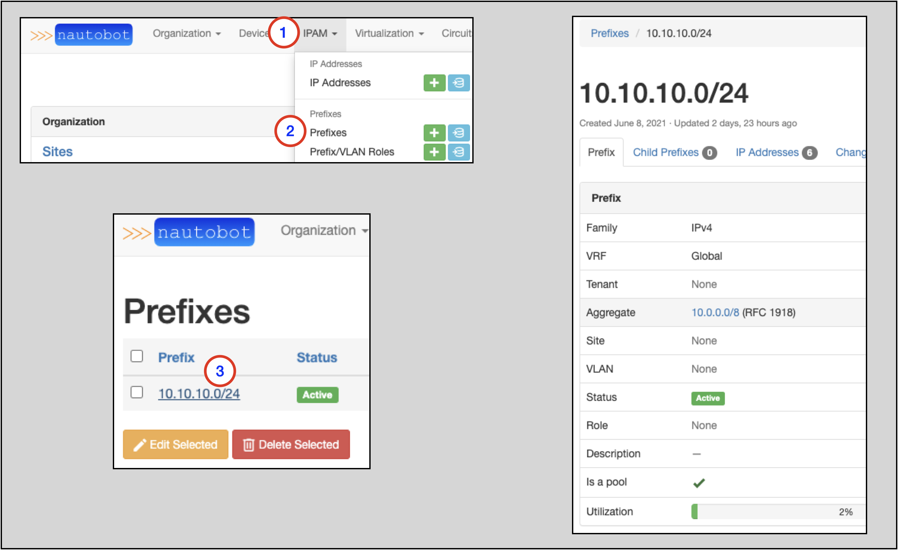
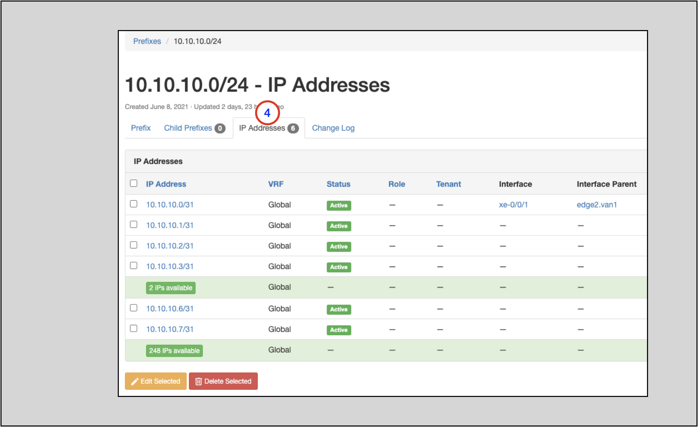

# The Search Bar

The next couple sections walk you through finding different objects and verifying information about the objects. 
The instructions in those sections will walk you through how to **navigate** to the main page for the proper object. 

You can also use the search bar to find the desired object's page.

We will show two quick examples.

Example one:

1. Type in `10.10.10.0` in the Search Bar and click on `Search`; this takes you to a search results page
2. **Aggregate** search result `10.0.0.0/8` (this is the Aggregate for the Prefix `10.10.10.0/24`)
3. **Prefix** search result `10.10.10.0/24`
4. **IP Address** search result `10.10.10.0/31`
5. Interface related to `10.10.10.0/31` 
6. Interface Parent (Device) for `10.10.10.0/31`

Clicking on any of these objects takes you to the main page for that object.
This example shows the result of clicking on the **IP Address** object (4).

Example two shows a Device-specific search:

1. Search for `edge`; this takes you to a search results page
2. In the drop-down selector to the right, select **Devices**
3. Search results for Devices with `edge` in the name
4. *Tenants* for each Device (if applicable) 
5. *Device Type* for each Device
6. *Site* for each Device

Clicking on an of the links for the results takes you to the main page for that object. For example:

* Clicking on the `Vancouver 1` Site takes you to the main page for the Site.
* Clicking on the `edge2.van1` Device takes you to the main page for the Device

# Finding an IP Address for an Interface

1. Click on **Devices** on the top-level navigation menu
2. Click on **Devices** to go to the main page for Devices
3. Search for the Device you are interested in (`edge2.van1` in this example) and click on the link to go to the main page for the Device
4. Go to the `Interfaces` tab and look for the row with the Interface you are interested in; find the IP Address(es) in the **IP Addresses** column in the row

# Finding IP Addresses in a Prefix 

To find information on a particular Prefix:

1. Click on **IPAM** in the top-level drop-down menu
2. Click on **Prefixes** to get to the Prefixes main page 
3. Find the Prefix you are interested in and click on the link

4. To view the available and allocated IP Addresses, click on the `IP Addresses` tab

