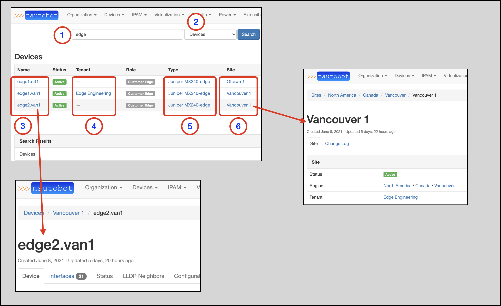

# The Search Bar

The exercises in the prior sections in this *Getting Started Guide* walked you through how to **navigate** to the proper objects.

You can also use the Search Bar to find desired objects with either partial or complete alpha/numeric characters or exact UUID.

We will show two quick examples.

Example one:

1. Type in `10.10.10.0` in the Search Bar and click on `Search`
    * This takes you to a search results page
2. **Aggregate** search result `10.0.0.0/8` (this is the Aggregate for the Prefix `10.10.10.0/24`)
3. **Prefix** search result `10.10.10.0/24`
4. **IP Address** search result `10.10.10.0/31`
5. Interface related to `10.10.10.0/31`
6. Interface Parent (Device) for `10.10.10.0/31`

Clicking on any of these objects takes you to the main page for that object.
This example shows the result of clicking on the **IP Address** object (4).

Example two shows a Device-specific search:

1. Search for `edge`
    * This takes you to a search results page
2. In the drop-down selector to the right, select `Devices`
3. Search results for Devices with `edge` in the name
4. *Tenants* for each Device (if applicable)
5. *Device Type* for each Device
6. *Site* for each Device

Clicking on an of the links for the results takes you to the main page for that object. For example:

* Clicking on the `Vancouver 1` Site takes you to the main page for the Site.
* Clicking on the `edge2.van1` Device takes you to the main page for the Device

**END OF *Getting Started in the Web UI* GUIDE**
