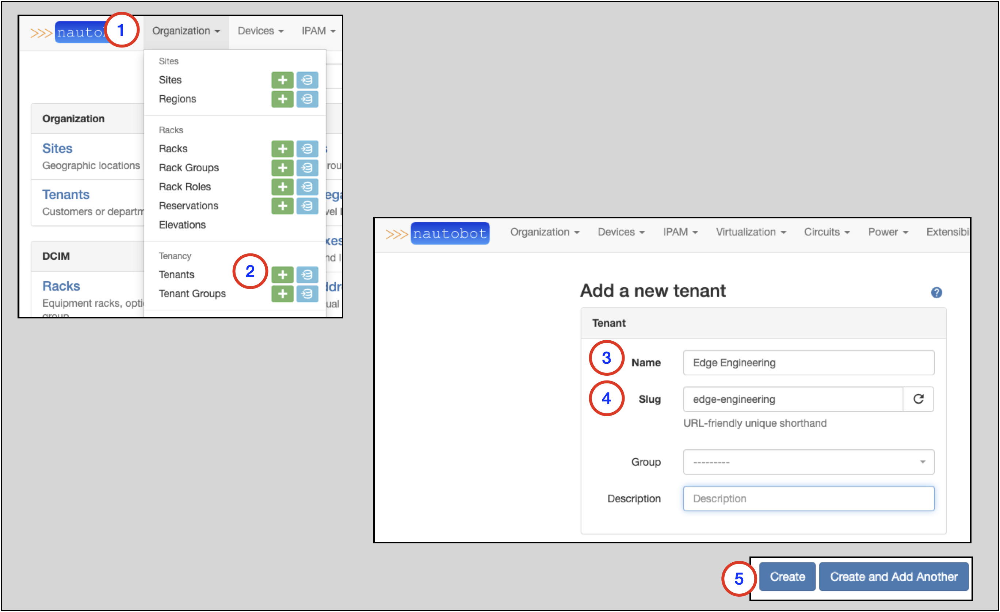
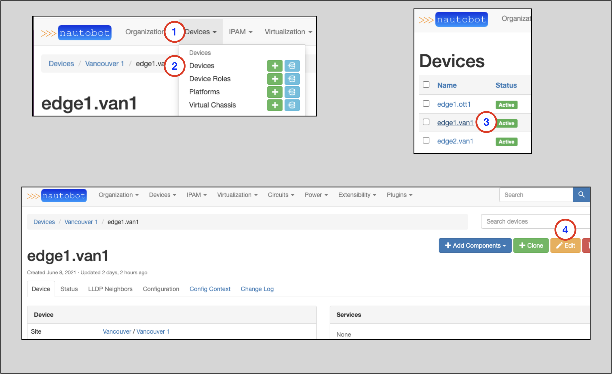
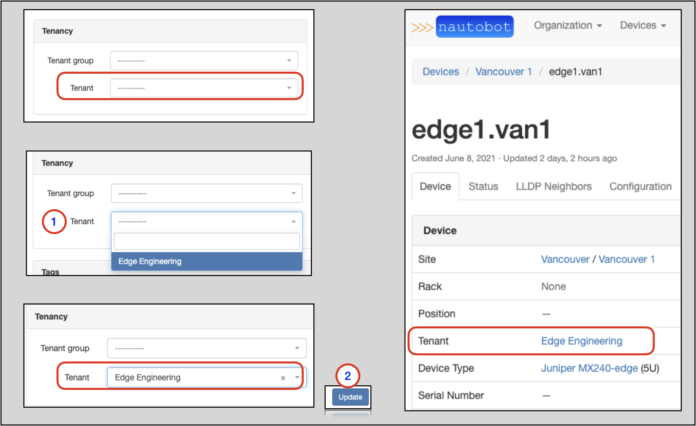

# Tenants

A 'Tenant' signifies ownership of an object in Nautobot and as such, any object may only have a single Tenant assigned.

More information on Tenants can be found in the [Tenants](../../models/tenancy/tenant.md) section of the Nautobot docs.

## Creating a Tenant

To create a Tenant:

1. Click on **Organization** on the top navigation menu
2. Find **Tenants** and click on the `+`
3. Populate the `Name` field
4. The `Slug` field will auto-populate based on the `Name` field, but this can be manually overwritten
5. Click the `Create` button

## Assigning a Tenant to an Object

It is simple to assign a Tenant to an existing object. This next example will add a Tenant to an existing Device.

1. Click on **Devices** in the top navigation menu
2. Look for the **Devices** option and click on it
    * This will take you to the **Devices** page
3. Click on the specific Device you want to add the Tenant to
    * This will take you to the main page for that Device
4. On the specific Device page, click on the `Edit` button

Once on the page to edit the Device:

1. Make a selection from the `Tenant` drop-down menu selector
2. Click the `Update` button

This will take you back to the main page for the Device.

Notice that the `Tenant` field is now populated/updated.
