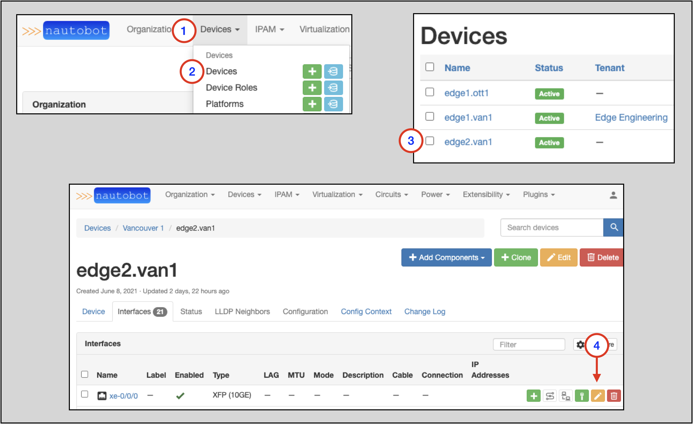

# VLANS and VLAN Groups

Each VLAN may be assigned to a site, tenant, and/or VLAN group.

Each VLAN must be assigned a status. The following statuses are available by default:

* Active
* Reserved
* Deprecated

In general, VLANs can have overlapping names and IDs. The exception to this is VLANs within a VLAN Group: each VLAN within a group must have a unique ID and name.  
A VLAN Group may be assigned to a specific site, but a Group cannot belong to multiple sites. VLANs may be assigned to a specific site as well.

The Nautobot documentation has more info about [VLANs and VLAN Groups](../../core-functionality/vlans.md#vlan-management).

## VLAN Example

The following example will show:

* Creating a `vlan 200` without a site assignment (*global* scope)
* Creating two VLANs, each with overlapping Names and IDs: ID = `100` and Name = `vlan 100`
    * Neither of the `vlan 100` instances will be assigned to a group, but each of the VLANs will be assigned to a different site (*site-specific* scope)
* How the *site-specific* and *global* scopes affect which VLANs can be assigned on which Devices

!!! note
    This example will require a Site (`Ottawa 1`) within a Region (`Ottawa`) in the `North America` Region in addition to the `Vancouver 1` Site and `Vancouver` Region created prior.
    Refer back to the [Create a Site](creating-devices.md#create-a-site) and [Create a Region](regions.md#creating-regions) sections to do so.

### Creating the VLANs

1. Click on **IPAM** in the top navigation menu
2. Look for the **VLANS** option and click on the **+** to go to the `Add a new VLAN` form
3. Populate `ID` with `200`
4. Populate `Name` with `vlan 200`
5. Select `Status` as `Active`
6. Click on `Create and Add Another` to save; you will then be taken to the `Add a new VLAN` form

!!! note
    The required parameters to create a new VLAN are bolded in the `Add a new VLAN` form: **ID**, **Name**, and **Status**

Now we'll create two instances of VLANs, each with **ID** = `100` and **Name** = `vlan 100` and an `Active` **Status**.
The differentiator will be that one instance will be assigned to the `Vancouver 1` Site and the other to the `Ottawa 1` Site.

On the `Add a new VLAN` form:

1. Populate `ID` with `100`
2. Populate `Name` with `vlan 100`
3. Select `Status` as `Active`
4. Select `Vancouver` from the `Region` selector drop-down
5. Select `Vancouver 1` from the `Site` selector drop-down
6. Click on the `Create and Add Another` button

!!! note
    The `Region` drop-down selection in step 4 is optional and only meant to narrow down the options presented in the **Site** drop-down selector in Step 5.
    A VLAN cannot be assigned to a Region.

1. Populate `ID` with `100`
2. Populate `Name` with `vlan 100`
3. Select `Status` as `Active`
4. Select `Ottawa` from the `Region` selector drop-down
5. Select `Ottawa 1` from the `Site` selector drop-down
6. Click on the `Create` button when complete with the second instance

Once you've created the three VLANs and then hit the `Create` button, you will be taken to the **VLANs** main page. On that page,
you'll see the three VLANs and the Site assignment for each one. Each `vlan 100` instance will have a Site assignment, while
`vlan 200` will not:

### Assigning VLANs to an Interface

To assign a VLAN to an Interface:

1. Click on **IPAM** on the top-level navigation menu
2. Select **Devices** to go to the Devices main page
3. Click on the name of the Device you wish to add a VLAN to (`edge2.van1`) in this example
4. Click on the `Edit` button for the `xe-0/0/0` Interface to go to the `Editing interface xe-0/0/0` page
5. On the `Editing interface xe-0/0/0` page, set `802.1Q` Mode to `Access` (or whatever mode you need) and then click on the VLAN drop-down selector. Notice that there are two choices:
    * One choice is the `vlan 100` instance specifically assigned to the `Vancouver 1` Site
    * The other choice is `vlan 200`, which was not assigned to a Site, and thus has a global scope

!!! note
    The `vlan 100` instance that is assigned to the `Ottawa 1` Site does not show up as an option for the `Vancouver1` Site

