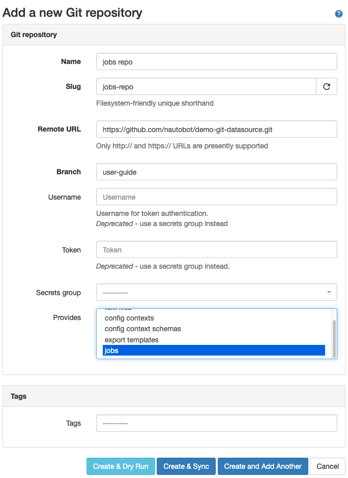
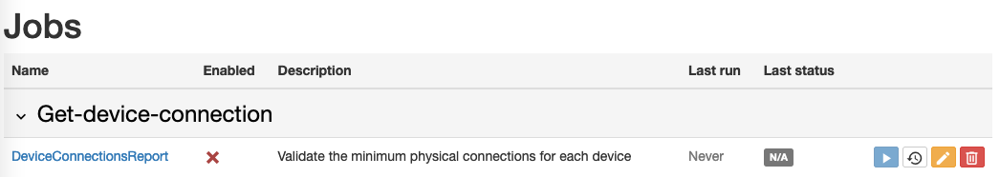
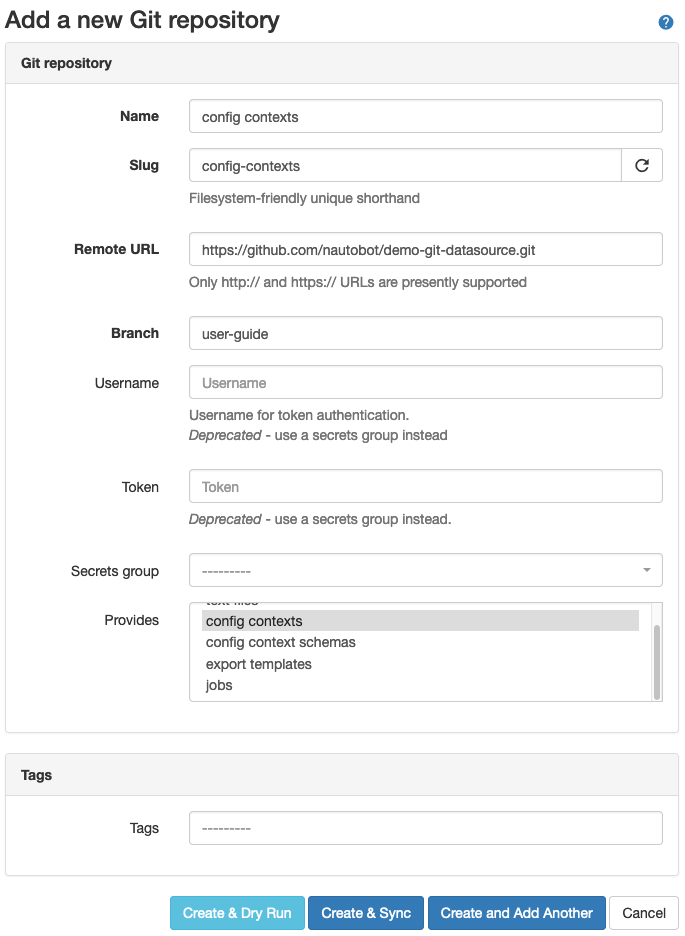

# Git as a Data Source

The "Git™ as a Data Source" feature was developed to provide the ability to populate existing data, templates, scripts, and much more into Nautobot; while leveraging the benefits that tools such as GitHub and GitLab already provide, including issue tracking, discussions, pipelines, and approvals.  For example having the ability to have users approve the YAML data that is used for Nautobot  `config context` along with running tests on that data, or having the users approve Jinja2 templates that are used for Nautobot `export templates`.  These examples and more can be accomplished by used Git as a Data Source.

For more technical details on how to use this feature, please see the documentation on [Git Repositories](../models/extras/gitrepository.md).

## Supported Providers

The feature uses the concept of a `provides` field to map a repository to a use case. A list of the supported options is provided below.

### Core Functionality

|Name|Summary|
|:--|:--|
|[Export Templates](../models/extras/exporttemplate.md)|Nautobot allows users to define custom templates that can be used when exporting objects.|
|[Jobs](../additional-features/jobs.md)|Jobs are a way for users to execute custom logic on demand from within the Nautobot UI. Jobs can interact directly with Nautobot data to accomplish various data creation, modification, and validation tasks.|
|[Config Contexts](../models/extras/configcontext.md)|Config contexts can be used to provide additional data that you can't natively store in Nautobot.|
|[Config Context Schemas](../models/extras/configcontextschema.md)|Schemas enforce data validation on config contexts.|

### Examples of Plugins Defining Additional Providers

Additional Git providers can be added by using Nautobot's flexible plugin system.

|Name|Summary|Related Plugin|
|:--|:--|:--|
|Backup Configs|Backup configuration data.|[Golden Config](https://github.com/nautobot/nautobot-plugin-golden-config)|
|Intended Configs|Stores the intended configurations, this grabs Nautobot data and runs through Jinja Templates.|[Golden Config](https://github.com/nautobot/nautobot-plugin-golden-config)|
|Jinja Templates|Repository that holds Jinja templates to be used to generate intended configs.|[Golden Config](https://github.com/nautobot/nautobot-plugin-golden-config)|

## Repository Details

This table defines repository parameters that are required to establish a repository connection.

|Field|Explanation|
|:--|:--|
|Name|User friendly name for the repo.|
|Slug|Computer-friendly name for the repo. Auto-generated based on the `name` provided, but you can change it if you wish.|
|Remote URL|The URL pointing to the Git repo. Current git url usage is limited to `http` or `https`.|
|Branch|The branch in the Git repo to use. Defaults to `main`.|
|Token|(Optional) A personal access token for the `username` provided.  For more information on generating a personal access token see the corresponding links below.|
|Username|(Optional) The Git username that corresponds with the personal access token above. Note not required for GitHub, but is for GitLab.|
|Secrets Group|(Optional) Grouping containing a *HTTP token* and/or *HTTP username* as needed to access the repository.|
|Provides|Resource type(s) provided by this Git repo.|

- [GitHub Personal Access Token](https://docs.github.com/en/github/authenticating-to-github/creating-a-personal-access-token)
- [GitLab Personal Access Token](https://docs.gitlab.com/ee/user/profile/personal_access_tokens.html)
- [Bitbucket Personal Access Token](https://confluence.atlassian.com/bitbucketserver/personal-access-tokens-939515499.html)

!!! warning
    Beginning in Nautobot 1.2, there are two ways to define a `token` and/or `username` for a Git repository -- either by directly configuring them into the repository definition, or by associating the repository with a [secrets group](../models/extras/secretsgroup.md) record (this latter approach is new in Nautobot 1.2). The direct-configuration approach should be considered as deprecated, as it is less secure and poses a number of maintainability issues. If at all possible, you should use a secrets group instead. The direct-configuration approach may be removed altogether as an option in a future release of Nautobot.

## Using Git Data Sources

This section will focus on examples and use the `user-guide` branch on the `demo-git-datasources` repo: `https://github.com/nautobot/demo-git-datasource/tree/user-guide`.

### Export Templates

[Export Templates](../models/extras/exporttemplate.md) allow a user to export Nautobot objects based on a custom template.  Export templates can change over time depending on the needs of a user.  Allowing export templates to reference a Git repo makes managing templates easier.

A template can be used to put objects into a specific format for ingestion into another system, tool, or report.  It is possible that different templates are needed depending on specific users or teams.  This can lead to sprawl of export templates.  To keep accurate templates synced with Nautobot the Git Data Sources extensibility feature can be used.

#### Add a Repository

Navigate to the Data Sources Git integration. **Extensibility -> Git Repositories**.


Click [+] or [Add]

That loads a default page to add a repository.


!!! note
    By default only config contexts, export templates, and jobs are available resource types.  Others may be added when specific plugins are used.

#### Fill out Repository Details

Fill out the details for the Git repository. More information on the inputs can be found in the [fields section](#repository-details).


As soon as you click on **Create & Sync**, Nautobot will clone and sync the repository and provide status of the job.

!!! note
    If you are using a self-signed Git repository, the Server Administrator will need to ensure the [`GIT_SSL_NO_VERIFY`](../configuration/optional-settings.md#git_ssl_no_verify) environment variable is set to permit this.


The repository will now be displayed on the main Git Repository page.


Once the repository is synced each template will now be available in the Export Templates section.  **Extensibility -> Export Templates**.


!!! note
    If the templates don't populate, make sure the Git directory is named `export_templates` and the sub-directory and sub-sub-directory names correctly match the Nautobot `content type`.

Example below:

```no-highlight
▶ tree export_templates
export_templates
└── dcim
    └── device
        ├── markdown_export.md
        ├── text_export.txt
        └── yaml_export.yml

2 directories, 3 files
```

#### Modifying a File and Sync Changes

Now that the export templates have been loaded into Nautobot they can be utilized as normal.  For example navigate to **Devices -> Devices** and click on **Export** in the top right corner, the dropdown will now include the templates loaded from the Git repository.

The power of having export templates utilizing the Git integration comes with the native source control features that Git comes with.  To illustrate a simple Git sync within Nautobot assume the following template needs to be updated.

Filename: `/export_templates/dcim/device/yaml_export.yml`

Current contents:

```jinja
---


- {{ device.name }}:


...
```

The template needs to be modified to provide more information than just a list of hostnames.  The site needs to be added.

The updated template is now:

```jinja
---


- {{ device.name }}:
  site: {{ device.site }}


...
```

Once the contributor updates the Git repository via normal Git processes and it is reviewed and merged into the branch that was used, a sync process from Nautobot needs to be completed.  This can be done from the default Git view, or within a specific detailed view of a Git repository.

From the default Git repositories view:


From the detailed view:


!!! tip
    Once the repository has been synced it's easy to check the history for the templates.
    Navigate to **Git Repositories** and select the repository in question.  Once you're in the detailed view you can look through the **Synchronization Status** or **Change Log** tabs.

Now that the Git repository is linked for export templates it can be controlled via the normal Git operations workflow, which allows users or groups of users to perform code reviews using Pull Requests etc.

### Jobs

Jobs are a way for users to execute custom logic on demand from within the Nautobot UI. Jobs can interact directly with Nautobot data to accomplish various data creation, modification, and validation tasks.

For technical details on jobs, please see the [documentation on jobs](../additional-features/jobs.md#jobs).

Jobs allow a user to write scripts in Python.  By integrating the scripts with Git, a user can utilize Git workflows to manage source control, versioning, and pipelines.

Setting up the repository can be done following the same steps from [Export Templates](#export-templates).  The only differences is the `provides` selection changes to `jobs`.

Jobs need to be defined in `/jobs/` directory at the root of a Git repository.

An example tree for `/jobs/`.

```no-highlight
▶ tree jobs
jobs
├── __init__.py
└── get-device-connection.py

1 directory, 2 files
```

!!! note
    As shown in the above example, the `/jobs/` directory must contain a file called `__init__.py`. This may be an empty file, but it must exist.

Once the repository is created in Nautobot.


!!! tip
    The same repository and branch can be used for the different `provides` methods.  Nautobot Git as a data source will look for specific root directory names.

Once the scripts have been pushed into the repository, a sync needs to be executed, after which navigating to Jobs via **Jobs -> Jobs** will show the new jobs loaded from the Git repository.


Jobs now shows the job from the Git repository.



At this point all changes, and history can be kept using Git.  A simple `sync` operation can be done from Nautobot to pulldown any changes.

### Config Contexts

Detailed information on [config contexts](../models/extras/gitrepository.md#configuration-contexts) in Git Repositories.

Config contexts may be provided as JSON or YAML files located in the `/config_contexts/` folder, which must be in the root of the Git repository.

Config contexts can be used to provide additional details to different automation tooling.  For example Ansible variables, or any other data that you can't natively store in Nautobot.  It can also be used in the Golden Configuration Nautobot plugin to provide extra details to generate configuration templates.

A few simple examples of Configuration Context data might be:

- DNS Servers
- NTP Servers
- ACL Data
- Routing Information such as BGP ASNs etc.

Similar to the other data sources, the repository can be added by navigating to **Extensibility -> Git repositories**. Click on **Add**, and fill out the repository details.



Once the repository syncs the details can be found in the **Synchronization Status** tab.  For example, the platform specifics were synced:


The repository structure is:

```no-highlight
▶ tree config_contexts
config_contexts
├── devices
│   ├── site-a-bb-01.yml
│   ├── site-a-rtr-01.yml
│   ├── site-a-rtr-02.yml
│   ├── site-a-spine-01.yml
│   ├── site-a-spine-02.yml
│   ├── site-b-bb-01.yml
│   ├── site-b-leaf-01.yml
│   ├── site-b-leaf-02.yml
│   ├── site-b-rtr-01.yml
│   ├── site-b-rtr-02.yml
│   ├── site-b-spine-01.yml
│   └── site-b-spine-02.yml
├── platform_eos.yml
├── platform_junos.yml
├── platform_nxos.yml
└── role_spine.yml

1 directory, 16 files
```

Configuration Context details:

- Follows an inheritance methodology similar to what Ansible implements.  Global contexts can be overwritten by local contexts at both a group level, as well as at a device specific level.
- Nautobot UI provides a simple view to see merged config contexts.  It can be visualized by navigating to a device and clicking on the **config contexts** tab.

Here's an example, with some of the details omitted for brevity.


There is a huge benefit to having `config contexts` managed by a Git workflow.  This type of data can be modified often, especially platform specifics, or new device roles.  Utilizing a standard Git workflow allows for all the proper reviews and approvals to be accomplished before accepting the changes into Nautobot for use.

### Config Context Schemas

Detailed information on [config context schemas](../models/extras/gitrepository.md#configuration-context-schemas) in Git Repositories.

Config context schemas are used to enforce data validation on config contexts. These schema are managed via the [config context schema model](../models/extras/configcontextschema.md) and are optionally linked to config context instances, in addition to devices and virtual machines for the purpose of validating their local context data.

```no-highlight
▶ tree config_contexts
config_context_schemas
├── schema_1.yaml
├── schema_2.json
```

## Additional Git Data Sources

As seen in [Fill out Repository Details](#fill-out-repository-details), the standard installation of Nautobot will come natively with export templates, jobs, and config contexts.  Additional data sources can be incorporated using the Nautobot plugin system.  For example, the [nautobot-plugin-golden-config](https://github.com/nautobot/nautobot-plugin-golden-config) plugin implements four additional data sources.

- Config Contexts
- Backup Configs
- Intended Configs
- Jinja Templates

For more information for the Golden Configuration specific data sources, navigate to [Nautobot Golden Config Repo](https://github.com/nautobot/nautobot-plugin-golden-config/blob/develop/docs/navigating-golden.md#git-settings).

## Common Issues and Troubleshooting

1. Repository is linked, but data is not properly loaded into Nautobot.
    - Validate the root directory is set to the proper name.
    - Export Templates -> `export_templates`.
    - Jobs -> `jobs`.
    - Config Contexts -> `config_contexts`.
2. Synchronization Status Failures.
    - Validate branch is correct and exists in the remote repository.
    
    - Validate the remote url is correct and is the `http(s)` url.  `ssh` urls are not currently supported.
    
3. Authentication Issues.
    - Check repository permissions.
    - Ensure the password is the Personal Access Token (PAT) for the username supplied.
    - Ensure the PAT permissions are setup properly.
      - At a minimum the `repo` option should be checked or access.

    
