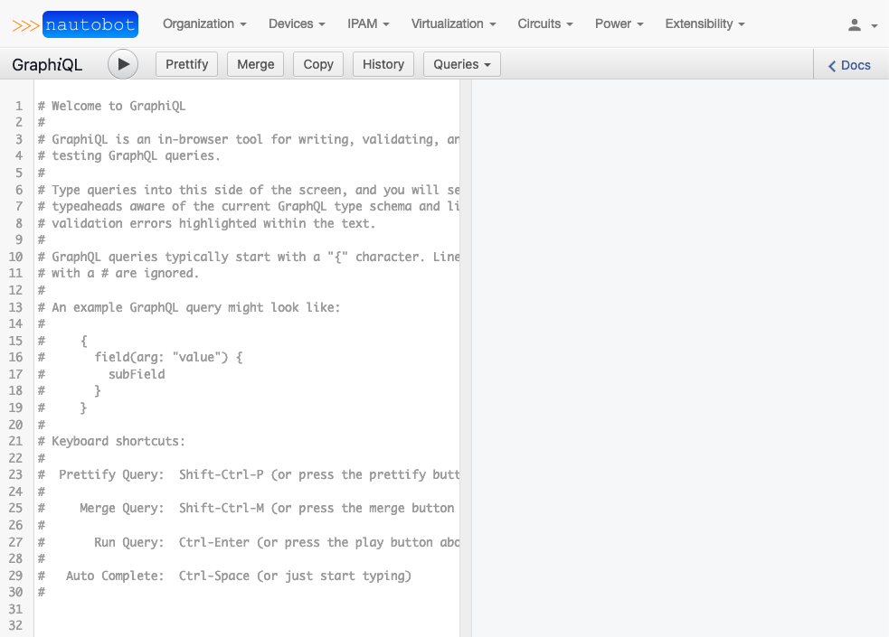
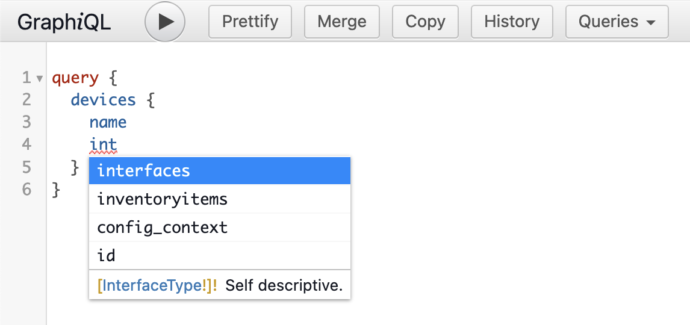

# GraphQL User Guide

## Introduction

### What is GraphQL?

[GraphQL](https://graphql.org/) is a query language for your APIs and a runtime for fulfilling those queries with your existing data.

### How GraphQL simplifies API Interactions

When interacting with APIs, It's often necessary to build relationships between multiple models to achieve the result that is desired. Doing this typically requires multiple API calls to create the relationships. For example, lets assume that there are two devices in Nautobot. Each are assigned a site, region, roles, interfaces, and IP Addresses.

Simply querying the `/api/dcim/devices/` API route provides:

??? info "View API Results"

    ```json
    {
      "count": 2,
      "next": "https://demo.nautobot.com/api/dcim/devices/?limit=1&offset=2",
      "previous": "https://demo.nautobot.com/api/dcim/devices/?limit=1",
      "results": [
        {
          "id": "c8886c88-6eff-4c4f-a079-4ef16b53d4f6",
          "url": "https://demo.nautobot.com/api/dcim/devices/c8886c88-6eff-4c4f-a079-4ef16b53d4f6/",
          "name": "ams-edge-02",
          "display": "ams-edge-02",
          "device_type": {
            "id": "244ea351-3c7a-4d23-ba80-5db6b65312cc",
            "url": "https://demo.nautobot.com/api/dcim/device-types/244ea351-3c7a-4d23-ba80-5db6b65312cc/",
            "manufacturer": {
              "id": "687f53d9-2c51-40fd-83aa-875e43d01a05",
              "url": "https://demo.nautobot.com/api/dcim/manufacturers/687f53d9-2c51-40fd-83aa-875e43d01a05/",
              "name": "Arista",
              "slug": "arista"
            },
            "model": "DCS-7280CR2-60",
            "slug": "dcs-7280cr2-60",
            "display": "Arista DCS-7280CR2-60"
          },
          "device_role": {
            "id": "a3637471-6b4d-4f5a-a249-838d621abe60",
            "url": "https://demo.nautobot.com/api/dcim/device-roles/a3637471-6b4d-4f5a-a249-838d621abe60/",
            "name": "edge",
            "slug": "edge"
          },
          "tenant": null,
          "platform": null,
          "serial": "",
          "asset_tag": null,
          "site": {
            "id": "4ad439e9-4f1b-41c9-bc8c-dd7c1c921dc3",
            "url": "https://demo.nautobot.com/api/dcim/sites/4ad439e9-4f1b-41c9-bc8c-dd7c1c921dc3/",
            "name": "ams",
            "slug": "ams"
          },
          "rack": {
            "id": "bff3f7af-bd77-49b6-a57a-9c4b8fc7673a",
            "url": "https://demo.nautobot.com/api/dcim/racks/bff3f7af-bd77-49b6-a57a-9c4b8fc7673a/",
            "name": "ams-102",
            "display": "ams-102"
          },
          "position": 40,
          "face": {
            "value": "front",
            "label": "Front"
          },
          "parent_device": null,
          "status": {
            "value": "active",
            "label": "Active"
          },
          "primary_ip": null,
          "primary_ip4": null,
          "primary_ip6": null,
          "cluster": null,
          "virtual_chassis": null,
          "vc_position": null,
          "vc_priority": null,
          "comments": "",
          "local_context_data": null,
          "tags": [],
          "custom_fields": {},
          "config_context": {},
          "created": "2021-02-25",
          "last_updated": "2021-02-25T14:51:57.609598"
        }
      ]
    }
    ```

<!-- markdownlint-disable-next-line MD033 -->
<br />
There is a lot of useful information in that API call, but there is also a lot of information that is missing; such as interfaces and ip addresses associated with the devices. There is also potentially a lot of information that isn't needed for the specific task. To retrieve the missing information, subsequent API calls would need to be performed; and those API results would need to be correlated to the correct device.

GraphQL reduces the complexity of performing multiple API calls and correlating results by empowering the user to create their own query that provides the user exactly what they want and nothing that they don't, in a single API call.

### Exploring GraphQL in Nautobot

In Nautobot, there is a link to the GraphQL web interface at the bottom right-hand side of the page. The GraphQL web interface is called GraphiQL. Navigating to the URI (`/graphql`), brings up the GraphiQL tool for creating queries. This interface is useful for exploring the possibilities of GraphQL and validating that written queries execute successfully.



### Documentation Explorer

If you're new to GraphQL, take a little bit of time to explore the *Documentation Explorer*. This can be accomplished by clicking the `< Docs` link in the GraphiQL interface. The information within *Documentation Explorer* is specific to creating queries in Nautobot.


In the *Documentation Explorer*, search for `devices`. The results are all of the models that utilize the `devices` model.


From the `devices` query, select `devices` from `Query.devices`. This will display all of the potential query fields from devices.


### First Query

Now that you have a basic understanding of how to obtain information to query from the *Documentation Explorer*, let's craft a query. Earlier in the guide, a sample REST API call was performed to obtain device information. While the query had a lot of important information, it also lacked a lot of information. In this section, lets explore how to craft a GraphQL query that displays all of the information that we want.

GraphQL queries are encapsulated in `query { }` flags (simply `{ }` is also acceptable). With that in mind, let's craft our query from the GraphiQL interface to inspect all devices and display their device names. To do this, let's execute:

```graphql
query {
  devices {
    name
  }
}
```

This query will retrieve a list of all devices by their hostname.

??? info "View GraphQL Query Results"
    <!-- markdownlint-disable-next-line MD033 -->
    

<!-- markdownlint-disable-next-line MD033 -->
<br />
Now, let's modify the query to provide interface names for each device. We can do that by modifying the existing query to add `interfaces { name }` as a sub-query of `devices`. GraphiQL makes this process a bit easier, because it has syntax completion built in.



```graphql
query {
  devices {
    name
    interfaces {
      name
    }
  }
}
```

The result is a list of all the devices by their hostname and associated interfaces by their names.

??? info "View GraphQL Query Results"
    <!-- markdownlint-disable-next-line MD033 -->
    

<!-- markdownlint-disable-next-line MD033 -->
<br />
We can continue iterating on the query until we get exactly what we want from the query. For example, if I wanted to iterate on the previous query to not only display the interfaces of the devices, but also display the interface description, the IP Addresses associated with the interface, and whether or not the interface was a dedicated management interface; I would structure the query like:

```graphql
query {
  devices {
    name
    interfaces {
      name
      description
      mgmt_only
      ip_addresses {
        address
      }   
    }
  }
}
```

The results of the query look like:

??? info "View GraphQL Query Results"
    <!-- markdownlint-disable-next-line MD033 -->
    

### Filtering Queries

These queries are great, but they are displaying the interface attributes and device names for every device in the Nautobot inventory. Nautobot allows users to filter queries at any level as desired to narrow the scope of the returned data. As an example, we can filter the queried devices by their site location. This is done by adding `(site: "<site name>")` after `devices`. For example: `query { devices(site: "ams") { name }}` will display all devices in the `ams` site.

As an example. We can query devices by their site location. This is done by adding `(site: "<site name>")` after `devices`. For example: `query { devices(site: "ams") { name }}` will display all devices in the `ams` site.

??? info "View GraphQL Query Results"
    <!-- markdownlint-disable-next-line MD033 -->
    

<!-- markdownlint-disable-next-line MD033 -->
<br />
GraphQL also allows you to filter by multiple attributes at once if desired. You can use the *Documentation Explorer* to assist you in finding criteria attributes to filter on. In this example, I add the `role` attribute in addition to `site`.

```graphql
query {
  devices(site: "ams", role: "edge") {
    name
  }
}
```

??? info "View GraphQL Query Results"
    <!-- markdownlint-disable-next-line MD033 -->
    

<!-- markdownlint-disable-next-line MD033 -->
<br />
You can also filter at deeper levels of the query. On many to one relationships you can filter the results based on an attribute of the field. Any attribute that relates to a GraphQLType can be filtered.

```graphql
query {
  devices(site: "ams", role: "edge") {
    name
    interfaces(name: "Ethernet1/1") {
      name
    }
  }
}
```

```graphql
query {
  sites(name: "ams") {
    devices(role: "edge") {
      name
      interfaces(name: "Ethernet1/1") {
        name
      }
    }
  }
}
```

??? info "View GraphQL Query Results"
    <!-- markdownlint-disable-next-line MD033 -->
    

+++ 1.3.0
    You can also paginate the results returned to you when the data set gets larger. To do so, use the keywords "limit" and "offset". The "limit" keyword will limit the count of results returned after the "offset". If no "offset" is specified, then the default offset is zero.

    ```graphql
    query {
      devices(site: "ams01", , limit: 1, offset: 1) {
        name
      }
    }
    ```

## Using the GraphQL API in Nautobot

Now that we've explored how to use the GraphiQL interface to help us create GraphQL queries, let's take our queries and call them with the REST API. This is where the real advantage is going to come in to play, because it will allow us to utilize these queries in a programmatic way.


From the [Nautobot Swagger documentation](https://demo.nautobot.com/api/docs/), we can see that the API calls to `/api/graphql` require a HTTP POST method. In the HTTP POST, the `query` field is required, as it is where we specify the GraphQL query. The `variables` field is optional; it's where we can assign values to any variables included in the query, if we choose to do so.

To simplify the process even more, we'll utilize the [PyNautobot SDK](https://pynautobot.readthedocs.io/en/latest/index.html).

Here is an example Python script using the PyNautobot SDK to query GraphQL:

```python
#!/usr/bin/env python3

import pynautobot
import json

query = """
query {
  devices {
    name
    interfaces {
      name
      description
      mgmt_only
      ip_addresses {
        address
      }
    }
  }
}
"""
nb = pynautobot.api(
    url="http://localhost",
    token="aaaaaaaaaaaaaaaaaaaaaaaaaaaaaaaaaaaaaaaa"
)
gql = nb.graphql.query(query=query)

print(json.dumps(gql.json, indent=2))
```

The contents of the `query` variable was taken directly from the example above where we grabbed all device interfaces and associated attributes. We then take the output and print the contents as a JSON object. Now, let's iterate on the script to filter the contents with the `variable` flag. Just as we did above, we'll filter by `site`.

```python
#!/usr/bin/env python3

import pynautobot
import json

variables = {"site_name": "ams"}
query = """
query ($site_name: String!) {
  devices (site: $site_name) {
    name
    interfaces {
      name
      mgmt_only
      ip_addresses {
        address
      }
    }
  }
}
"""
nb = pynautobot.api(
    url="http://localhost",
    token="aaaaaaaaaaaaaaaaaaaaaaaaaaaaaaaaaaaaaaaa"
)
gql = nb.graphql.query(query=query, variables=variables)

print(json.dumps(gql.json, indent=2))
```

In the updated script, we add the `variables = {"site_name": "ams"}` variable. We then update the query to let GraphQL know that we will be sending parameters to to filter by `site`. The updated output is still a JSON object. Instead of fetching all devices, we are filtering by devices in the `ams` site. The PyNautobot SDK has some [excellent GraphQL examples](https://pynautobot.readthedocs.io/en/latest/api/core/graphql.html). Be sure to check out the documentation.

### Saving Queries

+++ 1.1.0

Queries can now be stored inside of Nautobot, allowing the user to easily rerun previously defined queries.

Inside of **Extensibility -> Data Management -> GraphQL Queries**, there are views to create and manage GraphQL queries.

Saved queries can be executed from the detailed query view or via a REST API request. The queries can also be populated from the detailed query view into GraphiQL by using the "Open in GraphiQL" button. Additionally, in the GraphiQL UI, there is now a menu item, "Queries", which can be used to populate GraphiQL with any previously saved query.

To execute a stored query via the REST API, a POST request can be sent to `/api/extras/graphql-queries/[slug]/run/`. Any GraphQL variables required by the query can be passed in as JSON data within the request body.

## Closing

GraphQL is a powerful, yet simple, tool for querying the exact information that is necessary for the task at hand. For further information about GraphQL, be sure to check out the [GraphQL Docs](https://graphql.org/learn/)!
