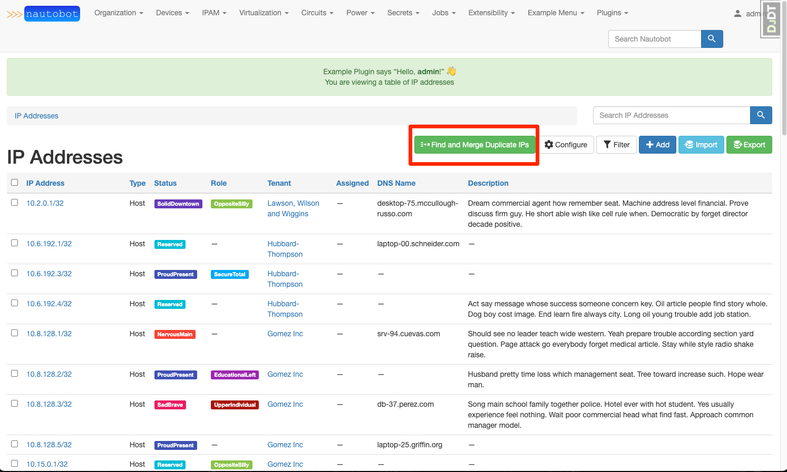
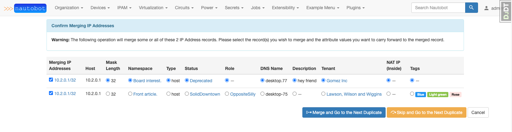
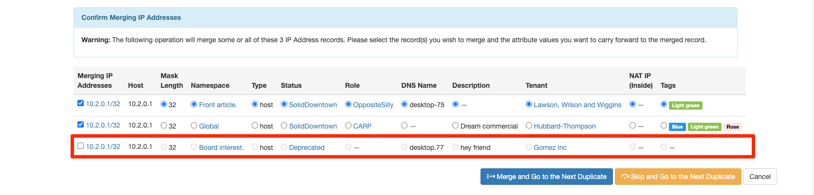
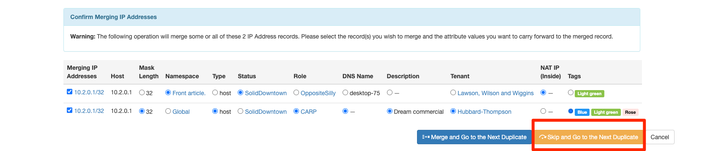
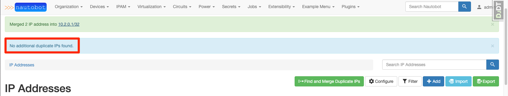

# Duplicate IP Address Merge Post Migration Tool

Upgrading from Nautobot v1.x to v2.0 can leave many duplicate `IP addresses` in the existing database. This tool is designated to help users to reduce unnecessary duplicate `IP Addresses` by merging them into a single IP Address with all the desired attributes.

## When to use this tool

After upgrading to Nautobot v2.0 and running the data migrations necessary, some unnecessarily duplicate `IP Addresses` might exist in your database. We define duplicate `IP Addresses` as those which have the same `host` attribute but exist in different `namespaces`. If you have no use case to keep those duplicate `IP Addresses` around, we recommend you to use this tool to de-duplicate those `IP Addresses` and keep your database clean and manageable. But if you do have reasons to maintain duplicate `IP Addresses`, this tool is not for you.

!!! important
    Possible reasons to maintain duplicate `IP Addresses` can be the following:
    1. You have use cases for duplicate `IP Addresses` with different `nat_inside` attributes.
    2. Duplicate `IP Addresses` are `primary ips` on different `Devices`.

## How to access this tool

To use this tool:
1. Go to the `IPAM` tab on the navigation menu and click on `IP Addresses`. This will take you to the list of `IP Addresses` exist in the database.
2. On the top right of the page, you will find a group of buttons representing different available actions and the first one should be `Find and Merge Duplicate IPs`.
3. Click on that button to access the tool.

## How to use this tool

Clicking on the `Find and Merge Duplicate IPs` button will automatically query your database for duplicate `IP Addresses` and group them by their respective `host` values. The tool will present the duplicate `IP Addresses` in order from lowest to highest `host` values.

### Merging All Duplicate IP Addresses Presented with Desired Attributes

Once the duplicate `IP Addresses` are found, the tool will put them in a table ordered by their `mask_length` and the table presents all their selectable attributes. Select the desired attribute values for the eventually merged `IP Address` and click on the `Merge and Go to the Next Duplicates` button to collapse/delete all the `IP Addresses` presented into a new `IP Address` with all the attributes you selected. This will also take you to a page of the next available duplicate `IP Addresses`.

### Merging Only Some Duplicate IP Addresses Presented with Desired Attributes

If you want to keep some of the `IP Addresses` around and merge the others, you can de-select the checkboxes in the first column correpsonding to the `IP Addresses` you do not wish to merge, select the desired attributes and click on the `Merge and Go to the Next Duplicates` button. This operation will only collapse/delete the `IP Addresses` that have their checkboxes selected in the first column.

!!! note
    Unchecking the checkbox of the corresponding `IP Address` means that the attributes of the `IP Addresses` will not be available for selection. Moreover, If there are only one or less checkboxes checked, clicking on the `Merge and Go to the Next Duplicates` button will be a no-op.

### Skip Merging All Duplicate IP Addresses Presented

If you decide that these `IP Addresses` presented do not need to be merged, you can click on the `Skip and Go to the Next Duplicates` button to skip merging these `IP Addresses` and go to the next set of duplicate `IP Addresses` with a different `host` value.

### No more Duplicate IP Addresses

If you have gone through all duplicate `IP Addresses`, you will be taken back to the list view of `IP Addresses` with a message indicating that `No additional duplicate IPs found.`.

