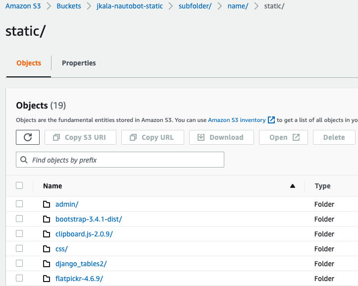
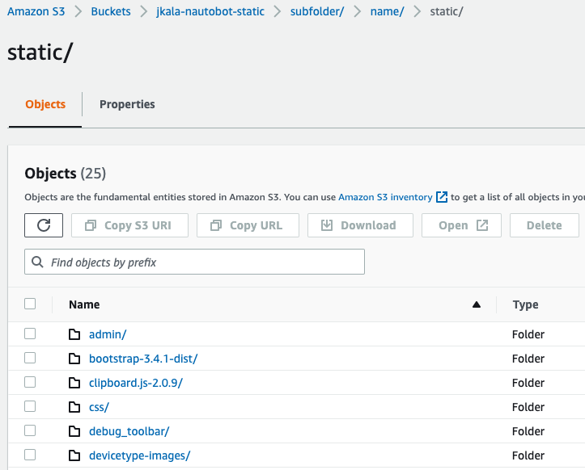

# AWS S3 using Django-Storage Backend

The backend storage engine is used for Nautobot to handle uploaded files (e.g. image attachments), as well as static files (e.g. css, js). Nautobot supports integration with the django-storages package, which provides backends for several popular file storage services. If not configured, local filesystem storage will be used; however this user-guide will demonstrate how to use AWS S3 buckets to store these files.

## Installation

Nautobot can use [`django-storages`](https://django-storages.readthedocs.io/en/stable/) to publish files to S3 -- see the [docs](https://docs.nautobot.com/projects/core/en/stable/installation/nautobot/#remote-file-storage) for more information on installing this optional dependency.

TLDR:

```shell
$ echo "nautobot[remote_storage]" >> $NAUTOBOT_ROOT/local_requirements.txt
$ pip3 install "nautobot[remote_storage]"
```

## Bucket Creation Terraform

The AWS S3 bucket will be hosting Nautobot static files and needs some specific configuration to allow anonymous HTTP access.  The following is an example of Terraform configuration to create the S3 bucket appropriately, the same values can be configured manually:

```terraform
resource "aws_s3_bucket" "nautobot_static_files" {
  bucket        = "my-bucket-name"
  acl           = "public-read"

  cors_rule {
    allowed_headers = ["*"]
    allowed_methods = ["GET"]
    allowed_origins = ["http*"]
  }
  cors_rule {
    allowed_methods = ["GET", "HEAD"]
    allowed_origins = ["*"]
  }

  tags = {
    Name = "Nautobot Static Files"
  }
}
```

## Configuration

The [`django-storages`](https://django-storages.readthedocs.io/en/stable/) library is quite powerful, please refer to their documentation for a more detailed explanation of the individual settings or for more information.

In `nautobot_config.py` define the following configuration:

```python
STORAGE_BACKEND = "storages.backends.s3boto3.S3Boto3Storage"

STORAGE_CONFIG = {
    "AWS_ACCESS_KEY_ID": "...",
    "AWS_SECRET_ACCESS_KEY": "...",
    "AWS_STORAGE_BUCKET_NAME": "my-bucket-name",
    "AWS_S3_REGION_NAME": "us-west-1",
    "AWS_DEFAULT_ACL": "public-read",
    "AWS_QUERYSTRING_AUTH": False,
    "AWS_LOCATION": "subfolder/name/static/"
}
STATICFILES_STORAGE = STORAGE_BACKEND
```

If `AWS_ACCESS_KEY_ID` and `AWS_SECRET_ACCESS_KEY` are not set, `boto3` [internally looks up IAM credentials](https://boto3.amazonaws.com/v1/documentation/api/latest/guide/credentials.html).  Using an [IAM Role for EC2](https://docs.aws.amazon.com/AWSEC2/latest/UserGuide/iam-roles-for-amazon-ec2.html?icmpid=docs_ec2_console) is highly recommended.

The `STORAGE_CONFIG` has some valuable pieces of information.

- Access Key and Secret Key are for authentication and authorization of the S3 bucket.
- Storage bucket name is the S3 bucket name, within the bucket provided the aws location will be used to build the parent directory structure.
    - In the example above the static files will be stored in `f"{AWS_STORAGE_BUCKET_NAME}.s3.amazonaws.com/{AWS_LOCATION}"`
- Finally, region is where the s3 bucket resides.

!!! info
    The remaining options are not required, but django-storages documentation should be reviewed to understand the security requirements.

By using the the settings listed above, the static files will be stored in the S3 bucket instead of on the Nautobot servers filesystem. Once the `nautobot-server collectstatic` is executed you will see the files.

Here's a snippet from the S3 bucket in use.


Now when an image is added to one of the core supported models like the `dcim.device-type`, a new directory will be created in the S3 bucket based on the `upload_to` attribute from the originating model. As an example we now see a new directory called `devicetype-images/`.



The directory is defined in the `Devicetype` model on the front/rear images attributes. Source code snippet below:

```python
front_image = models.ImageField(upload_to="devicetype-images", blank=True)
rear_image = models.ImageField(upload_to="devicetype-images", blank=True)
```

At a high level this takes care of everything you'd need for standard Nautobot deployment, but what if you're creating a plugin and you have a requirement for the data to be stored in an additional directory?

This is where using the generic `FileField` provided by Django comes into play. For example, lets say a new plugin is being developed and storing the software images is one of the key requirements. The model might look something like the snippet below:

```python
class SoftwareFileAttachment(BaseModel):
    """An uploaded software bin file for OS upgrades."""

    file = models.FileField(upload_to="uploads/")
    name = models.CharField(max_length=50, blank=True)
    created = models.DateTimeField(auto_now_add=True)

    def __str__(self):
        """String value for HTML rendering."""
        return f"{self.file}"
```

The `models.FileField` alongside the `upload_to` argument can be used to store user uploaded files into the already established S3 bucket. With the configuration settings provided earlier in this article and the `upload_to=uploads/` attribute the software attachments will be stored at `f"{AWS_STORAGE_BUCKET_NAME}.s3.amazonaws.com/{AWS_LOCATION}/uploads/"`.

The nice thing about using `django-storages` is the ease of use and the ability to easily extend storage backends. One use case for extending storage backends that has been used is to store certain plugin data attachments in its own S3 bucket with different permissions. If we take this concept to the example of `SoftwareFileAttachment` we can put the software images in their own S3 bucket by creating a custom storage backend that we can pass to our `models.FileField` model field.

For this example I created a simple python file called `customer_storage.py` in the root of my plugin.

```python
"""Example of a custom extension to support flexible s3 storage."""
from storages.backends.s3boto3 import S3Boto3Storage

class MediaStorage(S3Boto3Storage):
    bucket_name = 'nautobot-sw-media'
    location = "software_images" # store files under directory `software_images/` in bucket `nautobot-sw-media`
```

In the model you just need to pass in the `storage=` argument.

```python
from custom_config_plugin.custom_storage import MediaStorage

class SoftwareFileAttachment(BaseModel):
    """An uploaded software bin file for OS upgrades."""

    file = models.FileField(upload_to="uploads/", storage=MediaStorage)
    name = models.CharField(max_length=50, blank=True)
    created = models.DateTimeField(auto_now_add=True)

    def __str__(self):
        """String value for HTML rendering."""
        return f"{self.file}"
```

When a user uploads a new software image to this model it will be stored in `<AWS S3 URL>/software_images/uploads/<file>.bin`.

This is valuable because you may have certain models in a plugin or other enhancements that need to have more specific granularity in the S3 bucket they belong in, also it may be crucial to have different S3 IAM requirements for certain files over the general static files the Nautobot application needs to run appropriately.

## Summary

Django-Storages is the backend library used to extend Nautobots backend storage flexibility. The same concepts above can be used for Azure Storage, Dropbox, GCP etc. As all of these have native support within the `django-storages` library.
